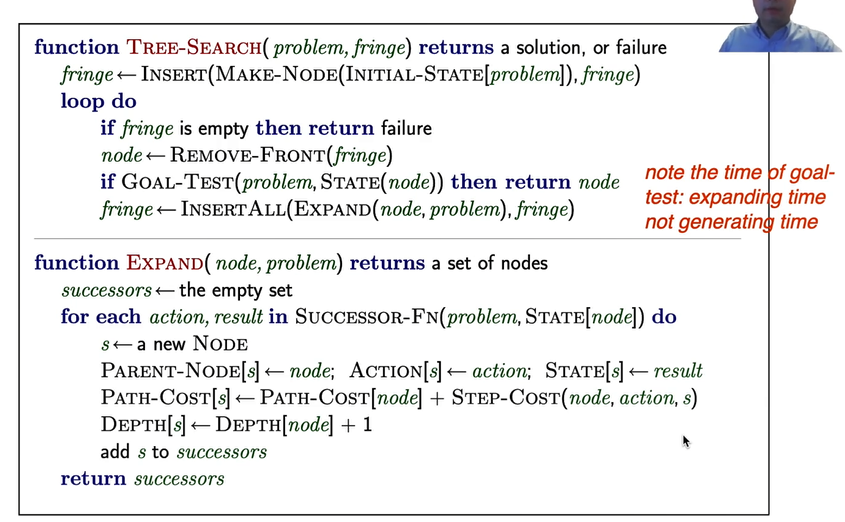
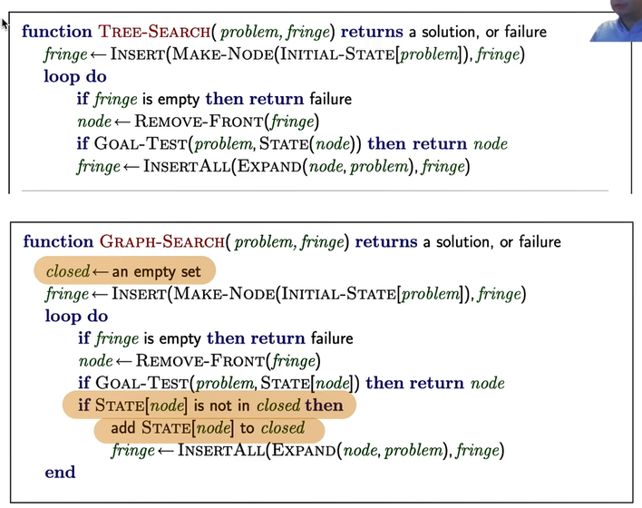
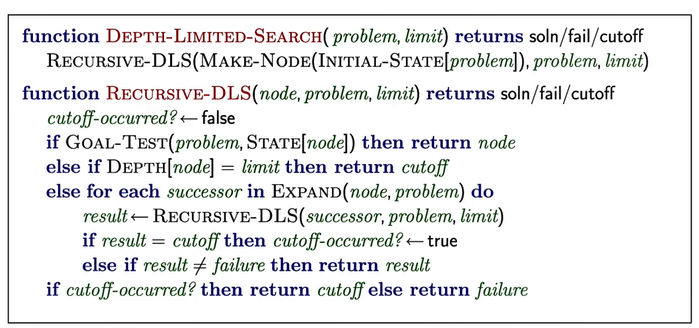
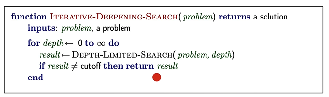
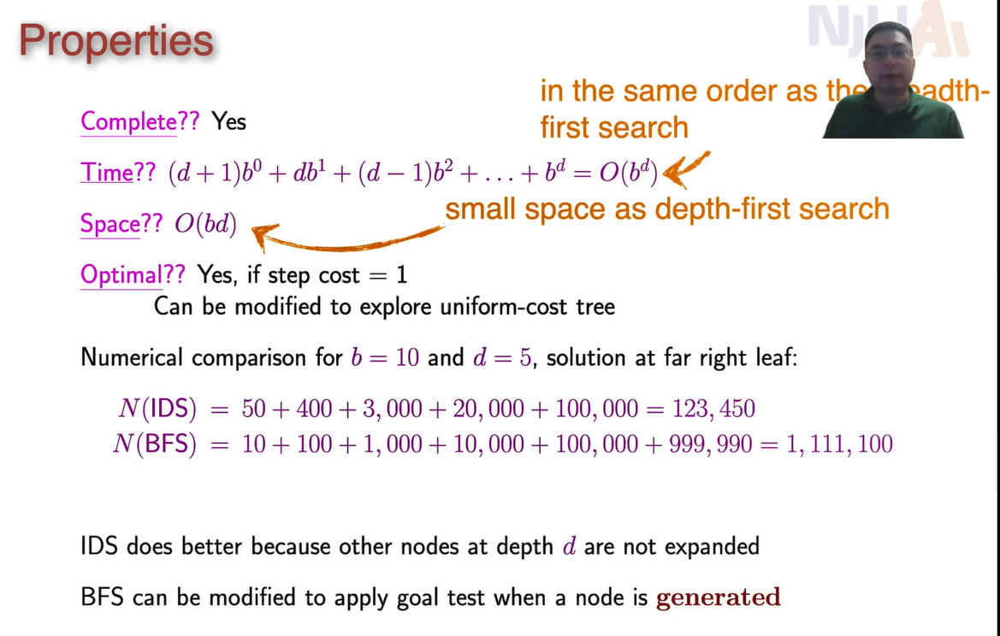
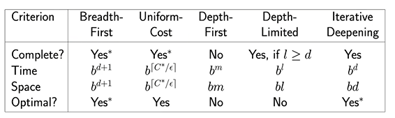

# lecture 2

什么是人工智能？

能完成一些需要人用智能完成的事情，比如推箱子、地图路径规划（路径搜索）

## 搜索问题

### 定义

问题的基本要素：

* initial state初始状态
* possible action可能的动作
* 训练模型（或转移模型）(transition model,or successor function)：动作对当前状态做出的改变
* goal test测试是否达到了目标
* path cost路径开销

衡量复杂度所需的变量：

* $b$ ：最大分差支数

  > maximum branching factor of the search tree

* $d$ ：开销最少的解的深度

* $m$：状态空间的最大深度（可能为无穷）

衡量算法的指标：

* 完整性：如果存在解，是否总能找到？
* 时间复杂度：生成或展开的节点数
* 空间复杂度：内存里最多需要装多少个
* 最优化：是否总能找到一个开销最少的解？

其他定义：

* 一个解 (solution) 是一系列的动作，使得从初始状态到达目标状态

### 基本假设：

明确知道所有状态

转移是确定的，没有随机性

状态是离散的

### 实现

用树实现

用搜索树存储所有信息

node对应了一个state

#### 搜索过程

从初始状态开始

拓展一颗树：

* 如果没有拓展的候选，报错
* 选择一个叶节点以进行拓展
* 如果节点包含一个goal state就返回一个解
* 否则拓展该节点并添加到搜索节点

注意：goal test的位置必须是在把 `node` 取出 `fringe` 后进行，而不能在加入 `fringe` 前（ `expand` 过程中或刚结束时）进行

* 以路径规划为例，一个城市可以有多个 `node` ，在取出后进行goal test避免了程序在进行开销优先搜索时提前结束而导致返回非最优的解

如果树中出现可能重复节点（比如路径规划绕圈了），称为图搜索：

注意检查的是状态而不是节点，一个节点可以有多个状态

### 分类

有先验知识（informed Search Strategies）

无先验知识（uninformed……）

#### 无先验

按什么顺序存储？

**宽度优先**：一层层访问树，完成一整层再访问下一层（`fringe` 为FIFO队列）

* 完全性？是（如果 $b$ 是有限的，通常如此），goal一定在某一层
* 时间：$O(b^{d+1})$ 
* 空间：$O(b^{d+1})$（把所有节点保存到存储）
* 如果cost=1 per step是最优的，否则不是

**深度优先**：先往深的走，走到头往回退一步再往深走（`fringe` 为栈空间，即FILO队列）

* 完全性？在无限深度时失败、重复state失败。如果有限且通过图搜索规避死循环，则有完全性。
* 时间：$O(b^m)$
* 空间：$O(bm)$ ，因为对一个分支搜索结束后就不需要再保存它
* 最优化：否

**开销优先**(uniform-cost search)：先选择cost最小的（使用优先级队列，cost小的先出）

* 如果cost一样，等价于宽度优先
* 完全性：是，如果cost存在下界（否则有可能像深度优先一样一条路走到黑）
  * 记下界为 $\varepsilon$
* 时间复杂度和宽度优先一样，换一种写法：$O(b^{\left \lceil C^*/\varepsilon \right \rceil })$，其中 $C^*$ 为最优解的开销
* 空间复杂度和宽度优先一样，换一种写法：$O(b^{\left \lceil C^*/\varepsilon \right \rceil })$
* 最优化：是

### 深度有限的深度优先(Depth-limited search)

就是多了一行 `else if`

### 可变限深度优先（Ierative Deepening Search)

多次搜索了起始时（上面几层）的节点，似乎很浪费

但是其实由于深度增加时复杂度是指数增加的，这些浪费微乎其微

性能分析：

## 总结

