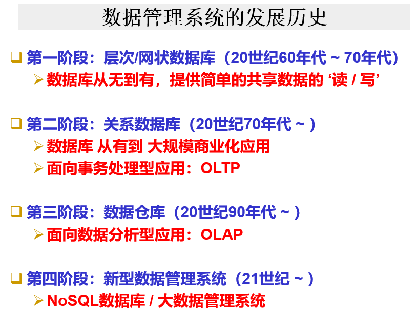

# introduction

## 概念

* **数据库**（DataBase）是长期存储在计算机内、有组织的、大量的、共享的数据集合。

* **数据库管理系统**（DataBase Management System，DBMS）是位于用户与操作系统之间的一层数据管理软件，为用户或应用程序提供访问数据库的方法和接口。

* **数据库技术**是研究数据库的结构、存储、设计、管理和使用的一门软件学科。
* **数据库用户**（DataBase User）
* **数据库服务器**
* **数据模型**（Data Model）
* **数据模式**

### 分级概念

* DB数据库
* DBMS数据库管理系统
* DBS数据库系统=DB+DBMS+软硬件上的系统+数据库管理员
* 数据库应用系统=DBS+应用程序+end Users或APP开发者

### DBMS

> A program product for keeping computerized records (on disk) about an enterprise

* 操纵和管理数据库的大型软件，用于建立、使用和维护数据库
* 对数据库进行统一的管理和控制，以保证其安全性和完整性
* 用户通过DBMS访问数据，管理员通过DBMS进行数据库维护工作
* 支持多个应用程序和用户用不同方法在同时或不同时刻去建立。修改、查询数据库（数据共享）
* 基本功能：数据库定义（数据保存的方式）、数据操纵、数据库管理、数据库的建立和维护

### 数据库用户 (DataBase User)

* End users
  * Casual users（临时用户）用SQL请求数据库存取
  * Naive users（无经验的用户）通过菜单或应用存取
* 程序员 Application programmers
* 数据库管理员 DataBase Administrators (DBA)

只有后两者需要了解数据库相关知识

### 数据库服务器架构

两层通常用于局域网，三层用于广域网

三层没有暴露数据服务器的端口，比较安全；也不需要在用户端安装应用程序；减少与数据服务器的连接数量以降低负载

## 数据模型与数据模式

数据模型是一种抽象模型，组织数据的元素，定义这些元素之间的关系、与现实世界实体的关系

> A **data model** is an [abstract model](https://en.wikipedia.org/wiki/Abstract_model) that organizes elements of [data](https://en.wikipedia.org/wiki/Data) and standardizes how they relate to one another and to the properties of real-world entities. 

### 分类

### 发展史

关系数据模型在70年代出现，目前仍占据统治地位，为本课程主讲

数据库的大规模应用从关系数据模型开始

数据库技术的发展是由应用驱动的

#### 层次数据模型

用有向树表示数据结构

局限性：

* 只能从父节点访问子节点，无法反向、横向访问

* 磁盘没有树状结构，所以层次数据模型只是一个逻辑数据模型，需要一定的存储实现方式（不讲）

* 只适合网状的数据

#### 网状数据模型

是一个有向无环图（有时无向，甚至有环）

* 比较方便

* 第一代数据库系统

* 第一个数据库系统IDS基于此

#### 关系数据模型

#### 对象关系模型

只介绍区别：表格有内部结构，即一个元素（属性）可以不是一个简单的值，而是有复杂的内部结构

## 数据模式

* 外模式，也称子模式(Subschema)或用户模式
  * 是数据库用户(包括应用程序员和最终用户)能够看见和使用的局部数据的逻辑结构和特征的描述，是数据库用户的数据视图，是与某一应用有关的数据的逻辑表示。
  * 一个数据库可以有多个外模式;
  * 外模式就是用户视图;
  *  外模式是保证数据安全性的一个有力措施。
* 内模式(Internal Schema)，也称存储模式(Storage Schema)
  * 它是数据物理结构和存储方式的描述，是数据在数据库内部的表示方式
  * 例如
    * 记录的存储方式是顺序存储、按照B树结构存储还是按hash方法存储
    * 索引按照什么方式组织
    * 数据是否压缩存储，是否加密
    * 数据的存储记录结构有何规定
  * 一个数据库只有一个内模式;
  * 一个表可能由多个文件组成，如：数据文件、索引文件。
  * 它是数据库管理系统(DBMS)对数据库中数据进行有效组织和管理的方法
  * 其目的有：
    * 为了减少数据冗余，实现数据共享;
    * 为了提高存取效率，改善性能。
* 模式，也称逻辑模式
  * 是数据库中全体数据的逻辑结构和特征的描述，是所有用户的公共数据视图。
  *  一个数据库只有一个模式;
  * 是数据库数据在逻辑级上的视图;
  * 数据库模式以某一种数据模型为基础;
  * 定义模式时不仅要定义数据的逻辑结构(如数据记录由哪些数据项构成，数据项的名字、类型、取值范围等)，而且要定义与数据有关的安全性、完整性要求，定义这些数据之间的联系。

## 数据管理技术的发展阶段

* 人工管理（50年代以前），慢
* 文件系统管理（60-70年代），共享能力差，安全性等差
* 数据库系统管理（70年代至今）

## 新一代数据管理技术

## 课程目标

* 学习进行数据库工作的观念（concept）和技术

* 不是如何实现一个数据库，而是如何设置和使用（set up）

