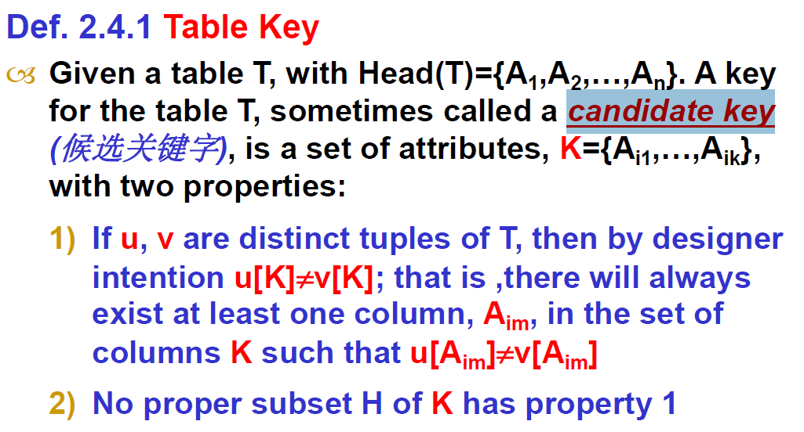
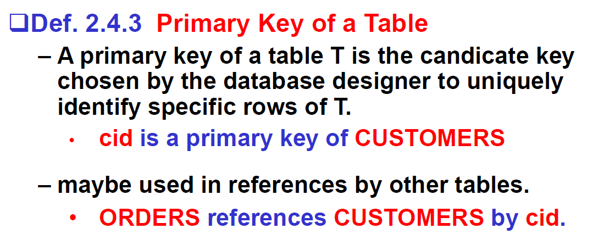
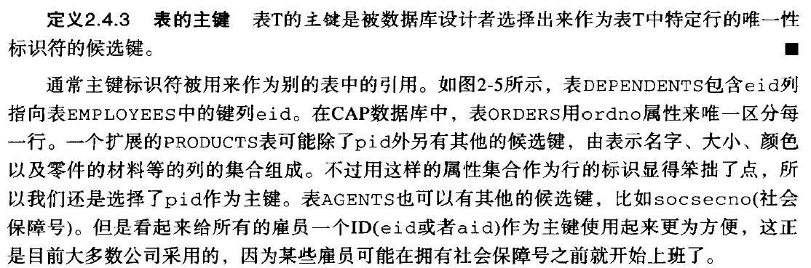

# 02 关系数据库

## 关系数据结构

由多个二维表组成，每个表有表名

第一行是每一列的列名

### 术语

| 关系数据库管理系统（SQL） | 关系模型        | 文件系统               |
| ------------------------- | --------------- | ---------------------- |
| table(表)                 | relation(关系)  | file of records(文件)  |
| column(列)                | attribute(属性) | field(字段)            |
| row(行)                   | tuple(元组)     | record(记录)           |
| table heading(表头)       | schema(模式)    | type of record(记录型) |

关系模式：关系名+全部属性名

数据库是关系的集合

关系是属性的集合

注意：列名通常不会改变，会被用户存储并用于发生请求

列类型(Column type，或称domain或Data type)：数据类型、合法的取值范围

* 多数数据库系统不支持枚举类型的数据完整性
* 不同表中的同名类型是不同的(particular)

关系代数(relational algebra)列的类型是一个枚举类型

* //奇奇怪怪的

* > Relational Algebra (关系代数)
  > Domain of column is like an enumerated type.

#### 关系代数

##### 基本运算：

笛卡尔乘积：用于将不同属性的取值范围作笛卡尔积得到一个由n元组组成的集合

### 关系规则(relational rules)

**在lecture 2中**，所有关系数据库满足以下规则：

* 第一范式First Normal Form Rule
* 只能通过内容访问行Access Rows by Content Only Rule
* 行的唯一性The Unique Row Rule
* 实体完整性Entity Integrity Rule：表中的任意行在主键列的取值都不允许为空值

#### 第一范式

每一列的取值不能是一个多值（比如列表）或者有内部结构的值

#### 只能通过内容访问行

只能通过内容（属性值）访问行

不能通过行序号访问

因此行列之间是没有序号的

大多数关系数据库产品不遵循该规则，它允许用户用RID（Row ID）来访问行

#### 行的唯一性

两行不能在所有的属性上完全一样

所以一个关系是一个由元组组成的 (无序的) 集合

很多关系数据库产品不遵循该规则，允许相同的行

### 各种key

#### Superkey

是一组具有唯一性的列

例如(cid,cname)

#### Key

是最小的superkey

或称candidate key

在形式化定义中还叫table key？

#### Primary Key（主键）

设计者选定，用以唯一确定一行的candidate key

可以证明一个表必有一个key，且有现成算法找出这个key

### 空值

储存由设计者负责

需要考虑如何处理

表中的任意行在主键列的取值都不允许为空值

## 对模型的操作

store

query insert delete update

