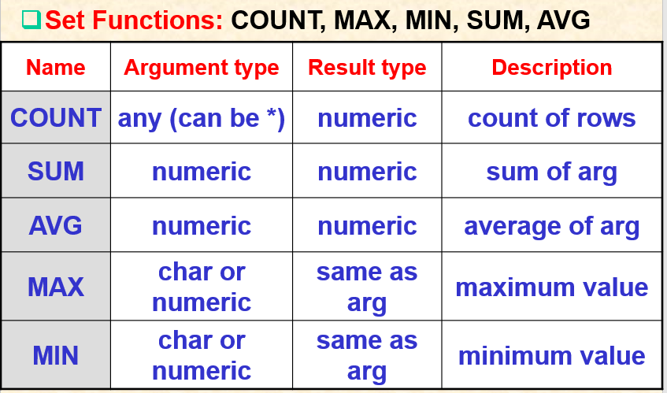
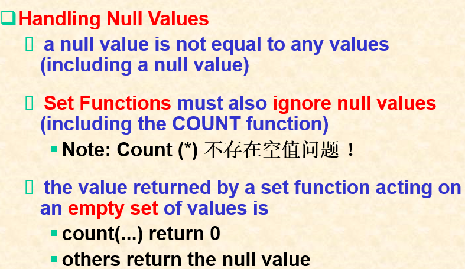
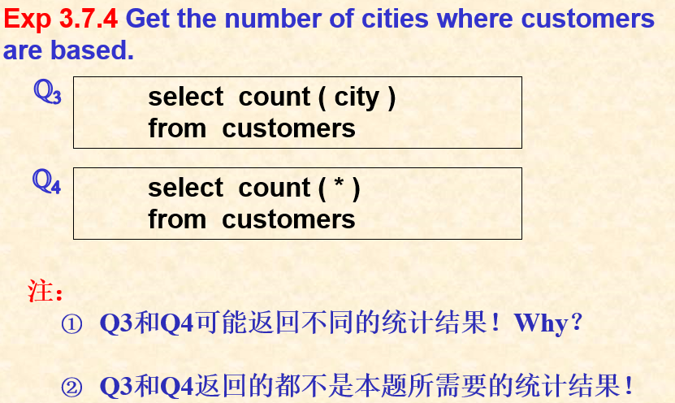
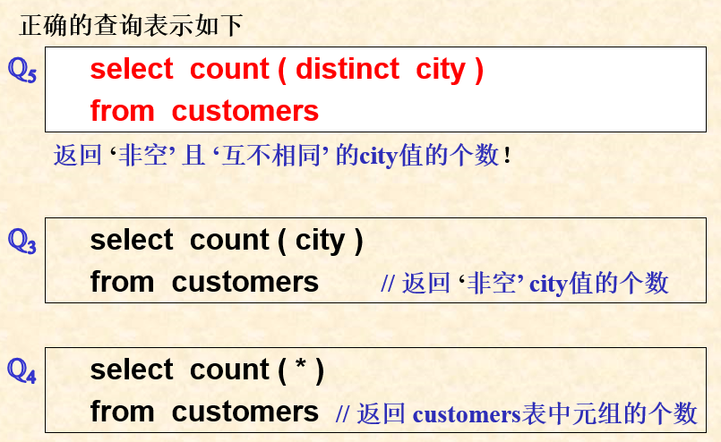
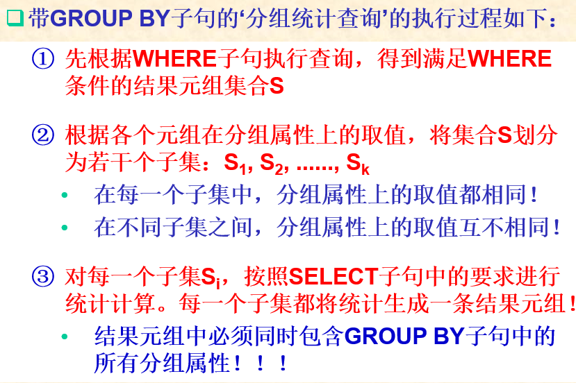
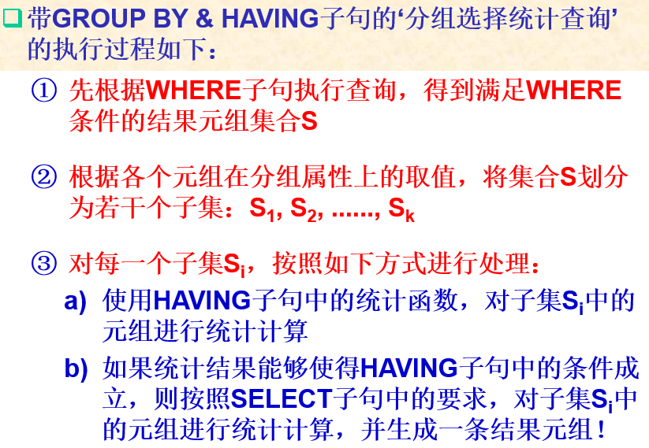
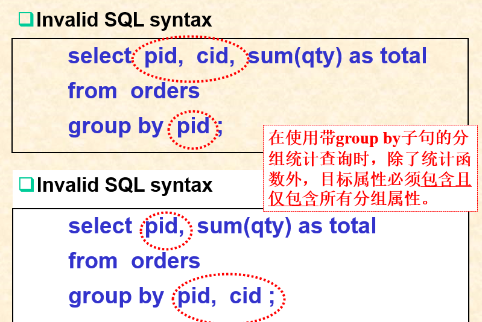

# 05 数据库的集合函数

## 统计函数

只允许在 `Select` 和 `Having` 子句中使用统计函数

三种使用方式：

* select  + 统计函数
* select  分组属性+统计函数......group by 分组属性
* select  分组属性+统计函数
* ......
* group by 分组属性 + having 组选择条件

在SELECT子句中使用到统计函数的查询（不带GROUP BY子句），其执行过程如下：

* 先执行查询得到满足条件的结果元组集合S
* 再根据SELECT子句中的要求，对集合S中的所有元素（元组或属性）进行统计计算
* 输出统计结果（单条结果元组）

空值处理

## 分组函数

`GROUP BY clause & HAVING clause`

其中：

* 带GROUP BY子句的查询也被称为‘分组统计查询’
* 在GROUP BY子句中给出的属性，被称为该查询的‘分组属性’
* 在GROUP BY子句之后，还可以再有HAVING子句。一个带有GROUP BY和HAVING子句的查询，也被称为‘分组选择统计查询’

执行过程：（PPT有样例）

