# Ch1 概述

## 数据库基本概念

* **数据库**（DataBase）是长期存储在计算机内、有组织的、大量的、共享的数据集合。
* **数据库管理系统**（DataBase Management System，DBMS）是位于用户与操作系统之间的一层数据管理软件，为用户或应用程序提供访问数据库的方法和接口。
* **数据库技术**是研究数据库的结构、存储、设计、管理和使用的一门软件学科。
* **数据库用户**（DataBase User）
  * 最终用户(**End users**)——交互式用户：
    * 临时用户(**casual users**)：通过SQL访问DBMS的用户
    * 初级用户(**naive users**)：通过菜单访问DBMS的用户
  * 应用程序员(**application programmers**)：编写菜单程序的程序员
  * 数据库管理员(**DataBase Administrators**)：管理DBMS的专家
* **数据模型**（Data Model）：
  * 层次数据模型
  * 网状数据模型
  * 关系模型（属于对象关系模型）
  * 面向对象模型（属于对象关系模型）

> ### 分级概念
>
> * DB数据库
> * DBMS数据库管理系统
> * DBS数据库系统=DB+DBMS+软硬件上的系统+数据库管理员
> * 数据库应用系统=DBS+应用程序+end Users或APP开发者

## 数据库的体系架构

### 两层架构

在两层C/S架构中，数据库和DBMS运行在数据库服务器中，数据库应用程序运行在客户机中，两者之间通过局域网实现数据访问。


### 三层架构

更多的时候，数据库服务器及其应用程序可能分布在距离遥远的不同地方（如下图所示），他们相互之间无法通过企业内部的局域网相连，只能通过更广阔的互联网来实现数据访问和数据传输。

在三层B/S架构中，数据库和DBMS运行在数据库服务器中，数据库应用程序运行在应用服务器（也称“Web服务器”）中，用户客户端只需要安装常用的浏览器，负责接收用户输入和结果展示。


## 数据库系统发展历史


> SQL (Structured Query Language) 指结构化查询语言，后面会讲到
>
> 但是NoSQL ( = Not Only SQL ) 指非关系型数据库：
>
> 

## 三级模式

* 外模式，也称子模式(Subschema)或用户模式
  * 是数据库用户(包括应用程序员和最终用户)能够看见和使用的局部数据的逻辑结构和特征的描述，是数据库用户的数据视图，是与某一应用有关的数据的逻辑表示。
  * 一个数据库可以有多个外模式;
  * 外模式就是用户视图;
  * 外模式是保证数据安全性的一个有力措施。
* 内模式(Internal Schema)，也称存储模式(Storage Schema)
  * 它是数据物理结构和存储方式的描述，是数据在数据库内部的表示方式
  * 例如
    * 记录的存储方式是顺序存储、按照B树结构存储还是按hash方法存储
    * 索引按照什么方式组织
    * 数据是否压缩存储，是否加密
    * 数据的存储记录结构有何规定
  * 一个数据库只有一个内模式;
  * 一个表可能由多个文件组成，如：数据文件、索引文件。
  * 它是数据库管理系统(DBMS)对数据库中数据进行有效组织和管理的方法
  * 其目的有：
    * 为了减少数据冗余，实现数据共享;
    * 为了提高存取效率，改善性能。
* 模式，也称逻辑模式
  * 是数据库中全体数据的逻辑结构和特征的描述，是所有用户的公共数据视图。
  * 一个数据库只有一个模式;
  * 是数据库数据在逻辑级上的视图;
  * 数据库模式以某一种数据模型为基础;
  * 定义模式时不仅要定义数据的逻辑结构(如数据记录由哪些数据项构成，数据项的名字、类型、取值范围等)，而且要定义与数据有关的安全性、完整性要求，定义这些数据之间的联系。


## 国产数据库


# Ch2 关系模型

## 基本概念

### 数据结构

| 关系数据库管理系统（SQL） | 关系模型                                  | 文件系统               |
| ------------------------- | ----------------------------------------- | ---------------------- |
| table(表)                 | relation(关系)                            | file of records(文件)  |
| column(列)                | attribute(属性)                           | field(字段)            |
| row(行)                   | tuple(元组)                               | record(记录)           |
| table heading(表头)       | relation schema(关系模式)或者schema(模式) | type of record(记录型) |

列类型(Column type，或称域domain或数据类型Data type)：数据类型、合法的取值范围

* 多数数据库系统不支持枚举类型的数据完整性
  * 然而我们可以将一个字符串类型的域限制在另一张表的一列中，以实现枚举类型

* 不同表中的同名类型是不同的(particular)

## 关系的约束规则

### 第一范式规则(First Normal Form Rule)

每一列的取值不能是一个多值（比如列表）或者有内部结构的值

### 只能通过内容访问行(Access Rows by Content Only Rule)

只能通过内容（属性值）访问行

不能通过行序号访问

因此**行列之间是没有序号的**

大多数关系数据库产品不遵循该规则，它允许用户用RID（Row ID）来访问行

### 行的唯一性(The Unique Row Rule)

两行不能在所有的属性上完全一样

所以一个关系是一个由元组组成的 (无序的) 集合

**等价于实体完整性规则**（见ch2.基本概念.空值）

很多关系数据库产品不遵循该规则，允许相同的行

## 键与超键

给定一个表 $T$，标题 $\text{HEAD}(T)=A_1\cdots A_n$。对于其中的某组属性的集合 $K=\{A_{i1},\cdots,A_{ik}\}$ 讨论以下条件：

* 条件1：如果 $u,v$ 是 $T$ 中的两个不同元组，根据设计者的意图 $u[K]\ne v[K]$；也就是说，集合 $K$ 中必定存在至少一个列 $A_{im}$ 使得 $u[A_{im}]\ne v[A_{im}]$
* 条件2：没有 $K$ 的真子集满足条件1

如果 $K$ 满足条件1，称它为表 $T$ 的一个**超键(Super Key)**，如果同时满足两个条件，称它为表 $T$ 的一个**键(Key，或译关键字)**

**键也被称为候选关键字(candidate key)**

**主键**：被数据库设计者选择出来作为表 $T$ 中特定行的唯一标识符的候选键（可能包含多个列）

## 空值

未知或未定义的值

引入空值后，带来了**实体完整性规则(Entity Integrity Rule)**：表 $T$ 中任意行在主键各列的取值都不允许为空值

## 关系代数

### 分类

**按是否是集合运算：**

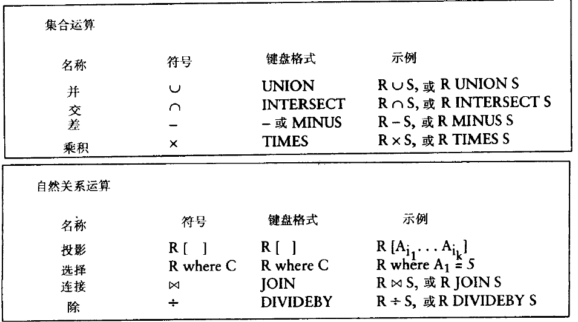

**按是否是扩充运算：**

* 基本运算：并、差、投影、选择、笛卡尔积
* 扩充运算：交、自然连接、$\theta$ 连接、除法

基本运算已经是完备且最小的（可以导出所有扩充运算的最小运算集），但是为了方便仍然允许扩充运算

### 集合运算

虽然我们认为列之间没有顺序，但是为了方便，我们表示一行的所有元素时要固定这些元素的顺序

#### 相容表（兼容表，Compatible Tables）

两张表的关系模式（标题，即属性名的集合）是相同的（且具有相同的含义），称为相容表

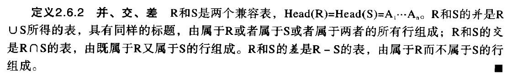


#### 赋值、别名


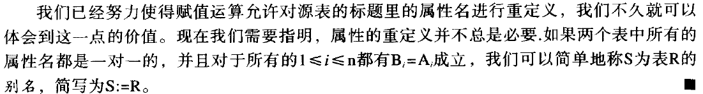

### 乘积（笛卡尔积）


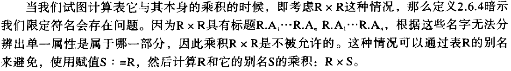

### 自然关系运算

#### 投影

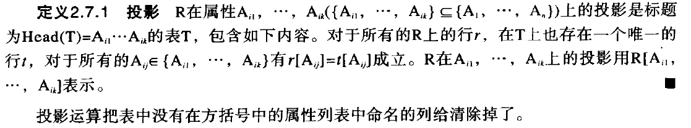

#### 选择


比较符号：$<,>,>=,<=,<>$，最后一个是不等

条件连接符：与或非

#### 连接

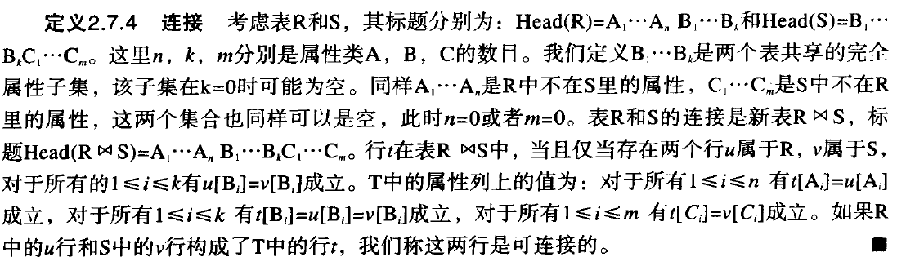

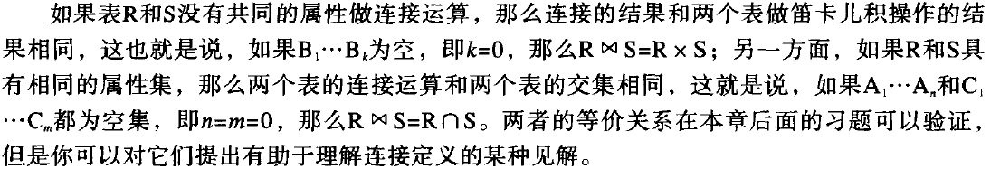

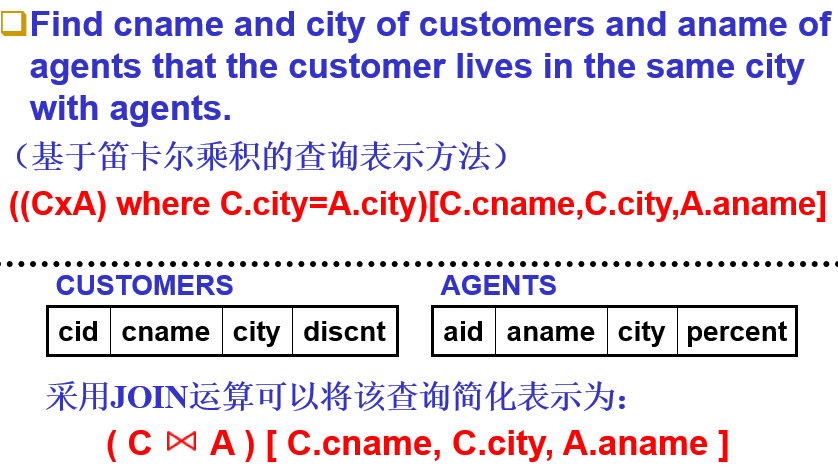

#### 除

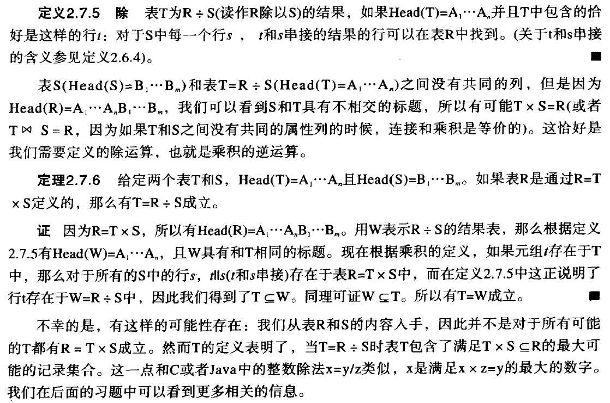

**例1**：注意 $T_3$ 是前两者的**交集**

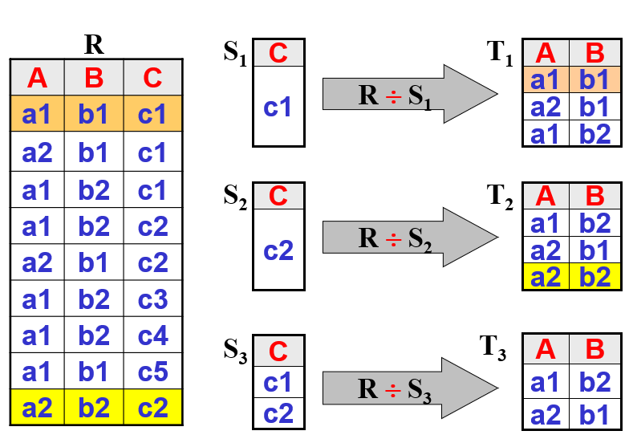

**例2**：输出可以是空集


### 优先级

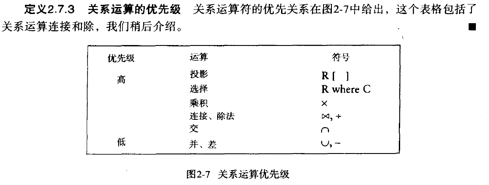

### 其他运算

#### $\theta$ 连接


#### 外连接

解决连接后无法反向得到原表的问题


# Ch3 基本SQL查询

## 基础

### SQL语言的基本语言成分

**符号**：26个英文字母，阿拉伯数字，括号，四则运算，......

**保留字**：在SQL语言中具有特定含义的语言成分，通常是一个英文单词（或缩写），通常用于标识一条SQL语句的组成成分，也包括系统内置的系统表、存储过程/函数、SQL函数等等，例如：

* 用于标识语句类型：create, select, insert, alter, ......
* 用于标识对象类型：table, view, procedure, trigger, ......
* 用于标识语句成分：unique, primary key, with check option, ......
* 数据类型，内置函数，......
* 可编程SQL中的流程控制命令：if...then...else, while..., for ...

**标识符**：用于对由用户创建的数据库对象进行命名，包括表、视图、属性、存储过程/函数、触发器、变量......

**常量**：数值常量、字符（串）常量、日期/时间常量

### SQL语言的基本表示规范（交互式SQL）

一条完整的SQL语句，通常以命令动词开始，以分号 `;` 作为**结束符**

在交互式SQL执行窗口中，可以一次只执行一条SQL语句，也可以一次执行多条SQL语句（批处理）

在批处理执行方式下，分号既作为前一条SQL语句的结束符，也可以看做是不同SQL语句之间的分隔符

除常量外，SQL语言中的其他语言成分仅支持西文字符，且(字母)**不区分大小写**

保留字、表名、列名等都**不区分大小写**（在个别数据库系统中有例外）

字符或日期/时间类型的常量需要使用单引号定界符，可支持不同的日期显示格式

### 数据类型

* CHARACTER  DataType：字符串类型
* ==NUMERIC==  DataType：数组类型
* DATE/TIME DataType：日期、时间类型

### 下文格式约定

标准格式约定：

* 大写的项必须完全相同，小写的项自定义
* 在方括号 `[]` 内的语句表示可选
* `{a|b|c}` 表示在 `a`、`b`、`c` 中选择一个，且为必选
* `[a|b|c]` 表示在 `a`、`b`、`c` 中选择一个，但也可以不选。如果某个符号有下划线，它为默认值
* `{ , colnamename ...}` 表示可以有0个或多个

## 创建表

格式被限制为：

```sql
CREATE TABLE tablename (
colname datatype [ NOT NULL ]
{ , colname datatype [ NOT NULL ] ... }
[ , PRIMARY KEY ( colname { , colname ... } ) ]
) ;
```

* `NOT NULL` 为空约束，约束这一列的不为 `null`
* `PRIMARY KEY` 是主键
* 对数据库的修改违反上面两点时，系统拒绝操作

例子：

```sql
CREATE TABLE agents (
aid CHAR(3) NOT NULL,
aname VARCHAR(13),
city VARCHAR(20),
percent SMALLINT,
PRIMARY KEY (aid) );
```

## 查询


### 命令

```sql
SELECT [ALL | DISTINCT] {* | expr[[AS] c_alias] {, expr [[AS] c_alias]...}}
FROM  tablename [[AS] corr_name] { , tablename [[AS] corr_name]... }
[ WHERE search_condition ]
[ GROUP BY colname { , colname ... }
[ HAVING search_condition ] ]
[ ORDER BY colname [ ASC | DESC ]
 { , colname [ ASC | DESC ] ... } ];
```

### 单表查询


### FROM与表的重命名

在 `FROM` 中：

* 方法1：`table_name  AS  alias_name`
* 方法2：`table_name   alias_name`

关于`FROM`：

* 范围子句，定义本次查询可以访问的关系表
* 如果对表进行了换名，那么必须通过定义的别名来访问对应的关系表
* FROM子句中的表（别名）不能重名
* 如果范围子句中的表存在同名的属性，可以通过‘表名.属性名’的方式来明确定义需要访问表中的列；否则可以直接通过属性名来访问相关的列
* FROM若有多个表，先作笛卡尔积

重命名例子：

```sql
SELECT  distinct  cname, aname
FROM    customers  c, orders  o, agents  a
WHERE   c.cid=o.cid  and  o.aid=a.aid ;
```

### 多表查询

连接查询：


嵌套查询：

详见“子查询”一节


自身连接查询：


### SELECT与查询结果输出

* `distinct` 保证查询结果不重复，不写就为允许重复行，此时不进行检查，会快一点。默认为 `all`
* 结果元组排序：`order by`（这个不在SELECT里）
* 改名：`SELECT expression  AS  alias_name`，结果属性不能重名

关于 `SELECT`：

`SELECT [distinct] column name list  |  expressions  |  *`

* 目标子句，用于投影生成结果关系
* 可以是单个属性的投影，也可以是对一个表达式的计算结果进行投影
* 可以用 `*` 表示投影出表中的所有属性（按照创建表时的属性定义顺序显示）
* 可以用 `distinct` 谓词要求系统对结果元组进行唯一性检查

## 子查询

在 `FROM,WHERE` 中都可以嵌入子查询

### 谓词（用于where）

The IN Predicate

* `expr  IN  ( subquery )`
* `expr  NOT  IN  ( subquery )`

The Quantified Comparison Predicate

* `expr  $\theta$  SOME ( subquery )`
* `expr  $\theta$  ANY ( subquery )`
* `expr  $\theta$  ALL ( subquery )`
* `$\theta` 为某个比较操作符（$>,<,\leq,\geq,=,<>$）
* some和any等价，当且仅当至少存在一个由子查询返回的元素使 `expr $\theta$ s` 时为真，则为真
* all当且仅当全部子查询返回的元素使 `expr $\theta$ s` 时为真

The EXISTS Predicate

* `EXISTS ( subquery )` 子查询为空集返回 `false` ，否则为 `true`
* `NOT  EXISTS ( subquery )` 与上面相反

The BETWEEN Predicate

* `expr [NOT] BETWEEN expr1 AND expr2`

  ```sql
  SELECT  *
  FROM  customers
  WHERE  discnt  BETWEEN 6 AND 10
  ```

The IS NULL Predicate

* `column  IS [NOT] NULL`

The LIKE Predicate

* `column [NOT] LIKE val1 [ ESCAPE val2 ]`

underscore ( `_` ): 任意单个字符

percent ( `%` ): 大于等于零个字符的字符串

escape character：转义符，可以自定义，可以转义自己


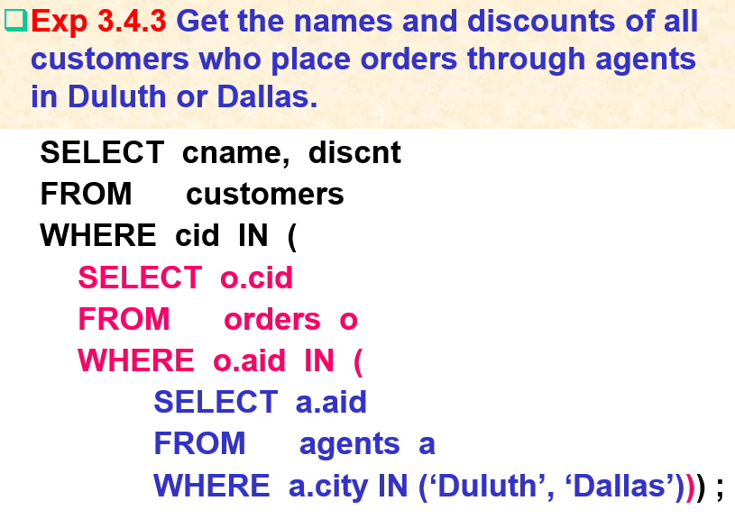

### uncorrelated subquery (独立子查询)

子查询不需要来自外层（调用者）的参数，可以独立运行

### correlated subquery (相关子查询)

需要来自外层的参数

### Scoping Rule

外部不能访问内部变量，反之则可以


### 子查询的集合运算

* `UNION/INTERSECT/EXPECT`：并、交、减，不会有重复的行
* `UNION ALL/INTERSECT ALL/EXPECT ALL`，可能有重复行，但速度快

`EXPECT` 有时作 `MINUS`


## 实现复杂运算（子查询）

### 并

* `subquery UNION subquery` 求并集，不会有重复的行
* `subquery UNION ALL subquery` 求并集，可能有重复的行，速度快

### 除法的实现


## 集合函数


### 统计查询

使用 `GROUP BY`


## 数据更新命令


### 插入

可以插入立即值的元组，也可以插入子查询的结果


### 更改

where中可以包含子查询


### 删除


# Ch5

## 游标(cursor)

作用：读取多行的数据库返回

四个相关语句：

* 声明(declare)一个游标（此时游标还不能使用）
* 打开(open)一个游标，此时程序向数据库系统发出调用，此后游标可以使用
  * 如果查询依赖于宿主变量，变量应被赋值。此后宿主变量的改变不影响检索的结果
  * 游标指向第一行的前面
* 拉取(fetch)一行
  * 游标先加一，然后把指向的行赋值给变量
* 关闭(close)游标
  * 这个下面的截图里没有：`EXEC SQL CLOSE agent_dollars ;` 其中 `agent_dollars` 是游标的名字

一个完整的示例：

22行标识了退出循环的方式

```C
#define TRUE 1
#include <stdio.h>
#include "prompt.h"
exec sql include sqlca;
/* SQL variables can be external or automatic, here external */
exec sql begin declare section;
  char cust_id[5], agent_id[4];
  double dollar_sum;   
  char user_name[20], user_pwd[20];     
exec sql end declare section;
int main()
{
  char cid_prompt[ ] = "Please enter customer ID:  ";
  int count;
  exec sql declare agent_dollars cursor for
       select aid, sum(dollars) from orders where cid = :cust_id group by aid;  
  exec sql whenever sqlerror stop;      /* error trap condition */
  strcpy(user_name, "scott");
  strcpy(user_pwd, "tiger");
  exec sql connect :user_name identified by :user_pwd;
  exec sql whenever sqlerror goto report_error;
  exec sql whenever not found goto finish;//重要
  while(prompt(cid_prompt, 1, cust_id, 4) >= 0)
  { 
      exec sql open agent_dollars;
      while(TRUE)
      {         
          exec sql fetch agent_dollars into :agent_id, :dollar_sum;
          printf("%s %11.2f\n", agent_id, dollar_sum);
      } /* end fetch loop */
finish:
      exec sql close agent_dollars; 
      exec sql commit work;
  }  /* end of main loop */
  exec sql commit release;
  return 0;
report_error:
  print_dberror();                          
  exec sql rollback release;
  return 1;                                 
}

```


# Ch6

## EER模型

ER Diagrams （ER图）是E-R模型的图形化表示法。

E-R模型中有三个基本概念：实体（集），属性，联系，在ER图中分别对应着三种不同的图形符号：长方形，椭圆形，菱形；这些基本概念之间的组成连接关系，可通过他们之间的无向线段进行相连。

在后面的扩充ER模型中，引入了一些新的概念，并扩展了对应的扩充ER图（EER Diagram）的表示符号。

基本组成为：实体(entity)，属性(attribute)、联系(relationship)

### 属性的细分

一、根据一个属性的取值是否能用于“标识该实体集中的实体”，我们可以将其划分为identifier（标识属性）和descriptor（描述属性）两大类；在一个entity中，能够起到 identifier 作用的属性子集（即实体集的关键字）可能不只一个，在每一个entity上，我们只能选择其中的一个关键字（通常是后面被选择作为关系表的 primary key 的那一个）并在ER图中通过为属性名**加下划线**的方式来表示，其他的关键字只能在附加的需求文件中用文字来进行描述。

二、根据一个属性的属性值的取值情况，我们也可以将实体的属性划分为以下的三类：

  （1）single-valued attribute（单值属性）：其取值是一个不可分割的原子值

  （2）composite attribute（组合属性）：其取值是一个由若干个成员属性值所构成的‘结构化’值（record-value）

  （3）multi-valued attribute（集合属性）：其取值是一个由若干个具有相同类型的值所构成的集合值（set-value）

其中，composite attribute 和 multi-valued attribute 又被统称为是 ‘多值属性’。

在ER图中，composite attribute的表示方法相对简单，只需要在composite attribute和其各个成员属性之间用‘无向线段’直接相连即可。

而对于 multi-valued attribute 则提供了两种表示方法：

  （1）在 multi-valued attribute 和 实体集（长方形）之间用无向的双线段进行连接（如图，hobbies和Employees之间的双线段）；

  （2）在扩充ER模型中，引入了 **Cardinality of Attributes （属性基数）**的定义，可用于描述一个属性的取值特征（单值 or 集合值）。属性基数可以被标在连线上


### 联系的细分

* 一对一关系：
  * 二者都是可选参与：向任意一方（也可以同时）加入一列，记录另一方的主键
  * 仅一方被强制参与：向被强制方加入一列，记录另一方的主键
  * 两边都是强制参与：建议合并两张表
* 多对一关系：多方增加一列，记录“一”方的主键；或者用一张表表示关系
* 多对多关系：用一张表来表示关系

关系的 `(min-card, max-card)` 对被表示在连线上：


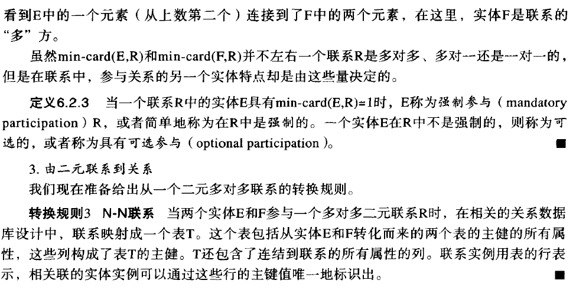


## EER转换到关系模型


## 规范化

规范化设计是数据库设计的另一种方法，和ER模型不同。但是它们几乎得到一样的结果。

规范化方法中，设计者从一个将被建模的现实世界的情形出发，列出将成为关系表中列名的候选数据项，以及这些数据项之间关系的规则列表。目的是将所有数据项表示为符合限制条件的表的属性，限制条件与范式相关。

**规范化设计的目标**：

* 在一个关系中，属性与属性之间需要满足一定的约束条件，这样的约束条件，我们称之为‘范式’ (Normal From)
* 不同的约束条件，就构成了不同级别的范式定义
* 规范化设计的目标，是希望最终设计得到的每一个关系都能满足到特定范式（通常是3NF）的要求，从而**避免出现过高的数据冗余存储和操作异常现象**。

### 异常


### 函数依赖(FD, Functional Dependency)

$A\to B$


* A和B是两个属性集合，且来自于同一个关系
* 函数依赖来自于对现实世界中数据约束的抽象
* 一组属性函数决定它的所有子集，这种函数依赖称为**平凡函数依赖**。
* 当关系中属性集合Y不是属性集合X的子集时，存在函数依赖X→Y，则称这种函数依赖为**非平凡函数依赖**。
* **完全函数依赖**：设X,Y是关系R的两个属性集合，X’是X的真子集，存在X→Y，但对每一个X’都有X’!→Y，则称Y完全函数依赖于X。
* **不完全函数依赖**：设X,Y是关系R的两个属性集合，存在X→Y，若X’是X的真子集，存在X’→Y，则称Y部分函数依赖于X。

#### Armstrong’s Axioms (Armstrong公理)

统称蕴含规则

基本规则：

* 包含规则：若 $Y\subseteq X$ ，则 $X\to Y$
* 传递规则：若 $X\to Y,Y\to Z$ ，则 $X\to Z$
* 增广规则：若 $X\to Y$ ，则 $XZ\to YZ$

扩充规则：

* 合并规则：若 $X\to Y,X\to Z$ ，则 $X\to YZ$
* 分解规则：若 $X\to YZ$ ，则 $X\to Y,X\to Z$ 

#### 基于函数依赖的关键字定义

**主属性**：一个属性是构成某一个候选关键字（候选码）的属性集中的一个属性，则称它为主属性(Prime attribute)，否则为非主属性

这里超键被定义为通过函数依赖决定表中所有属性的属性集


寻找键（最小超键）的算法：

```pseudocode
set K := Head(T) ;
for each attribute A in K {
    compute (K - A)F+ ;
    if (K-A)F+ contains all the attributes in T
    then {
        set K := K - { A } ;
    }
}
```

#### 闭包，覆盖和最小覆盖


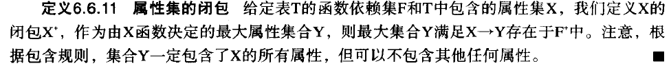

> 这个翻译太垃圾了，可以看原文：
>
> Given a set $X$ of attributes in a table $T$ and a set $F$ of FDs on $T$, we define the CLOSURE of the set $X$ (under $F$), denoted by $X^+$ or $X^+_F$, as the largest set of attributes $Y$ such that $X→Y$ is in $F^+$.
>
> 即 $\mathrm{X}_{\mathrm{F}}^{+}=\left\{\mathrm{A} \mid \mathrm{X} \rightarrow \mathrm{A} \in \mathrm{F}^{+}\right\}$

**函数依赖集的最小覆盖**：一个函数依赖集 $M$，它覆盖给定依赖集 $F$ 且是最小的（其没有真子集覆盖 $F$）


**注意：如果第三步导致改变，需要返回第二步！**


### 范式

* **1NF**：即关系数据库的规则1：每一列的取值不能是一个多值（比如列表）或者有内部结构的值
* **2NF**：对于任意函数依赖 $X\to A$ （$A$ 是单个属性），若 $A$ 是一个不在 $X$ 中的非主关键字，那么 $X$ 不是某个候选键的真子集
  * 或者说，所有非键字段都不能是候选键非全体字段的函数
* **3NF**：对于任意函数依赖 $X\to A$ （$A$ 是单个属性），若 $A$ 是一个不在 $X$ 中的非主关键字，那么 $X$ 一定是表的超键
  * 相比2NF，3NF不允许非主关键字互相决定
* **BCNF**：关系模式R中存在的任意一个非平凡函数依赖 $X\to A$，都满足 $X$ 是 $R$ 的一个超键
  * 或者：任何 $F$ 可推导出的函数依赖 $X \to A$ 都在 $T$ 中，这里 $A$ 是不在 $X$ 中的单一属性，$X$ 必须是 $T$ 的一个超键
  * 相比3NF，BCNF不允许主属性被非主属性决定

### 模式分解

#### 无损分解

无损连接性：定义6.7.1

依赖保持性：表中的函数依赖仍然继续保留，见定义6.8.3


#### 分解算法（到3NF）

输入表 $T$ 和函数依赖集 $F$，返回表头的集合 $S$ （属性集合的集合

*  将 $F$ 替换为它的最小覆盖
* 令 $S=\O$
* 遍历所有 $F$ 中的依赖 $X \to Y$：
  * 如果 $\forall Z\in S,X\cup Y\not\subseteq Z$，那么令 $S=S\cup Heading(X\cup Y)$
* 如果对于 $T$ 的所有候选键 $K$ ，$\forall Z\in S,K\not \subseteq Z$：
  * 选择一个候选键 $K$ ，令 $S=S\cup Heading(K)$

其中 $Heading(K)$ 生成包含属性集合 $K$ 的集合


# Ch7

## 基表定义命令


### 数据完整性约束

* NOT NULL, DEFALUT, CHECK
* Primary Key, Unique
* Foreign Key
  * ON DELETE
  * ON UPDATE

`ON DELETE RESTRICT` 指当引用表存在对行 `t` 的引用，行 `t` 不可以被删除


## 视图

作用：给子查询命名

视图对应的子查询中不允许 `ORDER BY`


## 授权与权限回收

### 授权


### 权限回收


# Ch10

## 事务

### 定义、提交与回滚


### ACID


### 隔离级别


## 并发控制技术

### 调度

#### 串行与可串行


