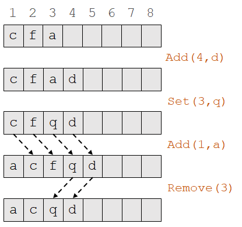
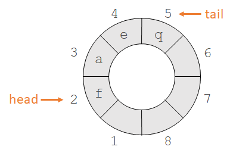
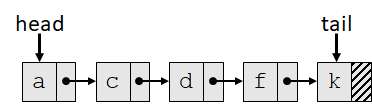
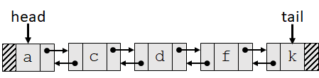
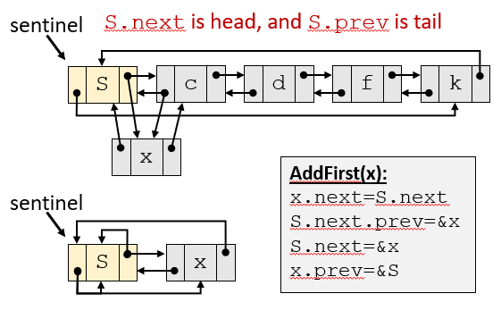

# 02 基本数据结构

## 复习：数据结构

数据结构是一种**存储和组织数据的方法**，以便**访问**和**修改**

> •A **data structure** is a way to **store and organize data** in order to facilitate **access** and **modifications**.

* 不同种类的数据需要不同种类的数据结构
* 一种数据可以被不同种数据结构表示。选择合适的数据结构是很重要的

## 抽象数据类型 (abstract data type, ADT)

通常，数据类型提供接口(interface)，**这一接口被称为ADT**

* ADT规定(specifies)一个数据结构**可以做、应该做**的事情，但**与如何实现无关**
* 例如```List```是一个ADT；而```ArrayList```，```LinkedList```等是数据结构
* ADT是逻辑上的描述，而数据结构是具体实现(concrete implementation)
* 类似于```.h```和```.cpp```的关系
* 不同的数据结构可以实现相同的ADT

## 常见ADT

### 队列 (Queue ADT)

队列表示一组元素，包括以下两种操作

* ```Add(x)```将```x```添加到队列中

* ```Remove()```从队列中移除下一个元素```y```并返回```y```

  队列规则(queuing discipline)决定移除哪一个元素，包括FIFO，LIFO等

**此处分类按课件。课本中队列仅指先进先出队列**

#### 先进先出队列 (FIFO queue)

FIFO: first-in-first-out

元素按照它们被添加的顺序被移除

#### 后进先出队列 (LIFO queue)

LIFO: last-in-first-out

最新加入的元素是下一个移除的元素

又被称作**栈(stack)**，此时：

* `Add(x)`又被称作`Push(x)`
* `Remove(x)`又被称作`Pop(x)`

### 双端队列(Deque ADT)

Deque: double-ended queue

可以在头、尾插入和移除元素

可以实现(implement) FIFO Queue和LIFO Queue的功能

### 列表 (List ADT)

一个元素序列，支持一下操作：

* `Size()`返回列表长度
* `Get(i)`返回 $x_i$
* `Set(i,x)`将 $x_i$ 设为 $x$
* `Add(i,x)`将 $x_i$ 设为 $x$，其后的元素全部后移
* `Remove(i)`删去 $x_i$，其后元素全部前移

列表可以实现双端队列

## 常见数据结构

### ArrayList data structure



使用数组实现

* 适合**列表、后进先出队列**
* 不适合先进先出队列和双端队列，因为移除需要移动大量元素，比较慢

### ArrayDeque data structure



使用环形数组实现

* **使用模运算形成环**
* **通过移动头、尾指针实现头尾处的增删元素**
* 适合**先进先出，后进先出，双端队列**
* 对中间元素的操作较慢，不适合列表
* 容量难以扩充

### 链表 (LinkedList data structure)



* 适合**先进先出**：在尾处添加元素，头处移除
* 适合**后进先出**：在头部添加和移除元素
* 不适合双端对列和列表：在尾部移除元素较慢

### 双向链表 (DLinkedList data structure)

DLinkedList: doubly-linked list



* 适合**先进先出、先进后出、双端队列**
* 不适合列表

### 带哨兵(sentinel)的双向链表



* 哨兵**不能降低操作的渐进时间界**
* 哨兵**降低了操作的常数因子**
* 在循环语句中使用哨兵的好处往往在于**使代码简洁**，而非提高速度
* 哨兵会占用存储空间，应当慎用（尤其是对于很短的链表）

