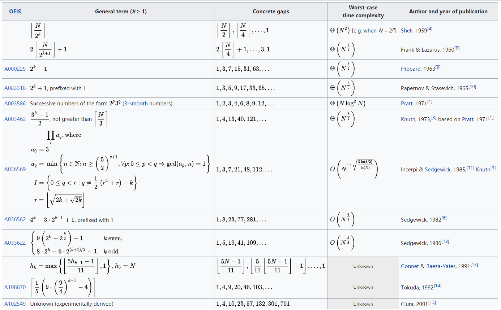

# 05 排序

## 排序算法的衡量指标（或特点，Characteristics）

* 运行时间
* **原址的**(In-place)：除了输入数组的空间以外，如果一个排序算法只需要常数个（即$O(1)$​​​​个）额外的存储空间，那么称它是**原址的**
* **稳定性**(Stability)：如果具有相同值的两个元素在排序后仍然保持它们原来的顺序，称使用的排序算法有稳定性

## 概述

### 性能表

| 排序方法       | 平均情况               | 最好情况         | 最坏情况         | 额外存储空间                                                 | 稳定性 |
| -------------- | ---------------------- | ---------------- | ---------------- | ------------------------------------------------------------ | ------ |
| 冒泡排序       | $O(n^2)$               | $O(n^2)$         | $O(n^2)$         | $O(1)$​                                                       | 稳定   |
| (简单)选择排序 | $O(n^2)$               | $O(n^2)$         | $O(n^2)$         | $O(1)$​                                                       | 稳定   |
| (直接)插入排序 | $\Theta(n^2)$​​          | $\Theta(n)$​​      | $\Theta(n^2)$​    | $O(1)$​                                                       | 稳定   |
| 希尔排序       | $O(\log n)\sim O(n^2)$ | $O(n^{1.3})$     | $O(n^2)$         | $O(1)$​                                                       | 不稳定 |
| 堆排序         | $O(n\lg n)$            | $O(n\lg n)$      | $O(n\lg n)$      | $O(1)$​                                                       | 不稳定 |
| 归并排序       | $\Theta(n\lg n)$​​       | $\Theta(n\lg n)$ | $\Theta(n\lg n)$ | $O(n)$                                                       | 稳定   |
| 快速排序       | $\Theta(n\lg n)$​       | $O(n\lg n)$      | $\Theta(n^2)$​​    | $\text{不是特别大的数组}O(1)\\\text{否则}O(\log_2n)\sim O(n\log n)$​ | 不稳定 |
| 计数排序       | $\Theta(k+n)$          |                  | $\Theta(k+n)$    |                                                              |        |
| 基数排序       | $\Theta(d(k+n))$       |                  | $\Theta(d(k+n))$​ |                                                              |        |
| 桶排序         | $\Theta(n)$​            |                  | $\Theta(n^2)$​    |                                                              |        |

### 分治法的使用

* 将输入分为大小为 $1$ 的和为 $n-1$ 的两部分
  * 插入排序，易于分割，合并时需要资源
  * 选择排序，分割时需要资源，易于合并
* 将输入分为两个相等的部分
  * 归并排序，易于分割，合并时需要资源
* 将输入分为两个**大致**相等的部分
  * 快速排序，分割时需要资源，易于合并

## 算法性能上下限

对于问题 $P$（例如排序问题）和算法 $A$ ：

**上限**(Upper bound)指最坏情况下算法 $A$​​ 需要的时间

* $\displaystyle T_A(n)=\max_{|I|=n}\{cost_A(I)\}$
* 每一个对问题 $P$ 有效的算法都有一个上限

**下限**(Lower bound)指解决问题 $P$​ 的**最佳算法**的最坏情况下所需的时间

* $\displaystyle T_P(n)=\min_{A\text{ solves }P}\{\max_{|I|=n}\{cost_A(I)\}\}$​
* 通常以 $\Omega(f(n))$ 的形式出现
* $T_P(n)=\Omega(f(n))$ 表示任何算法都需要花费至少 $\Omega(f(n))$ 的时间来解决问题 $P$​
* 我们通常求出很多下限，但最高的下限才有意义

### 对手论证 (Adversary Argument)

假设一个对手决定了输入，算法向这个对手询问若干关于输入的问题

如果算法问的问题不够，那么对手就可以构造出一个使得算法的输出错误的输入


通过对手论证，我们得出**排序问题的下限为** $\boldsymbol{\Omega(n)}$

任何排序算法的时间复杂度不可能低于这一下限

### 决策树 (decision tree)

我们分析**基于比较**的排序算法(Comparison-based sorting)的下限。

* **基于比较**指排序的结果仅仅根据输入元素之间相互比较的结果，不能检测输入项的值
* 包括冒泡、选择、插入、希尔、堆、归并、快速排序等多个算法

**决策树**：

* 是树
* 每一个内部节点(internal node)表示算法对输入所问的一个问题
* 输出边(outgoing edges)表示问题的可能答案
* 每一个叶子(leaf)表示一个输出
* 算法的一个实例(execution)是从根到叶的一条路径
* 最坏情况时间复杂度至少为根到某一叶的最长路径（即为树的高度）


不失一般性，我们假设输入元素互异，且我们只用 $\leqslant$ 进行比较：

* 此时决策树是一个二叉树
* 这个树必须有至少 $n!$ 个叶子（可能的输出有 $n!$ 个）
* 故树的高度至少为 $\lg(n!)$ ，即 $\Omega(n\log n)$​

**由此，基于比较的排序算法的时间复杂度下限为** $\boldsymbol{\Omega(n\log n)}$

**不基于比较的排序算法可以超出这一下限，如桶排序，基数排序，计数排序等**

## 选择排序 (Selection Sort )

思路：依次找到第 $i$ 小的元素并放置到位置 $i$

递归版：

```
SelectionSortRec(A):
if (|A|==1)
  return A
else
  min = GetMinElement(A)
  A’ = RemoveElement(A,min)
  return Concatenate(min,SelectSortionRec(A’))
```

`Concatenate(x,y)` 为连接

循环版：


```
SelectionSort(A):
for (i=1 to A.length-1)
  minIdx = i
  for (j=i+1 to A.length)
    if (A[j]<A[minIdx])
      minIdx=j
  Swap(i,minIdx)
```

时间复杂度：$\displaystyle \sum_{i=1}^{n-1}(\Theta(1)+\Theta(n-i))=\Theta(n^2)$

空间复杂度：需要 $O(1)$ 个额外空间，故它是**原址的**。

稳定性：无。`Swap` 操作破坏了稳定性。

意义：假设 `A` 被组织为一个堆，那么它可以简化为堆排序。事实上这是堆排序的灵感来源。

## 冒泡排序 (Bubble Sort)

```
BubbleSort(A):
for (i=A.length downto 2)
  for (j=1 to i-1)
    if (A[j]>A[j+1])
      Swap(A[j],A[j+1])
```

时间复杂度：$\Theta(n^2)$

空间复杂度：需要 $O(1)$ 个额外空间，故它是**原址的**。

稳定性：具有稳定性

**改进**：当某一次对`j`的循环没有改变数组，那么排序其实已经完成，不需要进行剩下的步骤。

```
BubbleSortImproved(A):
n=A.length
repeat
  swapped=false
  for (j=1 to n-1)
    if (A[j]>A[j+1])
      Swap(A[j],A[j+1])
      swapped=true
  n=n-1
until (swapped==false)
```

**再次改进**：数组在最后一次交换之后的部分已经被排序了，下一次不用管

```
BubbleSortImprovedAgain(A):
n=A.length
repeat
  lastSwapIdx=-1
  for (j=1 to n-1)
    if (A[j]>A[j+1])
      Swap(A[j],A[j+1])
      lastSwapIdx=j+1
  n=lastSwapIdx-1
until (n<=1)
```

**改进并没有降低其时间复杂度，但是降低了常数因子**

### 希尔排序 (Shell Sort)

希尔排序是对插入排序的一种（大规模的）改进

希尔排序通过**将比较的全部元素分为几个区域**来提升插入排序的性能。这样可以让一个元素可以一次性地朝最终位置前进一大步。然后算法再取越来越小的步长进行排序，算法的最后一步就是普通的插入排序，但是到了这步，需排序的数据几乎是已排好的了（此时插入排序）。

在最后一步前的每一步都在试图缩短元素与其正确位置的距离，这样在最后一步插入排序的时候就会很快。

区域的区分是通过选择等距离的几个元素来完成的

* 每次选取的距离要比上一次短
* 第一次选取的距离小于数组规模
* 最后一次选取的距离为 $1$ ，即插入排序

以 $16$ 元素的数组，距离选取 $\{8,4,2,1\}$ 为例：

* 例如第二次中 $\{503,612,653,908\}$ 在一组并进行排序


**步长序列选取 $\displaystyle\frac{n}{2^i}$​ 时的时间复杂度**：$\displaystyle \sum_{i=1}^{(\lg n)-1}(\frac{n}{2^i}\cdot O(2^{2i}))=O(n^2)$​​​​​ 

**距离的选取对希尔排序的时间复杂度影响极大**



实践中用A033622的希尔排序比插入排序要快，甚至在小数组中比快速排序和堆排序还快，但是在涉及大量数据时希尔排序还是比快速排序慢。

## 快速排序 (Quick Sort)

```
QuickSortAbs(A):
x = GetPivot(A)
<B,C> = Partition(A,x)
QuickSortAbs(B)
QuickSortAbs(C)
return Concatenate(B,x,C)
```

思想：

* 在输入数组 $A$ 中选择一个元素 $x$​ 作为主元(pivot)
* 用主元将输入分割为数组 $B,C$ ，其中 $\forall b\in B,b\leqslant x,\quad \forall c\in C,c> x$​
* 递归地排序 $B,C$
* 返回 $<B,x,C>$

### 以选择最后一个元素作为主元为例

简单的分割：

```
Partition(A):
x = A[n], l = 1, r = n
for (i=1 to n-1)
  if (A[i]<=x)
    B[l] = A[i]
    l++
  else
    B[r] = A[i]
    r--
B[l]=x
return <B,l>
```

原址的分割：

```
InplacePartition(A, p, r):
x = A[r], i=p-1
for (j=p to r-1)
  if (A[j]<=x)
    i=i+1
    Swap(A[i],A[j])
Swap(A[i+1],A[r])
return i+1
```

参数`p`指示了数组的起始位置，`r`指示了数组的终止位置。这两个参数是为了实现（原址的）递归过程而引入的。

`x`是主元的值，`i`指示了比主元小的数组的终止位置（自身在该数组内）

步骤：

* 对选中数组`A[p..r]`除`A[r]`（主元）的所有元素循环：
  * 若该元素小于主元，`A[i]`与该元素交换，`i`自加 $1$​ 
* 交换主元与`A[i+1]`

例子：


此时快速排序的算法为：

```
QuickSort(A, p, r):
if (p<r)
  q = InplacePartition(A,p,r)
  QuickSort(A,p,q-1)
  QuickSort(A,q+1,r)
```

需要注意的是，这并不是完全原址的：

* 事实上，储存`i`，`j`也需要空间，当数组特别大时，递归次数很多，这消耗的空间不可忽略
* 最好和平均的情况下要消耗 $O(\log_2 n)$ 的空间
* 最坏情况下需要 $O(n\log n)$ 的空间
* 这并不会太可怕，如果一个数列大部分是不同的元素，它本身就占用了 $O(n\log n)$ 的空间（不懂，抄维基的）

#### 性能分析


每层的时间复杂度是 $c_0(n-m)$

* $m$​ 是在本层被移除的主元数
* 如果分割是平衡的，那么层数就会变少
* 如果分割是平衡的，那么 $m$ 就会迅速增加


##### 最坏情况分析：

$\displaystyle T(n)=\max_{0\leqslant q\leqslant n-1}(T(q)+T(n-q-1))+c_0 n$​

假设 $T(n)\leqslant cn^2,$​ 有：

$
\begin{align}
T(n)&\leqslant \max_{0\leqslant q\leqslant n-1}(cq^2+c(n-q-1)^2)+c_0 n\\
&=c\cdot\max_{0\leqslant q\leqslant n-1}(q^2+(n-q-1)^2)+c_0 n\\
&\leqslant c(n-1)^2+c_0n\\
&=cn^2-c(2n-1)+c_0n\\
&\leqslant cn^2
\end{align}
$

得证。

##### 最佳情况分析：

当分割是平衡的：

$T(n)\leqslant2T(n/2)+\Theta(n)$

$T(n)=O(n\log n)$

事实上，**分割并不需要是平衡的，只要是以恒定比例分割的即可**：

即当 $T(n)\leqslant T(dn)+T((1-d)n)+\Theta(n),\quad d=\Theta(1)$ 时，亦有 $T(n)=O(n\log n)$

##### 平均情况分析：

对于规模为 $n$ 的输入数组，假设所有 $n!$​ 种输入的序列出现的概率相等，快速排序的期望运行时间是多少？

* 所有分割都是近似于平衡的（即恒定比例的）
* 所以在两个好的分割之间不会出现太多坏的分割
* 坏分割的开销会被临近的好分割吸收，因此（渐进紧确地）不会影响时间复杂度

**故平均情况下的运行时间为** $\boldsymbol{O(n\log n)}$

### 随机的快速排序

任何确定的选取主元的方式都一定会有相应的最坏情况

因此可以随机地选取主元

这样无论怎样的输入序列（即使攻击者了解算法），也不会是最坏情况

```
RndQuickSort(A, p, r):
if (p<r)
  i = Random(p,r)
  Swap(A[r],A[i])
  q = InplacePartition(A,p,r)
  RndQuickSort(A,p,q-1)
  RndQuickSort(A,q+1,r)
```

对于任意输入，时间复杂度为 $O(n\log n)$

#### 时间复杂度分析

分析过程如下：

**引理一**：对于规模为 $n$​​​ 的输入，快速排序的运行时间为 $O(n+X)$​​​ ，其中 $X$​​​ 为整个过程中进行元素比较的总次数

* 证明：算法最多对`InplacePartition`调用 $n$ 次，每次调用包含固定的工作量和若干次比较。

下面**定义一些符号**：

* 指示器随机变量 $X_{ij}=\left\{\begin{matrix}1,&z_i,z_j\text{进行过比较} \\0,&\text{否则}\end{matrix}\right.$​
* 定义输入数组的各元素为 $z_1\leqslant z_2\leqslant\cdots\leqslant z_n$​
* 定义集合 $Z_{ij}=\{z_i,z_{i+1},\cdots,z_j\}$

**引理二**：每两个不同元素间最多发生一次比较

* 证明：
  * 元素只会与主元发生比较
  * 每个元素最多成为一次主元
  * 成为主元的元素不会再与之前的主元发生比较

由引理二得 $\displaystyle X=\sum_{i=1}^{n-1}\sum_{j=i+1}^{n}X_{ij}$

故期望 $\displaystyle\mathbb{E}(X)=\mathbb{E}[\sum_{i=1}^{n-1}\sum_{j=i+1}^{n}X_{ij}]=\sum_{i=1}^{n-1}\sum_{j=i+1}^{n}\mathbb{E}(X_{ij})=\sum_{i=1}^{n-1}\sum_{j=i+1}^{n}P\{z_i,z_j\text{进行过比较}\}$

**引理三**：$\displaystyle P\{z_i\text{是}Z_{ij}\text{中选出的第一个主元}\}=\frac{1}{j-i+1}$​

* 证明：
  * 在 $Z_{ij}$ 中任意元素被选为主元之前， $Z_{ij}$ 中的所有元素始终处于同一个分区内
  *  $Z_{ij}$ 中任意元素被等可能地选为主元

**引理四**：$\displaystyle P\{z_i,z_j\text{进行过比较}\}=\frac{2}{j-i+1}$​

* 证明：

  考虑任意两个不同的元素 $z_i,z_j$ ，如果任意 $z_k,i<k<j$ 被选中为主元，那么 $z_i,z_j$ 在此后就不会被进行比较

  $
  \displaystyle
  \begin{align}
  P\{z_i,z_j\text{进行过比较}\}&=P\{z_i\text{或}z_j\text{是}Z_{ij}\text{中选出的第一个主元}\}\\
  &=P\{z_i\text{是}Z_{ij}\text{中选出的第一个主元}\}+P\{z_j\text{是}Z_{ij}\text{中选出的第一个主元}\}&\quad\quad\quad\quad(\text{显然这两个事件互斥})\\
  &=\frac{1}{j-i+1}+\frac{1}{j-i+1}&\quad\quad\quad\quad(\text{引理三})\\
  &=\frac{2}{j-i+1}
  \end{align}
  $​​​

**定理：对于任意输入，时间复杂度为** $\boldsymbol {O(n\log n)}$​

证明：

由引理二，四：

$
\displaystyle
\begin{align}
\mathbb{E}(X)&=\sum_{i=1}^{n-1}\sum_{j=i+1}^{n}\frac{2}{j-i+1}\\
&=\sum_{i=1}^{n-1}\sum_{k=1}^{n-i}\frac{2}{k+1}&\quad\quad\quad\quad(\text{作变换}k=j-i)\\
&<\sum_{i=1}^{n-1}\sum_{k=1}^{n}\frac{2}{k}\\
&=\sum_{i=1}^{n-1}P(\lg n)\\
&=O(n\lg n)
\end{align}
$

又由引理一，**随机的快速排序的运行时间为** $\boldsymbol {O(n\log n)}$

#### 拓展

* 如果输入数组中有很多相同的元素，可以更改算法，将数组分为三部分（$<,>,=$​​ 主元），这样我们只用对两部分进行递归，进一步提高速度
* 在递归到数组较小时，我们可以停止使用快速排序而改用其他算法。在小数组上快速排序较慢
* 使用多主元的快速排序算法正在研究当中

## 不基于比较的排序算法

### 桶排序 (bucket sort)

**要求**已知输入的元素为集合 $\{1,2,\cdots,d\}$​ ，记为 $[\,d\,]$​

步骤：

* 创造 $d$ 个桶
* 依次扫描元素，将他们放到对应的桶中
* 组合

桶排序不是基于比较的排序，它直接使用了元素的值

```
BucketSort(A, d):
<L1,L2,…,Ld> = CreateBuckets(d)
for (i=1 to A.length)
  AssignToBucket(A[i])
CombineBuckets(L1,L2,…,Ld)
```

时间复杂度为 $\Theta(n+d)$

* 创建桶需要 $\Theta(d)$
* 扫描并绑定(assign)所有元素需要 $\Theta(n)$
* 合并桶需要 $\Theta(d)$

如果元素很多，可以在一个桶里装多个元素，但此时我们需要对桶内的元素进行排序

```
BucketSort(A, k):
<L1,L2,…,Lk> = CreateBuckets(k)
for (i=1 to A.length)
  AssignToBucket(A[i])
for (j=1 to k)
  SortWithinBucket(Lj)
CombineBuckets(L1,L2,…,Lk)
```

时间复杂度是 $\Theta(n+k)$ 加上桶内排序时间，$k$ 为桶数

如果元素是均匀分配且我们使用插入排序，那么总时间复杂度（的期望）是 $\displaystyle O(n+k+(\frac{n^2}{k}))$​

当 $k\approx n$ ，它等于 $O(n)$

**桶排序可以是稳定的**

### 基数排序 (Radix sort)

如果数组中所有数的**位数相等**，可以使用基数排序

从最后一位开始，用其他的任何稳定算法（通常是桶排序）排序每一位

基数排序不是基于比较的排序算法

基数排序是**稳定的**


```
RadixSort(A, d):
for (i=1 to d)
  use-bucket-sort-to-sort-A-on-digit-i
```

使用桶排序时，每一位的桶数为 $10$ ，是一个定值

故每次桶排序的时间复杂度为 $\Theta(n+10)=\Theta(n)$

总时间复杂度为 $\Theta(dn)$，$d$ 为位数

