# 07 搜索树

## 树

### 特殊的二叉树

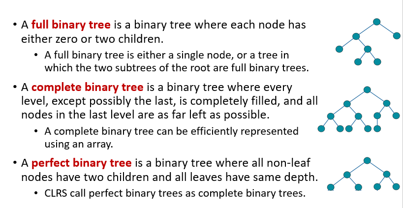

对于这三个的定义，各教程并未达成一致

本课程采用这个版本

### 树的遍历

如何把树的每个节点都访问一次？

多种方法：

* 先序遍历 preorder tree walk，输出子树根的关键字位于左子树的关键字值和右子树的关键字值**之前**
* 后序遍历 postorder tree walk，输出子树根的关键字位于左子树的关键字值和右子树的关键字值**之后**
* 中序遍历 inorder tree walk，输出子树根的关键字位于左子树的关键字值和右子树的关键字值**之间**
* levelorder tree walk，按层遍历

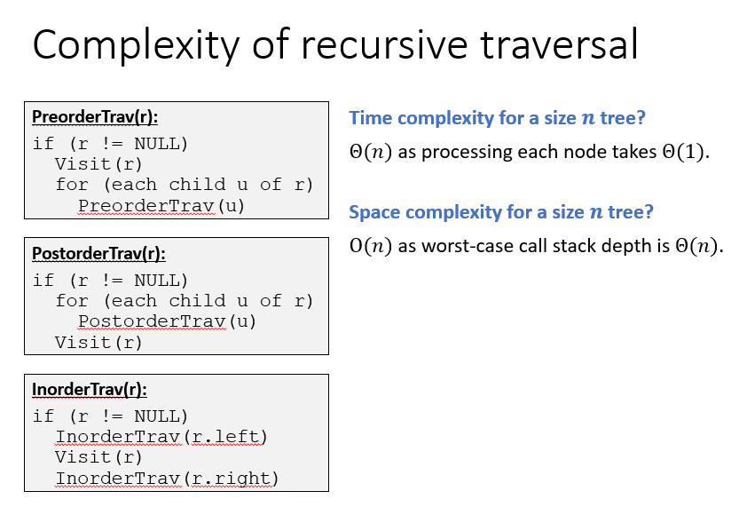

#### 通过使用栈把递归换成循环

```pseudocode
struct Frame {
  Node *node;
  bool visit;
  Frame(Node* n,bool v) {
    node = n;
    visit = v;
  }
}


PreorderTravIter(root):
Stack s
s.push(Frame(root,false))
while (!s.empty())
  f = s.pop()
  if (f.node != NULL)
    if (f.visit)
      Visit(f.node)
    else
      for (each child u of f.node)
        s.push(Frame(u,false))
      s.push(Frame(f.node,true))
      
      
InorderTravIter(root):
Stack s
s.push(Frame(root,false))
while (!s.empty())
  f = s.pop()
  if (f.node != NULL)
    if (f.visit)
      Visit(f.node)
    else
      s.push(Frame(f.node->right,false))
      s.push(Frame(f.node,true))
      s.push(Frame(f.node->left,false))
```


```pseudocode
LevelorderTrav(r):
Queue q
q.add(r)
while (!q.empty())
  node = q.remove()
  if (node != NULL)
    Visit(node)
    q.add(node->left)
    q.add(node->right)
```

## 搜索树

### 有序集合（OSet）

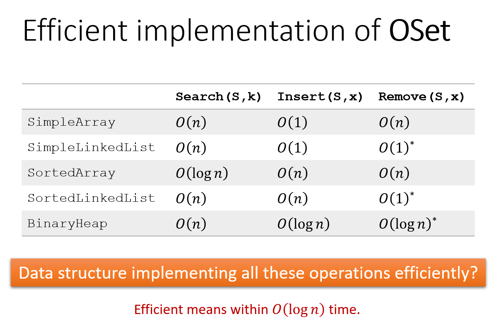

使用二叉搜索树（binary search tree ，BST）更快

### 搜索元素

```pseudocode
BSTSearch(x,k):
if (x==NULL or x.key==k)
  return x
else if (x.key>k)
  return BSTSearch(x.left,k)
else
  return BSTSearch(x.right,k)
```

```pseudocode
BSTSearchIter(x,k):
while (x!=NULL and x.key!=k)
  if (x.key>k)
    x = x.left
  else
    x = x.right
return x
```

复杂度：$O(h)$，$h$ 为树的高度

读取最大或者最小值也是 $O(h)$

### 搜索大于某值的所有元素中最小的

```pseudocode
BSTSuccessor(x):
if (x.right!=NULL)
  return BSTMin(x.right)
y = x.parent
while (y!=NULL and y.right==x)
  x = y
  y = y.parent
return y
```

### 插入元素

首先搜索插入的元素，当然是搜不到的，但会停在某个节点上

此时在次节点上加入插入的元素，作为其子节点

### 删除

#### 删除的节点没有孩子

直接删除，$O(1)$

#### 删除的节点只有一个孩子

将节点删除，孩子插入，$O(1)$

#### 删除的节点有两个孩子

##### `z.right.left==NULL`

删除 `z` ，用 `z.right` 替代，$O(1)$

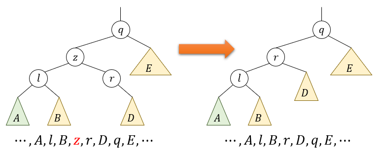

##### `z.right.left!=NULL`

用 `BSTsuccessor(z)` 替代 `z`

其实上一种情况的 `z.right` 也是 `BSTsuccessor(z)`

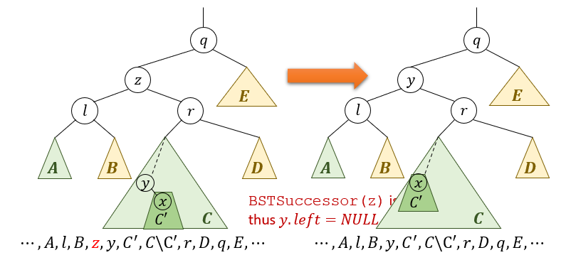

最多 $O(h)$

### 分析

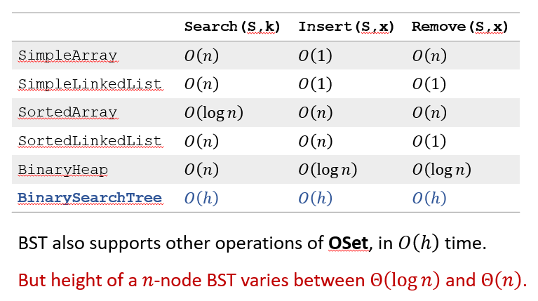

## 树堆（treap）

每个节点除了它自己的键 `key`，还有一个优先值 `priority`

键满足搜索树性质，优先值满足最小堆性质

期望上深度为 $O(\lg n)$

### 唯一性

对于互不相同的 `key` 和 `priority` ，树堆唯一。

> Proof by induction on n:
>
> * **[Basis]:** The claim clearly holds when n=0.
> * **[Hypothesis]:** The claim holds when n≤n^′-1.
> * **[Inductive Step]:** 
>   * Given a set of n′ nodes, let r be the node with min priority. By MinHeap-property, r has to be the root of the final Treap. 
>   * Let L be set of nodes with key values less than r.key, 
>     and R be set of nodes with key values larger than r.key.
>   * By BST-property, in the final Treap, nodes in L must in left sub-tree of r, and nodes in R must in right sub-tree of r.
>   * By induction hypothesis, nodes in L lead to a unique Treap, and nodes in R lead to a unique Treap.

### 插入

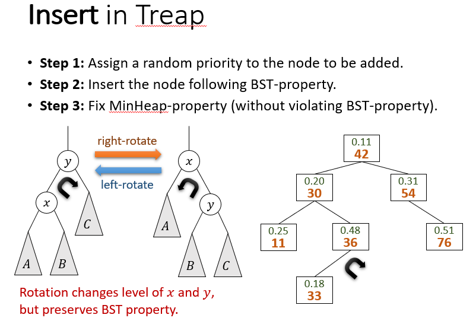

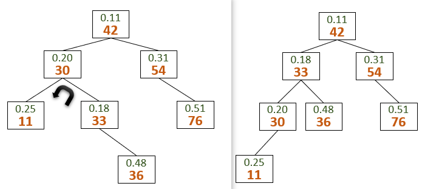

### 删除

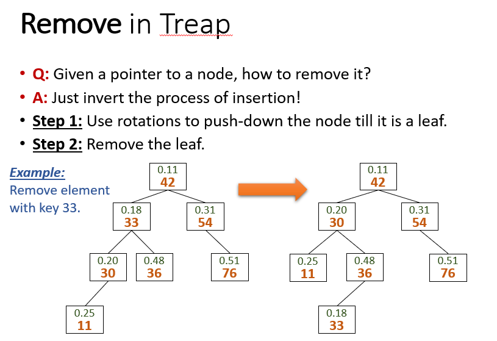

## 红黑树（RB-Tree

是一种二叉搜索树，每个节点带有颜色，满足以下条件

* 只有红色或黑色
* 根节点是黑色
* 叶子节点是黑色
* 红色节点的两个子节点是黑色
* 对任何一个节点，从它到所在子树的所有叶子节点的路径所经过的黑色节点数相等

为了满足性质，红黑树可以包含NULL的叶子节点，称为外部节点

最坏情况高度为 $O(\lg n)$

### 证明

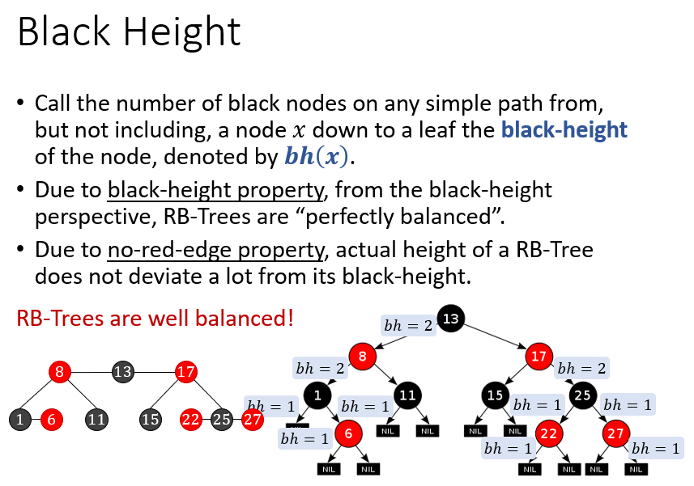

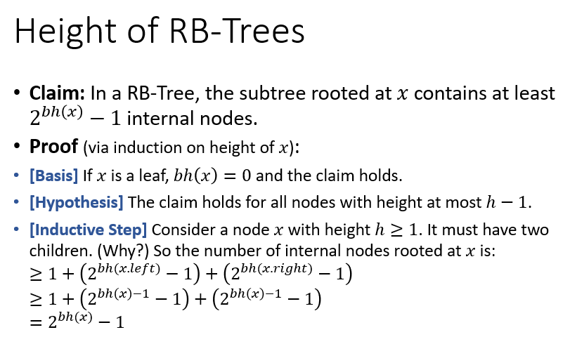

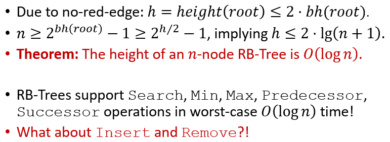

### 插入

首先将节点染成红色，按搜索树规则插入

然后修复被破坏的红黑树性质：

#### case1：父节点为黑

不需要做任何事

#### case2：插入的是根节点

直接将插入的节点染黑即可

#### case3：父节点和叔节点均为红

此时祖父节点一定为黑

将祖父节点染红，父节点和叔节点染黑

如果祖父节点的父节点为红，把祖父节点当做插入节点进行下一步

#### case4：父节点为红，叔节点为黑，插入的节点在右

以父节点为轴左旋，变为case5，此时原父节点变成插入的节点

#### case5：父节点为红，叔节点为黑，插入的节点在左

以插入节点的祖父为轴右旋，然后将它（之前的）祖父节点染红（原必为黑）和父节点染黑

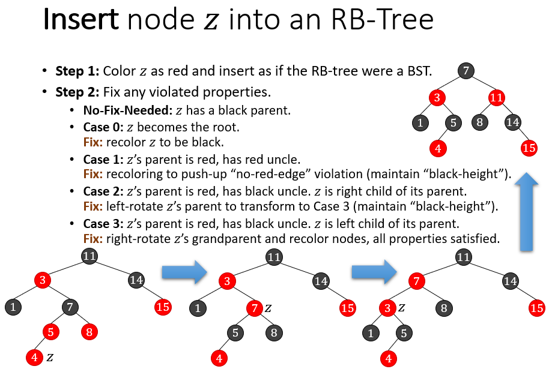

#### 时间复杂度

最坏 $O(\lg n)$，因为case3

至多 $O(1)$ 次旋转

### 删除

假设删除 `z` 

#### 确认结构上删除哪个节点

##### `z` 的右孩子是外部节点

直接用左孩子替代 `z`，此时结构上删除的是 `z`

##### `z` 的右孩子是一个子树

找到右子树中的最小值 `y` ，令 `z=y` （颜色不复制），然后用 `y` 的右子树替代 `y` （`y` 必然没有左子树）

此时结构上删除的是 `y`

#### 修复被破坏的红黑树性质

（不用背）

假设结构删除的是 `y` ，右孩子是 `x`

执行结构删除后，进行修复：

##### `y` 红色

不需要任何操作

##### `y` 为黑，`x` 为红

将 `x` 染黑即可

##### 均为黑

不妨设 `x` 为其父亲的左孩子，记 `x` 的兄弟节点为 `w`

* `w` 为红：此时 `x` 的父节点一定为黑，所以以 `x` 的父节点为轴左旋，`x` 的父节点染红；`w` 染黑
* `w` 和其两个孩子均为黑：`w` 染红，将 `x` 的子节点作为新的 `x` 继续修复
* `w` 为黑，其子节点左红右黑：以 `w` 为轴右旋，`w` 和 `w.left` （这里的left是左旋前的）交换颜色。变为最后一种情况
* `w` 为黑，其右子节点为红：以 `x` 的父亲为轴左旋，然后交换 `w` 和 `w`（原来的）父节点颜色，如图：

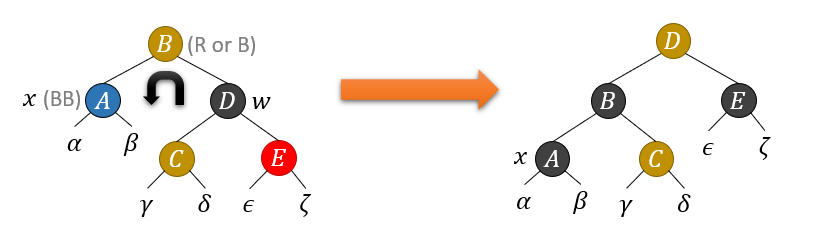

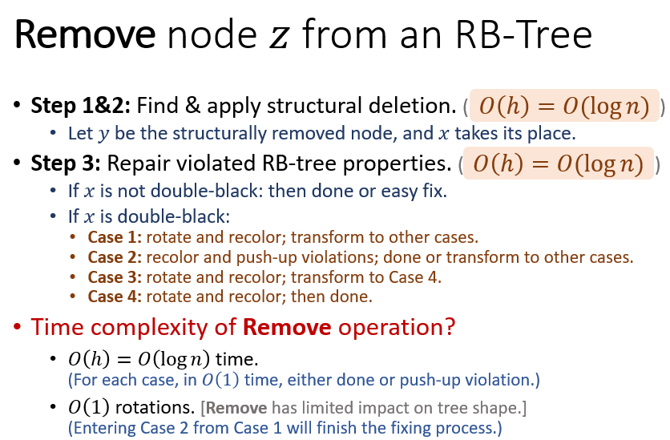

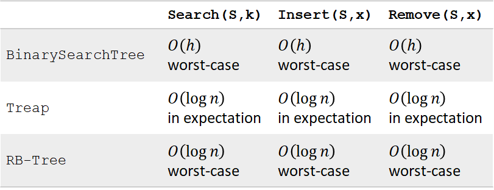

## 跳表（Skip List）

并不是树

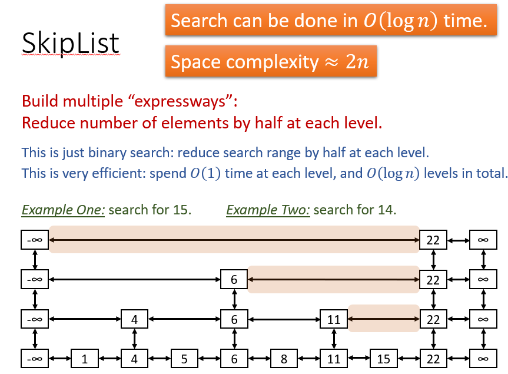

搜索的时间复杂度每层 $O(1)$，总共 $O(\lg n)$

空间复杂度 $2n$，只是翻倍了而已

### 插入

```pseudocode
Insert(L,x):
level = 1, done = false
while (!done)
  Insert x into level k list.
  Flip a fair coin:
    With probability 1/2: done = true
    With probability 1/2: k = k+1
```

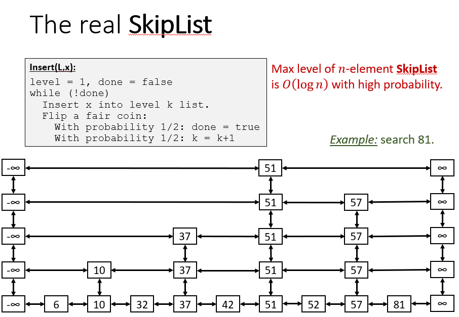

