# 11 图算法

## 在计算机中表示图

对于图 $G(V,E)$ ，点的数量 $|V|=n$，边的数量 $|E|=m$，在计算机中表示它主要由两种方法：

### 邻接矩阵(Adjacency Matrix)

用一个 $n\times n$ 矩阵 $A$ 表示，$a_{ij}=\begin{cases}1&i,j\text{之间有边，即}(i,j)\in E\\0&\text{否则}\end{cases}$

如果 $G$ 是无向图， $A$ 是对称矩阵

空间复杂度 $\Theta(n^2)$

$A^2$ 表示在 $2$ 步之内能否从 $i$ 走到 $j$

* 即记 $(b_{ij})=A^2,\quad b_{ij}=1$ 当且仅当在 $2$ 步之内能从 $i$ 走到 $j$

### 邻接表(Adjacency List)

**邻接表（**英语**：adjacency list）**是表示了图中与每一个顶点相邻的边集的集合，这里的集合指的是无序集。

使用链表：

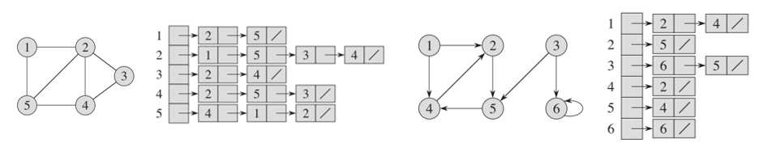

每个顶点有一个链表，链表中的元素为与其相连的所有元素

如果是无向图，一条边会出现两次

空间复杂度 $\Theta(n+m)$

### 比较

邻接矩阵：

* 快：查询 “$u,v$ 是否是邻居” 比较
* 慢：查询某个节点的一个或多个（所有）邻居

邻接表

* 慢：查询 “$u,v$ 是否是邻居” 比较
* 快：查询某个节点的一个或多个（所有）邻居

选择数据结构时需要考虑的问题（不止是这个问题，而是一般规律）：

* 哪种操作比较频繁？
* 数据本身的特征：图是稠密的(dense)还是稀疏的(sparse)？（关系到空间复杂度）

## 图搜索

两个可能的目标：

* 从节点 $s$ 开始，找到节点 $t$
* 从节点 $s$ 开始，遍历所有节点

两个都算搜索

### 广度优先(Breath-First Search, BFS)

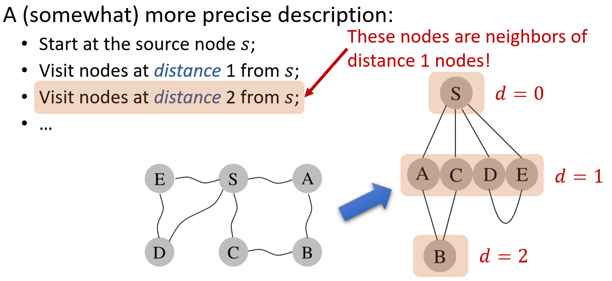

利用FIFO队列实现：

```pseudocode
BFSSkeleton(G,s):
    for (each u in V)
      u.dist=INF, u.visited=false
    s.dist = 0
    Q.enque(s)
    while (!Q.empty())
      u = Q.dequeue()
      u.visited = true
      for (each edge (u,v) in E)
        if (!v.visited)
          v.dist = u.dist+1
          Q.enque(v)
```

这个实现有一个问题：节点可能被重复加入 `Q`

可以不通过 `visited` 区分，而是通过 `discovered` 区分

更清晰的是为节点指定3种状态：

* 未发现：白
* 已发现但未遍历：灰
* 已遍历：黑

得到伪代码：

```pseudocode
BFS(G,s):
    for (each u in V)
      u.c = WHITE, u.d = INF, u.p = NIL
    s.c = GRAY, s.d = 0, s.p = NIL
    Q.enque(s)
    while (!Q.empty())
      u = Q.dequeue()
      u.c = BLACK
      for (each edge (u,v) in E)
        if (v.c == WHITE)
          v.c = GRAY
          v.d = u.d+1
          v.p = u
          Q.enque(v)
```

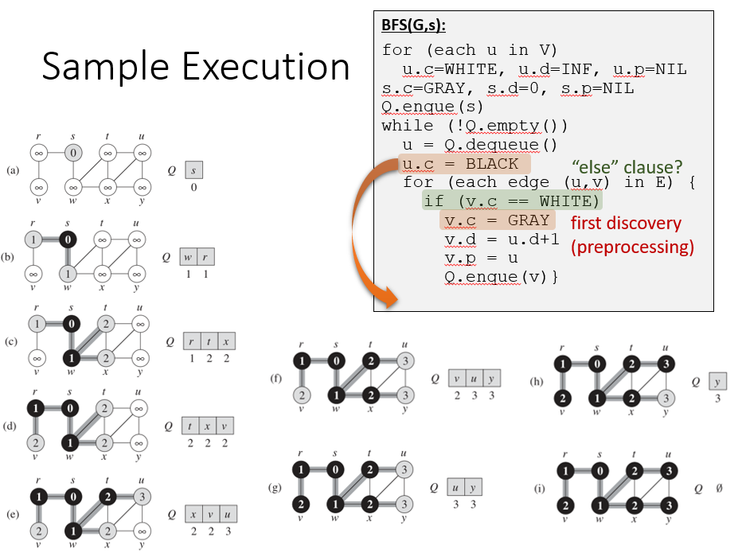

#### 运行时间

$\Theta(n+m)$

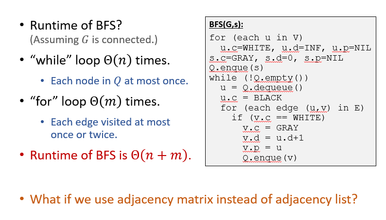

#### 非连通图上的BFS

对每一个节点使用BFS

```pseudocode
BFS(G):
    for (each u in V)
      u.c = WHITE, u.d = INF, u.p = NIL
    for (each u in V)
      if (u.c == WHITE)
        u.c = GRAY, u.d = 0, u.p = NIL
        Q.enque(u)
        while (!Q.empty())
          v = Q.dequeue()
          v.c = BLACK
          for (each edge (v,w) in E)
            if (w.c == WHITE)
              w.c = GRAY
              w.d = v.d+1
              w.p = v
              Q.enque(w)
```

### 深度优先(Depth-First Search, DFS)

递归版本：

```pseudocode
DFSSkeleton(G,s):
s.visited = true
for (each edge (s,v) in E)
  if (!v.visited)
    DFSSkelecton(G,v)
```

非递归版本：

```pseudocode
DFSIterSkeleton(G,s):
Stack Q
Q.push(s)
while (!Q.empty())
  u = Q.pop()
  if (!u.visited)
    u.visited = true
    for (each edge (u,v) in E)
      Q.push(v)
```


#### 非连通图上的DFS

```pseudocode
DFSAll(G):
for (each node u)
  u.visited = false
for (each node u)
  if (u.visited == false)
    DFSIterSkeleton(G,u)//或者DFSSkeleton
```

#### 三状态版本

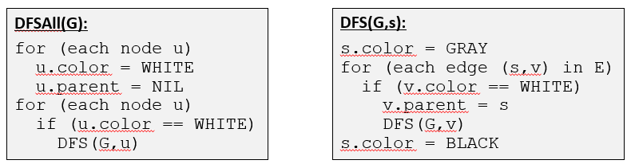

#### 时间复杂度

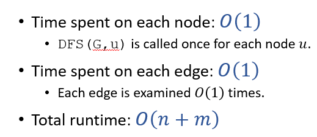

记一个节点 $u$ 的发现时间为 $u.d$，完成时间为 $u.f$

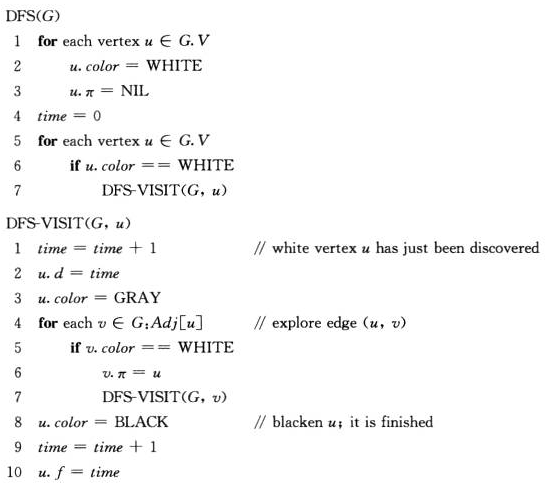

下面进行证明：

##### 边的分类：

DFS将边分为四类：

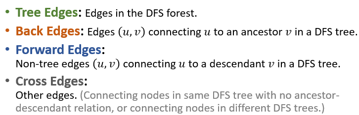

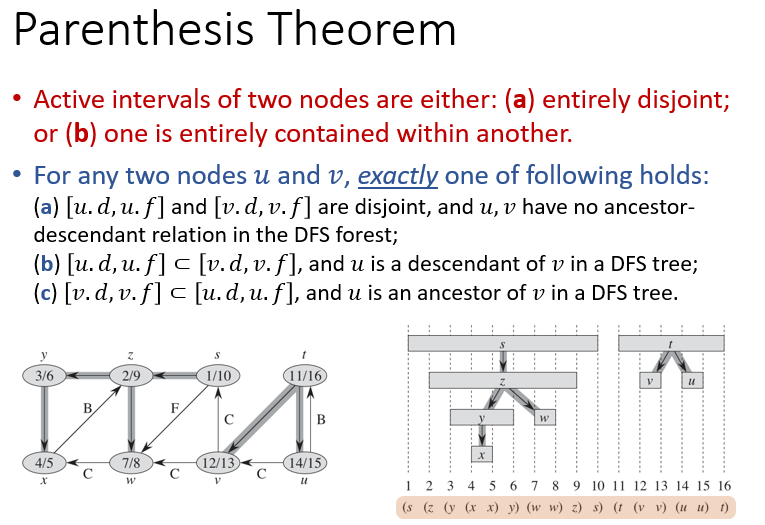

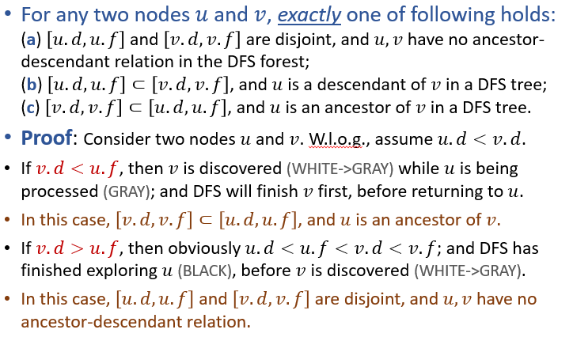

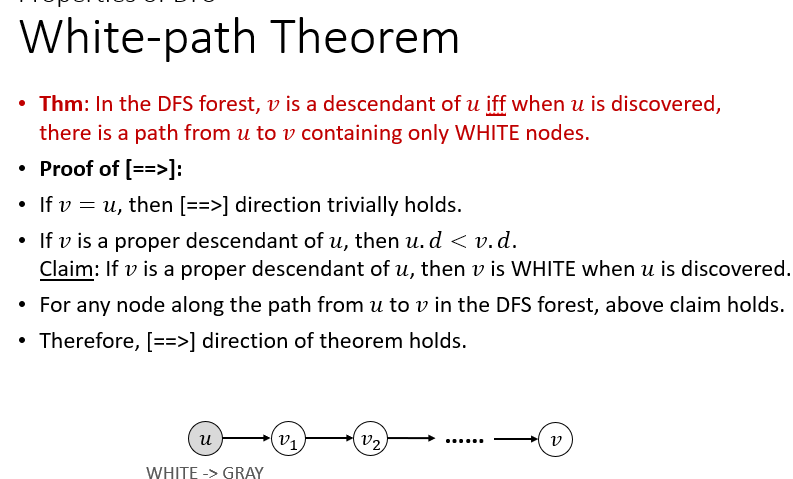

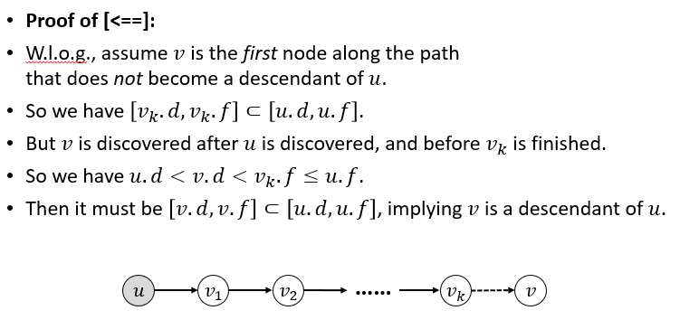

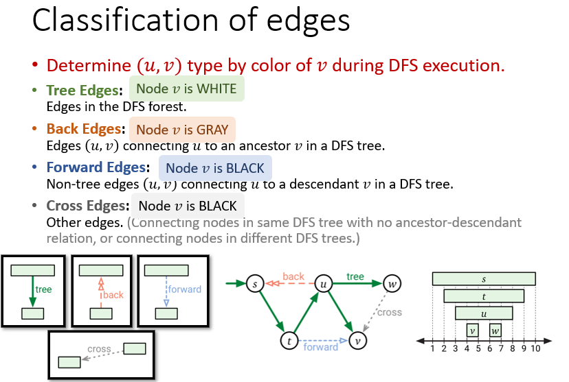

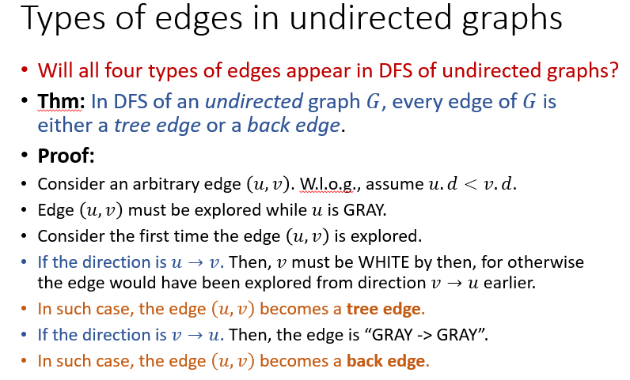
