# 12 DFS的一些应用

## 有向无环图(directed acyclic graph, DAG)

适合表示因果关系、层次结构和时间依赖关系

例如时间依赖关系：

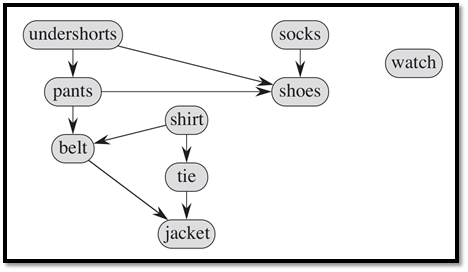

### 拓扑排序(topological sort)

DAG的拓扑排序指**对节点进行线性排序**，这个排序满足**如果DAG中包括边 $(u,v)$，那么在排序中 $u$ 出现在 $v$ 之前**

$E(G)$ 是 $V(G)$ 的一个**偏序**关系，而一个拓扑排序是满足 $E(G)$ 的一个 $V(G)$ 的**全序**关系

* 如果图包含环，拓扑排序是不可能的
* 一个图可能有多个不同的拓扑排序

#### 生成拓扑排序

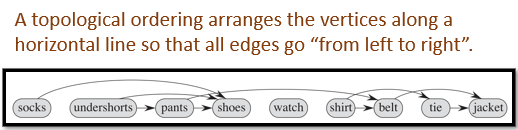

算法：

* 使用 `DFS(G)` 对图进行遍历，得到对每个节点的一个完成时间 `u.f`
* 当一个节点完成时，将它插入输出链表的头部
* 如果DFS完成且没有发现环，输出链表。

时间复杂度 $O(m+n)$

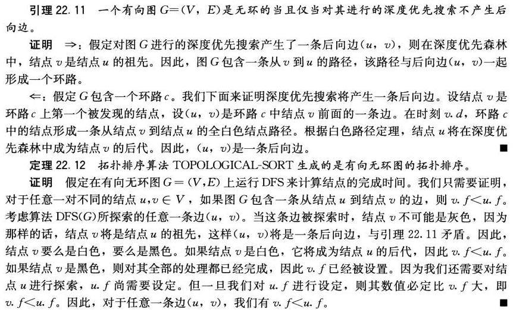

#### 另一种生成拓扑排序的方法

一个源节点(source node)是没有入边的节点

一个下沉点(sink node)是没有出边的节点

注意到：

* 每个DAG都有至少一个源节点和一个下沉点

* 在对DAG进行DFS时，源节点的完成时间最大
* 在对DAG进行DFS时，下沉点的完成时间最小

所以设计算法：

* 找出源节点并输出
* 删除该节点和与它有联系的所有边
* 重复，直到图为空

## 强连通分量

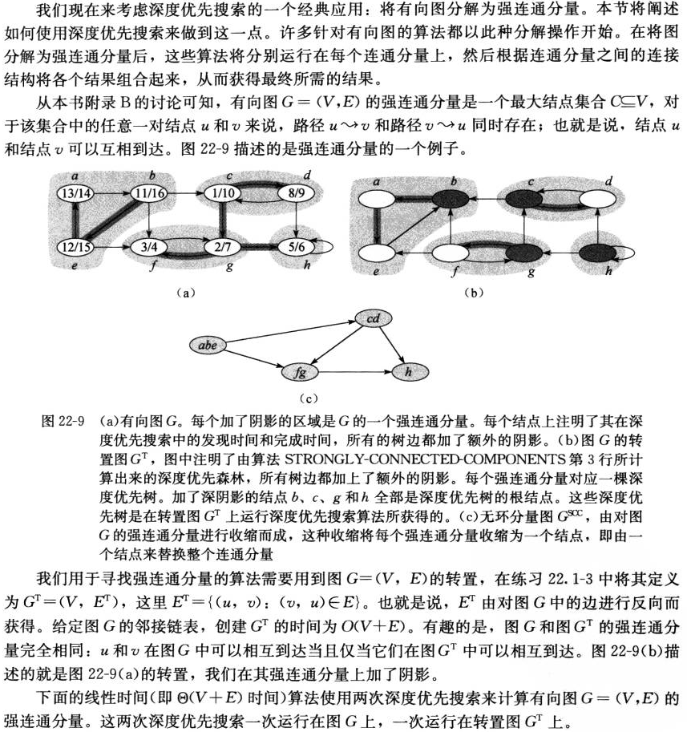

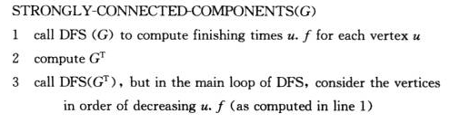

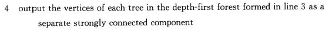

时间复杂度：$O(m+n)$，包括一次生成 $G^T$ 和两次DFS

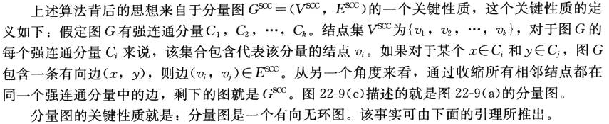

证明见《算法导论》第三版中文版P358

### Tarjan's SCC Algorithm(了解即可)

$O(m+n)$

更快（非渐进的），只进行一次DFS

建议看PPT（13-P22），有动画更清楚

基本原理：


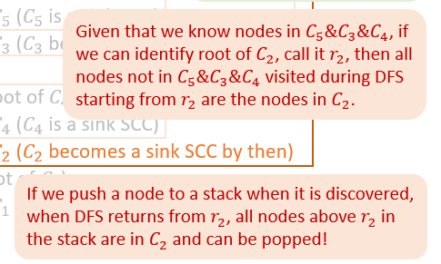

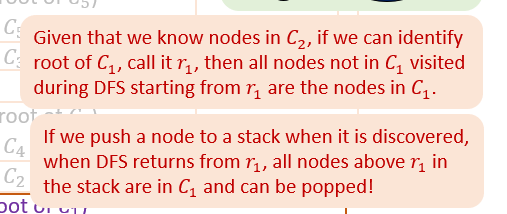

#### 找出 $r_i$

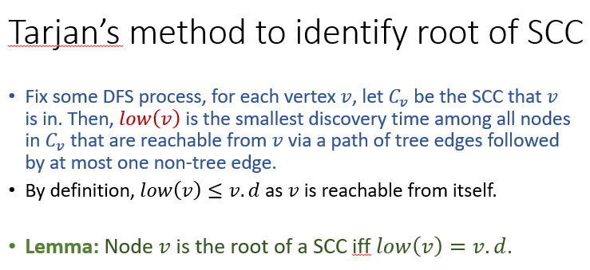

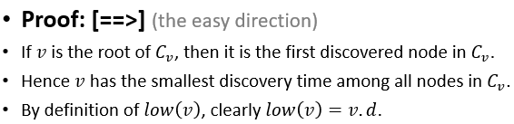

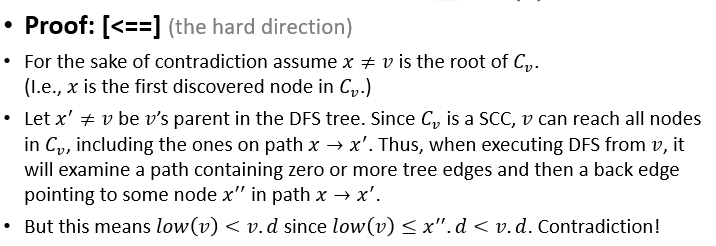

#### 伪代码

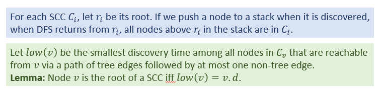

```pseudocode
Tarjan(G):
time = 0
Let S be a stack
for (each node v)
  v.root = NIL
  v.visited = false
for (each node v)
  if (!v.visited)
    TarjanDFS(v)


TarjanDFS(v):
v.visited = true, time = time+1
v.d = time, v.low = v.d
S.push(v)
for (each edge (v,w))
  if (!w.visited) // tree edge
    TarjanDFS(w)
    v.low = min(v.low, w.low)
  else if (w.root == NIL) // non tree edge in 𝐶_𝑣
    v.low = min(v.low, w.d)
if (v.low == v.d)
  repeat
    w = S.pop(), w.root = v
  until (w==v)
```

