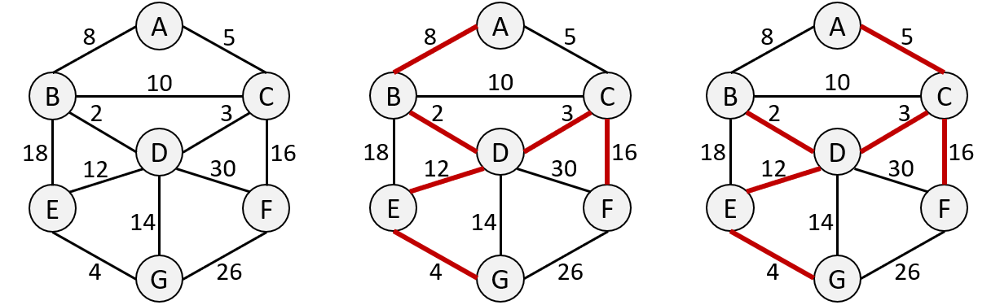
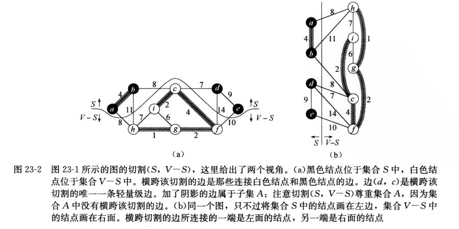
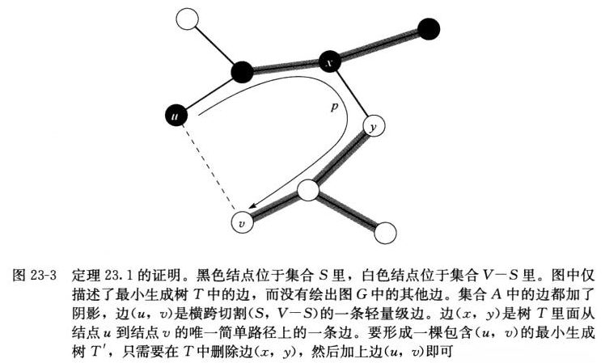
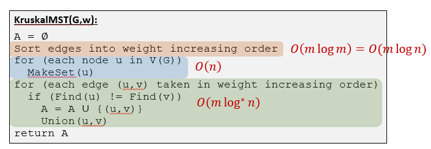
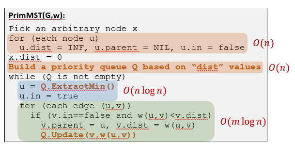
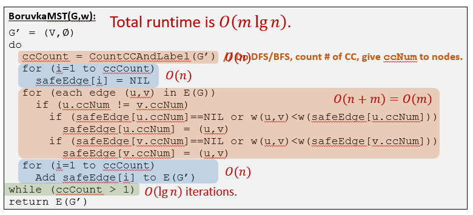
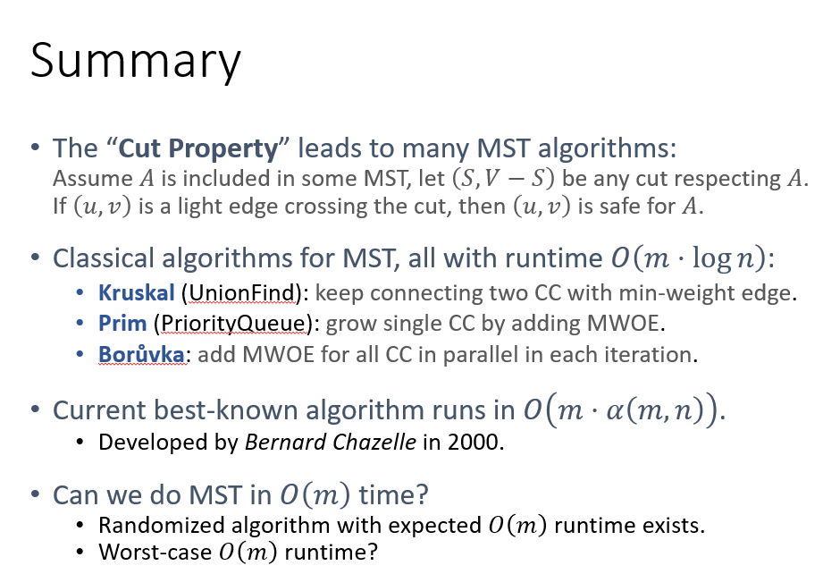

# 13 最小生成树

考虑一个带权重的无向连通图 $G=(V,E)$：

* 生成树是一个包含 $V$ 中所有节点，边集 $T$ 是 $E$ 的子集的树
* **最小生成树（MST）**是边的总权重 $w(T)=\sum_{(u,v)\in T}w(u,v)$ 最小的生成树



MST广泛应用于网络设计：

* 运输网络设计
* 供水网络设计
* 通讯网络设计
* 计算机网络设计

MST也是一些其他高级算法的重要子程序

## 产生MST

* 起始状态：所有节点和空的边集 $A$

* 将 safe edges 加入 $A$ ，维护循环不变量使得 $A$ 是 $MST$ 的子集

  >Find some edge (These edges also called “**safe edges**”.) to add to A, maintaining the invariant that “A is a subset of some MST”.
  > (At anytime, A is the edge set of a spanning forest.)
  >
  >安全边指边 $(u,v)$ 使得 $A$ 为某棵最小生成树的子集时， $A\cup \{(u,v)\}$ 也是某棵最小生成树的子集。

* 重复上一步直到获得一个生成树（判断标准： $|A|=n-1$）

```pseudocode
GenericMST(G,w):
A = ∅
while (A is not a spanning tree)
  Find edge (𝑢,𝑣) maintaining the invariant
  A = A ∪ {(𝑢,𝑣)}
return A
```

**后面介绍的三种算法都是这一算法的细化，各使用一种特定的方式找到 safe edge。但是首先，我们需要确定一个 safe edge 应当满足什么条件**

### 找出 safe edge

我们首先需要一些定义：

* 无向图 $G=(V, E)$ 的一个**切割(cut)** $(S, V-S)$ 是集合 $V$ 的一个划分, 如图 23-2 所示。

* 如果一条边 $(u, v) \in E$ 的一个端点位于集合 $S$, 另一个端点位于集合 $V-S$, 则称该条边**横跨切割(cross)** $(S, V-S)$ 。

* 如果集合 $A$ 中不存在横跨该切割的边, 则称该切割**尊重(respects)**集合 $A$ 。

* 在横跨一个切割的所有边中, 权重最小的边称为**轻量级边(light edge)**。

  > 注意, 轻量级边可能不是唯一的。一般, 如果一条边是满足某个性质的所有边中权重最小的, 则称该条边是满足给定性质的一条轻量级边。



#### 定理1

假设：

* $G=(V, E)$ 是一个在边 $E$ 上定义了实数值权重函数 $w$ 的连通无向图。

* 集合 $A$ 为 $E$ 的一个子集, 且 $A$ 包括在图 $G$ 的某棵最小生成树中

* $(S, V-S)$ 是图 $G$ 中尊重集合 $A$ 的任意一个切割

* $(u, v)$ 是横跨切割 $(S, V-S)$ 的一条轻量级边。

那么边 $(u, v)$ 对于集合 $A$ 是安全的。

**证明**

设 $T$ 是一棵包括 $A$ 的最小生成树, 并假定 $T$ 不包含轻量级边 $(u, v)$; 否则, 我们已经证明完毕。

现在来构建另一棵最小生成树 $T^{\prime}$, 我们通过前切和粘贴来将 $A \cup\{(u, v)\}$ 包括在 树 $T^{\prime}$ 中, 从而证明 $(u, v)$ 对于集合 $A$ 来说是安全的。

边 $(u, v)$ 与 $T$ 中从结点 $u$ 到结点 $v$ 的简单路径 $p$ 形成一个环路, 如图 23-3 所示。



由于结点 $u$ 和结点 $v$ 分别处在切割 $(S, V-S)$ 的两端, $T$ 中至少有一条边属于简单路径 $p$ 并且横跨该切 割。设 $(x, y)$ 为这样的一条边。

因为切割 $(S, V-S)$ 尊重集合 $A$, 边 $(x, y)$ 不在集合 $A$ 中。由于边 $(x, y)$ 位于 $T$ 中从 $u$ 到 $v$ 的唯一简单路径上, 将该条边删除会导致 $T$ 被分解为两个连通分量。 

将 $(u, v)$ 加上去可将这两个连通分量连接起来形成一棵新的生成树 $T^{\prime}=T-\{(x, y)\} \cup\{(u, v)\}$ 。

下面证明 $T^{\prime}$ 是一棵最小生成树。由于边 $(u, v)$ 是横跨切割 $(S, V-S)$ 的一条轻量级边并且边 $(x, y)$ 也横跨该切割, 我们有 $w(u, v) \leqslant w(x, y)$ 。因此,
$$
w\left(T^{\prime}\right)=w(T)-w(x, y)+w(u, v) \leqslant w(T)
$$
但是, $T$ 是一棵最小生成树, 我们有 $w(T) \leqslant w\left(T^{\prime}\right) ;$ 因此, $T^{\prime}$ 一定也是一棵最小生成树。

下面还需要证明边 $(u, v)$ 对于集合 $A$ 来说是一条安全边。因为 $A \subseteq T$ 并且 $(x, y) \notin A$, 所以有 $A \subseteq T^{\prime} ;$ 因此 $A \cup\{(u, v)\} \subseteq T^{\prime}$ 。由于 $T^{\prime}$ 是最小生成树, $(u, v)$ 对于集合 $A$ 是安全的。

定理1能够帮助我们更好地理解连通图 $G=(V, E)$ 上算法 $G E N E R I C-M S T$ 的工作原理。随着该算法的推进, 集合 $A$ 总是保持在无环状态; 否则, 包含 $A$ 的最小生成树将包含一个环路,这将与树的定义相矛盾。

在算法执行的任意时刻, 图 $G_{A}=(V, A)$ 是一个森林, $G_{A}$ 中的每个连通分量则是一棵树 (某些树可能仅包含一个结点，如在算法开始时, 集合 $A$ 为空, 而森林中包含$|V|$ 棵树, 每棵树中只有一个结点)。

而且, 由于 $A \cup\{(u, v)\}$ 必须是无环的, 所有对于集合 $A$为安全的边 $(u, v)$ 所连接的是 $G_{A}$ 中不同的连通分量。

GENERIC-MST 算法的第 $2 \sim 4$ 行的 while 循环执行的总次数为 $|V|-1$ 次, 因为该循环的每遍循环都找出最小生成树所需 $|V|-1$ 条边中的一条。在初始时, 当 $A=\varnothing$ 时, $G_{A}$ 中有 $|V|$ 棵树, 每遍循环将树的数量减少 1 棵。当整个森林仅包含一棵树时, 该算法就终止。

#### 推论

下面介绍的两个算法将使用下列推论：

设：

* $G=(V, E)$ 是一个连通无向图, 并有定义在边集合 $E$ 上的实数值权重函数 $w$ 。
* 集合 $A$ 为 $E$ 的一个子集, 且该子集包括在 $G$ 的某棵最小生成树里
* $C=\left(V_{C}, E_{C}\right)$ 为森林 $G_{A}=(V, A)$ 中的一个连通分量(树)。

如果边 $(u, v)$ 是连接 $C$ 和 $G_{A}$ 中某个其他连通分量的一条轻量级边, 则边 $(u, v)$ 对于集合 $A$ 是安全的。

**证明**

切割 $\left(V_{C}, V-V_{C}\right)$ 尊重集合 $A$, 边 $(u, v)$ 是横跨该切割的一条轻量级边, 因此, 边 $(u, v)$ 对于集合 $A$ 是安全的。

### Kruskal

从所有点和 $0$ 条边开始，选择连接两棵树的最小权重边。

```pseudocode
KruskalMST(G,w):
A = ∅
Sort edges into weight increasing order
for (each edge (𝑢,𝑣) taken in weight increasing order)
  if (adding edge (𝑢,𝑣) does not form cycle in A)
    A = A ∪ {(𝑢,𝑣)}
return A
```

或者写具体一点：

```pseudocode
KruskalMST(G,w):
A = ∅
Sort edges into weight increasing order
for (each node u in V(G))
  MakeSet(u)
for (each edge (u,v) taken in weight increasing order)
  if (Find(u) != Find(v))
    A = A ∪ {(u,v)}
    Union(u,v)
return A
```

#### 时间复杂度



### Prim

MWOE：minimum-weight-outgoing-edge

> •**Cut Property****:** Assume A is included in some MST, let $G_A=(V,A)$. 
>  For any CC in $G_A$, its minimum-weight-outgoing-edge in $G$ is safe for $A$.
>
> •**Strategy for finding safe edge in Prim’s algorithm:
> ** Keep finding MWOE in one *fixed* CC in G_A.

策略：找到MWOE作为 safe edge

prim能处理边权为负的情况，其他可能在边权为负时正确性出错（没证过，不一定）

```pseudocode
PrimMST(G,w):
Pick an arbitrary node x
for (each node u)
  u.dist = INF, u.parent = NIL, u.in = false
x.dist = 0
Build a priority queue Q based on “dist” values
while (Q is not empty)
  u = Q.ExtractMin()
  u.in = true
  for (each edge (u,v))
    if (v.in==false and w(u,v)<v.dist)
      v.parent = u, v.dist = w(u,v)
      Q.Update(v,w(u,v))
```

#### 时间复杂度



这里 priority queue 使用 binary heap 实现

### Borůvka

这个在书上没讲，但是讲义有

类似与Prim，但是Prim对一个固定的CC寻找MWOE并添加，Borůvka同时对所有MWOE进行寻找和添加

这实际上是最早的MST产生算法

```pseudocode
BoruvkaMST(G,w):
G’ = (V,∅)
do
  ccCount = CountCCAndLabel(G’) 
  for (i=1 to ccCount)
    safeEdge[i] = NIL
  for (each edge (u,v) in E(G))
    if (u.ccNum != v.ccNum)
      if (safeEdge[u.ccNum]==NIL or w(u,v)<w(safeEdge[u.ccNum]))
        safeEdge[u.ccNum] = (u,v)
      if (safeEdge[v.ccNum]==NIL or w(u,v)<w(safeEdge[v.ccNum]))
        safeEdge[v.ccNum] = (u,v)
  for (i=1 to ccCount)
    Add safeEdge[i] to E(G’)
while (ccCount > 1)
return E(G’)
```

#### 时间复杂度



Borůvka**允许并行计算**。

### 总结

