# 14 贪心算法

* 对于许多问题，你需要预测未来的情况（比如下棋），一个专注于短期利益的策略可能导致失败
* 但对于某些其他问题，可以在决策时作出当前看起来最好的决定，而不必过于担心未来结果，比如构造MST
* 贪心算法策略（Greedy Algorithmic Startegy）：给定一个问题，一个一个地建立一个解决方案，总是作出提供最明显和最直接好处的选择。
  * 有时它给出最优化的解
  * 有时给出接近于最优化的解
  * 有时失败

## 活动选择问题

* 假设我们有一个教室和 $n$ 个活动 $S=\{a_1\cdots a_n\}$
* 每个活动有开始时间 $s_i$ 和完成时间 $f_i$
* 两个活动不能同时进行

求我们可以计划的最大活动数

可以使用分治法：

* 定义 $S_i$ 为 $a_i$ 完成后开始的活动集合
* 定义 $F_i$ 为 $a_i$ 开始前完成的活动集合
* $\displaystyle OPT(S)=\max_{1\leq i\leq n}\{1+OPT(S_i)\}$
* 为了使 $OPT(S)$ 最大，第一个完成的时间应当越早越好

```pseudocode
ActivitySelection(S):
Sort S into increasing order of finish time
SOL = {a1}, a’ = a1
for (i=2 to n)
  if (ai.start_time > a’.finish_time)
    SOL = SOL ∪ {ai}
    a’ = ai
return SOL
```

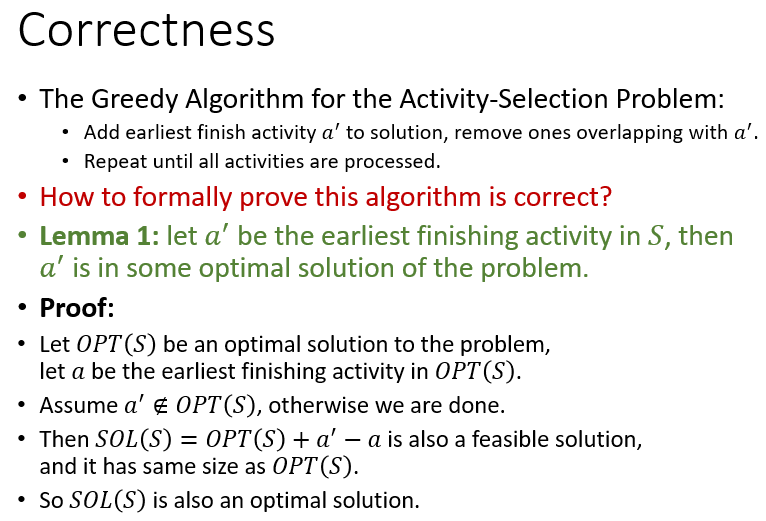

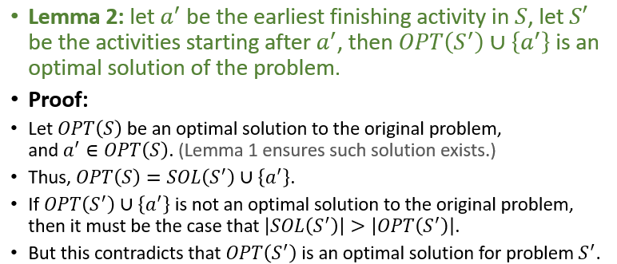

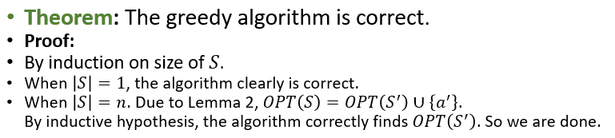

## 贪心算法原理

如果一个问题具有以下两个性质，贪心算法通常可用：

* 最优子结构(Optimal substructure)
* 贪心选择性质(Greedy property，或者 Greedy-choice property)

### 最优子结构

如果一个问题的最优解包含其子结构的最优解，称问题具有最优子结构。

形式化描述：


### 贪心选择性质

可以通过局部最优（贪心）选择来构造全局最优解。换句话说，当进行选择时，可以直接做出当前看来最优的选择，而不必考虑子问题的解。

形式化描述：

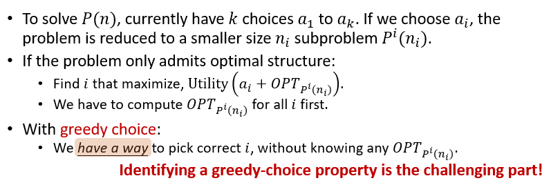


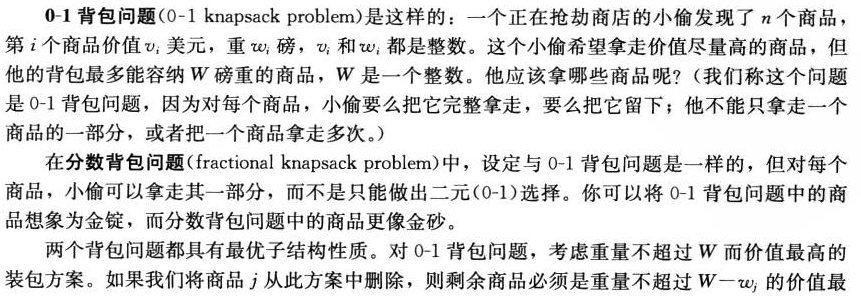

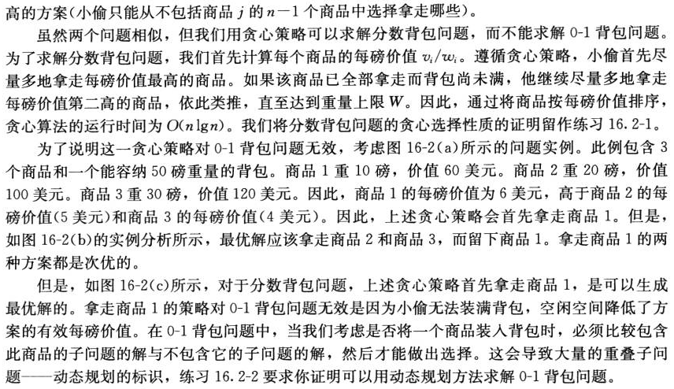

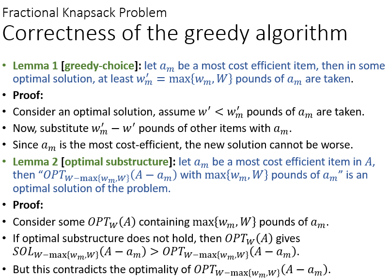

## 赫夫曼编码

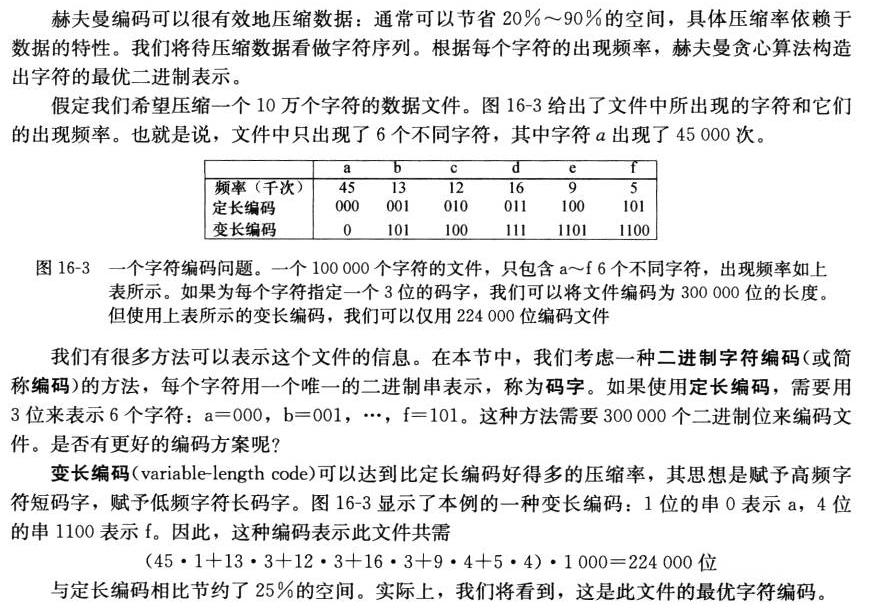

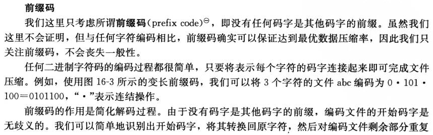

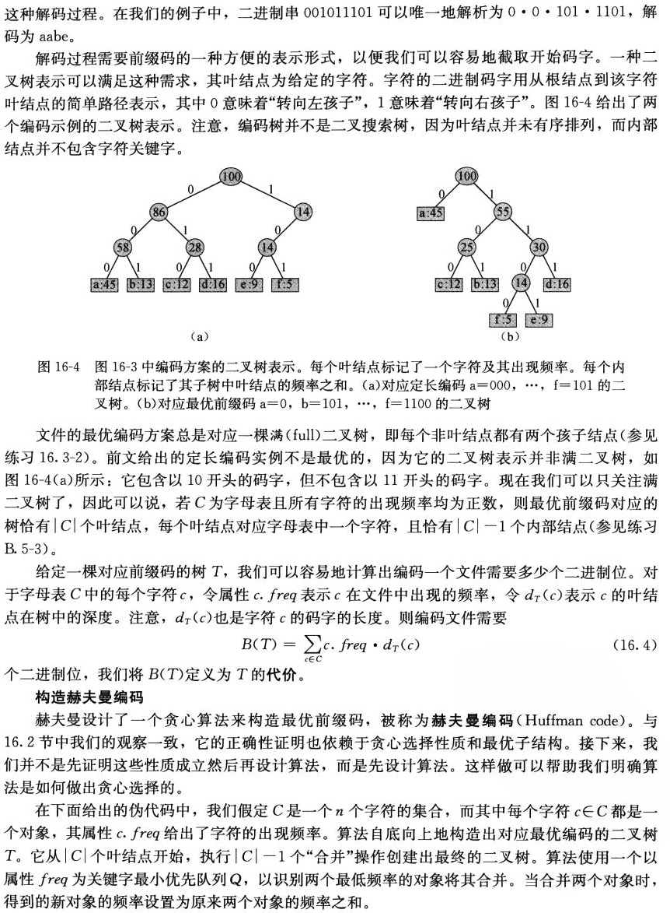

```pseudocode
Huffman(C):
Build a priority queue Q based on frequency
for (i=1 to n-1)
  Allocate new node z
  x = z.left = Q.ExtractMin()
  y = z.right = Q.ExtractMin()
  z.frequency = x.frequency + y.frequency
  Q.Insert(z)
return Q.ExtractMin()
```

时间复杂度 $O(n\log n)$

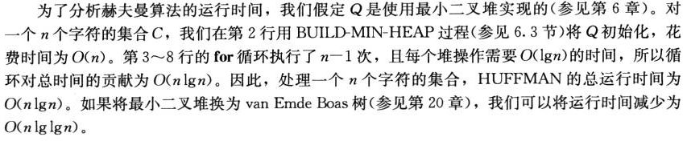

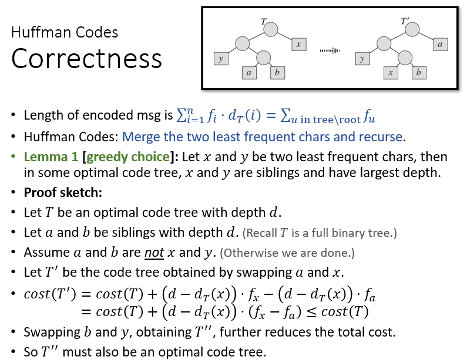

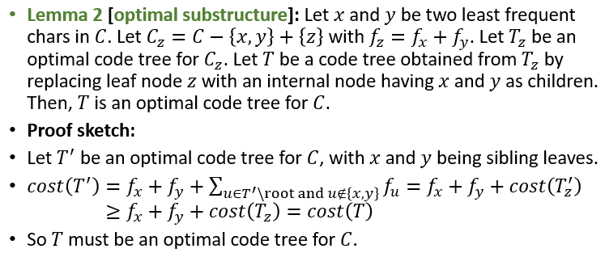

## 集合覆盖问题(Set Cover)

假设需要给 $n$ 个城镇建设学校

* 每个学校必须位于一个城镇
* 学校可以覆盖（服务） $30km$ 内的所有城镇

我们至少要建多少学校？

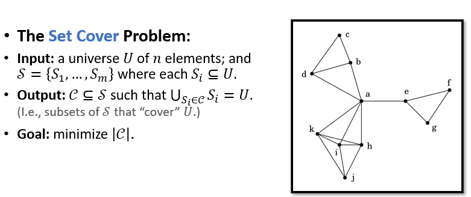

### 简单的贪心算法

始终选择覆盖了最多未覆盖城镇的地点建设学校。

这个算法并不是最优化的：

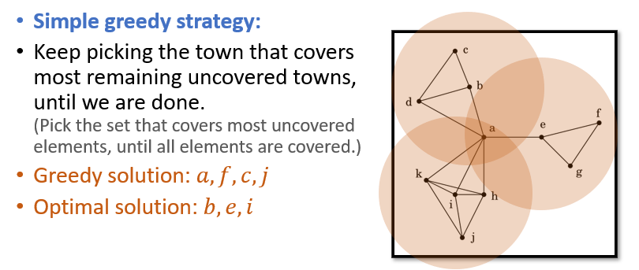

但是它很接近于最优化：

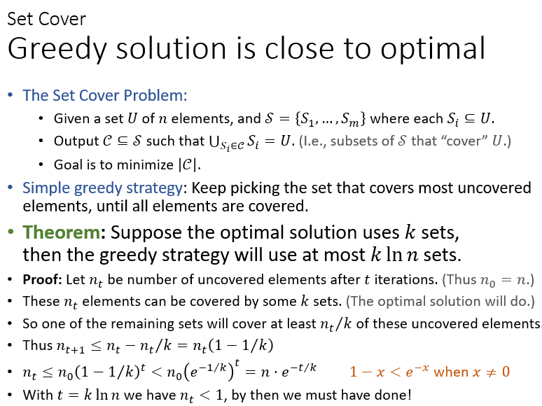

贪心算法给出了一个线性时间内的 $\ln n$ 近似，我们不知道能否做到更好：

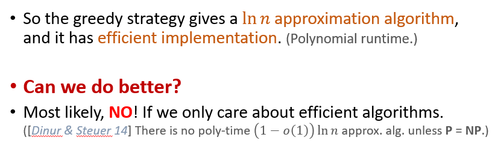

## 总结

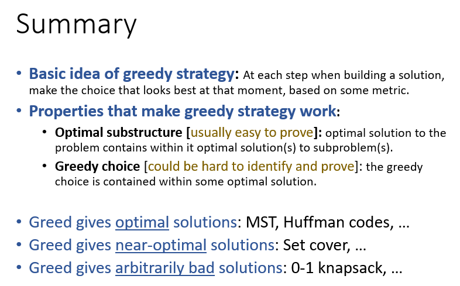