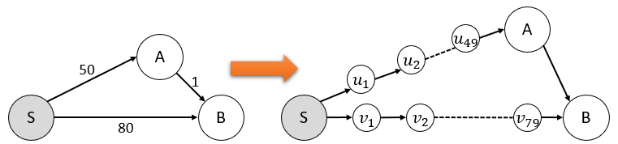
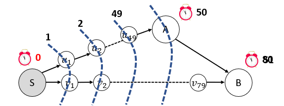
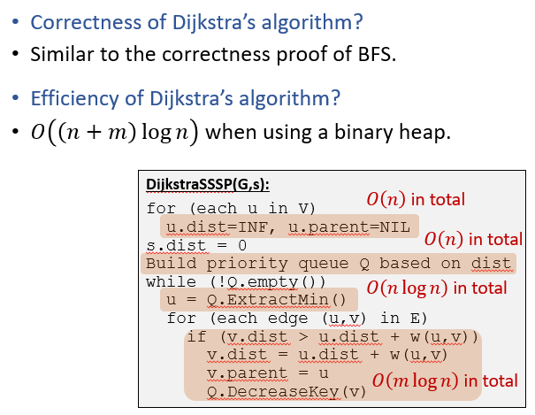
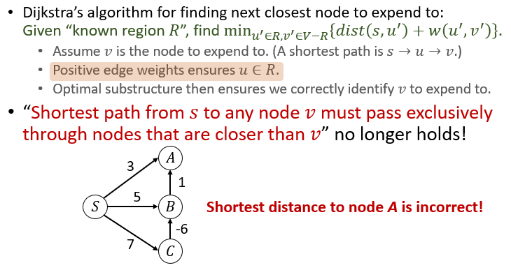
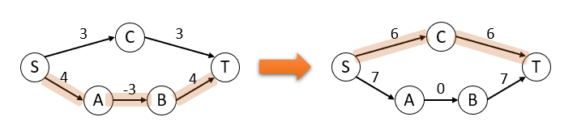
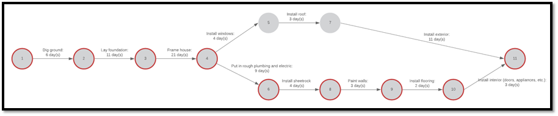
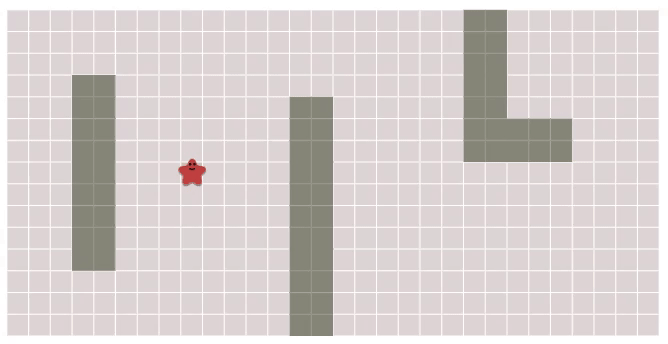
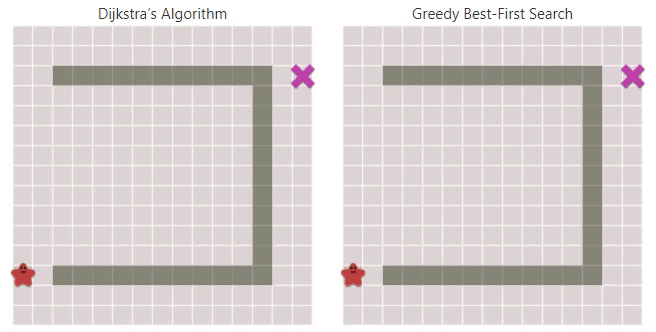
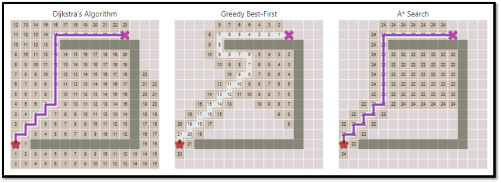

# 15 单源最短路径(SSSP)

Single-Source Shortest Path (SSSP)

给定一张地图，如何找到从 $s$ 到 $t$ 的最短路径？

再推广一下，给定图 $G=(V,E)$ 和权重函数 $w(u,v)$，从 $s$ 到 $t$ 的最小权重路径是什么？

* 权重不一定总是长度，也有可能是时间、花费
* 图可以是有向图，也就是说 $w(u,v)\ne w(v,u)$ 是有可能的
* 可以有负数权重边
* **不能**有负数权重环（否则问题未被well-defined）

## 单元权重(unit weight)

最简单的SSSP，所有边的权重均为 $1$

使用BFS即可

## 正权重(positive weight)

权重是正数

一个解决方式：在边上增加伪节点(dummy nodes)使得问题转化为单元权重问题



问题：如果边的权重差距较大，算法会变得非常慢！

为了节省时间，避开(bypass)处理伪节点的过程：

* 想象每个节点 $u$ 有一个闹钟（倒计时） $T_u$
* 源节点的时钟在 $0$ 时刻响起(或者时间耗尽，goes off)
* 如果 $T_u$ 响起，对于所有边 $(u,v)$，更新 $T_v=\min\{T_v,T_u+w(u,v)\}$



这一过程实际上是模仿BFS的过程：

* 在任意时刻，$T_u$ 是 $dist(s,u)$ 的一个估计
* 在任意时刻，$T_u\geq dist(s,u)$，当 $T_u$ 响起时等式成立

### Dijkstra

```pseudocode
DijkstraSSSP(G,s):
for (each u in V)
  u.dist=INF, u.parent=NIL
s.dist = 0
Build priority queue Q based on dist
while (!Q.empty())
  u = Q.ExtractMin()
  for (each edge (u,v) in E)
    if (v.dist > u.dist + w(u,v))
      v.dist = u.dist + w(u,v)
      v.parent = u
      Q.DecreaseKey(v)
```

**算法分析：**



## 负权重(negative weight)

如果图中包含负权重边，dijkstra算法不再可用：



> **为什么不能将所有边的权重加上 $\max\{-1\cdot w(u,v)\}$？**
>
> 这样并不是给所有路径添加相同的权重。受路径中边的数量影响
>
> 反例：
>
> 

### BellmanFord,一种朴素算法

首先将所有节点的 `dist` 赋值为正无穷，起始点 `s.dist` 为0

定义操作 `Update(u,v)`，它将 `v.dist` 赋值为 `min{v.dist,u.dist+w(u,v)}`

* 这样，任何时刻一个点的 `dist` 都是过高的或者准确的
* 应用一系列的正确的 `Update` 之后，我们得到准确的 `v.dist`

因为一个最短路径一定不包含环，我们将所有路径更新 $|V|-1$ 次即可

```pseudocode
BellmanFordSSSP(G,s):
for (each u in V)
  u.dist=INF, u.parent=NIL
s.dist = 0
repeat n-1 times:
  for (each edge (u,v) in E)
    if (v.dist > u.dist + w(u,v))
      v.dist = u.dist + w(u,v)
      v.parent = u
```

时间复杂度 $O(|V||E|)$

它甚至可以找到负权重环（这样问题未被良定义）：

```pseudocode
BellmanFordSSSP(G,s):
for (each u in V)
  u.dist=INF, u.parent=NIL
s.dist = 0
repeat n-1 times:
  for (each edge (u,v) in E)
    if (v.dist > u.dist + w(u,v))
      v.dist = u.dist + w(u,v)
      v.parent = u
for (each edge (u,v) in E)
  if (v.dist > u.dist + w(u,v))
    return “Negative Cycle”
```

### 有向无环图(DAG)中对BellmanFord的优化

有向无环图中，任何路径，包括最短路径，其内部节点都是按照拓扑序排序的

```pseudocode
DAGSSSP(G,s):
for (each u in V)
  u.dist=INF, u.parent=NIL
s.dist = 0
Run DFS to obtain topological order
for (each node u in topological order)
  for (each edge (u,v) in E)
    if (v.dist > u.dist + w(u,v))
      v.dist = u.dist + w(u,v)
      v.parent = u
```

#### 应用

安排有依赖关系的工作



## 特殊情况下的路径搜索

### 在网格中

使用Dijkstra



是否有类似右边的更加快的算法？


#### Greedy Best-First Search

**得到的可能不是最优解！**

```pseudocode
GreedyBFS(G, s, t):
s.est_to_goal = heuristic(s,t)
Build priority queue Q based on est_to_goal
while (!Q.empty())
  u = Q.ExtractMin()
  for (each edge (u,v) in E)
    if (v is not in Q)
      v.est_to_goal = heuristic(v,t)
      v.parent = u
      Q.Add(v)
```

启发函数 `heuristic` 是对距离的估计（不需要准确），比如使用曼哈顿距离



#### A*算法

GreedyBFS很快，但不一定最优；Dijkstra最优，但是不够快

有没有又快又最优的办法？



```pseudocode
AStarPathfinding(G, s, t):
for (each node u in V)
  u.est_to_s = INFINITY
  u.est_to_t = heuristic(u,t)
  u.metric = u.est_to_s + u.est_to_t
s.est_to_s = 0, s.metric = s.est_to_s + s.est_to_t
Build priority queue Q based on metric
while (!Q.empty())
  u = Q.ExtractMin()
  for (each edge (u,v) in E)
    if (v∉Q or v.est_to_s > u.est_to_s + dist(u,v))
      v.est_to_s = u.est_to_s + dist(u,v)
      v.metric = v.est_to_s + v.est_to_t
      v.parent = u
      Q.AddOrUpdate(v)
```

只要 `u.est_to_t <= dist(u,t)` 始终成立，A*算法保证正确性（见人工智能导论笔记）

