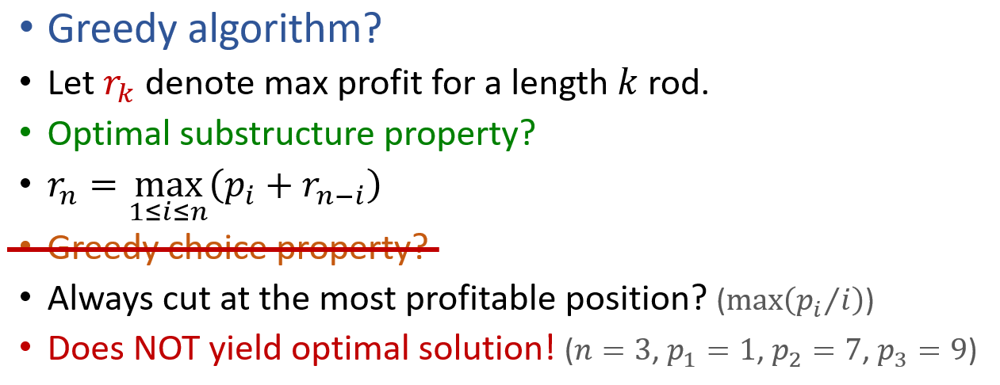
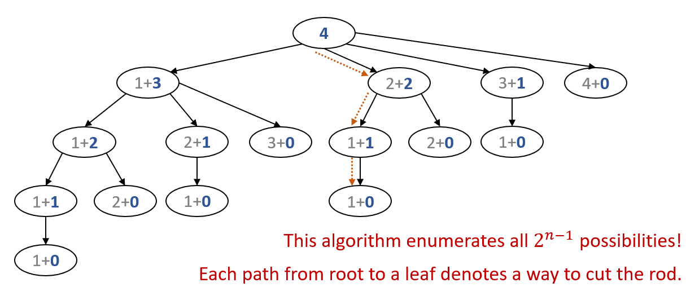
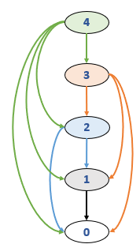

# 动态规划(Dynamic Programming)

## Rod-Cutting问题

假设我们有一条长度为 $n\in N^+$ 的长杆，要将其切割后销售，长度为 $i\in N^+$ 的杆售价为 $p_i$。

如何获得最大收益？

这个问题不满足贪婪算法的要求



### 简单的递归

我们可以使用简单的递归算法：

```pseudocode
CutRodRec(prices,n):
if (n==0)
  return 0
r = -INF
for (i=1 to n)
  r = Max(r, prices[i]+CutRodRec(prices,n-i))
return r
```

这个算法时间复杂度极大，因为它遍历了全部 $2^{n-1}$ 种情况：



### 每个子问题只计算一次

注意到：有的子情况出现了多次，实际上只需要被计算 $1$ 次！

更改后的算法：

```pseudocode
CutRodRecMem(prices,n):
for (i=0 to n)
  r[i] = -INF
return CutRodRecMemAux(prices,r,n)

CutRodRecMemAux(prices,r,n):
if (r[n]>0)
  return r[n]
if (n==0)
  q = 0
else
  q = -INF
  for (i=1 to n)
    q = Max(q, prices[i]+CutRodRecMemAux(prices,r,n-i))
r[n] = q
return q
```

时间复杂度为 $O(n^2)$：

* 每个子问题只被求解一次
* 当求解大小为 $i$ 的问题时，它的所有子问题都被解决了（否则先递归地解决其子问题，时间复杂度算在子问题上）
* 大小为 $i$ 的问题所需的时间为 $O(i)$
* $\displaystyle \sum_{i=1}^n O(i)=O(n^2)$

### 循环版本

子问题图是一个有向无环图，故其递归版本可以通过DFS导出



```pseudocode
CutRodIter(prices,n):
r[0] = 0
for (i=1 to n)
  q = -INF
  for (j=1 to i)
    if (q < prices[j] + r[i-j])
      q = prices[j] + r[i-j]
      cuts[i] = j
  r[i] = q
return r[n]

PrintOpt(cuts,n):
while (n>0)
  Print cuts[n]
  n = n – cuts[n]
```

**递归版本是 Top-down，循环版本是 Bottom-up**

