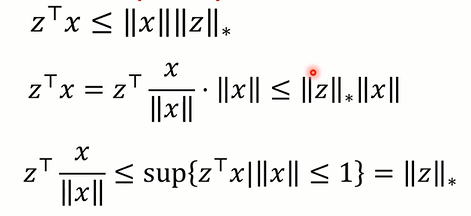

# lecture 2

## 范数 (Norm)

### 范数的定义

一个定义域为 $R^n$ 的函数 $f:R^n\to R$ 是一个范数当且仅当：

* $f$ 有**非负性**（nonnegative）：$\forall x\in R^n,f(x)\geqslant 0$
* $f$ 有**正定性**（definite）：$f(x)=0 \Leftrightarrow x=0$
* $f$ 有**同质性**（homogeneous）：$\forall x\in R^n,\forall t\in R,f(tx)=|t|f(x)$，维基百科称“绝对一次齐次性”
* $f$ **满足三角不等式**：$\forall x,y\in R^n,f(x+y)\leqslant f(x)+f(y)$

### 向量的范数

#### 内积与欧几里得范数

* 向量内积 (Inner product) $<x,y>=(x^Tx)$
* 欧几里得范数 $||x||_2=(x^Tx)^{\frac{1}{2}}$
* 柯西-施瓦茨不等式 $|x^Ty|\leqslant ||x||_2||y||_2$
* 角度 $\displaystyle\angle(x,y)=\cos^{-1}(\frac{x^Ty}{||x||_2||y||_2})$

#### 其他范数

* $l_1$-范数：$||x||_1=|x_1|+\cdots +|x_n|$
* $l_\infty$-范数（切比雪夫范数）：$||x||_\infty=max\{|x_1|,\cdots ,|x_n|\}$
* $l_p$-范数：$||x||_p=(|x_1|^p+\cdots +|x_n|^p)^{\frac{1}{p}}$
* 对于实对称正定矩阵 $P$ ，称 $P\in S^n_{++}$，定义**P-二次范数**为 $||x||_P=(x^TPx)^{\frac{1}{2}}=||P^{\frac{1}{2}}x||_2$
* **距离** $dist(x,y)=||x-y||$，该定义要基于范数的定义
* **单位球**(unit ball)，定义基于范数的定义
  * $\mathcal{B}\overset{def}{=}\{x\in R^n|\;||x||\leqslant 1\}$ 称为范数 $||\cdot||$ 的单位球
  * 有性质：
    * 关于原点对称
    * 是凸集(convex set)，即其上任意两点连线上的点都在集合内
    * 是有界闭集、内部非空
  * 满足以上三个性质的任何集合 $C$ 都是一个单位球，其对应的范数是 $||x||=(sup\{t\geqslant0|tx\in C\})^{-1}$
  * 球本身不一定是圆的，取决于范数的定义

### 矩阵的范数

* $X,Y\in R^{m\times n}$ 上的内积
  * $\displaystyle <X,Y>=tr(X^TY)=\sum_{i=1}^m\sum_{i=1}^n X_{ij}Y_{ij}$
  * $tr()$ 表示矩阵的迹，即主对角线（$i=j$）上所有元素之和
  * 若 $X,Y$ 是对称方阵，记为 $X,Y\in S^{n}$，则有 $\displaystyle <X,Y>=tr(XY)=\sum_{i=1}^n\sum_{i=1}^n X_{ij}Y_{ij}=\sum_{i=1}^n X_{ii}Y_{ii}+2\sum_{i<j}X_{ij}Y_{ij}$
* **Frobenius范数** (Frobenius norm) （对于矩阵 $X\in R^{m\times n}$ ）
  * $\displaystyle||x||_F=(tr(X^TY))^{\frac{1}{2}}=(\sum_{i=1}^m\sum_{i=1}^n X_{ij}Y_{ij})^{\frac{1}{2}}$
  * 称为矩阵的F范数，与向量的二范数对应
  * 称为F范数是因为矩阵的二范数这个名字被别的东西占用了（历史遗留问题）
* 绝对值之和范数（Sum-absolute-value norm）（对于矩阵 $X\in R^{m\times n}$ ）
  * $\displaystyle ||X||_{sav}=\sum_{i=1}^m\sum_{i=1}^n |X_{ij}|$
* 最大绝对值范数（Maximum-absolute-value norm）（对于矩阵 $X\in R^{m\times n}$ ）
  * $||X||_{mav}=\max\{|X_{ij}|\;|i=1,\cdots,m,j=1,\cdots,n\}$

### 范数的等价性 (Equivalence)

### 算子范数 (Operator norm)

### 对偶范数 (Dual norm)

**重点：$l_p,l_q$ 对偶等价于 $\displaystyle \frac{1}{p}+\frac{1}{q}=1$**

对偶不等式的证明（从下往上看）：

## 分析 (analysis)

以下概念中数学分析第二学期已有的省略定义：

* 内点 (interior point)
* （集合 $C$ 的）内部 (interior)，本课程中记为 $\text{int } C$
* 开集 (open set)
* 闭集 (Closed Set)
* **闭包** (closure)
  * 集合 $C$ 的闭包定义为 $\text{cl }C\overset{def}{=}R^n\backslash \text{int}(R^n\backslash C)$
  * 即为补集内部的补集
  * 这个在数分中也有定义，不过是以另一种形式
* 边界 (boundary)
* 上下确界(Supremum and infimum) $\sup C,\inf C$
  * 对于有限集，$\sup C$ 也可以写作 $\max C$
  * 规定 $\sup \O=-\infty,\inf \O=\infty$

## 函数 (Function)

以下概念中数学分析第二学期已有的省略定义：

* 连续性(Continuity)
* 闭函数(Closed functions)：
  * $f$ 是闭函数指 $\forall \alpha\in R$ ， $f$ 的次水平集 $\{x\in dom\;f|f(x)\leq \alpha\}$ 是闭集
  * 等价于 $f$ 的上境图 $epi \; f=\{(x,t)\in R^{n+1}|x\in dom\;f,f(x)\leq t\}$ 是闭集
  * 如果 $f$ 连续且定义域是闭集，则 $f$ 是闭函数
  * 如果 $f$ 连续且定义域是开集，则 $f$ 是闭函数等价于 $f$ 沿着任何收敛于其定义域的边界点的序列收敛于无穷

## 导数 (Derivatives)

### 可微与导数

假定 $f: \mathbf{R}^{n} \rightarrow \mathbf{R}^{m}$，$x \in\operatorname{int}\operatorname{dom} f$ 。函数 $f$ 在 $x$ 处**可微**(differentiable)的定义是, 存在矩阵 $D f(x) \in \mathbf{R}^{m \times n}$ 满足

$\displaystyle \lim _{z\in \operatorname{dom} f, z \neq x, z \rightarrow x} \frac{\|f(z)-f(x)-D f(x)(z-x)\|_{2}}{\|z-x\|_{2}}=0$

在这种情况下我们**将 $D f(x)$ 称为 $f$ 在 $x$ 处的导数** (或Jacobian 矩阵)。（至多只有一 个矩阵能够满足）

如果 $\operatorname{dom} f$ 是**开集**, 并且函数 $f$ 在其定义域内处处可微, 我们称其为**可微函数**。

我们将 $z$ 的仿射函数 $f(x)+Df(x)(z-x)$ 称作 $f$ 在 $x$ 处的**一次逼近**

> 关于 $z$ 的仿射函数：一个关于 $z$ 的线性项（如 $Df(x)(z-x)$ ）加一个关于 $z$ 的常数项 $f(x)$

通过推导 $f$ 在 $x$ 处的一次逼近可以**确定该点的导数**

或者也可以直接计算**偏导数** $\displaystyle Df(x)_{ij}=\frac{\partial f_i(x)}{\partial x_j} $

### 梯度(Gradient)

对于**实函数** $f:R^n\to R$，其导数 $Df(x)$ 是 $1\times n$ 矩阵，即行向量

它的转置称为函数的**梯度**：

$\nabla f(x)=Df(x)^T$

这是一个列向量，其分量是 $f$  的偏导数

此时 $f$ 在 $x$ 处的一次逼近可以表示为 $f(x)+\nabla f(x)^T(z-x)$ 

#### 例子：

* $f(x)=\frac12x^TPx+q^Tx+r,\quad \nabla f(x)=Px+q$
* $f(x)=\log \det X,\quad \nabla f(x)=X^{-1}$

### 链式规则 (chain rule)

假设 $f: \mathbf{R}^{n} \rightarrow \mathbf{R}^{m}$ 在 $x \in\operatorname{int}\operatorname{dom} f$ 处可微, $g: \mathbf{R}^{m} \rightarrow \mathbf{R}^{p}$ 在 $x \in\operatorname{int}\operatorname{dom} g$ 处可微。

定义复合函数 $h: \mathbf{R}^{n} \rightarrow \mathbf{R}^{p}$ 为 $h(z)=g(f(z))$ 。

则 $h$ 在 $x$ 处可微, 导数为

$D h(x)=D g(f(x)) D f(x)$

作为一个例子, 假设 $f: \mathbf{R}^{n} \rightarrow \mathbf{R}, g: \mathbf{R} \rightarrow \mathbf{R}, h(x)=g(f(x))$ 。对 $D h(x)=Dg(f(x)) D f(x)$ 转置得到

$\nabla h(x)=g^{\prime}(f(x)) \nabla f(x)$

#### 复合仿射函数 (Composition of Affine Function)

假设 $f: \mathbf{R}^{n} \rightarrow \mathbf{R}^{m}$ 是可微函数，$A\in R^{n\times p},b\in R^n$

定义 $g:R^p\to R^m$ 为 $g(x)=f(Ax+b)$

根据链式法则，$Dg(x)=Df(Ax+b)A$

当 $f$ 是实函数，即 $m=1$ 时，有**复合仿射函数的梯度公式**

$\nabla g(x)=A^T \nabla f(Ax+b)$

### 二阶导数(Second Derivative)

如果函数在 $f: \mathbf{R}^{n} \rightarrow \mathbf{R}$  $x$ 处二次可微, 那么 $f$ 在 $x \in\operatorname{int}\operatorname{dom} f$ 处的**二阶导数或 Hessian 矩阵**, 用 $\nabla^{2} f(x)$ 表示, 就是

$\displaystyle \nabla^{2} f(x)_{i j}=\frac{\partial^{2} f(x)}{\partial x_{i} \partial x_{j}}, \quad i=1, \cdots, n, \quad j=1, \cdots, n$

其中偏导数都在 $x$ 处取值。函数 $f$ 在 (或) 接近 $x$ 处以 $z$ 为变量的**二次逼近**为

$\widehat{f}(z)=f(x)+\nabla f(x)^{T}(z-x)+(1 / 2)(z-x)^{T} \nabla^{2} f(x)(z-x)$

该二次逼近满足

$\displaystyle \lim _{z\in \operatorname{dom} f, z \neq x, z \rightarrow x} \frac{|f(z)-\widehat{f}(z)|}{\|z-x\|_{2}^{2}}=0$

不难理解, 二阶导数可以解释为一阶导数的导数。

如果 $f$ 是可微函数, 其**梯度映射** $\nabla f: \mathbf{R}^{n} \rightarrow \mathbf{R}^{n}$ 的定义域为 $\operatorname{dom} \nabla f=\operatorname{dom} f$, 函数值为 $\nabla f(x)$ 在 $x$ 处的数值。

这个映射的导数是

$D \nabla f(x)=\nabla^{2} f(x)$

#### 二阶导数的链式法则

大多数情况下二阶导数的一般性链式法则比较繁琐

只给出要用到的一些特殊情况

##### 标量复合函数

 $f: \mathbf{R}^{n} \rightarrow \mathbf{R}, g: \mathbf{R} \rightarrow \mathbf{R}, h(x)=g(f(x))$ 

直接求偏导可得

$\nabla^2 h(x)=g'(f(x))\nabla^2f(x)+g''(f(x))\nabla f(x)\nabla f(x)^T$

##### 复合仿射函数

$f: \mathbf{R}^{n} \rightarrow \mathbf{R},A\in R^{n\times m},b\in R^n$

定义 $g:R^m\to R$ 为 $g(x)=f(Ax+b)$

则 $\nabla g(x)=A^T\nabla f(Ax+b)$

有 $\nabla^2g(x)=A^T\nabla^2f(Ax+b)A$

## 线性代数 (Linear algebra)

以下概念中高等代数第二学期已有的省略定义：

* （矩阵的）**值域与零空间**：指矩阵对应的线性变换的值域与零空间（高等代数已学）
  * 值域(range)记为 $\mathcal{R}(A)$
  * 零空间(nullspace)记为 $$\mathcal{N}(A)$$
* $R^n$ 的子空间(subspace) $\mathcal{V}$ 的**正交补**(orthogonal complement)记为 $\mathcal{V}^\perp$
  * $\overset{\perp}{\oplus}$ 指**正交直和**，即两个正交子空间之和
  * 有 $\mathcal{N}(A)=\mathcal{R}(A^T)^\perp\\\mathcal{R}(A)=\mathcal{N}(A^T)^\perp\\\mathcal{N}(A)\overset{\perp}{\oplus}\mathcal{R}(A^T)=R^n$
  * 上面最后一条式子被称为 **$A$ 导出的正交分解**
* 矩阵半正定记为 $X\succeq 0$，正定为 $X\succ 0$

### 对称特征值分解 (Symmetric eigenvalue decomposition)

实对称 $n$ 阶方阵 $A$ 可以分解为：

$A=Q\Lambda Q^T$

其中 $Q$ 是正交矩阵，$\Lambda$ 为对角矩阵

这被称为特征值的**谱分解**或**（对称）特征值分解**

即高等代数中的[**正交相似对角化**](onenote:https://d.docs.live.net/50aeff96e7f8919f/文档/课程/高等代数/欧几里得空间.one#正交相似对角化&section-id={44481C14-C9B7-4291-A1B1-513EF825F844}&page-id={23064033-FF5C-4108-BD20-E8432A08A1B6}&end)（OneNote链接）

* 通常对特征值排列使其满足 $\lambda_1\geqslant\lambda_2\geqslant\cdots\geqslant\lambda_n$
* $\lambda_i(A)$ 表示 $A$ 第 $i$ 大的特征值
* 记 $\lambda_1(A)=\lambda_{max}(A),\lambda_n(A)=\lambda_{min}(A)$
* $\displaystyle\det A=\prod_{i=1}^{n} \lambda_i$
* $\displaystyle\operatorname{tr} A=\sum_{i=1}^{n} \lambda_i$
* $\displaystyle ||A||_2=\max_{i=1,\cdots,n}|\lambda_i|=\max(\lambda_1,-\lambda_n)$
* $\displaystyle ||A||_F=(\sum_{i=1}^{n} \lambda_i^2)^{1/2}$
* $\displaystyle\lambda_{max}(A)=\sup_{x\ne 0}\frac{x^TAx}{xTx}$
* $\displaystyle\lambda_{min}(A)=\inf_{x\ne 0}\frac{x^TAx}{xTx}$
* $\forall x,\lambda_{min}(A)x^Tx\leqslant x^TAx\leqslant \lambda_{max}(A)x^Tx$
* **对称平方根**：若有特征值分解 $A=Q\operatorname{diag}(\lambda_1,\cdots,\lambda_n)Q^T$
  * $A^{1/2}=Q\operatorname{diag}(\lambda_1^{1/2},\cdots,\lambda_n^{1/2})Q^T$
  * 这是 $X^2=A$ 的唯一的对称半正定的解

### 奇异值分解 (Singular value decomposition, SVD)

假设 $A \in \mathbf{R}^{m \times n}, \operatorname{rank} A=r_{\circ}$ 那么 $A$ 可以因式分解为

$A=U \Sigma V^{T}$

其中 $U \in \mathbf{R}^{m \times r}$ 满足 $U^{T} U=I, V \in \mathbf{R}^{n \times r}$ 满足 $V^{T} V=I$, 而 $\Sigma=\operatorname{diag}\left(\sigma_{1}, \cdots, \sigma_{r}\right)$
满足

$\sigma_{1} \geqslant \sigma_{2} \geqslant \cdots \geqslant \sigma_{r}>0$

称为 $A$ 的**奇异值分解** $(\mathrm{SVD})$ 。 $U$ 的**列向量**称为 $A$ 的**左奇异向量**, $V$ 的**列向量**称为**右奇异向量**, 而 $\sigma_{i}$ 则称为**奇异值**。奇异值分解可以写成

$\displaystyle A=\sum_{i=1}^{r} \sigma_{i} u_{i} v_{i}^{T} $

* $\displaystyle\|A\|_{2}=\sigma_{1} $

* $\displaystyle\|A\|_{F}=\left(\sum_{i=1}^{n} \sigma_{i}^{2}\right)^{1 / 2}$
* **伪逆**(Pseudo-inverse) $A^\dagger=V\Sigma^{-1} V^{T}\in R^{n\times m}$

### Schur补(Schur complement)

考虑一个 $n$ 阶对称方阵 $X=\begin{bmatrix}A&B \\B^T&C\end{bmatrix}$

其中 $A$ 是一个 $k$ 阶对称方阵

如果 $\det A\ne 0$，矩阵 $S=C-B^TA^{-1}B$ 被称为 $A$ 在 $X$ 中的**Schur补**

* $\det X=\det A\det S$
* $X$ 正定的充要条件是 $A$ 和 $S$ 都正定
* 如果 $A$ 正定，那么 $X$ 半正定等价于 $S$ 半正定

