# 4 凸函数 (convex functions)

## 4.1 定义

### 4.4.1 凸函数

$f:\boldsymbol R^n\to\boldsymbol R$ 是凸函数当且仅当其同时满足：

* 定义域 $\operatorname{dom}f$ 是凸集
* $\forall \theta\in[0,1],\;x,y\in \operatorname{dom}f$ 有 $f(\theta x+(1-\theta)y)\leqslant \theta f(x)+(1-\theta)f(y)$

### 4.4.2 严格凸函数

$f:\boldsymbol R^n\to\boldsymbol R$ 是严格凸函数当且仅当其同时满足：

* 定义域 $\operatorname{dom}f$ 是凸集
* $\forall \theta\in[0,1],\;x,y\in \operatorname{dom}f$​ 有 $f(\theta x+(1-\theta)y)< \theta f(x)+(1-\theta)f(y)$​

### 4.4.3 凹函数

$f$ 是凹函数当且仅当 $-f$ 是凸函数

$f$ 是仿射函数当且仅当它既是凸函数也是凹函数

### 4.4.4 拓展值延伸 (Extended-value Extensions)

通过把凸函数 $f:\boldsymbol R^n\to\boldsymbol R$ 在定义域外的值定义为 $\infty$ ，我们可以把它的定义域拓展到全空间 $\boldsymbol R^n$

如果 $f$ 是凸函数，我们定义它的拓展值延伸 $\tilde{f}:\boldsymbol R^n\to\boldsymbol R\,\cup\{\infty\}$ 为：

$\displaystyle \tilde{f}=
\left\{\begin{matrix}
f(x)&x\in\operatorname{dom}f \\ 
\infty&x\not\in\operatorname{dom}f
\end{matrix}\right.
$​

延伸函数 $\tilde{f}$ 定义在全空间 $\boldsymbol R^n$ 上，取值集合为 $\boldsymbol R\,\cup\{\infty\}$

我们可以从延伸函数的定义域确定原函数的定义域，即 $\operatorname{dom}f=\{x\;|\;\tilde{f}(x)<\infty\}$

这种延伸简化了符号描述，这样我们不需要明确描述定义域或者每次提到 $f(x)$ 时都限定”对于所有 $x\in \operatorname{dom}f$ “。

这也可以用于自动定义定义域，例如对于方程 $\tilde{f}(x)=\tilde{f_1}(x)+\tilde{f_2}(x)$ ，定义域被自动定义为 $\operatorname{dom}f=\operatorname{dom}f_1\,\cap\operatorname{dom}f_2$​

**在不造成歧义的情况下，本书用同样的符号表示凸函数及其延伸函数，即假设所有凸函数都被隐含地延伸了。**

类似地，可以定义凹函数在定义域外的值为 $-\infty$

## 4.2 基本性质(properties)

### 4.2.1 不同阶上的条件

#### 4.2.1.1 零阶条件 (Zeroth-order Condition)

即为其定义：$\forall \theta\in[0,1]$​ ，有 $f(\theta x+(1-\theta)y)\leqslant \theta f(x)+(1-\theta)f(y)$​

一个函数是凸函数当且仅当它被限制到任意与定义域相交的直线上时是凸函数

对于任意的 $x\in \operatorname{dom}f,v\in\boldsymbol R^n,t\in\boldsymbol R,x+tv\in\operatorname{dom}f$，有：

$f$ 是凸函数当且仅当 $g(t)=f(x+tv)$ 是凸函数

**这里可能要求限制在一维空间上，上课注意听一下**

#### 4.2.1.2 一阶条件 (First-order Conditions)

假设 $f$​ 可微（即其梯度 $\triangledown f$​ 在开集 $\operatorname{dom}f$​ 上处处存在），则函数 $f$​​ 是凸函数当且仅当同时满足：

* $\operatorname{dom}f$ 是凸集
* $\forall x,y\in\operatorname{dom}f,\quad f(y)\geqslant f(x)+\triangledown f(x)^T (y-x)$

对于严格凸有同样的充分必要条件，将 $\geqslant$ 换成 $>$​ 即可​

凹函数同理

这表现出**从一个凸函数的局部信息（某点的函数值和导数）可以得到一些全局信息（如全局下估计）**

例如，$\forall x,y\in \operatorname{dom}f,\quad\triangledown f(x)=0\Rightarrow f(y)\geqslant f(x)$​ ，即 $x$ 是 $f$ 的全局极小点

#### 4.2.1.3 二阶条件 (Second-order Conditions)

若 $f$​ 二阶可微（即其Hessian矩阵或二阶导数 $\triangledown^2 f$​ 在开集 $\operatorname{dom}f$​​​ 上处处存在），则函数 $f$ 是凸函数当且仅当其同时满足：

* $\operatorname{dom}f$​ 是凸集
* $\forall x\in\operatorname{dom}f,\quad \triangledown^2 f(x)\geqslant 0$​

**注意**：$\triangledown^2 f(x)> 0\Rightarrow f$​ 是严格凸函数，**反之不然**

* 例如 $f(x)=x^4$​ 是严格凸函数但 $f''(0)=0$

条件一是必要的，反例如 $\displaystyle f(x)=\frac{1}{x^2}$​

### 4.2.2 下水平集 (Sublevel Sets)

函数 $f:\boldsymbol R^n\to\boldsymbol R$ 的 **α-下水平集**(α-sublevel set) 定义为：

$C_\alpha=\{x\in \operatorname{dom}f\;|\;f(x)\leqslant \alpha\}$

对于任意 $\alpha$ 值，**凸函数的下水平集仍然是凸集**（**反之不然**，如 $f(x)=-e^x$​），证明由定义直接得到

同理可以定义 **α-上水平集**(α-superlevel set) $\{x\in \operatorname{dom}f\;|\;f(x)\geqslant \alpha\}$​，**凹函数的上水平集都是凸集**

### 4.2.3 上境图 (Epigraph)

函数 $f:\boldsymbol R^n\to\boldsymbol R$ 的**图像**(Graph)定义为 $\{(x,f(x))\;|\;x\in\operatorname{dom}f \}$，它是 $\boldsymbol R^{n+1}$ 空间的一个子集

函数 $f:\boldsymbol R^n\to\boldsymbol R$​​​ 的**上境图**(Epigraph)定义为 $\operatorname{epi}f=\{(x,t)\;|\;x\in\operatorname{dom}f,f(x)\leqslant t \}$​​，它也是 $\boldsymbol R^{n+1}$​​​ 空间的一个子集

* **一个函数是凸函数当且仅当它的上境图是凸集**
* 上境图建立了凸集和凸函数的联系

函数 $f:\boldsymbol R^n\to\boldsymbol R$​ 的**亚图**(Epigraph)定义为 $\operatorname{epi}f=\{(x,t)\;|\;x\in\operatorname{dom}f,f(x)\geqslant t \}$​，它也是 $\boldsymbol R^{n+1}$​ 空间的一个子集

* **一个函数是凹函数当且仅当它的亚图是凸集**

### 4.2.4 Jensen 不等式及其拓展

基本不等式 $f(\theta x+(1-\theta)y)\leqslant \theta f(x)+(1-\theta)f(y),\quad\theta\in[0,1]$​​​ 有时也称作**Jensen不等式**

这一不等式可以拓展为：

* 若 $f$​ 是凸函数，$x_1,\cdots,x_k\in\operatorname{dom}f,\quad\theta_1,\cdots,\theta_k\geqslant0,\quad\theta_1+\cdots+\theta_k=1$​

  则有 $f(\theta_1x_1+\cdots+\theta_kx_k)\leqslant\theta_1f(x_1)+\cdots+\theta_kf(x_k)$

这一不等式也可以拓展到无穷项和、积分和期望

* 若 $f$​ 是凸函数，对于 $\displaystyle\sum_{i=1}^\infty\theta_i=1,\quad \theta_i\geqslant0,\quad x_i\in C$​

  有 $\displaystyle f(\sum_{i=1}^\infty\theta_ix_i)\leqslant\sum_{i=1}^\infty\theta_if(x_i)$

* 若 $f$ 是凸函数，对于 $\displaystyle S\subseteq\operatorname{dom}f,\quad \int_Sp(x)dx=1,\quad p(x)\geqslant0$

  有 $\displaystyle f(\int_Sp(x)xdx)\leqslant\int_Sp(x)f(x)dx$

* 若 $f$ 是凸函数，$x$ 是随机变量，且 $x\in \operatorname{dom}f$ 的概率为 $1$​，当相应的期望存在时

  有 $f(E(x))\leqslant E(f(x))$​

**上述所有不等式均被称为Jensen不等式**

事实上最初Jensen提出的不等式相当简单：$\displaystyle f(\frac{x+y}{2})\leqslant\frac{f(x)+f(y)}{2}$

## 4.3 例子

### 4.3.1 $\boldsymbol R$ 上的例子

### 4.3.2 $\boldsymbol R^n$ 上的例子

## 4.4 保凸运算 (Operations That Preserve Convexity)

利用保凸运算可以构造新的凸函数或凹函数

### 4.4.1 非负加权求和 (Nonnegative Weighted Sums)

**所有凸函数的集合是一个凸锥**

**凸函数的非负加权求和是凸函数**

凹函数的非负加权求和是凹函数

**严格凸（凹）函数的正加权求和是严格凸（凹）函数**

**可以拓展到无限级数和积分**

可以通过定义或上境图证明，以上境图为例：

* 如果 $w \geqslant 0$ 且 $f$ 是凸函数, 我们有
  $\operatorname{epi}(w f)=\left[\begin{array}{cc}I & 0 \\ 0 & w\end{array}\right]\operatorname{epi}f$​
  而凸集由线性变换得到的象仍是凸集，得证

### 4.4.2 复合仿射映射 (Composition with an affine mapping)

对于 $f:\boldsymbol R^n\to\boldsymbol R,\;A\in \boldsymbol R^{n\times m},\;b\in\boldsymbol R^n$

定义 $g:\boldsymbol R^n\to\boldsymbol R$ 为 $g(x)=f(Ax+b),\quad\operatorname{dom}g=\{x\;|\; Ax+b\in\operatorname{dom}f\}$

**如果 $f$ 是凸（凹）函数，则 $g$​ 也是凸（凹）函数**

### 4.4.3 逐点最大函数 (Pointwise Maximum)

如果函数 $f_1,f_2$​​ 均为凸函数，则二者的**逐点最大函数** $f$​​ 定义为 

$f(x)=\max\{f_1(x),f_2(x)\},\quad\operatorname{dom}f=\operatorname{dom}f_1\cap\operatorname{dom}f_2$

**逐点最大函数 $f$​​ 也是凸函数**

**易证有限个凸函数函数的逐点最大函数也是凸函数**

证明：

* 任取 $0\leqslant\theta\leqslant1,\quad x,y\in \operatorname{dom}f$

  

### 4.4.4 逐点上确界函数 (Pointwise Supremum)

逐点最大的性质可以**拓展至无限个**凸函数的逐点上确界。

如果对于 $\forall y\in \mathcal{A}$，$f(x,y)$​​ 关于 $x$​​ 都是凸的​，则函数 $\displaystyle g(x)=\sup_{y\in\mathcal{A}}f(x,y)$ 关于 $x$ 也是凸的。

其中 $\operatorname{dom}g=\{x\;|\;(x,y)\in \operatorname{dom}f,\;\forall y\in \mathcal{A},\;\displaystyle\sup_{y\in\mathcal{A}}f(x,y)<\infty\}$

类似地，一系列凹函数的逐点下确界仍然是凹函数

从上境图的角度理解，一系列函数的逐点上确界函数对于它们上境图的交集。

对于 $f,g,\mathcal{A}$ 我们有 $\operatorname{epi}g=\displaystyle \bigcap_{y\in \mathcal{A}}\operatorname{epi} f(\cdot,y)$

因此，$g$ 的凸性可由一系列凸集的交集仍然为凸集得到。

#### 将凸函数表示为一族仿射函数的逐点上确界

**将一个函数表示为一族仿射函数的逐点上确界可以证明它是凸函数**

反过来，**几乎所有凸函数都可以表示成一族仿射函数的逐点上确界**

以下证明：

如果 $f:\boldsymbol R^n\to\boldsymbol R$ 是凸函数，$\operatorname{dom}f=\boldsymbol R^n$，有：

$f(x)=\sup\{g(x)\;|\;g\text{ 仿射，}\forall z.(g(z)\leqslant f(z))\}$

### 4.4.5 复合 (compositions)

给定函数 $h:\boldsymbol R^k\to\boldsymbol R$​​ 和 $g:\boldsymbol R^n\to\boldsymbol R^k$​​，定义复合函数 $f=h\circ g:\boldsymbol R^n\to\boldsymbol R$​​ 为：

$f(x)=h(g(x)),\quad\operatorname{dom}f=\{x\in\operatorname{dom}g\;|\;g(x)\in \operatorname{dom}h\}$

#### 4.4.5.1 标量复合 (Scalar Composition)

当$k=1$，即 $h:\boldsymbol R\to\boldsymbol R,\quad g:\boldsymbol R^n\to\boldsymbol R$​

如果它们二次可微，有链式法则(chain rule) $\triangledown^2 f(x)=h'(g(x))\triangledown^2 g(x)+h''(g(x))\triangledown g(x)\triangledown g(x)^T$​

得到以下规律（即使它们不可微，这些规律依然成立）

| $h$ 的凸性 | 拓展值延伸 $\tilde{h}$​ 的增减性 | $g$ 的凸性 | $f$​ 的凸性 |
| :--------: | :-----------------------------: | :--------: | :--------: |
|     凸     |              非减               |     凸     |     凸     |
|     凸     |              非增               |     凹     |     凸     |
|     凹     |              非减               |     凹     |     凹     |
|     凹     |              非增               |     凸     |     凹     |

$\tilde{h}$ 是拓展值延伸，对凸函数拓展到 $\infty$，凹函数拓展到 $-\infty$

$\tilde{h}$ 的增减性的含义：

* 以非减为例，指 $\forall x,y\in \boldsymbol R,\quad x<y\Rightarrow \tilde{h}(x)\leqslant\tilde{h}(y)$​
* 比如对于 $h(x)=x^2,\operatorname{dom}h=R_+$，有反例 $\tilde{h}(-1)=\infty>0=\tilde{h}(0)$​，故它不是非减的

#### 4.4.5.2 矢量复合 (Vector Composition)

矢量复合考虑 $k\geqslant 1$ 时的情况。这时设 $f(x)=h(g(x))=h(g_1(x),\cdots,g_k(x))$

其中 $h:\boldsymbol R^k\to\boldsymbol R,\quad g_i:\boldsymbol R^n\to\boldsymbol R$

不失一般性，假设 $n=1,\operatorname{dom}h=\boldsymbol R^k,\operatorname{dom}g_i=\boldsymbol R$，

如果两函数二阶可微，有 $f''(x)=g'(x)^T \triangledown^2 h(g(x)) g'(x) + \triangledown h(g(x))^T g''(x)$

我们可以得到规则：

| $h$ 的凸性 | $h$ 在每个维度分量上 | $g_i$​ 的凸性 | $f$​ 的凸性 |
| :--------: | :------------------: | :----------: | :--------: |
|     凸     |         非减         |      凸      |     凸     |
|     凸     |         非增         |      凹      |     凸     |
|     凹     |         非减         |      凹      |     凹     |

对于更一般的情况，如 $n>1$​、函数不可微或一般的定义域，类似的结论依然成立

但是**对于一般的情况**，不仅 $h$​ 要满足单调性条件，**$\boldsymbol{\tilde{h}}$​ 也要满足单调性条件**

### 4.4.6 最小化 (Minimization)

如果 $f$ 关于 $(x,y)$ 是凸函数，集合 $C$ 是非空凸集

定义函数 $\displaystyle g(x)=\inf_{y\in C}f(x,y),\quad\operatorname{dom}g=\{x|\exist\, y\in C.((x,y)\in \operatorname{dom}f)\}$​

若存在某个 $x$ 使得 $g(x)>-\infty$（该条件意味着对于所有 $x$，$g(x)>-\infty$）

则函数 $g$ 关于 $x$ 是凸函数

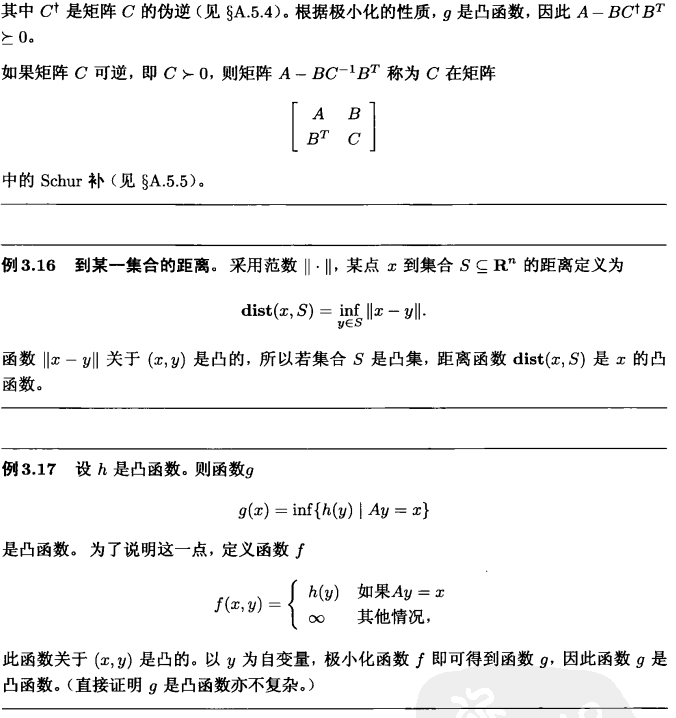

### 4.4.7 透视函数 (Perspective of a function)

给定函数 $f:\boldsymbol R^n\to\boldsymbol R$，则其透视函数 $g:\boldsymbol R^{n+1}\to\boldsymbol R$ 定义为

$g(x,t)=tf(x/t),\quad\operatorname{dom}g=\{(x,t)\;|\;x/t\in\operatorname{dom}f,t>0\}$

透视运算是保凸运算：

* 如果 $f$ 是凸函数，则 $g$ 也是凸函数
* 如果 $f$ 是凹函数，则 $g$ 也是凹函数

证明：

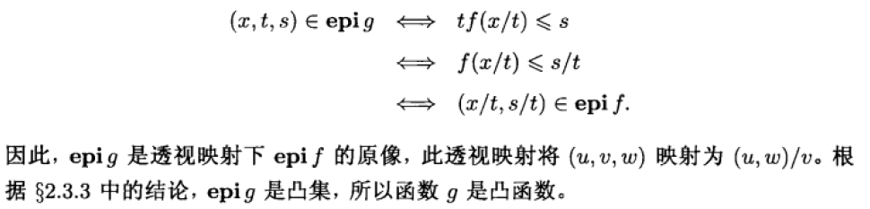

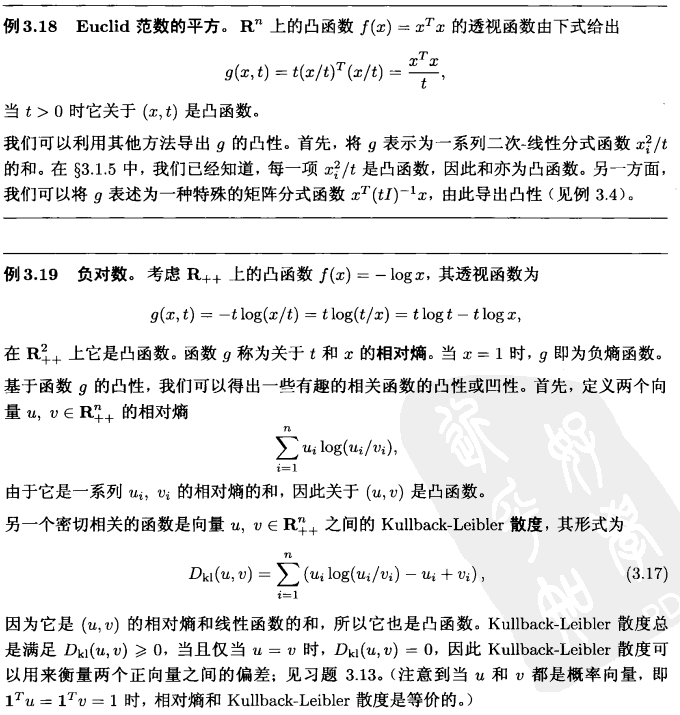

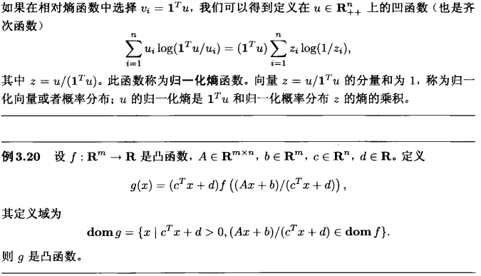

## 4.7 共轭函数(conjugate function)

重点

### 4.7.1 定义

设函数 $f: \mathbf{R}^{n} \rightarrow \mathbf{R}$, 定义函数 $f^{*}: \mathbf{R}^{n} \rightarrow \mathbf{R}$ 为
$$
f^{*}(y)=\sup _{x \in \operatorname{dom} f}\left(y^{T} x-f(x)\right)
$$
此函数称为函数 $f$ 的共轭函数。使上述上确界有限, 即差值 $y^{T} x-f(x)$ 在 $\operatorname{dom} f$ 有 上界的所有 $y \in \mathbf{R}^{n}$ 构成了共轭函数的定义域。图3.8描述了此定义。

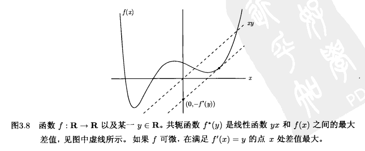

显而易见, $f^{*}$ 是凸函数, 这是因为它是一系列 $y$ 的凸函数 (实质上是仿射函数) 的逐点上确界。无论 $f$ 是否是凸函数, $f^{*}$ 都是凸函数。

(注意到这里当 $f$ 是凸函 数时, 下标 $x \in \operatorname{dom} f$ 可以去掉, 这是因为根据之前关于扩展值延伸的定义, 对于 $\left.x \notin \operatorname{dom} f, y^{T} x-f(x)=-\infty_{0}\right)$

我们从一些简单的例子开始描述共轭函数的一些规律。在此基础上我们可以写出很多常见凸函数的共轭函数的解析形式。

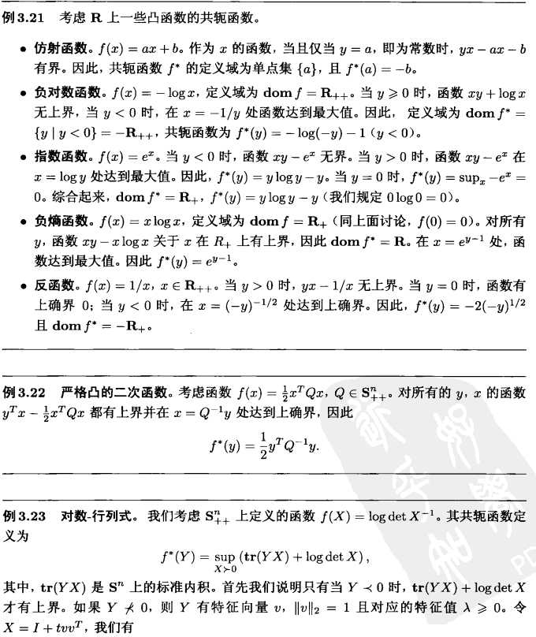

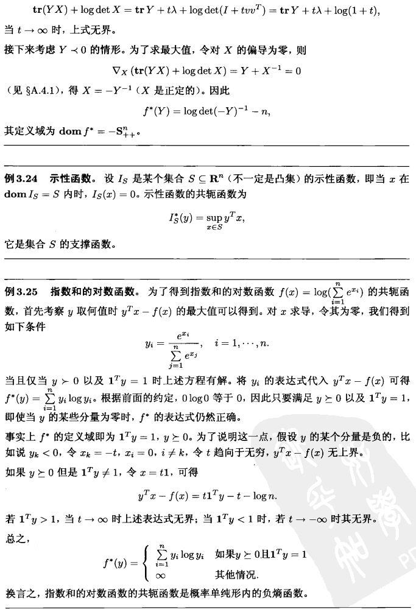

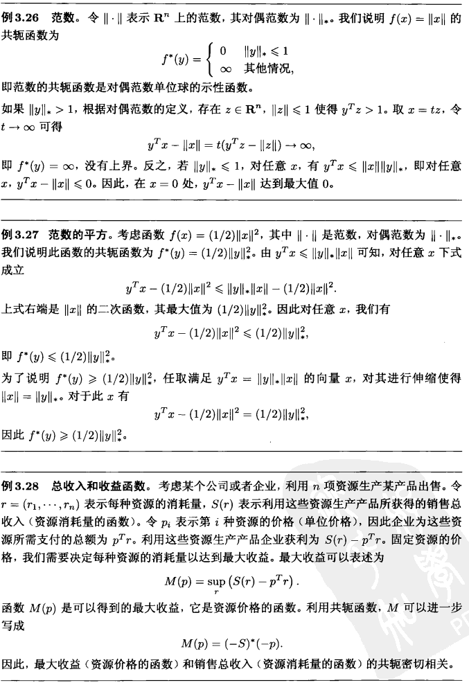

## 4.6 拟凸函数

次重点

### 不同阶上的条件

$\forall x,y\in\operatorname{dom}f,\quad f(y)\leqslant f(x)\Rightarrow\triangledown f(x)^T (y-x)\leqslant 0$

### 保拟凸操作

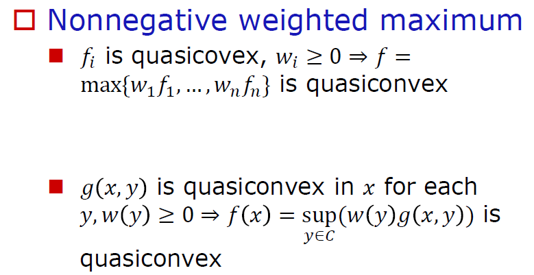

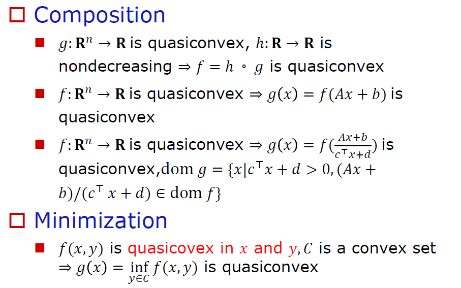

## 4.7 对数凸（Log-convex）与对数凹（Log-concave）

不是重点，不用背

### 4.7.1 定义

$f: \mathbf{R}^{n} \rightarrow \mathbf{R}, f(x)>0, \forall x \in \operatorname{dom} f, f$ 是对数凸的

 $\Leftrightarrow \forall x, y \in \operatorname{dom} f, 0 \leq \theta \leq 1,$    $f(\theta x+(1-\theta) y) \geq f(x)^{\theta} f(y)^{1-\theta}$

### 4.7.2 性质

$f: \mathbf{R}^{n} \rightarrow \mathbf{R}, f(x)>0, \forall x \in \operatorname{dom} f, \log f(x)$ 是凹（凸）的 $\Rightarrow f$ 是对数凹（凸）的

对数凸的函数是凸函数

非负凹函数是对数凹的

对于二阶可微的函数 $f$：

* 如果 $f$ 的定义域为凸集
* $\nabla^{2} \log f(x)=\frac{1}{f(x)} \nabla^{2} f(x)-\frac{1}{f(x)^{2}} \nabla f(x) \nabla f(x)^{\top}$
* $f$ is log-convex $\Leftrightarrow f(x) \nabla^{2} f(x) \geqslant \nabla f(x) \nabla f(x)^{\top}$
* $f$ is log-concave $\Leftrightarrow f(x) \nabla^{2} f(x) \preccurlyeq \nabla f(x) \nabla f(x)^{\top}$

## 4.8 K-convex

不是重点，不用背

### 4.8.1 定义

$K \subseteq \mathbf{R}^{m}$ 是一个正常锥，与一个广义不等号 $\preccurlyeq_{K}$ 关联

$f: \mathbf{R}^{n} \rightarrow \mathbf{R}^{m}$ is $K$-convex if $\forall x, y \in$ $\operatorname{dom} f, 0 \leq \theta \leq 1$
$$
f(\theta x+(1-\theta) y) \preccurlyeq_{K} \theta f(x)+(1-\theta) f(y)
$$
$f: \mathbf{R}^{n} \rightarrow \mathbf{R}^{m}$ is stricly $K-$ convex if $\forall x \neq y \in$ $\operatorname{dom} f, 0<\theta<1$
$$
f(\theta x+(1-\theta) y) \prec_{K} \theta f(x)+(1-\theta) f(y)
$$
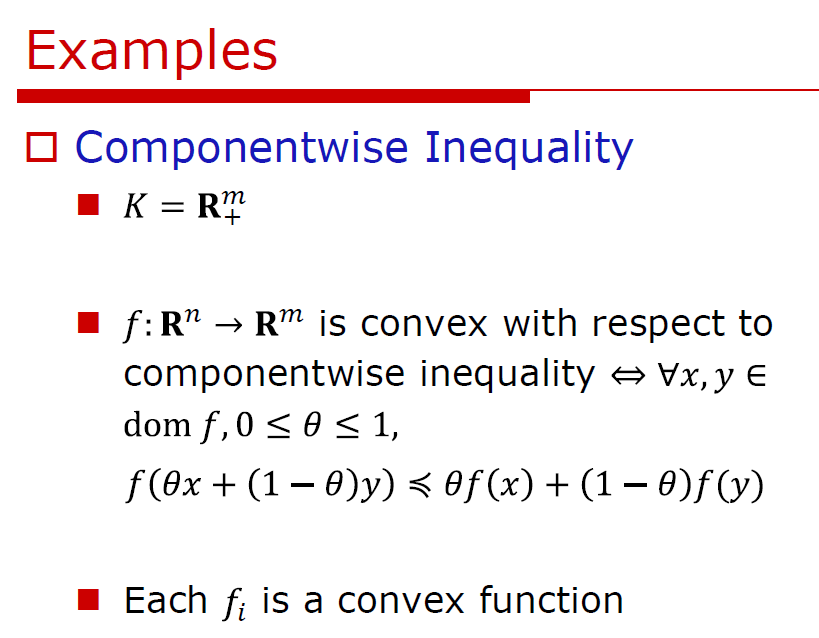

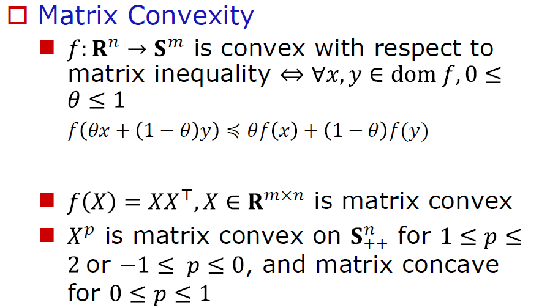

### 4.8.2 关于对偶锥

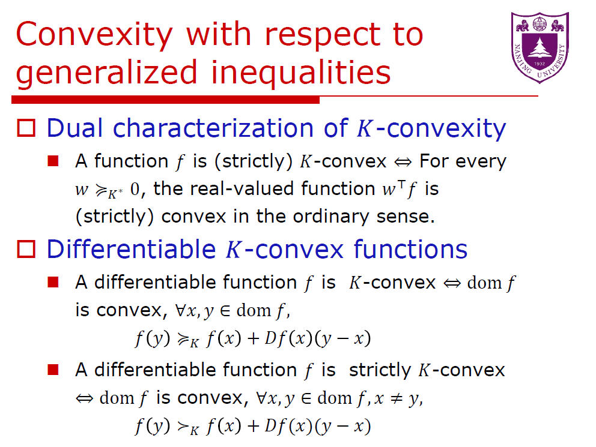

### 4.8.3 复合保凸

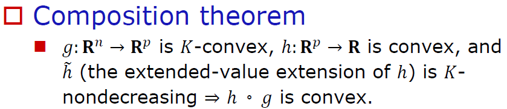

### 4.8.4 K-单调性

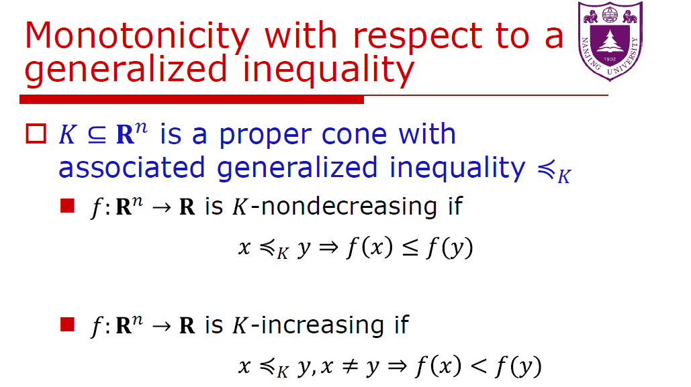
