# 5 凸优化问题

## 5.1 基本术语

定义域 $\displaystyle\mathcal{D}=\bigcap_{i=0}^m \operatorname{dom}f_i\cap\bigcap_{i=0}^p \operatorname{dom}h_i$

### 5.1.1 最优与次优

最优值 $p^{\star}=\inf \left\{f_{0}(x) \mid f_{i}(x) \leq 0, i=1, \ldots, m, h_{i}(x)=0, i=1, \ldots, p\right\}$

* 对于不可行问题（infeasible），$p^*=+\infty$
* 无下界问题：$\exist x_k,f_0(x_k)\to-\infty$ 则 $p^*=-\infty$

最优点：$x^*$ 可行且 $f_0(x^*)=p^*$

最优集：$X_{\mathrm{opt}}=\left\{x \mid f_{i}(x) \leq 0, i=1, \ldots, m, h_{i}(x)=0, i=1, \ldots, p, f_{0}(x)=p^{*}\right\}$

* 最优集是非空集等价于问题可解，等价于最优值可达（achieved）

* 否则称不可达，常在问题无下界时发生
  * $p^*$ 是有限值也有可能，比如 $f_0(x)=1/x:p^*=0$
  * 因为 $p^*$ 用下确界定义，而下确界不一定取得到

$\varepsilon$-次优点（$\varepsilon$-suboptimal Points）：无法达到优化变量时，近似的可行解 $x$，$f_0(x)\leq p^*+\varepsilon$。

* 其集合称为 $\varepsilon$-次优集

### 5.1.2 局部最优

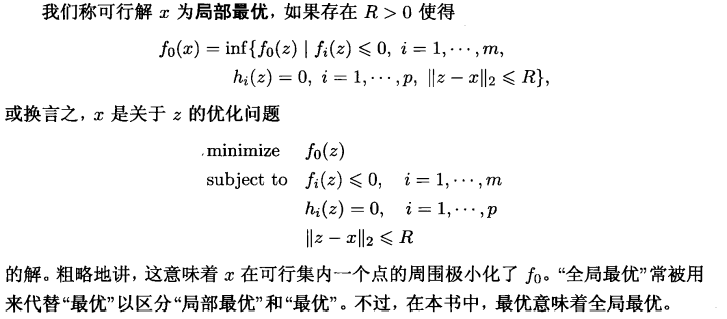

### 5.1.3 约束起作用

### 5.1.4 可行性问题

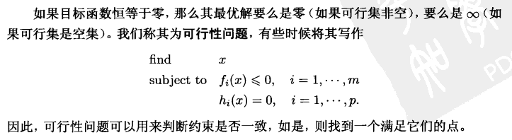

### 5.1.5 最大化问题

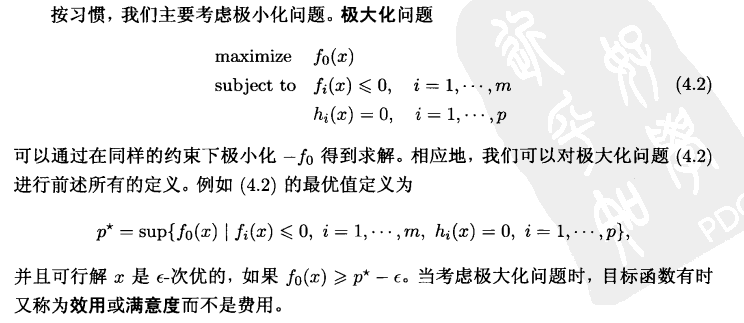

### 5.1.6 标准形式

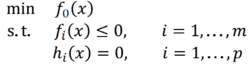

## 5.2 等价问题

### 5.2.1 变量变换

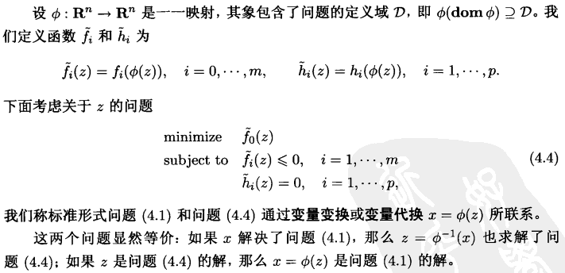

### 5.2.2 目标和约束函数变换

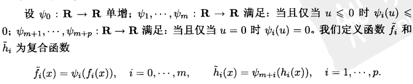

### 5.2.3 松弛变量

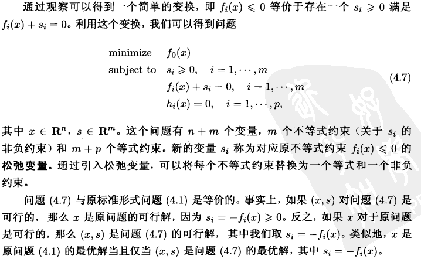

### 5.2.4 消除等式约束

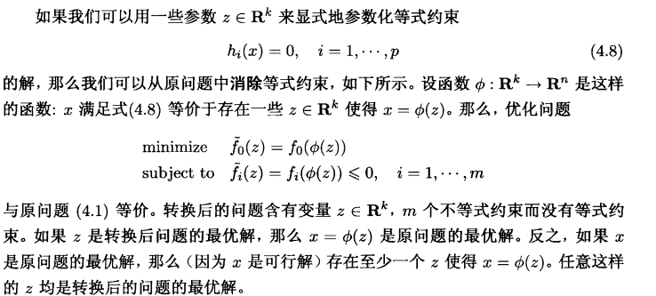

#### 消除线性等号约束

回顾：$\mathcal{R}(F)=\mathcal{N}(A)$

### 5.2.5 引入等号约束

### 5.2.6 优化部分变量

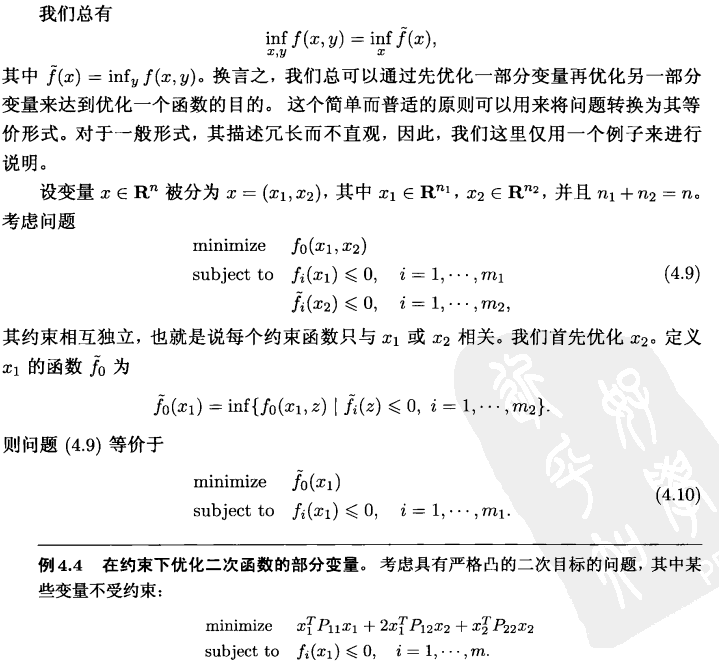

### 5.2.7 上境图形式

### 5.2.8 显性和隐性约束

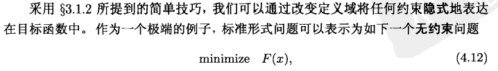

## 5.3 问题描述

* Parameter Problem Description（参数问题描述）
  * 函数有解析式或者闭式表达式（含 $x$ 和一些参数的公式或表达式，例如 $f_0(x)=x^TPx+q^Tx+r$）
  * 参数值已经给定
* Oracle Problem（谕示问题，也称黑箱子问题或子程序模型）
  * 无法获得函数解析式，只能询问（定义域内任意一点的）函数取值，通常还有一些导数
  * 也可能得到一些先验知识，比如函数的凸性、可微性和上下界

## 5.4 凸优化

* 目标函数是凸的
* 不等式约束函数是凸的
* 等式约束函数是仿射的（$h_i(x)=a^T_ix-b_i$）

我们立即注意到一个重要的性质: **凸优化问题的可行集是凸的**, 因为它是问题定义域 $\displaystyle\mathcal{D}=\bigcap_{i=0}^{m} \operatorname{dom} f_{i}$ (这是一个凸集)、 $m$ 个 (凸的) 下水平集 $\left\{x \mid f_{i}(x) \leqslant 0\right\}$ 以及 $p$ 个超平面 $\left\{x \mid a_{i}^{T} x=b_{i}\right\}$ 的交集。(我们可以不失一般性地假设 $a_{i} \neq 0:$ 如果对于某些 $i$ 有 $a_{i}=0$ 且 $b_{i}=0$, 那 么可以删去第 $i$ 个等式约束; 如果 $a_{i}=0$ 但 $b_{i} \neq 0$, 那么第 $i$ 个等式约束是矛盾的, 问题不可行。) 因此, 在一个凸优化问题中, 我们是**在一个凸集上极小化一个凸的目标函数**。

如果 $f_{0}$ 是拟凸而非凸的, 我们称问题 (4.15) 为 (标准形式的) **拟凸优化问题**。因 为凸或拟凸函数的下水平集都是凸集, 可知对于凸或拟凸的优化问题, 其 $\epsilon$-次优集是凸 的。特别地, 其最优集是凸的。如果目标函数是严格凸的, 那么最优集包含至多一个点。

> 回顾： $\epsilon$-次优解是无法达到优化变量时，近似的可行解 $x$，$f_0(x)\leq p^*+\varepsilon$。

### 5.4.1 凹最大化问题

稍稍改变符号, 我们也称
$$
\begin{array}{ll}
\operatorname{maximize} & f_{0}(x) \\
\text { subject to } & f_{i}(x) \leqslant 0, \quad i=1, \cdots, m \\
& a_{i}^{T} x=b_{i}, \quad i=1, \cdots, p
\end{array}
$$
为凸优化问题, 如果目标函数 $f_{0}$ 是凹的而不等式约束函数 $f_{1}, \cdots, f_{m}$ 是凸的。这个凹 最大化问题可以简单地通过极小化凸目标函数 $-f_{0}$ 得以求解。对于极小化问题的所有 结果、结论及算法都可以简单地转换用于解决最大化问题。类似地, 如果 $f_{0}$ 是拟凹的, 那么最大化问题 (4.16) 被称为拟凹的。

### 5.4.2 抽象凸优化问题

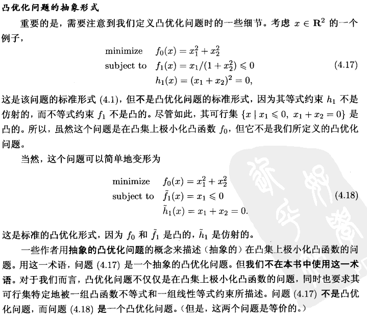

### 5.4.3 局部最优解与全局最优解

凸优化问题的一个基础性质是其任意局部最优解也是 (全局) 最优解。为理解这点, 设 $x$ 是凸优化问题的局部最优解, 即 $x$ 是可行的并且对于某些 $R>0$, 有
$$
f_{0}(x)=\inf \left\{f_{0}(z) \mid z \text { 可行, }\|z-x\|_{2} \leqslant R\right\} \text {, }
$$
现在假设 $x$ 不是全局最优解, 即存在一个可行的 $y$ 使得 $f_{0}(y)\left\langle f_{0}(x)\right.$ 。显然 $\left.\|y-x\|_{2}\right\rangle$ $R$, 因为否则的话有 $f_{0}(x) \leqslant f_{0}(y)$ 。考虑由
$$
z=(1-\theta) x+\theta y, \quad \theta=\frac{R}{2\|y-x\|_{2}}
$$
给出的点 $z$, 我们有 $\|z-x\|_{2}=R / 2<R_{0}$ 根据可行集的凸性, $z$ 是可行的。根据 $f_{0}$ 的 凸性, 我们有
$$
f_{0}(z) \leqslant(1-\theta) f_{0}(x)+\theta f_{0}(y)<f_{0}(x)
$$
这与式 (4.19) 矛盾。因此不存在满足 $f_{0}(y)<f_{0}(x)$ 的可行解 $y$, 即 $x$ 是全局最优解。 对于拟凸优化问题, 局部最优解是全局最优解这一性质不成立, 参见 $\S 4.2 .5$ 。

### 5.4.4 可微函数 $f_{0}$ 的最优性准则

设凸优化问题的目标函数 $f_{0}$ 是可微的, 对于所有的 $x, y \in \operatorname{dom} f_{0}$ 有
$$
f_{0}(y) \geqslant f_{0}(x)+\nabla f_{0}(x)^{T}(y-x)\quad\quad\quad(4.20)
$$
(参见 $\S 3.1 .3$ )。令 $X$ 表示其可行集, 即
$$
X=\left\{x \mid f_{i}(x) \leqslant 0, i=1, \cdots, m, h_{i}(x)=0, i=1, \cdots, p\right\}
$$
那么, $x$ 是最优解, 当且仅当 $x \in X$ 且
$$
\nabla f_{0}(x)^{T}(y-x) \geqslant 0, \forall y \in X\quad\quad\quad(4.21)
$$
这个最优性准则可以从几何上进行理解: 如果 $\nabla f_{0}(x) \neq 0$, 那么意味着 $-\nabla f_{0}(x)$ 在 $x$ 处定义了可行集的一个支撑超平面 

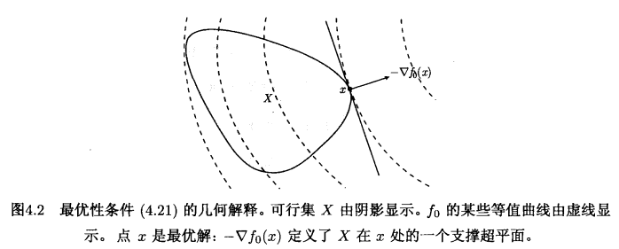

#### 5.4.4.1 最优性条件的证明

首先假设 $x \in X$ 满足式(4.21)。那么, 如果 $y \in X$, 根据式(4.20), 我们有 $f_{0}(y) \geqslant$ $f_{0}(x)$ 。这表明 $x$ 是问题(4.1) 的一个最优解。

反之, 设 $x$ 是最优解但条件 (4.21) 不成立, 即对于某些 $y \in X$, 有
$$
\nabla f_{0}(x)^{T}(y-x)<0
$$
考虑点 $z(t)=t y+(1-t) x$, 其中 $t \in[0,1]$ 为参数。因为 $z(t)$ 在 $x$ 和 $y$ 之间的线段上, 而可行集是凸集, 因此 $z(t)$ 可行。我们可断言对于小正数 $t$, 有 $f_{0}(z(t))<f_{0}(x)$, 这证明了 $x$ 不是最优的。为说明这一点, 注意
$$
\left.\frac{d}{d t} f_{0}(z(t))\right|_{t=0}=\nabla f_{0}(x)^{T}(y-x)<0
$$
所以, 对于小正数 $t$, 我们有 $f_{0}(z(t))<f_{0}(x)$ 。

#### 5.4.4.2 无约束问题
对于无约束优化问题 (即 $m=p=0$ ), 条件 (4.21) 可以简化为一个众所周知的 $x$ 是最优解的充要条件
$$
\nabla f_{0}(x)=0\quad\quad\quad(4.22)
$$
我们都知道这个最优性条件, 有必要考察一下它是如何从条件 (4.21) 中得到的。设 $x$ 为 可行解, 即 $x \in \operatorname{dom} f_{0}$, 并且对于所有可行的 $y$, 都有 $\nabla f_{0}(x)^{T}(y-x) \geqslant 0$ 。因为 $f_{0}$ 可微, 其定义域是开的, 因此所有充分靠近 $x$ 的点都是可行的。我们取 $y=x-t \nabla f_{0}(x)$, 其中 $t \in \mathbf{R}$ 为参数。当 $t$ 为小的正数时, $y$ 是可行的, 因此
$$
\nabla f_{0}(x)^{T}(y-x)=-t\left\|\nabla f_{0}(x)\right\|_{2}^{2} \geqslant 0
$$
从中可知 $\nabla f_{0}(x)=0$ 。

根据式(4.22) 解的数量, 有几种可能的情况：

* 如果式(4.22) 无解, 那么没有最优点，问题无下界或最优值有限但不可达。这里我们需要区分两种情况。
* 另一方面，我们有可能得到(4.22)的多个解，每一个这样的解都极小化了 $f_0$

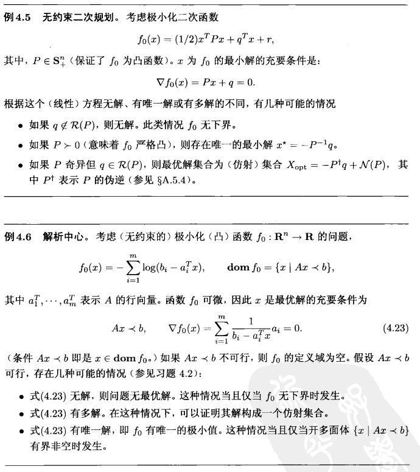

#### 5.4.4.3 只有等式约束的问题

$$
\begin{align}
&\text{minimize}&f_0(x)\\
&\text{subject to}&Ax=b
\end{align}
$$

其可行集是仿射的。我们假设定义域非空, 否则问题不可行。可行解 $x$ 的最优性条件 为: 对任意满足 $A y=b$ 的 $y$,
$$
\nabla f_{0}(x)^{T}(y-x) \geqslant 0
$$
都成立。因为 $x$ 可行, 每个可行解 $y$ 都可以写作 $y=x+v$ 的形式, 其中 $v \in \mathcal{N}(A)$ 。因 此, 最优性条件可表示为
$$
\nabla f_{0}(x)^{T} v \geqslant 0, \forall v \in \mathcal{N}(A)
$$
如果一个线性函数在子空间中非负, 则它在子空间上必恒等于零。因此, 对于任意 $v \in \mathcal{N}(A)$, 我们有 $\nabla f_{0}(x)^{T} v=0$, 换言之
$$
\nabla f_{0}(x) \perp \mathcal{N}(A)
$$
利用 $\mathcal{N}(A)^{\perp}=\mathcal{R}\left(A^{T}\right)$, 最优性条件可以表示为 $\nabla f_{0}(x) \in \mathcal{R}\left(A^{T}\right)$, 即存在 $\nu \in \mathbf{R}^{p}$, 使 得
$$
\nabla f_{0}(x)+A^{T} \nu=0
$$
同时考虑 $A x=b$ 的要求 (即要求 $x$ 可行), 这是经典的 Lagrange 乘子最优性条件, 我 们将在第 5 章中仔细地研究这个条件。

#### 5.4.4.4 非负象限中的极小化

作为另一个例子, 我们考虑问题

$\begin{array}{ll}\operatorname{minimize} & f_{0}(x) \\ \text {subject to } & x \succeq 0,\end{array}$

这里唯一的不等式约束是变量的非负约束。
于是, 最优性条件 $(4.21)$ 为
$$
x \succeq 0, \quad \nabla f_{0}(x)^{T}(y-x) \geqslant 0, \forall y \succeq 0 .
$$
$\nabla f_{0}(x)^{T} y$ 是 $y$ 的线性函数并且在 $y \succeq 0$ 上无下界, 除非我们有 $\nabla f_{0}(x) \succeq 0$ 。 于是, 这 个条件简化为 $-\nabla f_{0}(x)^{T} x \geqslant 0$ 。但是 $x \succeq 0$ 且 $\nabla f_{0}(x) \succeq 0$, 所以必须有 $\nabla f_{0}(x)^{T} x=0$, 即
$$
\sum_{i=1}^{n}\left(\nabla f_{0}(x)\right)_{i} x_{i}=0
$$
这里求和中的每一项都是两个非负数的乘积, 因此可知每一项都必须为零, 即对于 $i=1, \cdots, n$, 有 $\left(\nabla f_{0}(x)\right)_{i} x_{i}=0$ 。
因此, 最优性条件可以表示为
$$
x \succeq 0, \quad \nabla f_{0}(x) \succeq 0, \quad x_{i}\left(\nabla f_{0}(x)\right)_{i}=0, \quad i=1, \cdots, n
$$
最后一个条件称为互补性, 因为它意味着向量 $x$ 和 $\nabla f_{0}(x)$ 的稀疏模式 (即非零分量对 应的索引集合) 是互补的 (即交集为空)。我们将在第 5 章中再次深入地讨论互补条件。

### 5.4.5 等价的凸问题

等价问题仍保持凸性：

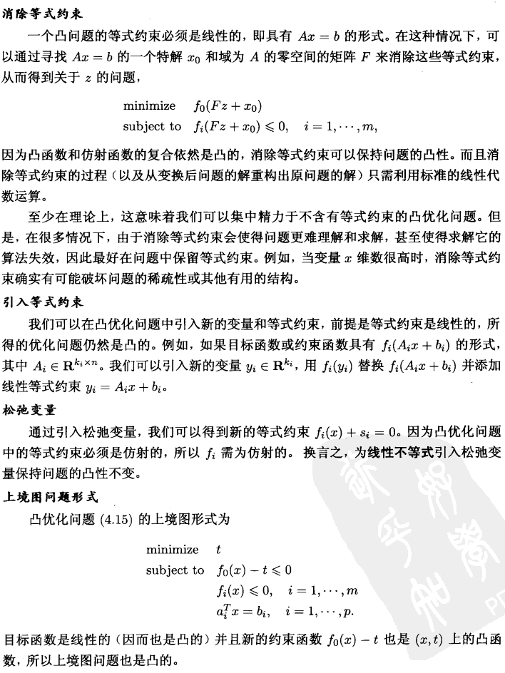

## 5.5 拟凸优化

//Todo:书150

## 5.6 线性规划问题

当目标函数和约束函数都是仿射时, 问题称作线性规划 (LP)。一般的线性规划具有以下形式
$$
\begin{array}{ll}
\operatorname{minimize} & c^{T} x+d \\
\text { subject to } & G x \preceq h\quad\quad\quad\quad(4.27) \\
& A x=b
\end{array}
$$
其中 $G \in \mathbf{R}^{m \times n}, A \in \mathbf{R}^{p \times n}$ 。当然, 线性规划是凸优化问题。

常将目标函数中的常数 $d$ 省略, 因为它不影响最优解 (以及可行解) 集合。由于我们总可以将极大化目标函数 $c^{T} x+d$ 转化为极小化 $-c^{T} x-d$ (仍然是凸的), 所以我们也称具有仿射目标函数和约束函数的最大化问题为线性规划。

线性规划的几何解释可见图 $4.4$, 线性规划 (4.27) 的可行集是多面体 $\mathcal{P}$; 这一问题 是在 $\mathcal{P}$ 上极小化仿射函数 $c^{T} x+d$ (或者, 等价地, 极小化线性函数 $c^{T} x$ )。

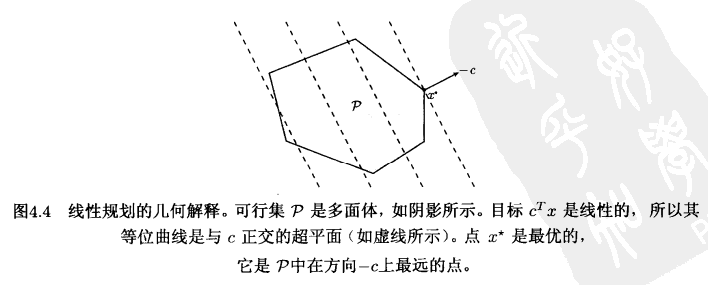

### 5.6.1 标准形式及其转换

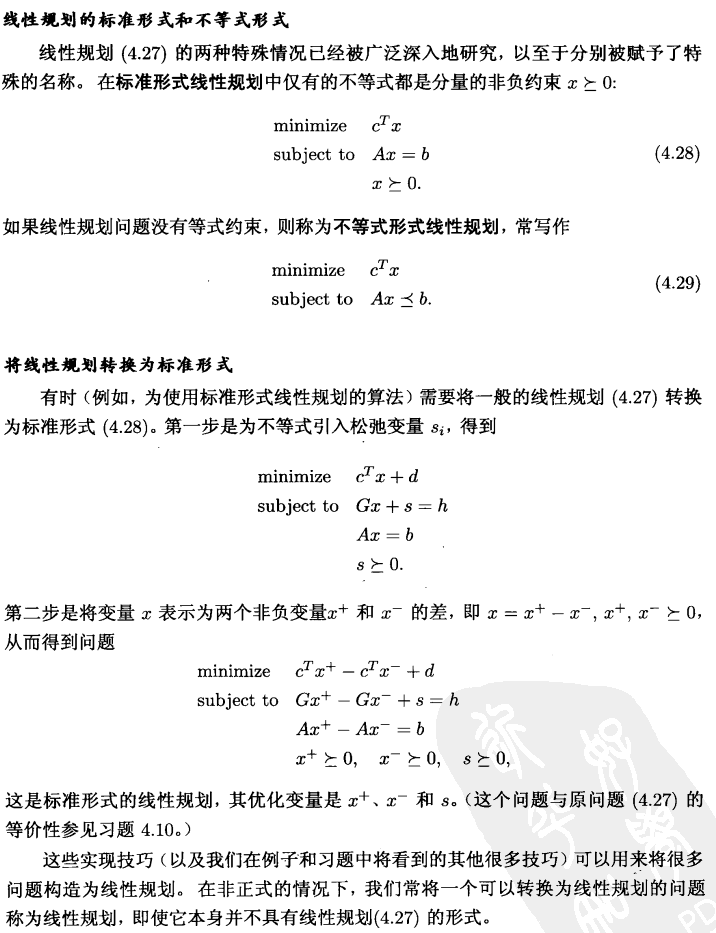

### 5.6.2 例子

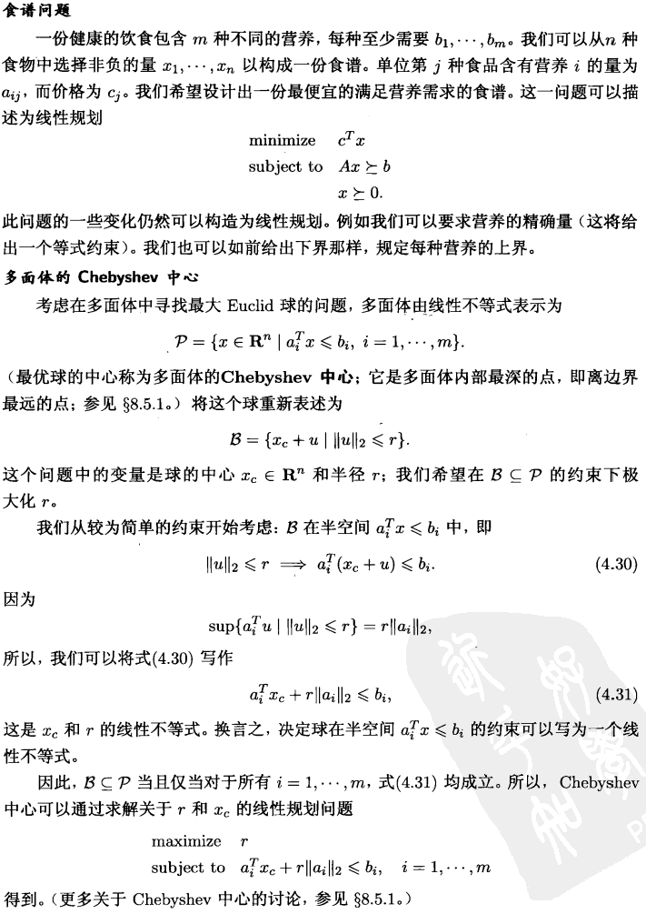

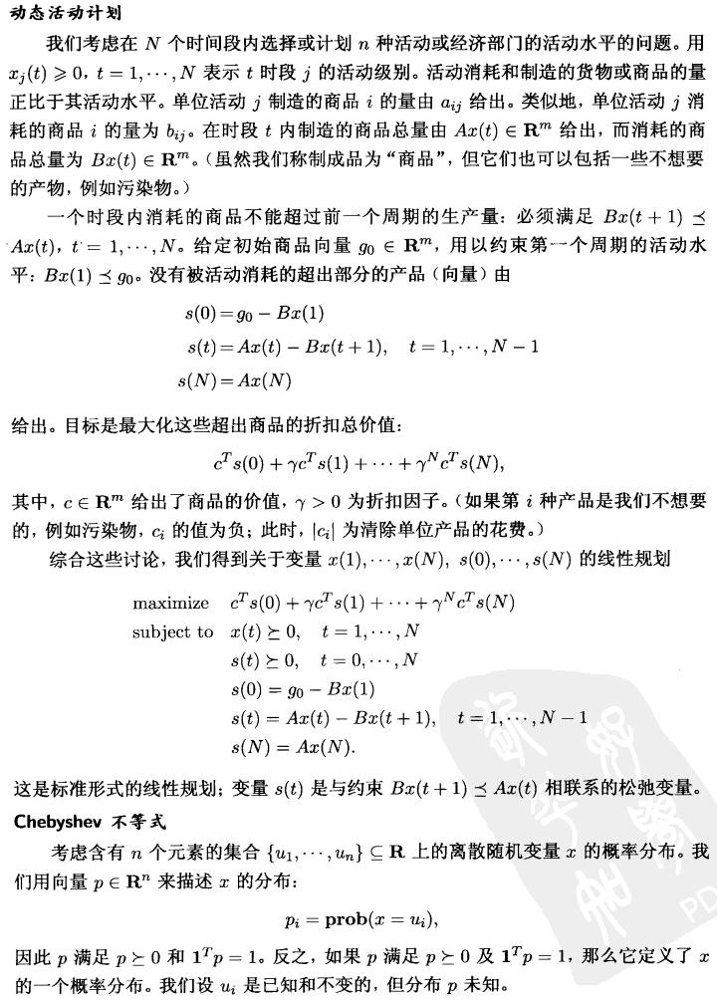

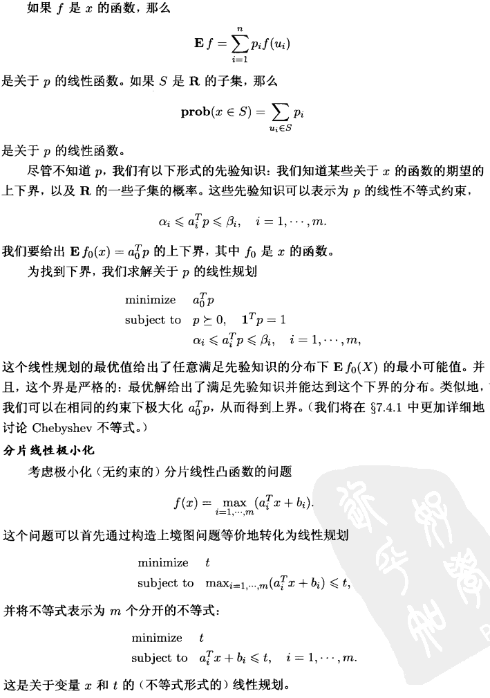

## 5.7 线性分式规划

在多面体上极小化仿射函数之比的问题称为线性分式规划:
$$
\begin{array}{ll}
\operatorname{minimize} & f_{0}(x) \\
\text { subject to } & G x \preceq h \\
& A x=b
\end{array}
$$
其目标函数由
$$
f_{0}(x)=\frac{c^{T} x+d}{e^{T} x+f}, \quad \operatorname{dom} f_{0}=\left\{x \mid e^{T} x+f>0\right\}
$$
给出。这个目标函数是拟凸的 (事实上是拟线性的), 因此线性分式规划是一个**拟凸优化**问题。

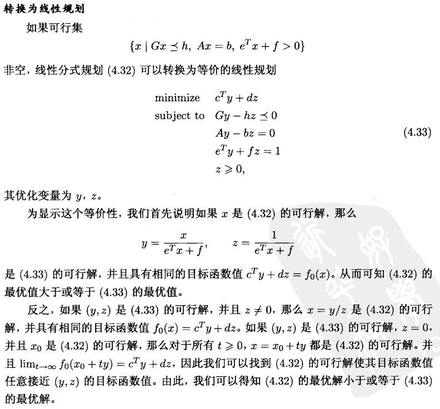

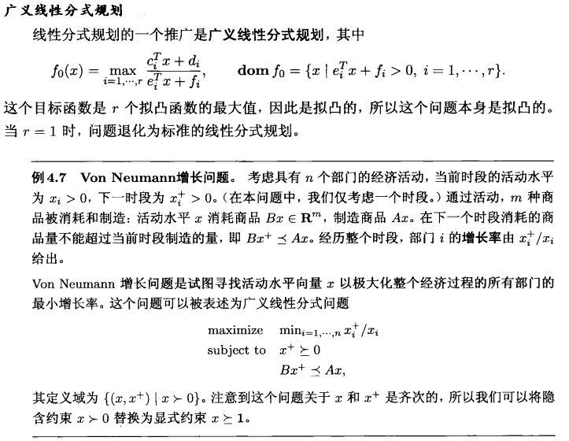

## 5.8 二次优化问题

当凸优化问题 (4.15) 的目标函数是 (凸) 二次型并且约束函数为仿射时, 该问题称 为二次规划 $(\mathrm{QP})$ 。 二次规划可以表述为
$$
\begin{array}{ll}
\operatorname{minimize} & (1 / 2) x^{T} P x+q^{T} x+r \\
\text { subject to } & G x \preceq h \\
& A x=b
\end{array}
$$
的形式, 其中 $P \in \mathbf{S}_{+}^{n}, G \in \mathbf{R}^{m \times n}$ 并且 $A \in \mathbf{R}^{p \times n}$ 。在二次规划问题中, 我们在多面体 上极小化一个凸二次函数, 如图 $4.5$ 所示。
如果在 (4.15) 中, 不仅目标函数, 其不等式约束也是 (凸) 二次型, 例如
$$
\begin{array}{ll}
\operatorname{minimize} & (1 / 2) x^{T} P_{0} x+q_{0}^{T} x+r_{0} \\
\text { subject to } & (1 / 2) x^{T} P_{i} x+q_{i}^{T} x+r_{i} \leqslant 0, \quad i=1, \cdots, m \\
& A x=b
\end{array}
$$
其中 $P_{i} \in \mathbf{S}_{+}^{n}, i=0,1 \cdots, m$ 。这一问题称为二次约束二次规划 (QCQP)。在 QCQP 中, (当 $P_{i} \succ 0$ 时) 我们在椭圆的交集构成的可行集上极小化凸二次函数。

线性规划是二次规划的特例, 即在 (4.34) 中取 $P=0$ 。二次规划 (因此也包括线性 规划) 是二次约束二次规划的特例, 通过在 (4.35) 中令 $P_{i}=0, i=1, \cdots, m$ 可得。

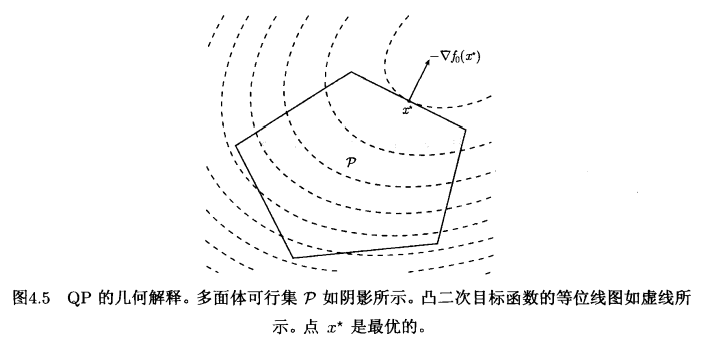

### 5.8.1 例子

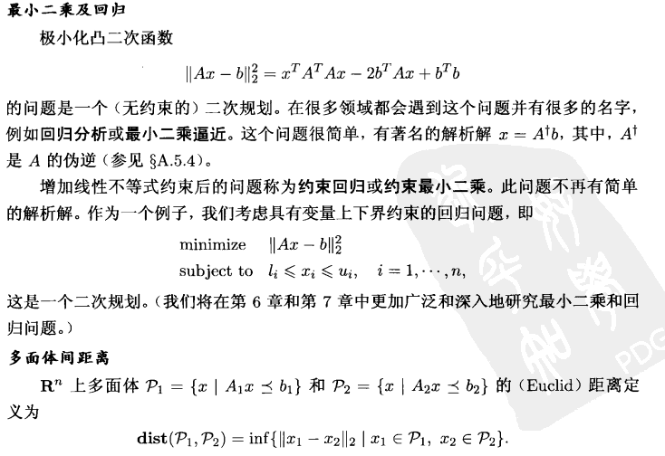

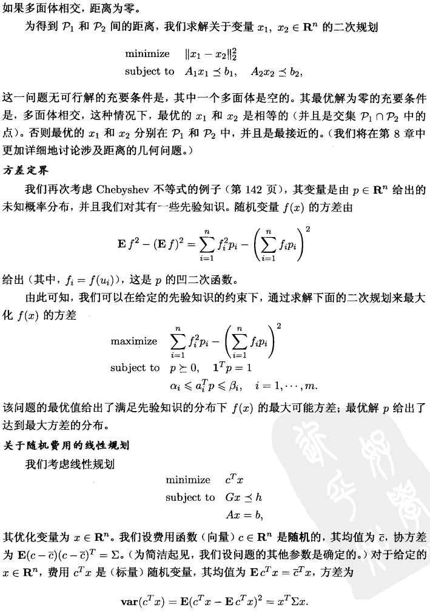

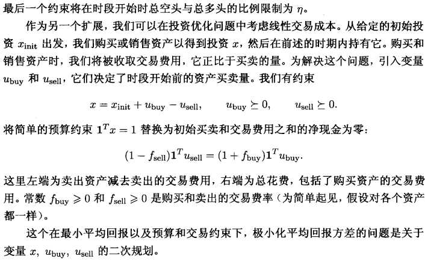

## 5.9 二阶锥优化

一个与二次规划紧密相关的问题是二阶锥规划 (SOCP):
$$
\begin{array}{ll}
\operatorname{minimize} & f^{T} x \\
\text { subject to } & \left\|A_{i} x+b_{i}\right\|_{2} \leqslant c_{i}^{T} x+d_{i}, \quad i=1, \cdots, m \\
& F x=g
\end{array}
$$
其中, $x \in \mathbf{R}^{n}$ 为优化变量, $A_{i} \in \mathbf{R}^{n_{i} \times n}$ 且 $F \in \mathbf{R}^{p \times n}$ 。我们称这种形式中的约束
$$
\|A x+b\|_{2} \leqslant c^{T} x+d
$$
其中 $A \in \mathbf{R}^{k \times n}$, 为**二阶锥约束**, 因为这等同于要求仿射函数 $\left(A x+b, c^{T} x+d\right)$ 在 $\mathbf{R}^{k+1}$ 的二阶锥中。

当 $c_{i}=0, i=1, \cdots, m$ 时, SOCP (4.36) 等同于 QCQP (可通过将每个约束平方 得到)。类似地, 如果 $A_{i}=0, i=1, \cdots, m$, SOCP (4.36) 退化为 (一般的) 线性规划。 但是, 二阶锥规划比 QCQP (当然也比线性规划) 更一般。

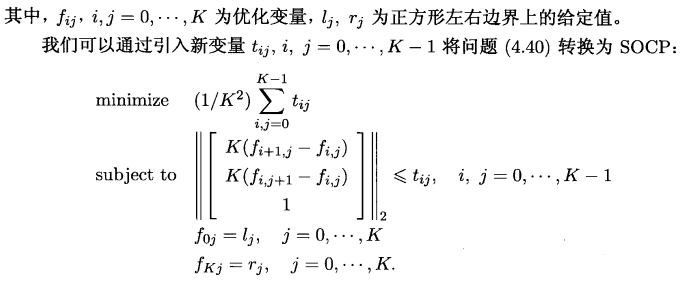

## 5.10 几何规划

几何规划问题并非凸优化，但是可以转化为凸优化

### 5.10.1 单项式与正项式

函数 $f: \mathbf{R}^{n} \rightarrow \mathbf{R}, \operatorname{dom} f=\mathbf{R}_{++}^{n}$ 定义为
$$
f(x)=c x_{1}^{a_{1}} x_{2}^{a_{2}} \cdots x_{n}^{a_{n}}
$$
其中 $c>0, a_{i} \in \mathbf{R}_{\circ}$ 它被称为单项式函数或简称为单项式。单项式的指数 $a_{i}$ 可以是任 意实数, 包括分数或负数, 但系数 $c$ 必须非负。 

“单项式” 与代数中的标准定义矛盾, 在那里指数必须是非负整数, 但这个矛盾不会有任何混淆。

单项式的和, 即具有下列形式的函数称为正项式函数 (具有 $K$ 项), 或简称为正项式
$$
f(x)=\sum_{k=1}^{K} c_{k} x_{1}^{a_{1 k}} x_{2}^{a_{2 k}} \cdots x_{n}^{a_{n k}}
$$
其中 $c_{k}>0$ 。

正项式对于加法, 数乘和非负的伸缩变换是封闭的。

单项式对于数乘和除是封闭的。

如果将正项式乘以一个单项式, 其结果是一个正项式; 类似地, 将正项式除以一个 单项式, 其结果仍为正项式。

### 5.10.2 几何规划

具有下列形式的优化问题
$$
\begin{array}{ll}
\operatorname{minimize} & f_{0}(x) \\
\text { subject to } & f_{i}(x) \leqslant 1, \quad i=1, \cdots, m \\
& h_{i}(x)=1, \quad i=1, \cdots, p
\end{array}
$$

被称为几何规划 (GP), 其中 $f_{0}, \cdots, f_{m}$ 为正项式, $h_{1}, \cdots, h_{p}$ 为单项式。这个问题的定 义域为 $\mathcal{D}=\mathbf{R}_{++}^{n} ;$ 约束 $x \succ 0$ 是隐式的。

### 5.10.3 几何规划的拓展

很容易处理这一问题的一些扩展。

* 如果 $f$ 是一个正项式而 $h$ 为单项式, 那么可以通过将约束 $f(x) \leqslant h(x)$ 表示为 $f(x) / h(x) \leqslant 1$ (因为 $f / h$ 为正项式) 来处理。这包括了约束为 $f(x) \leqslant a$ 的特殊情况, 其中 $f$ 为正项式且 $a>0$ 。

* 类似地, 如果 $h_{1}$ 和 $h_{2}$ 均是非零单项式函数, 那么我们处理等式约束 $h_{1}(x)=h_{2}(x)$ 时, 可以将其表示为 $h_{1}(x) / h_{2}(x)=1$ (因为 $h_{1} / h_{2}$ 为正项式)。

* 我们极大化一个非零单项式函数, 可以通过极小化其倒数 (也是一个单项式) 来实现。

例如, 考虑下面的问题
$$
\begin{array}{ll}
\text { maximize } & x / y \\
\text { subject to } & 2 \leqslant x \leqslant 3 \\
& x^{2}+3 y / z \leqslant \sqrt{y} \\
& x / y=z^{2}
\end{array}
$$
其优化变量为 $x, y, z \in \mathbf{R}$ (隐含约束为 $x, y, z>0$ )。用前述简单的转换, 我们得到等 价的标准形式 GP:
$$
\begin{array}{ll}
\text { minimize } & x^{-1} y \\
\text { subject to } & 2 x^{-1} \leqslant 1, \quad(1 / 3) x \leqslant 1 \\
& x^{2} y^{-1 / 2}+3 y^{1 / 2} z^{-1} \leqslant 1 \\
& x y^{-1} z^{-2}=1
\end{array}
$$
我们也称类北这样的问题为 GP, 它可以很容易地转换为等价的标准形式 GP (4.43)。(如同我们称可以轻易转换为线性规划的问题为线性规划一样。)

### 5.10.4 凸形式的几何规划

几何规划 (一般) 不是凸优化问题, 但是通过变量代换以及目标、约束函数的转换, 它们可以被转换为凸问题。

我们用 $y_{i}=\log x_{i}$ 定义变量, 因此 $x_{i}=e^{y_{i}}$ 。如果 $f$ 是由 (4.41) 给出的 $x$ 的单项式函数, 即
$$
f(x)=c x_{1}^{a_{1}} x_{2}^{a_{2}} \cdots x_{n}^{a_{n}}
$$
那么,

$$
\begin{aligned}
f(x) &=f\left(e^{y_{1}}, \cdots, e^{y_{n}}\right) \\
&=c\left(e^{y_{1}}\right)^{a_{1}} \cdots\left(e^{y_{n}}\right)^{a_{n}} \\
&=e^{a^{T} y+b}
\end{aligned}
$$
其中 $b=\log c$，变量变换 $y_{i}=\log x_{i}$ 将一个单项式函数转换为以仿射函数为指数的函数。

类似地, 如果 $f$ 是由 (4.42) 给出的正项式, 即
$$
f(x)=\sum_{k=1}^{K} c_{k} x_{1}^{a_{1 k}} x_{2}^{a_{2 k}} \cdots x_{n}^{a_{n k}}
$$
于是
$$
f(x)=\sum_{k=1}^{K} e^{a_{k}^{T} y+b_{k}}
$$
其中 $a_{k}=\left(a_{1 k}, \cdots, a_{n k}\right)$ 而 $b_{k}=\log c_{k}$ 。 经过变量变换, 正项式转换为以仿射函数为指数的函数的和。

几何规划 (4.43) 可以用新变量 $y$ 的形式表示为
$$
\begin{array}{ll}
\operatorname{minimize} & \displaystyle\sum_{k=1}^{K_{0}} e^{a_{0 k}^{T} y+b_{0 k}} \\
\text { subject to } & \displaystyle\sum_{k=1}^{K_{i}} e^{a_{i k}^{T} y+b_{i k}} \leqslant 1, \quad i=1, \cdots, m \\
& \displaystyle  e^{g_{i}^{T} y+h_{i}}=1, \quad i=1, \cdots, p
\end{array}
$$

其中 $a_{i k} \in \mathbf{R}^{n}, i=0, \cdots, m$, 包含了以正项式为指数的不等式约束, $g_{i} \in \mathbf{R}^{n}, i=$ $1, \cdots, p$, 包含了原几何规划中以单项式为指数的等式约束。

现在我们采用对数函数将目标函数和约束函数进行转换, 从而得到问题
$$
\begin{array}{ll}
\operatorname{minimize} & \displaystyle\tilde{f}_{0}(y)=\log \left(\sum_{k=1}^{K_{0}} e^{a_{0 k}^{T} y+b_{0 k}}\right) \\
\text { subject to } & \displaystyle\tilde{f}_{i}(y)=\log \left(\sum_{k=1}^{K_{i}} e^{a_{i k}^{T} y+b_{i k}}\right) \leqslant 0, &\quad i=1, \cdots, m \\
& \displaystyle\tilde{h}_{i}(y)=g_{i}^{T} y+h_{i}=0, &\quad i=1, \cdots, p
\end{array}
$$
因为函数 $\tilde{f}_{i}$ 是凸的, $\tilde{h}_{i}$ 是仿射的, 所以该问题是一个凸优化问题。我们称其为凸形 式的几何规划。为将其与原始的几何规划相区别, 我们称 (4.43) 为正项式形式的几何 规划。

需要注意的是, 正项式形式的几何规划 (4.43) 与凸形式的几何规划 (4.44) 之间的 转换并不涉及任何运算; 两个问题的数据是相同的。需要改变的仅仅是目标函数和约束 函数的形式。

如果正项式目标函数和所有约束函数都是单项式，那么几何规划退化为一般的线性规划，因此我们将几何规划视为线性规划的一个推广或拓展。

## 5.11 广义不等式规划

通过将不等式约束函数扩展为向量并使用广义不等式, 可以得到标准形式凸优化问题 (4.15) 的一个非常有用的推广:

$$
\begin{array}{ll}\operatorname{minimize} & f_{0}(x) \\ \text { subject to } & f_{i}(x) \preceq_{K_{i}} 0, \quad i=1, \cdots, m \\ & A x=b,\end{array}
$$
其中 $f_{0}: \mathbf{R}^{n} \rightarrow \mathbf{R}, K_{i} \subseteq \mathbf{R}^{k_{i}}$ 为正常锥, $f_{i}: \mathbf{R}^{n} \rightarrow \mathbf{R}^{k_{i}}$ 为 $K_{i}$-凸的。

我们称此问题为 (标准形式的) 广义不等式意义下的凸优化问题。

问题 (4.15) 是当 $K_{i}=\mathbf{R}_{+}, i=1, \cdots, m$ 时的特殊情况。

常规凸优化问题的很多结论对于广义不等式下的问题也是成立的。下面是一些 例子:

- 可行集, 任意下水平集和最优集都是凸的。
- 问题 (4.48) 的任意局部最优解都是全局最优的。
- 在 $\S 4.2 .3$ 中给出的对于可微函数 $f_{0}$ 的最优性条件不加改变地成立。
(在第 11 章中) 我们也可以看到广义不等式约束下的凸优化问题常常可以简单地按照 常规凸优化问题进行求解。

### 5.11.1 锥形式问题

在广义不等式的凸优化问题中, 最简单的是锥形式问题 (或称为锥规划), 它有线性目标函数和一个不等式约束函数, 该函数是仿射的 (因此是 $K$-凸的):
$$
\begin{array}{ll}
\text { minimize } & c^{T} x \\
\text { subject to } & F x+g \preceq_{K} 0 \\
& A x=b .
\end{array}
$$
当 $K$ 是非负象限时, 锥形式问题退化为线性规划。我们可以将锥形式问题视为线性规划的推广，其中的分量不等式被替换为广义线性不等式

仿照线性规划，我们称锥形式问题

$$
\begin{array}{ll}\operatorname{minimize} & c^{T} x \\ \text { subject to } & x \succeq_{K} 0 \\ & A x=b\end{array}
$$

为标准形式的雉形式问题。类似地, 问题
$$
\begin{array}{ll}
\text { minimize } & c^{T} x \\
\text { subject to } & F x+g \preceq_{K} 0
\end{array}
$$
称为不等式形式的雉形式问题。

### 5.11.2 半定规划

当 $K$ 为 $\mathbf{S}_{+}^{k}$, 即 $k \times k$ 半正定矩阵雉时, 相应的雉形式问题称为半定规划 (SDP), 并具有如下形式,

$$
\begin{array}{ll}
\operatorname{minimize} & c^{T} x \\
\text { subject to } & x_{1} F_{1}+\cdots+x_{n} F_{n}+G \preceq 0 \\
& A x=b,
\end{array}
$$

其中 $G, F_{1}, \cdots, F_{n} \in \mathbf{S}^{k}, A \in \mathbf{R}^{p \times n}$ 。这里的不等式是**线性矩阵不等式** (**LMI**, 参见 例 2.10）。

如果矩阵 $G, F_{1}, \cdots, F_{n}$ 都是对角阵, 那么 (4.50) 中的 LMI 等价于 $n$ 个线性不等 式, SDP (4.50) 退化为线性规划。

#### 5.11.2.1 标准和不等式形式的半定规划

仿照线性规划的分析, 标准形式的 SDP 具有对变量 $X \in \mathbf{S}^{n}$ 的线性等式约束 和 (矩阵) 非负约東:
$$
\begin{array}{ll}
\operatorname{minimize} & \operatorname{tr}(C X) \\
\text { subject to } & \operatorname{tr}\left(A_{i} X\right)=b_{i}, \quad i=1, \cdots, p \\
& X \succeq 0,
\end{array}
$$
其中 $C, A_{1}, \cdots, A_{p} \in \mathbf{S}^{n}$ 。(注意 $\operatorname{tr}(C X)=\sum_{i, j=1}^{n} C_{i j} X_{i j}$ 是 $\mathbf{S}^{n}$ 上一般实值线性函数 的形式。)

将这一形式与标准形式的线性规划 (4.28) 进行比较。在线性规划 (LP) 和 SDP 的标准形式中, 我们在变量的 $p$ 个线性等式约束和变量非负约束下极小化变量的线性函数。

如同不等式形式的 LP (4.29), 不等式形式的 SDP 不含有等式约束但具有一个 LMI:
$$
\begin{array}{ll}
\operatorname{minimize} & c^{T} x \\
\text { subject to } & x_{1} A_{1}+\cdots+x_{n} A_{n} \preceq B
\end{array}
$$
其优化变量为 $x \in \mathbf{R}^{n}$, 参数为 $B, A_{1}, \cdots, A_{n} \in \mathbf{S}^{k}, c \in \mathbf{R}^{n}$ 。

#### 5.11.2.2 多 LMI 与线性不等式

对于具有线性目标, 等式、不等式约束及多个 LMI 约束的问题
$$
\begin{array}{ll}
\operatorname{minimize} & c^{T} x \\
\text { subject to } & F^{(i)}(x)=x_{1} F_{1}^{(i)}+\cdots+x_{n} F_{n}^{(i)}+G^{(i)} \preceq 0, \quad i=1, \cdots, K \\
& G x \preceq h, \quad A x=b,
\end{array}
$$
仍然经常称其为 SDP。

从单个 LMI 和线性不等式可以构造具有大的对角块的 LMI, 从而可以容易地将这样的问题转换为一个 SDP：

$$
\begin{array}{ll}
\operatorname{minimize}& c^Tx \\
\operatorname{object~to} & \operatorname{diag}(Gx-h,F^{(1)}(x),\cdots,F^{(K)}(x))\preceq 0 \\
& A x=b 
\end{array}
$$

## 5.12 向量优化

没讲

