# 6 对偶性(Duality)

考虑标准形式的优化问题 (4.1):
$$
\begin{array}{ll}
\operatorname{minimize} & f_{0}(x) \\
\text { subject to } & f_{i}(x) \leqslant 0, \quad i=1, \cdots, m &\quad&&&&(5.1)\\
& h_{i}(x)=0, \quad i=1, \cdots, p
\end{array}
$$
其中, 自变量 $x \in \mathbf{R}^{n}$ 。设问题的定义域 $\mathcal{D}=\bigcap_{i=0}^{m} \operatorname{dom} f_{i} \cap \bigcap_{i=1}^{p} \operatorname{dom} h_{i}$ 是非空集合, 优化问题的最优值为 $p^{\star}$ 。

注意到这里**并没有假设问题 (5.1) 是凸优化问题**。

Lagrange 对偶的基本思想是在目标函数中考虑问题 (5.1) 的约束条件, 即添加约束条件的加权和, 得到增广的目标函数。

定义问题 (5.1) 的 Lagrange 函数 $L: \mathbf{R}^{n} \times \mathbf{R}^{m} \times \mathbf{R}^{p} \rightarrow \mathbf{R}$ 为
$$
L(x, \lambda, \nu)=f_{0}(x)+\sum_{i=1}^{m} \lambda_{i} f_{i}(x)+\sum_{i=1}^{p} \nu_{i} h_{i}(x)
$$
其中：

* 定义域为 $\operatorname{dom} L=\mathcal{D} \times \mathbf{R}^{m} \times \mathbf{R}^{p}$ 。

* $\lambda_{i}$ 称为第 $i$ 个不等式约束 $f_{i}(x) \leqslant 0$ 对应 的Lagrange 乘子; 

* $\nu_{i}$ 称为第 $i$ 个等式约束 $h_{i}(x)=0$ 对应的 Lagrange 乘子
* 向量 $\lambda$ 和 $\nu$ 称为对偶变量或者是问题 (5.1) 的Lagrange 乘子向量。

## 6.1 Lagrange 对偶函數

定义 Lagrange对偶函数 (或对偶函数) $g: \mathbf{R}^{m} \times \mathbf{R}^{p} \rightarrow \mathbf{R}$ 为 Lagrange 函数关于 $x$ 取得的最小值: 即对 $\lambda \in \mathbf{R}^{m}, \nu \in \mathbf{R}^{p}$, 有
$$
g(\lambda, \nu)=\inf _{x \in \mathcal{D}} L(x, \lambda, \nu)=\inf _{x \in \mathcal{D}}\left(f_{0}(x)+\sum_{i=1}^{m} \lambda_{i} f_{i}(x)+\sum_{i=1}^{p} \nu_{i} h_{i}(x)\right)
$$

如果 Lagrange 函数关于 $x$ 无下界，则对偶函数取值为 $-\infty$。

因为对偶函数是一族关于 $(\lambda,\nu)$ 的仿射函数的逐点下确界，所以对偶函数一定是凹的（无论原问题是不是凸的）

### 6.1.1 最优值的下界

对偶函数构成了原问题 (5.1) 最优值 $p^{\star}$ 的下界: 即对任意 $\lambda \succeq 0$ 和 $\nu$ 下式成立
$$
g(\lambda, \nu) \leqslant p^{\star}
$$
可以很容易验证这个重要的性质。

设 $\tilde{x}$ 是原问题 (5.1) 的一个可行点, 即 $f_{i}(\tilde{x}) \leqslant 0$ 且 $h_{i}(\tilde{x})=0$ 。根据假设, $\lambda \succeq 0$, 我们有
$$
\sum_{i=1}^{m} \lambda_{i} f_{i}(\tilde{x})+\sum_{i=1}^{p} \nu_{i} h_{i}(\tilde{x}) \leqslant 0
$$
这是因为左边的第一项非正而第二项为零。根据上述不等式, 有
$$
L(\tilde{x}, \lambda, \nu)=f_{0}(\tilde{x})+\sum_{i=1}^{m} \lambda_{i} f_{i}(\tilde{x})+\sum_{i=1}^{p} \nu_{i} h_{i}(\tilde{x}) \leqslant f_{0}(\tilde{x})
$$
因此
$$
g(\lambda, \nu)=\inf _{x \in \mathcal{D}} L(x, \lambda, \nu) \leqslant L(\tilde{x}, \lambda, \nu) \leqslant f_{0}(\tilde{x})
$$
由于每一个可行点 $\tilde{x}$ 都满足 $g(\lambda, \nu) \leqslant f_{0}(\tilde{x})$, 因此不等式 (5.2) 成立。

针对 $x \in \mathbf{R}$ 和具有一个不等式约束的某简单问题, 图 $5.1$ 描述了式 (5.2) 所给出的下界。

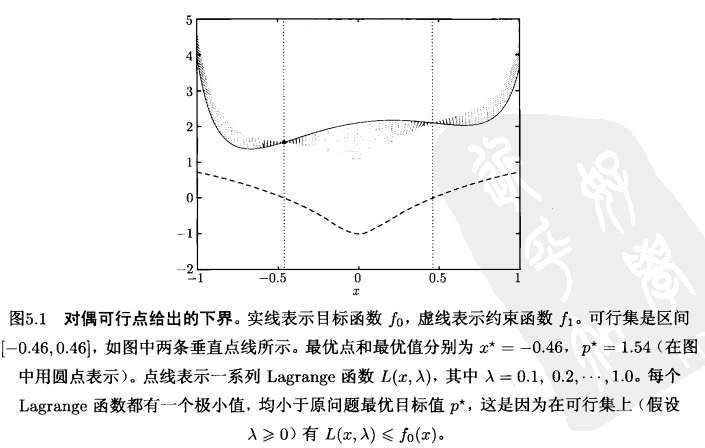

虽然不等式 (5.2) 成立, 但是当 $g(\lambda, \nu)=-\infty$ 时其意义不大。

只有当 $\lambda \succeq 0$ 且 $(\lambda, \nu) \in \operatorname{dom} g$ 即 $g(\lambda, \nu)>-\infty$ 时, 对偶函数才能给出 $p^{\star}$ 的一个非平凡下界。

称满足 $\lambda \succeq 0$ 以及 $(\lambda, \nu) \in \operatorname{dom} g$ 的 $(\lambda, \nu)$ 是**对偶可行**的, 后面很快就会看到这样定义的原因。

### 6.1.2 通过线性逼近来理解

可以通过对集合 $\{0\}$ 和 $-\mathbf{R}_{+}$的示性函数进行线性逼近来理解 Lagrange 函数和其给出下界的性质。首先将原问题 (5.1) 重新描述为一个无约束问题
$$
\operatorname{minimize} \quad f_{0}(x)+\sum_{i=1}^{m} I_{-}\left(f_{i}(x)\right)+\sum_{i=1}^{p} I_{0}\left(h_{i}(x)\right)
$$
其中, $I_{-}: \mathbf{R} \rightarrow \mathbf{R}$ 是非正实数集的示性函数
$$
I_{-}(u)= \begin{cases}0 & u \leqslant 0 \\ \infty & u>0\end{cases}
$$
类似地, $I_{0}$ 是集合 $\{0\}$ 的示性函数。

在表达式 (5.3) 中：

* 函数 $I_{-}(u)$ 可以理解为我们对约束函数值 $u=f_{i}(x)$ 的一种恼怒或不满: 如果 $f_{i}(x) \leqslant 0, I_{-}(u)$ 为零, 如果 $f_{i}(x)>0, I_{-}(u)$ 为 $\infty$ 。
* $I_{0}(u)$ 表达了我们对等式约束值 $u=h_{i}(x)$ 的不满。

我们可以认为函数 $I_{-}$是一个 “砖墙式”或“无限强硬”的不满意方程; 即随着函数 $f_{i}(x)$ 从 非正数变为正数, 我们的不满意度从零升到无穷大。
设在表达式 (5.3) 中, 用线性函数 $\lambda_{i} u$ 替代函数 $I_{-}(u)$, 其中 $\lambda_{i} \geqslant 0$, 用函数 $\nu_{i} u$ 替代 $I_{0}(u)$ 。

则目标函数变为 Lagrange 函数 $L(x, \lambda, \nu)$, 且对偶函数值 $g(\lambda, \nu)$ 是问题
$$
\operatorname{minimize} \quad L(x, \lambda, \nu)=f_{0}(x)+\sum_{i=1}^{m} \lambda_{i} f_{i}(x)+\sum_{i=1}^{p} \nu_{i} h_{i}(x)
$$
的最优值。在上述表达式中, 我们用线性或者“软”的不满意函数替换了函数 $I_{-}$和 $I_{0}$ 。 

对于不等式约束, 如果 $f_{i}(x)=0$, 我们的不满意度为零, 当 $f_{i}(x)>0$ 时, 不满意度大于零 (假设 $\lambda_{i}>0$ ); 随着约束“越来越被违背”, 我们越来越不满意。

在原始表达 式 (5.3) 中, 任意不大于零的 $f_{i}(x)$ 都是可接受的, 而在软的表达式中, 当约束有裕量时, 我们会感到满意, 例如当 $f_{i}(x)<0$ 时。

显然, 用线性函数 $\lambda_{i} u$ 去逼近 $I_{-}(u)$ 是远远不够的。然而, 线性函数至少可以看成是示性函数的一个下估计。这是因为对任意 $u$, 有 $\lambda_{i} u \leqslant I_{-}(u)$ 和 $\nu_{i} u \leqslant I_{0}(u)$, 我们随之可以得到, 对偶函数是原问题最优函数值的一个下界。

用“软”约束代替“硬”约束的思想在后文考虑内点法时 ( $\S 11.2 .1$ ) 会再次提到。

### [例子]

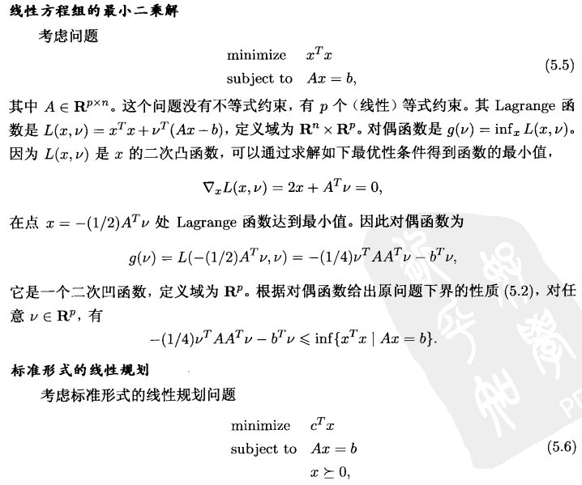

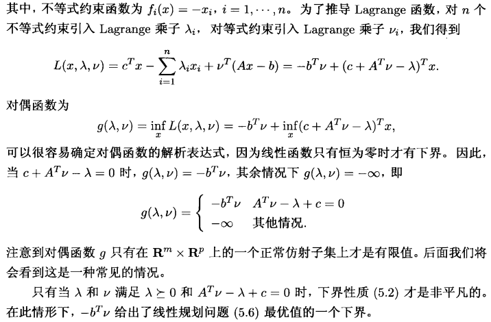

### 6.1.3 Lagrange 对偶函数和共轭函数
回忆 $\S 3.3$ 中所提到的函数 $f: \mathbf{R}^{n} \rightarrow \mathbf{R}$ 的共轭函数 $f^{*}$ 为

$$
f^{*}(y)=\sup _{x \in \operatorname{dom} f}\left(y^{T} x-f(x)\right)
$$

事实上, 共轭函数和 Lagrange 对偶函数紧密相关。下面的问题说明了一个简单的联系, 考虑问题

$$
\begin{array}{ll}\text { minimize } & f(x) \\ \text { subject to } & x=0\end{array}
$$

(虽然此问题没有什么挑战性, 目测就可以看出答案)

上述问题的 Lagrange 函数为 $L(x, \nu)=f(x)+\nu^{T} x$, 其对偶函数为
$$
g(\nu)=\inf _{x}\left(f(x)+\nu^{T} x\right)=-\sup _{x}\left((-\nu)^{T} x-f(x)\right)=-f^{*}(-\nu)
$$
更一般地 (也更有用地), 考虑一个优化问题, 其具有线性不等式以及等式约束,
$$
\begin{array}{ll}
\operatorname{minimize} & f_{0}(x) \\
\text { subject to } & A x \preceq b \\
& C x=d
\end{array}
$$
利用函数 $f_{0}$ 的共轭函数, 我们可以将问题 (5.10) 的对偶函数表述为
$$
\begin{aligned}
g(\lambda, \nu) &=\inf _{x}\left(f_{0}(x)+\lambda^{T}(A x-b)+\nu^{T}(C x-d)\right) \\
&=-b^{T} \lambda-d^{T} \nu+\inf _{x}\left(f_{0}(x)+\left(A^{T} \lambda+C^{T} \nu\right)^{T} x\right) \\
&=-b^{T} \lambda-d^{T} \nu-f_{0}^{*}\left(-A^{T} \lambda-C^{T} \nu\right)
\end{aligned}
$$
函数 $g$ 的定义域也可以由函数 $f_{0}^{*}$ 的定义域得到,
$$
\operatorname{dom} g=\left\{(\lambda, \nu) \mid-A^{T} \lambda-C^{T} \nu \in \operatorname{dom} f_{0}^{*}\right\} .
$$
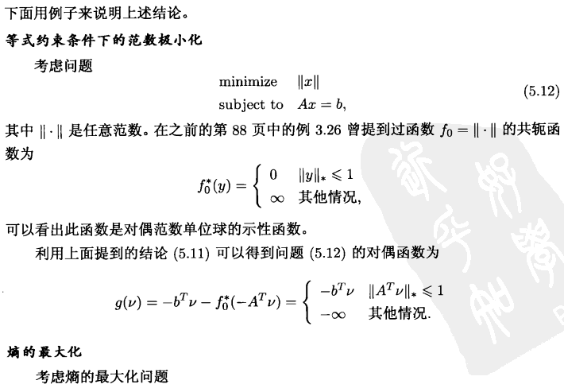

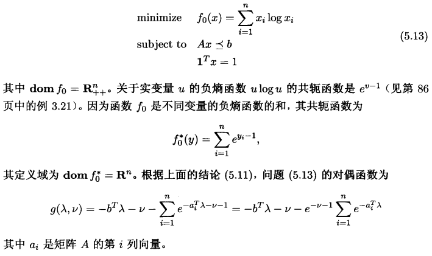

## 6.2 Lagrange 对偶问题

对于任意一组 $(\lambda, \nu)$, 其中 $\lambda \succeq 0$, Lagrange 对偶函数给出了优化问题 (5.1) 的最 优值 $p^{\star}$ 的一个下界。因此, 我们可以得到和参数 $\lambda 、 \nu$ 相关的一个下界。

一个自然的问题是: 从 Lagrange 函数能够得到的最好下界是什么?

可以将这个问题表述为优化问题
$$
\begin{array}{ll}
\operatorname{maximize} & g(\lambda, \nu) \\
\text { subject to } & \lambda \succeq 0
\end{array}
$$
上述问题称为问题 (5.1) 的Lagrange 对偶问题。在本书中, 原始问题 (5.1) 有时被称为原问题。

前面提到的对偶可行的概念, 即描述满足 $\lambda \succeq 0$ 和 $g(\lambda, \nu)>-\infty$ 的一组 $(\lambda, \nu)$, 此时具有意义。它意味着, 这样的一组 $(\lambda, \nu)$ 是对偶问题 (5.16) 的一个可行解。 

称解 $\left(\lambda^{\star}, \nu^{\star}\right)$ 是对偶最优解或者是最优 Lagrange 乘子, 如果它是对偶问题 (5.16) 的 最优解。

**Lagrange 对偶问题 (5.16) 是一个凸优化问题**, 这是因为极大化的目标函数是凹函 数, 且约束集合是凸集。

因此, **对偶问题的凸性和原问题 (5.1) 是否是凸优化问题无关**。

### 6.2.1 显式表达对偶约束

前面提到的例子说明了对偶函数的定义域
$$
\operatorname{dom} g=\{(\lambda, \nu) \mid g(\lambda, \nu)>-\infty\}
$$
的维数一般都小于 $m+p$ 。

事实上, 很多情况下, 我们可以求出 $\operatorname{dom} g$ 的仿射包并将其 表示为一系列线性等式约束。粗略地讲, 这说明我们可以识别出对偶问题 (5.16) 目标 函数 $g$ 中“隐藏”或“隐含”的等式约束。

这样处理之后我们可以得到一个等价的问题, 在等价的问题中, 这些等式约束都被显式地表达为优化问题的约束。下面的例子将说明这 一点。

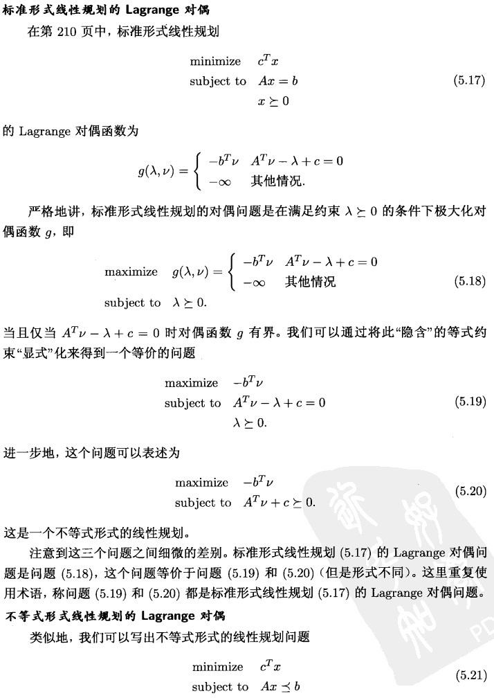

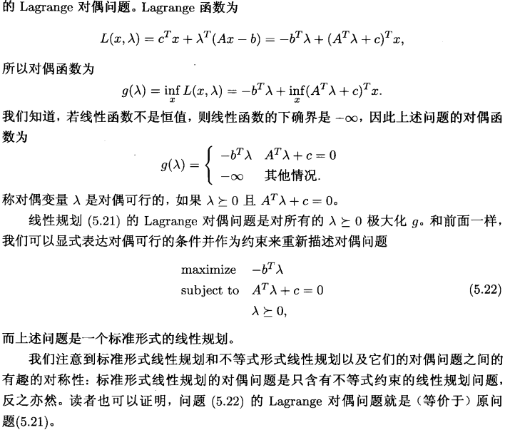

### 6.2.2 弱对偶性

Lagrange 对偶问题的最优值, 我们用 $d^{\star}$ 表示, 根据定义, 这是通过 Lagrange 函数得到的原问题最优值 $p^{\star}$ 的最好下界。

特别地, 我们有下面简单但是非常重要的不等式
$$
d^{\star} \leqslant p^{\star}
$$
即使原问题不是凸问题, 上述不等式亦成立。这个性质称为弱对偶性。

即使当 $d^{\star}$ 和 $p^{\star}$ 无限时, 弱对偶性不等式 (5.23) 也成立。例如, 如果原问题无下界, 即 $p^{\star}=-\infty$, 为了保证弱对偶性成立, 必须有 $d^{\star}=-\infty$, 即 Lagrange 对偶问题不可行。反过来, 若对偶问题无上界, 即 $d^{\star}=\infty$, 为了保证弱对偶性成立, 必须有 $p^{\star}=\infty$, 即原问题不可行。

定义差值 $p^{\star}-d^{\star}$ 是原问题的最优对偶间隙。它给出了原问题最优值以及通过 Lagrange 对偶函数所能得到的最好 (最大) 下界之间的差值。最优对偶间隙总是非负的。

当原问题很难求解时, 弱对偶不等式 (5.23) 可以给出原问题最优值的一个下界, 这是因为对偶问题总是凸问题, 而且在很多情况下都可以进行有效的求解得到 $d^{\star}$ 。

作为 一个例子, 考虑第 211 页提到的双向划分问题 (5.7)。

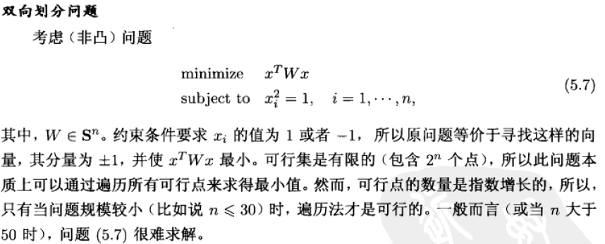

其对偶问题是一个半定规划问题
$$
\begin{array}{ll}\operatorname{maximize} & -\mathbf{1}^{T} \nu \\ \text { subject to } & W+\operatorname{diag}(\nu) \succeq 0\end{array}
$$

其中, 变量 $\nu \in \mathbf{R}^{n}$ 。即使当 $n$ 取相对较大的值, 例如 $n=1000$ 时, 上述问题都可以进 行有效求解。对偶问题的最优值给出了双向划分问题最优值的一个下界, 而这个下界 至少和根据 $\lambda_{\min }(W)$ 给出的下界 $(5.8)$ 一样好。

### 6.2.3 强对偶性和 Slater 约束准则

如果等式
$$
d^{\star}=p^{\star}
$$
成立, 即最优对偶间隙为零, 那么强对偶性成立。这说明从 Lagrange 对偶函数得到的最好下界是紧的。

对于一般情况, 强对偶性不成立。但是, 如果原问题 (5.1) 是凸问题, 即可以表述为 如下形式
$$
\begin{array}{ll}
\text { minimize } & f_{0}(x) \\
\text { subject to } & f_{i}(x) \leqslant 0, \quad i=1, \cdots, m, \\
& A x=b,
\end{array}
$$

其中, 函数 $f_{0}, \cdots, f_{m}$ 是凸函数, 强对偶性通常 (但不总是) 成立。有很多研究成果给出了强对偶性成立的条件 (除了凸性条件以外)。这些条件称为约束准则。

#### Slater 条件

一个简单的约束准则是 Slater 条件: 存在一点 $x \in$ relint $\mathcal{D}$ 使得下式成立
$$
f_{i}(x)<0, \quad i=1, \cdots, m, \quad A x=b
$$
满足上述条件的点有时称为严格可行, 这是因为不等式约束严格成立。Slater 定理说 明, 当 Slater 条件成立 (且原问题是凸问题) 时, 强对偶性成立。

当不等式约束函数 $f_{i}$ 中有一些是仿射函数时, Slater 条件可以进一步改进。如果 最前面的 $k$ 个约束函数 $f_{1}, \cdots, f_{k}$ 是仿射的, 则若下列弱化的条件成立, 强对偶性成立。

该条件为: 存在一点 $x \in$ relint $\mathcal{D}$ 使得
$$
f_{i}(x) \leqslant 0, \quad i=1, \cdots, k, \quad f_{i}(x)<0, \quad i=k+1, \cdots, m, \quad A x=b
$$
换言之, 仿射不等式不需要严格成立。注意到当所有约束条件都是线性等式或不等式且 $\operatorname{dom} f_{0}$ 是开集时, 改进的 Slater 条件 (5.27) 就是可行性条件。

若 Slater 条件 (以及其改进形式 (5.27)) 满足, 不但对于凸问题强对偶性成立, 也 意味着当 $d^{\star}>-\infty$ 时对偶问题能够取得最优值, 即存在一组对偶可行解 $\left(\lambda^{\star}, \nu^{\star}\right)$ 使得 $g\left(\lambda^{\star}, \nu^{\star}\right)=d^{\star}=p^{\star}$ 。在 $\S 5.3 .2$ 中, 我们将证明当原问题是凸问题且 Slater 条件成立时, 强对偶性成立。

## 6.3 鞍点解释(Saddle-point Interpretation)

上面我们已经给出了 $p*$ 的下界，但是实际问题中我们往往更关注 $x^*$

$6.3,6.4$ 就是为了解决这个问题

### 6.3.1 强弱对偶性的极大极小描述

可以将原、对偶优化问题以一种更为对称的方式进行表达。为了简化讨论, 假设没有等式约束

事实上, 现有的结果可以很容易地扩展至有等式约束的情形。

首先, 我们注意到
$$
\begin{aligned}
\sup _{\lambda \succeq 0} L(x, \lambda) &=\sup _{\lambda \succeq 0}\left(f_{0}(x)+\sum_{i=1}^{m} \lambda_{i} f_{i}(x)\right) \\
&=\left\{\begin{array}{lll}
f_{0}(x) & f_{i}(x) \leqslant 0, \quad i=1, \cdots, m \\
\infty & \text { 其他情况. }
\end{array}\right.
\end{aligned}
$$
假设 $x$ 不可行, 即存在某些 $i$ 使得 $f_{i}(x)>0$ 。

选择 $\lambda_{j}=0, j \neq i$, 以及 $\lambda_{i} \rightarrow \infty$, 可以 得出 $\sup _{\lambda \succeq 0} L(x, \lambda)=\infty$ 。 

反过来, 如果 $x$ 可行, 则有 $f_{i}(x) \leqslant 0, i=1, \cdots, m, \lambda$ 的最 优选择为 $\lambda=0, \sup _{\lambda \succeq 0} L(x, \lambda)=f_{0}(x)$ 。

这意味着我们可以将原问题的最优值写成如 下形式
$$
p^{\star}=\inf _{x} \sup _{\lambda \succeq 0} L(x, \lambda)
$$
根据对偶函数的定义, 有
$$
d^{\star}=\sup _{\lambda \succeq 0} \inf _{x} L(x, \lambda)
$$

因此弱对偶性可以表述为下述不等式（始终成立）
$$
\sup _{\lambda \succeq 0} \inf _{x} L(x, \lambda) \leqslant \inf _{x} \sup _{\lambda \succeq 0} L(x, \lambda)
$$
强对偶性可以表示为下面的等式（需要先证明强对偶性才成立）
$$
\sup _{\lambda \succeq 0} \inf _{x} L(x, \lambda)=\inf _{x} \sup _{\lambda \succeq 0} L(x, \lambda)
$$
强对偶性意味着对 $x$ 求极小和对 $\lambda \succeq 0$ 求极大可以互换而不影响结果。

事实上, 弱对偶性的不等式是否成立和 $L$ 的性质无关: 对任意 $f: \mathbf{R}^{n} \times \mathbf{R}^{m} \rightarrow \mathbf{R}$ (以 及任意 $W \subseteq \mathbf{R}^{n}$ 和 $Z \subseteq \mathbf{R}^{m}$ ), 下式成立:
$$
\sup _{z \in Z} \inf _{w \in W} f(w, z) \leqslant \inf _{w \in W} \sup _{z \in Z} f(w, z)
$$
这个一般性的等式称为**极大极小不等式**。

若强对偶性的等式成立, 即
$$
\sup _{z \in Z} \inf _{w \in W} f(w, z)=\inf _{w \in W} \sup _{z \in Z} f(w, z)
$$
我们称 $f$ (以及 $W$ 和 $Z$ ) 满足**强极大极小性质**或者**鞍点性质**。

当然, 强极大极小性质只在特殊情形下成立, 例如, 函数 $f: \mathbf{R}^{n} \times \mathbf{R}^{m} \rightarrow \mathbf{R}$ 是满足强对偶性问题的 Lagrange 函数, 而 $W=\mathbf{R}^{n}, Z=\mathbf{R}_{+}^{m}$ 。

### 6.3.2 鞍点解释

我们称一对 $\tilde{w} \in W, \tilde{z} \in Z$ 是函数 $f$ (以及 $W$ 和 $Z$ ) 的鞍点, 如果对任意 $w \in W$ 和 $z \in Z$ 下式成立
$$
f(\tilde{w}, z) \leqslant f(\tilde{w}, \tilde{z}) \leqslant f(w, \tilde{z})
$$
换言之, $f(w, \tilde{z})$ 在 $\tilde{w}$ 处取得最小值 (关于变量 $w \in W), f(\tilde{w}, z)$ 在 $\tilde{z}$ 处取得最大 值 (关于变量 $z \in Z$ ):
$$
f(\tilde{w}, \tilde{z})=\inf _{w \in W} f(w, \tilde{z}), \quad f(\tilde{w}, \tilde{z})=\sup _{z \in Z} f(\tilde{w}, z)
$$
上式意味着强极大极小性质 $(5.47)$ 成立, 且共同值为 $f(\tilde{w}, \tilde{z})$ 。

回到我们关于 Lagrange 对偶的讨论, 如果 $x^{\star}$ 和 $\lambda^{\star}$ 分别是原问题和对偶问题的最优点, 且强对偶性成立, 则它们是 Lagrange 函数的一个鞍点。反过来同样成立: 如果 $(x, \lambda)$ 是 Lagrange 函数的一个鞍点, 那么 $x$ 是原问题的最优解, $\lambda$ 是对偶问题的最优解, 且最优对偶间隙为零。

### 6.4 最优性条件

### 6.4.1 次优性认证

如果能够找到一个对偶可行解 $(\lambda, \nu)$, 就对原问题的最优值建立了一个下界: $p^{\star} \geqslant$ $g(\lambda, \nu)$ 。 因此, 对偶可行点 $(\lambda, \nu)$ 为表达式 $p^{\star} \geqslant g(\lambda, \nu)$ 的成立提供了一个证明或认证。 强对偶性意味着存在任意好的认证。

对偶可行点可以让我们在不知道 $p^{\star}$ 的确切值的情况下界定给定可行点的次优程度。

事实上, 如果 $x$ 是原问题可行解且 $(\lambda, \nu)$ 对偶可行, 那么
$$
f_{0}(x)-p^{\star} \leqslant f_{0}(x)-g(\lambda, \nu)
$$
特别地, 上式说明了 $x$ 是 $\epsilon$-次优, 其中 $\epsilon=f_{0}(x)-g(\lambda, \nu)$ 。 (这同样说明对对偶问题 $(\lambda, \nu)$ 是 $\epsilon$-次优。

定义原问题和对偶问题目标函数的差值
$$
f_{0}(x)-g(\lambda, \nu)
$$
为原问题可行解 $x$ 和对偶可行解 $(\lambda, \nu)$ 之间的对偶间隙。

一对原对偶问题的可行点 $x,(\lambda, \nu)$ 将原问题 (对偶问题) 的最优值限制在一个区间上:
$$
p^{\star} \in\left[g(\lambda, \nu), f_{0}(x)\right], \quad d^{\star} \in\left[g(\lambda, \nu), f_{0}(x)\right]
$$
区间的长度即为上面定义的对偶间隙。

如果原对偶可行对 $x,(\lambda, \nu)$ 的对偶间隙为零, 即 $f_{0}(x)=g(\lambda, \nu)$, 那么 $x$ 是原问题最优解且 $(\lambda, \nu)$ 是对偶问题最优解。此时, 我们可以认为 $(\lambda, \nu)$ 是证明 $x$ 为**最优解的一个认证** (类似地, 也可以认为 $x$ 是证明 $(\lambda, \nu)$ 对偶最优的一个认证)。

### 6.4.2 停止准则

上述现象可以用在优化算法中给出非启发式停止准则。设某个算法给出一系列原问题可行解 $x^{(k)}$ 以及对偶问题可行解 $\left(\lambda^{(k)}, \nu^{(k)}\right), k=1,2, \cdots$, 给定要求的绝对精度 $\epsilon_{\mathrm{abs}}>0$, 那么停止准则 (即**终止算法的条件**)
$$
f_{0}\left(x^{(k)}\right)-g\left(\lambda^{(k)}, \nu^{(k)}\right) \leqslant \epsilon_{\mathrm{abs}}
$$
保证当算法终止的时候, $x^{(k)}$ 是 $\epsilon_{\mathrm{abs}}$-次优。事实上, $\left(\lambda^{(k)}, \nu^{(k)}\right)$ 为此提供了一个认证。(当然, 只有**在强对偶性成立的条件下, 此方法对任意小的 $\epsilon_{\mathrm{abs}}$ 才都可行**。)

给定相对精度 $\epsilon_{\mathrm{rel}}>0$, 可以推导类似的条件保证 $\epsilon$-次优。如果
$$
g\left(\lambda^{(k)}, \nu^{(k)}\right)>0, \quad \frac{f_{0}\left(x^{(k)}\right)-g\left(\lambda^{(k)}, \nu^{(k)}\right)}{g\left(\lambda^{(k)}, \nu^{(k)}\right)} \leqslant \epsilon_{\mathrm{rel}}
$$

成立, 或者
$$
f_{0}\left(x^{(k)}\right)<0, \quad \frac{f_{0}\left(x^{(k)}\right)-g\left(\lambda^{(k)}, \nu^{(k)}\right)}{-f_{0}\left(x^{(k)}\right)} \leqslant \epsilon_{\text {rel }}
$$
成立, 那么 $p^{\star} \neq 0$, 且可以保证相对误差
$$
\frac{f_{0}\left(x^{(k)}\right)-p^{\star}}{\left|p^{\star}\right|}
$$
小于等于 $\epsilon_{\text {rel }}$

### 6.4.3 互补松弛性(Complementary Slackness)

设原问题和对偶问题的最优值都可以达到且相等 (即强对偶性成立)。令 $x^{\star}$ 是原问题的最优解, $\left(\lambda^{\star}, \nu^{\star}\right)$ 是对偶问题的最优解, 这表明
$$
\begin{aligned}
f_{0}\left(x^{\star}\right) &=g\left(\lambda^{\star}, \nu^{\star}\right) \\
&=\inf _{x}\left(f_{0}(x)+\sum_{i=1}^{m} \lambda_{i}^{\star} f_{i}(x)+\sum_{i=1}^{p} \nu_{i}^{\star} h_{i}(x)\right) \\
& \leqslant f_{0}\left(x^{\star}\right)+\sum_{i=1}^{m} \lambda_{i}^{\star} f_{i}\left(x^{\star}\right)+\sum_{i=1}^{p} \nu_{i}^{\star} h_{i}\left(x^{\star}\right) \\
& \leqslant f_{0}\left(x^{\star}\right)
\end{aligned}
$$
* 第一个等式说明最优对偶间隙为零
* 第二个等式是对偶函数的定义
* 第三个不等式是根 据 Lagrange 函数关于 $x$ 求下确界小于等于其在 $x=x^{\star}$ 处的值得来
* 最后一个不等式 的成立是因为 $\lambda_{i}^{\star} \geqslant 0, f_{i}\left(x^{\star}\right) \leqslant 0, i=1, \cdots, m$, 以及 $h_{i}\left(x^{\star}\right)=0, i=1, \cdots, p$ 

因此, 在上面的式子链中, **两个不等式取等号**。

可以由此得出一些有意义的结论。例如, 由于第三个不等式变为等式, 我们知道 $L\left(x, \lambda^{\star}, \nu^{\star}\right)$ 关于 $x$ 求极小时在 $x^{\star}$ 处取得最小值。( Lagrange 函数 $L\left(x, \lambda^{\star}, \nu^{\star}\right)$ 也可以有其他最小点; $x^{\star}$ 只是其中一个最小点。)

另外一个重要的结论是
$$
\sum_{i=1}^{m} \lambda_{i}^{\star} f_{i}\left(x^{\star}\right)=0
$$
事实上, 求和项的每一项都非正, 因此有
$$
\lambda_{i}^{\star} f_{i}\left(x^{\star}\right)=0, \quad i=1, \cdots, m
$$
**上述条件称为互补松弛性**; 它对任意原问题最优解 $x^{\star}$ 以及对偶问题最优解 $\left(\lambda^{\star}, \nu^{\star}\right)$ 都 成立 (当强对偶性成立时)。我们可以将互补松弛条件写成
$$
\lambda_{i}^{\star}>0 \Longrightarrow f_{i}\left(x^{\star}\right)=0
$$
或者等价地
$$
f_{i}\left(x^{\star}\right)<0 \Longrightarrow \lambda_{i}^{\star}=0
$$
粗略地讲, 上式意味着在最优点处, 除了第 $i$ 个约束起作用的情况, 最优 Lagrange 乘 子的第 $i$ 项都为零。

### 6.4.4 KKT 最优性条件

现在假设函数 $f_{0}, \cdots, f_{m}, h_{1}, \cdots, h_{p}$ **可微** (因此定义域是开集), 但是并**不假设这些函数是凸函数**。

#### 非凸问题的 KKT 条件

和前面一样, 令 $x^{\star}$ 和 $\left(\lambda^{\star}, \nu^{\star}\right)$ 分别是原问题和对偶问题的某对最优解, 对偶间隙为零。因为 $L\left(x, \lambda^{\star}, \nu^{\star}\right)$ 关于 $x$ 求极小在 $x^{\star}$ 处取得最小值, 因此函数在 $x^{\star}$ 处的导数 必须为零, 即,
$$
\nabla f_{0}\left(x^{\star}\right)+\sum_{i=1}^{m} \lambda_{i}^{\star} \nabla f_{i}\left(x^{\star}\right)+\sum_{i=1}^{p} \nu_{i}^{\star} \nabla h_{i}\left(x^{\star}\right)=0
$$
因此, 我们有
$$
\begin{aligned}
f_{i}\left(x^{\star}\right) \leqslant 0, & i=1, \cdots, m \\
h_{i}\left(x^{\star}\right)=0, & i=1, \cdots, p \\
\lambda_{i}^{\star} \geqslant 0, & i=1, \cdots, m \\
\lambda_{i}^{\star} f_{i}\left(x^{\star}\right)=0, & i=1, \cdots, m \\
\nabla f_{0}\left(x^{\star}\right)+\sum_{i=1}^{m} \lambda_{i}^{\star} \nabla f_{i}\left(x^{\star}\right)+\sum_{i=1}^{p} \nu_{i}^{\star} \nabla h_{i}\left(x^{\star}\right)=0, &
\end{aligned}
$$
我们称上式为 Karush-Kuhn-Tucker (KKT) 条件。

总之, 对于目标函数和约束函数可微的任意优化问题, **如果强对偶性成立, 那么任何一对原问题最优解和对偶问题最优解必须满足 KKT 条件**。

**这是强对偶性的必要条件**

#### 凸问题的 KKT 条件

当原问题是凸问题时, 满足 KKT 条件的点也是原、对偶最优解。换言之, 如果函 数 $f_{i}$ 是凸函数, $h_{i}$ 是仿射函数, $\tilde{x}, \tilde{\lambda}, \tilde{\nu}$ 是任意满足 KKT 条件的点,
$$
\begin{aligned}
f_{i}(\tilde{x}) \leqslant 0, & i=1, \cdots, m \\
h_{i}(\tilde{x})=0, & i=1, \cdots, p \\
\tilde{\lambda}_{i} \geqslant 0, & i=1, \cdots, m \\
\tilde{\lambda}_{i} f_{i}(\tilde{x})=0, & i=1, \cdots, m \\
\nabla f_{0}(\tilde{x})+\sum_{i=1}^{m} \tilde{\lambda}_{i} \nabla f_{i}(\tilde{x})+\sum_{i=1}^{p} \tilde{\nu}_{i} \nabla h_{i}(\tilde{x})=0, &
\end{aligned}
$$
那么 $\tilde{x}$ 和 $(\tilde{\lambda}, \tilde{\nu})$ 分别是原问题和对偶问题的最优解, 对偶间隙为零。

也就是说，**如果是凸问题，KKT是强对偶性的充要条件，任何一个满足KKT条件的点是最优解**

为了说明这一点, 注意到前两个条件说明了 $\tilde{x}$ 是原问题的可行解。因为 $\tilde{\lambda}_{i} \geqslant$ $0, L(x, \tilde{\lambda}, \tilde{\nu})$ 是 $x$ 的凸函数; 最后一个 KKT 条件说明在 $x=\tilde{x}$ 处, Lagrange 函数的导 数为零。因此, $L(x, \tilde{\lambda}, \tilde{\nu})$ 关于 $x$ 求极小在 $\tilde{x}$ 处取得最小值。我们得出结论
$$
\begin{aligned}
g(\tilde{\lambda}, \tilde{\nu}) &=L(\tilde{x}, \tilde{\lambda}, \tilde{\nu}) \\
&=f_{0}(\tilde{x})+\sum_{i=1}^{m} \tilde{\lambda}_{i} f_{i}(\tilde{x})+\sum_{i=1}^{p} \tilde{\nu}_{i} h_{i}(\tilde{x}) \\
&=f_{0}(\tilde{x})
\end{aligned}
$$
最后一行成立是因为 $h_{i}(\tilde{x})=0$ 以及 $\tilde{\lambda}_{i} f_{i}(\tilde{x})=0$ 。这说明原问题的解 $\tilde{x}$ 和对偶问题的 解 $(\tilde{\lambda}, \tilde{\nu})$ 之间的对偶间隙为零, 因此分别是原、对偶最优解。总之, **对目标函数和约束函数可微的任意凸优化问题, 任意满足 KKT 条件的点分别是原、对偶最优解, 对偶间隙为零**。

**若某个凸优化问题具有可微的目标函数和约束函数, 且其满足 Slater 条件, 那么 KKT 条件是最优性的充要条件**: Slater 条件意味着最优对偶间隙为零且对偶最优解可以达到, 因此 $x$ 是原问题最优解, 当且仅当存在 $(\lambda, \nu)$, 二者满足 KKT 条件。

KKT 条件在优化领域有着重要的作用。在一些特殊的情形下, 是可以解析求解 KKT 条件的 (也因此可以求解优化问题)。更一般地, 很多求解凸优化问题的方法可以认为或者理解为求解 KKT 条件的方法。

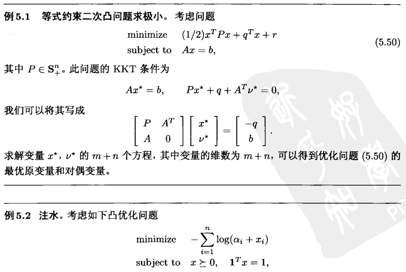

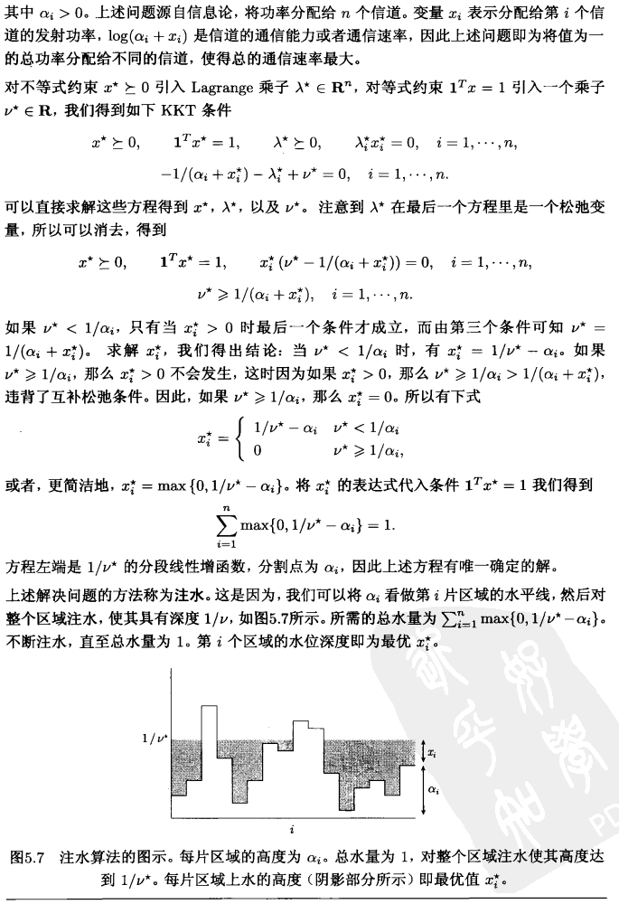

### 6.4.5 通过解对偶问题求解原问题

在之前我们提到，如果强对偶性问题存在一个对偶最优解 $\left(\lambda^{\star}, \nu^{\star}\right)$, 那么任意原问题最优点也是 $L\left(x, \lambda^{\star}, \nu^{\star}\right)$ 的最优解。这个性质可以让我们从对偶最优方程中去求解原问题最优解。

更精确地, 假设强对偶性成立, 对偶最优解 $\left(\lambda^{\star}, \nu^{\star}\right)$ 已知。假设 $L\left(x, \lambda^{\star}, \nu^{\star}\right)$ 的最小 点, 即下列问题的解
$$
\operatorname{minimize} \quad f_{0}(x)+\sum_{i=1}^{m} \lambda_{i}^{\star} f_{i}(x)+\sum_{i=1}^{p} \nu_{i}^{\star} h_{i}(x),\quad\quad\quad (5.55)
$$
唯一。(对于凸问题, 如果 $L\left(x, \lambda^{\star}, \nu^{\star}\right)$ 是 $x$ 的严格凸函数, 就会发生这种情况。) 

那么如果问题 (5.55) 的解是原问题可行解, 那么它就是原问题最优解; 如果它不是原问题可行解, 那么原问题不存在最优点, 即原问题的最优解无法达到。

当对偶问题比原问题更易求解时, 比如说对偶问题可以解析求解或者有某些特殊的结构更易分析, 上述方法很有意义。

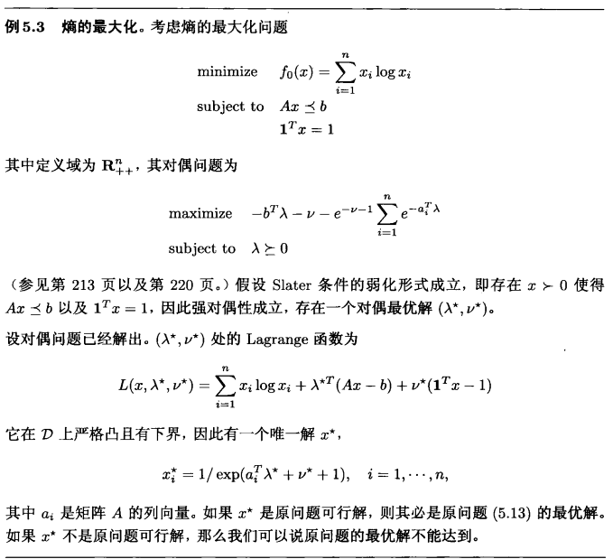

更多例子在课件Lecture 9
