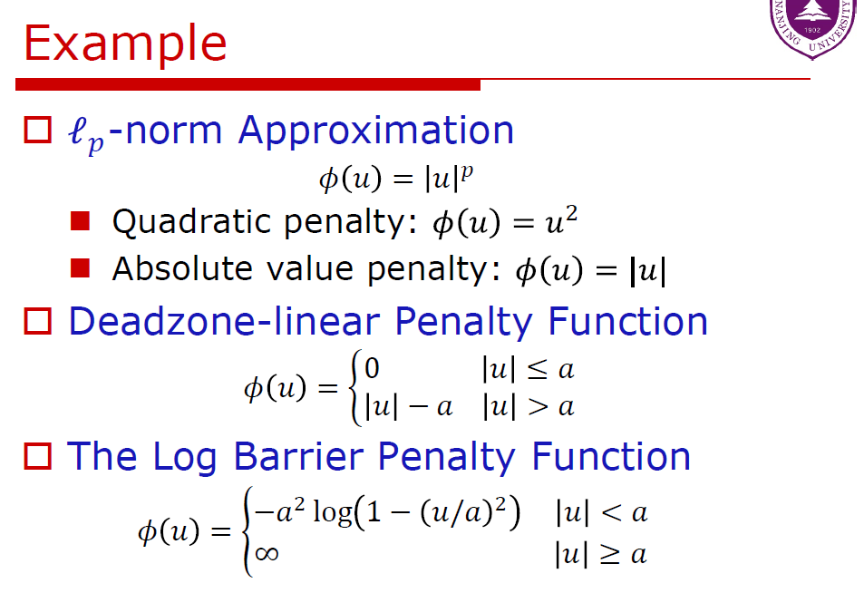
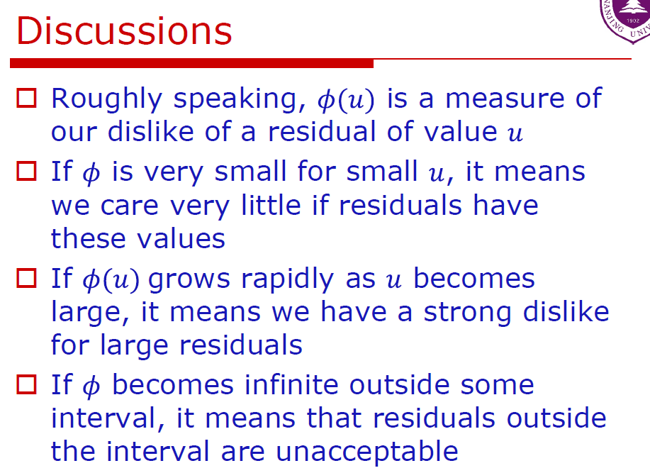
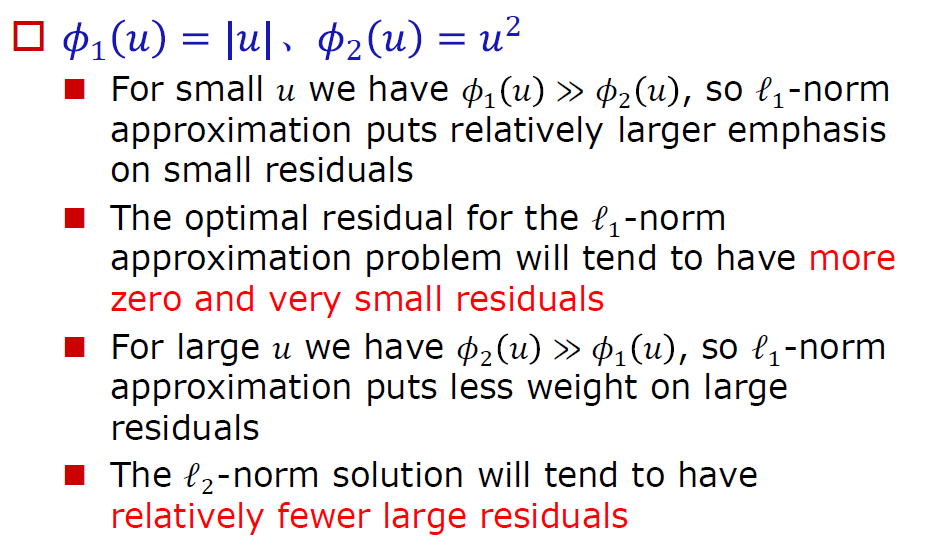
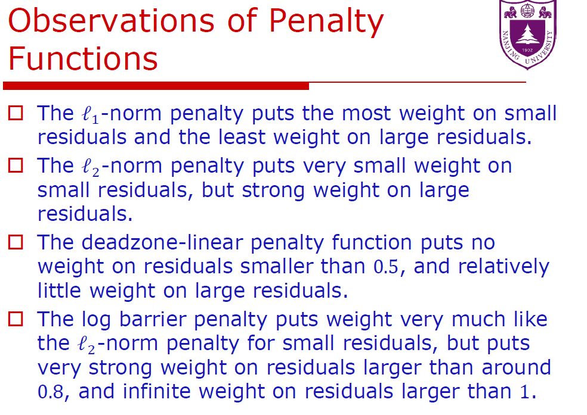
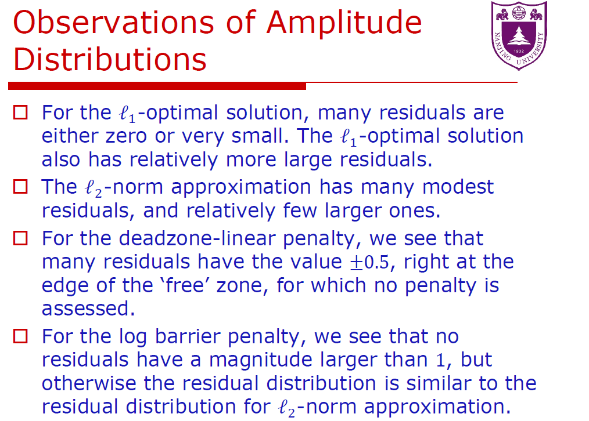
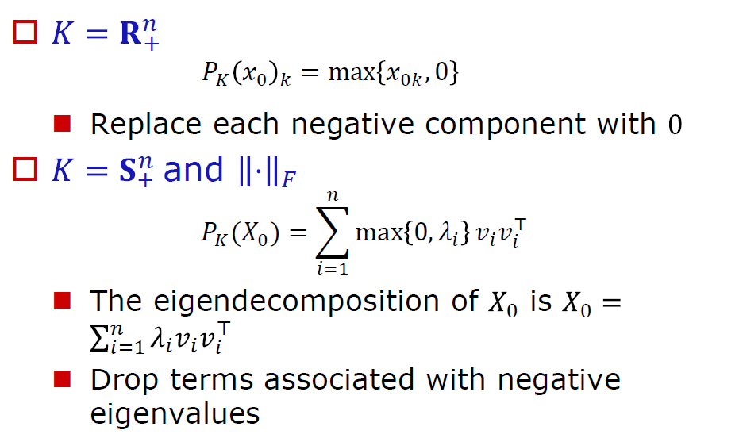

# 7 逼近与拟合

## 7.1 范数逼近

### 7.1.1 基本的范数逼近问题

最简单的范数逼近问题是具有下列形式的无约束问题
$$
\text { minimize }\|A x-b\|\quad\quad\quad\quad\quad(6.1)
$$
其中 $A \in \mathbf{R}^{m \times n}$ 和 $b \in \mathbf{R}^{m}$ 是问题的数据, $x \in \mathbf{R}^{n}$ 是变量, 而 $\|\cdot\|$ 是 $\mathbf{R}^{m}$ 上的一种范 数。范数逼近问题的解有时又被称为 $A x \approx b$ 在范数 $\|\cdot\|$ 下的近似解。向量
$$
r=A x-b
$$
称为这个问题的**残差**; 其分量有时也称为关于 $x$ 的个体残差。

范数逼近问题 (6.1) 是一个可解的凸问题, 也就是说, 总是存在至少一个最优解。 

当且仅当 $b \in \mathcal{R}(A)$ 时, 其最优值为零; 但是, 更有趣也更有用的是 $b \notin \mathcal{R}(A)$ 的情况。

我们可以不失一般性地假设 $A$ 的列向量独立; 特别地, 设 $m \geqslant n$ 。当 $m=n$ 时, 最优 解 $A^{-1} b$ 可以简单地得到, 因此我们可以假设 $m>n$ 。

#### 逼近的解释

通过将 $A x$ 表示为
$$
A x=x_{1} a_{1}+\cdots+x_{n} a_{n}
$$
其中 $a_{1}, \cdots, a_{n} \in \mathbf{R}^{m}$ 为 $A$ 的列, 我们可以看出, 范数逼近问题的目标是用 $A$ 的列的 线性组合, 尽可能准确地逼近或拟合向量 $b$, 其偏差由范数 $\|\cdot\|$ 度量。

这一逼近问题也称为回归问题。在此背景下, 向量 $a_{1}, \cdots, a_{n}$ 称为回归量, 设 $x$ 是 问题的一个最优解, 称向量 $x_{1} a_{1}+\cdots+x_{n} a_{n}$ 为 $b$ (向回归量) 的回归。

#### 估计的解释

一个与范数逼近问题密切相关的解释出现在基于不完全线性向量测量值进行的参 数估计问题中。考虑线性测量模型
$$
y=A x+v
$$

其中 $y \in \mathbf{R}^{m}$ 为测量值向量, $x \in \mathbf{R}^{n}$ 为待估计的参数向量, $v \in \mathbf{R}^{m}$ 为末知的测量误 差 (假设在范数 $\|\cdot\|$ 度量下很小)。相应的估计问题是在给定 $y$ 的情况下对 $x$ 是什么 进行合理的猜测。

如果我们猜测 $x$ 的值为 $\hat{x}$, 也就是隐含地猜测 $v$ 的值为 $y-A \hat{x}$ 。假设 $v$ (在 $\|\cdot\|$ 度量下) 越小越可信, 那么对于 $x$ 的最有可信的猜测是
$$
\hat{x}=\operatorname{argmin}_{z}\|A z-y\| \text {. }
$$
(这些想法可以在统计学的框架中进行更加正规的表述, 参见第 7 章。)

#### 几何的解释

考虑子空间 $\mathcal{A}=\mathcal{R}(A) \subseteq \mathbf{R}^{m}$ 和一个点 $b \in \mathbf{R}^{m}$ 。点 $b$ 向子空间 $\mathcal{A}$ 的投影是 $\mathcal{A}$ 中 在 $\|\cdot\|$ 下最靠近 $b$ 的点, 也就是说, 它是下列问题的任意最优解

$$
\begin{array}{ll}\text { minimize } & \|u-b\| \\ \text { subject to } & u \in \mathcal{A} .\end{array}
$$

将 $\mathcal{R}(A)$ 中的元素参数化为 $u=A x$, 我们可以看出求解范数逼近问题 (6.1) 等价于计 算 $b$ 向 $\mathcal{A}$ 的投影。

#### 设计的解释

我们可以将范数逼近问题 (6.1) 解释为一个最优设计问题。

* $x_{1}, \cdots, x_{n}$ 为 $n$ 个设计变量, 其数值待定。
* 向量 $y=A x$ 给出了表示 $m$ 个结果的向量, 我们假设它是设计变量 $x$ 的线性函数。
* 向量 $b$ 为目标向量或期望结果。目标是选择一个设计向量尽可能地接近 期望的结果，也就是说 $A x \approx b$ 。
* 我们可以将残差向量 $r$ 解释为实际结果 (即 $A x$ ) 与期 望或目标 (即 $b$ ) 之间的偏差。

如果我们用真实结果与期望目标之间偏差的范数来度量 设计的质量, 那么参数過近问题 (6.1) 也就是寻找最佳设计的问题。

#### 加权范数逼近问题

范数逼近问题的一个扩展是加权范数逼近问题
$$
\operatorname{minimize} \quad\|W(A x-b)\|
$$
其问题数据 $W \in \mathbf{R}^{m \times m}$ 称为权矩阵。权矩阵通常是对角的, 在这种情况下, 它给出了 对残差向量 $r=A x-b$. 分量之间不同的相对强调程度。

加权范数问题可以看做关于范数 $\|\cdot\|$ 和数据 $\tilde{A}=W A, \tilde{b}=W b$ 的范数逼近问题, 因此, 仍然可以被视为标准范数逼近问题 (6.1)。

另一方面, 加权范数逼近问题也可以被 看做关于数据 $A$ 和 $b$ 的范数估计问题, 其范数为 $W$-加权范数, 定义如下
$$
\|z\|_{W}=\|W z\|
$$
(这里假设 $W$ 非奇异)。

#### 最小二乘逼近

最常见的范数逼近问题采用 Euclid 或 $\ell_{2}$-范数。通过将目标函数平方, 我们得到等 价问题, 称为最小二乘逼近问题,
$$
\operatorname{minimize}\|A x-b\|_{2}^{2}=r_{1}^{2}+r_{2}^{2}+\cdots+r_{m}^{2} \text {, }
$$
其目标函数为残差平方和。通过将目标函数表示为凸二次函数,
$$
f(x)=x^{T} A^{T} A x-2 b^{T} A x+b^{T} b \text {. }
$$
这个问题可以解析地求解。点 $x$ 极小化 $f$, 当且仅当
$$
\nabla f(x)=2 A^{T} A x-2 A^{T} b=0
$$
即 $x$ 满足
$$
A^{T} A x=A^{T} b
$$
这个方程称为正规方程, 并且总是有解的。因为我们假设 $A$ 的列向量是独立的, 所以最小二乘逼近问题总有唯一解 $x=\left(A^{T} A\right)^{-1} A^{T} b$ 

#### Chebyshev 或极小极大逼近

当使用 $\ell_{\infty}$-范数时, 范数逼近问题
$$
\operatorname{minimize} \quad\|A x-b\|_{\infty}=\max \left\{\left|r_{1}\right|, \cdots,\left|r_{m}\right|\right\}
$$
称为Chebyshevi逼近问题。因为我们试图极小化最大 (绝对值) 残差, 因此又称为极 小极大逼近问题。Chebyshev 逼近问题可以描述为线性规划

$$
\begin{array}{ll}\text { minimize } & t \\ \text { subject to } & -t \mathbf{1} \preceq A x-b \preceq t 1,\end{array}
$$

其变量为 $x \in \mathbf{R}^{n}$ 和 $t \in \mathbf{R}$ 。

莍差绝对值之和逼近
如果采用 $\ell_{1}$-范数, 范数逼近问题

$$
\operatorname{minimize}\|A x-b\|_{1}=\left|r_{1}\right|+\cdots+\left|r_{m}\right|
$$

称为残差 (绝对值) 和逼近问题, 或者, 在估计领域, 称为一种鲁棒估计器 (其原因马上会明了)。

如同 Chebyshev 逼近问题一样, $\ell_{1}$-范数逼近问题可以描述为线性规划

$$
\begin{array}{ll}\operatorname{minimize} & \mathbf{1}^{T} t \\ \text { subject to } & -t \preceq A x-b \preceq t\end{array}
$$

其变量为 $x \in \mathbf{R}^{n}$ 和 $t \in \mathbf{R}^{m}$ 。

### 7.1.2 罚函数逼近

对于 $1 \leqslant p<\infty, \ell_{p}$ 范数逼近问题的目标函数为
$$
\left(\left|r_{1}\right|^{p}+\cdots+\left|r_{m}\right|^{p}\right)^{1 / p}
$$
如同最小二乘问题一样, 我们可以考虑目标函数为
$$
\left|r_{1}\right|^{p}+\cdots+\left|r_{m}\right|^{p}
$$
的等价问题, 这一目标函数是残差的可分、对称函数。特别地, 目标函数值仅取决于残 差的幅值分布, 即排序的残差。
我们将考虑 $\ell_{p}$-范数逼近问题的一个有用推广, 其目标函数仅仅取决于残差的幅值 分布。这个罚函数逼近问题具有形式
$$
\begin{array}{ll}
\text { minimize } & \phi\left(r_{1}\right)+\cdots+\phi\left(r_{m}\right) \quad\quad\quad\quad\quad(6.2)\\
\text { subject to } & r=A x-b,
\end{array}
$$
其中 $\phi: \mathbf{R} \rightarrow \mathbf{R}$ 称为 (残差) 罚函数。设 $\phi$ 为凸函数, 则罚函数逼近问题是一个凸优化 问题。

在很多情况下, 罚函数 $\phi$ 是对称、非负的, 并且满足 $\phi(0)=0$ 。但是, 在我们的 分析中, 并不需要这些性质。

#### 解释

我们可以将罚函数逼近问题 (6.2) 解释如下。

对于 $x$ 的选择, 我们得到了 $b$ 的一个 逼近 $A x$, 也得到了相应的残差向量 $r$ 。罚函数通过 $\phi\left(r_{i}\right)$ 评价残差每一个分量的费用或惩罚; 总体惩罚就是每个残差的罚函数之和, 即 $\phi\left(r_{1}\right)+\cdots+\phi\left(r_{m}\right)$ 。 $x$ 的不同选择导致不同的残差, 因此有不同的总体惩罚。在罚函数逼近问题中, 我们极小化由残差带来的总体惩罚。

**下面可以不看**

### 7.1.3 带有约束的逼近

可以在基本的范数逼近问题 (6.1) 中添加约束。当这些约束为凸约束时, 得到的问 题是凸的。有多种原因产生这些约束。

- 在逼近问题中, 约束可以用来排除对向量 $b$ 的特定的、不可接受的逼近, 或者确 保 $A x$ 的逼近结果满足特定的性质。
- 在逼近问题中, 约束可以作为待估计向量 $x$ 的先验知识, 或者来源于估计误差 $v$ 的先验知识。
- 确定点 $b$ 向比子空间更复杂的集合 (例如, 锥或多面体) 的投影时, 约束具有相应 的几何意义。
一些例子将说明上述讨论。

#### 变量的非负约束

我们可以在基本的范数逼近问题中添加约束 $x \succeq 0$ :

$$
\begin{array}{ll}\text { minimize } & \|A x-b\| \\ \text { subject to } & x \succeq 0 .\end{array}
$$

当我们估计已知非负的参数向量 $x$ 时, 例如, 能量、强度或比率, 需要在估计中添加非 负约束。其几何意义是计算向量 $b$ 向由 $A$ 的列向量组成的锥的投影。我们也可以将这 一问题解释为用 $A$ 的列向量的非负组合 (即锥组合) 去逼近 $b$ 。

#### 变量范围

这里我们添加约束 $l \preceq x \preceq u$, 其中 $l, u \in \mathbf{R}^{n}$ 为问题的参数:
$$
\begin{array}{ll}
\operatorname{minimize} & \|A x-b\| \\
\text { subject to } & l \preceq x \preceq u
\end{array}
$$
在估计问题中, 变量范围作为先验知识提出, 表明了每个变量所处的区间。其几何解释 是我们在确定 $b$ 向集合 $\{A x \mid l \preceq x \preceq u\}$ 的投影。

#### 概率分布

我们可以添加约束使得 $x$ 满足 $x \succeq 0, \mathbf{1}^{T} x=1:$
$$
\begin{array}{ll}
\text { minimize } & \|A x-b\| \\
\text { subject to } & x \succeq 0, \quad \mathbf{1}^{T} x=1
\end{array}
$$
这常见于对比例或相对频率 (它们非负且和为 1) 的估计中。这也可以解释为用 $A$ 的列 向量的凸组合来逼近 $b$ 。

#### 范数球约束

在基本的范数逼近问题中, 我们可以添加约束使得 $x$ 位于一个范数球中:
$$
\begin{array}{ll}
\operatorname{minimize} & \|A x-b\| \\
\text { subject to } & \left\|x-x_{0}\right\| \leqslant d
\end{array}
$$
其中 $x_{0}$ 和 $d$ 为问题的参数。这一约束可以由于下述原因而添加:
- 在估计问题中, $x_{0}$ 是对参数 $x$ 的一个先验的猜测, 而 $d$ 是估计值距离先验猜 测的最大可能误差。我们对于参数 $x$ 的估计是在所有可能的候选值（即满足 $\left\|z-x_{0}\right\| \leqslant d$ 的 $z$ ) 中选择与测量数据匹配最好的 $\hat{x}$ (即极小化 $\|A z-b\|$ )。
- 约束 $\left\|x-x_{0}\right\| \leqslant d$ 可以表示信赖域。线性关系 $y=A x$ 仅仅是某些非线性关系 $y=f(x)$ 的近似, 这种近似在 $x_{0}$ 的附近, 具体地, $\left\|x-x_{0}\right\| \leqslant d$ 成立。于是问题 变成在这些 $x$ 上, 即在模型 $y=A x$ 可以被信赖的区域中, 极小化 $\|A x-b\|$ 。

这些想法在正则化的内容中也会被提及。

## 7.2 最小范数问题

基本的最小范数问题具有下列形式
$$
\begin{array}{ll}
\operatorname{minimize} & \|x\| \\
\text { subject to } & A x=b
\end{array}\quad\quad\quad\quad\quad(6.5)
$$
其中数据为 $A \in \mathbf{R}^{m \times n}$ 和 $b \in \mathbf{R}^{m}$, 变量为 $x \in \mathbf{R}^{n},\|\cdot\|$ 为 $\mathbf{R}^{n}$ 上的一种范数。这个 问题的解称为 $A x=b$ 的最小范数解, 如果 $A x=b$ 有解, 这样的解总是存在的。当然, 最小范数问题是一个凸优化问题。

我们可以不失一般性地假设 $A$ 的行独立, 因此 $m \leqslant n$ 。当 $m=n$ 时, 唯一的可行 解是 $x=A^{-1} b$; 只有当 $m<n$, 即方程 $A x=b$ 不定时, 最小范数问题才有意义。 

### 7.2.1 重构为范数逼近问题

通过消去等式约束, 可以将最小范数问题 (6.5) 表示为一个范数逼近问题。令 $x_{0}$ 为 $A x=b$ 的一个任意解, 令 $Z \in \mathbf{R}^{n \times k}$ 的列为 $A$ 的零空间的基。于是, $A x=b$ 的通 解可以表示为 $x_{0}+Z u$, 其中 $u \in \mathbf{R}_{\text {。 }}^{k}$ 最小范数问题 $(6.5)$ 可以写为

$$
minimize \left\|x_{0}+Z u\right\|
$$

其变量为 $u \in \mathbf{R}^{k}$, 这是一个范数逼近问题。特别地, (如果演绎正确) 关于范数逼近问题的讨论和分析都可以应用于最小范数问题。

### 7.3.2 控制或设计的解释 

我们可以将最小范数问题 (6.5) 解释为最优设计或最优控制问题。  $x_{1}, \cdots, x_{n}$ 为 $ n$ 个设计变量, 其值待定。在控制领域, 变量 $ x_{1}, \cdots, x_{n} $表示输入, 其值待我们选定。向量 $y=A x$ 给出了设计  $x$ 对应的 $ m$ 个属性或结果, 我们假设它们是设计变量 $x$ 的线性函 数。$ m<n$ 个方程 $ A x=b$ 表示了设计的 $ m$ 个规范或要求。因为 $m<n$ ， 这种设计是 不定的, 具有  $n-m$ 个自由度 (假设  $A$ 的秩为 $m$ )。

在所有满足规格的设计中, 最小范数问题选择了范数 $\|\cdot\|$ 度量下的最小方案。这可以认为是最为有效的设计, 因为它用最小的可能值 $ x $ 达到了要求 $ A x=b$ 。 

### 7.3.3 估计解释

假设 $ x$ 为待估计的参数向量。我们有 $ m<n$ 个很好的 (没有噪声的) 线性测量值, 由 $A x=b $ 给出。因为测量值少于估计的参数，我们的测量值不足以完全确定 $x$ 。任意满足 $A x=b $ 的参数 $x$ 都符合我们的测量值

为了不进行更多测量而得到 $x$ 的一个好估计，我们必须用到先验信息。

假设我们有先验信息，或者单纯假设 $x$ 可能较小（在 $\|\cdot\|$ 度量下）。在所有满足测量值 $Ax=b$ 的参数向量中，最小范数问题选择了最小的向量作为 $x$ 的估计。

### 7.3.4 几何解释

我们也可以对最小二乘问题 (6.5) 给出简单的几何解释。可行集 $\{x \mid A x=b\}$ 是仿 射的, 目标函数是 $x$ 和 0 (在范数 $\|\cdot\|$ 度量下) 的距离。最小范数问题在仿射集合中寻 找距离 0 最近的点, 即寻找 0 向仿射集合 $\{x \mid A x=b\}$ 的投影。

### 7.3.5 线性方程组的最小二乘解

最常见的最小范数问题采用 Euclid 或 $\ell_{2}$-范数。通过将目标函数平方, 我们得到等价问题

$$
\begin{array}{ll}
\operatorname{minimize} & \|x\|^2 \\
\text { subject to } & A x=b
\end{array}
$$

其唯一解称为方程组 $A x=b$ 的最小二乘解。类似最小二乘逼近问题, 这一问题也可以 被解析地求解。引入对偶变量 $\nu \in \mathbf{R}^{m}$, 最优性条件为
$$
2 x^{\star}+A^{T} \nu^{\star}=0, \quad A x^{\star}=b,
$$
这是一组线性方程并容易求解。通过第一个方程, 我们可以得到 $x^{\star}=-(1 / 2) A^{T} \nu^{\star}$; 将 其带入第二个方程, 我们有 $-(1 / 2) A A^{T} \nu^{\star}=b$ 并且得到结论
$$
\nu^{\star}=-2\left(A A^{T}\right)^{-1} b, \quad x^{\star}=A^{T}\left(A A^{T}\right)^{-1} b .
$$
(因为 $\operatorname{rank} A=m<n$, 矩阵 $A A^{T}$ 可逆。) 

### 7.3.6 最小罚问题

最小范数问题 (6.5) 一个有用的变形是最小罚问题
$$
\begin{array}{ll}
\text { minimize } & \phi\left(x_{1}\right)+\cdots+\phi\left(x_{n}\right) \\
\text { subject to } & A x=b,
\end{array}
$$
其中 $\phi: \mathbf{R} \rightarrow \mathbf{R}$ 是凸和非负的并且满足 $\phi(0)=0$ 。罚函数的值 $\phi(u)$ 量化了我们对 $x$ 的某一分量具有值 $u$ 的厌恶程度; 于是, 在约束 $A x=b$ 下, 最小罚问题找到了具有最 小总惩罚的 $x$ 。

通过将 (罚函数逼近问题中的) 残差 $r$ 的幅值分布替换为 (最小罚问题中的) $x$ 的 幅值分布, 罚函数逼近问题中所有关于罚函数的讨论和解释都可以转接到最小罚问题 上。

### 7.3.7 通过最小 $\ell_{1}$-范数得到稀疏解

重新考虑第 293 页的讨论, $\ell_{1}$-范数逼近对小的残差给予相对较大的权, 因此, 将 导致很多最优残差很小, 或者甚至是零。类似的效果也发生在最小范数领域。最小 $\ell_{1}$-范 数问题

$\begin{array}{ll}\text { minimize } & \|x\|_{1} \\ \text { subject to } & A x=b\end{array}$

得到的解 $x$ 趋向于有很多等于零的分量。换言之, 最小 $\ell_{1}$-范数问题趋向于得到 $A x=b$ 的稀疏解, 常常有 $m$ 个非零分量。

容易找到 $A x=b$ 的只有 $m$ 个非零分量的解。(从 $1, \cdots, n$ 中) 任意选择 $m$ 个指标 作为 $x$ 的非零分量的下标。方程 $A x=b$ 退化为 $\tilde{A} \tilde{x}=b$, 其中 $\tilde{A}$ 为选定的 $A$ 的列组成 的 $m \times m$ 子矩阵, 而 $\tilde{x} \in \mathbf{R}^{m}$ 为 $x$ 的子向量, 包含了 $m$ 个选定的分量。如果 $\tilde{A}$ 非奇 异, 那么我们可以得到 $\tilde{x}=\tilde{A}^{-1} b$, 从而给出一个有 $m$ 或更少非零分量的可行解。如果 $\tilde{A}$ 奇异并且 $b \notin \mathcal{R}(\tilde{A})$, 那么方程 $\tilde{A} \tilde{x}=b$ 不可解, 这意味着对于选定的非零分量, 不存 在可行解。如果 $\tilde{A}$ 奇异且 $b \in \mathcal{R}(\tilde{A})$, 那么存在可行解, 其非零分量个数少于 $m$ 。

这一方法可以用来寻找有 $m$ 个 (或更少) 非零元素的最小的 $x$, 但是, 这通常需要 考虑并比较所有 $n ! /(m !(n-m) !)$ 种组合: 从 $x$ 的 $n$ 个系数中选择 $m$ 个非零系数。另 一方面, 求解最小 $\ell_{1}$-范数问题, 给出了好的启发式算法用以寻找 $A x=b$ 的稀疏的、较 小的解。

## 7.4 正则化

### 7.4.1 双准则式
在正则化逼近的基本形式中, 我们的目标是寻找向量 $x$ 使其较小 (如果可能的话), 同时使得残差 $A x-b$ 小。自然地, 这可以描述为双目标的 (凸) 向量优化问题, 这两个目标是 $\|A x-b\|$ 和 $\|x\|$ :

$$
minimize \;(关于 \mathbf{R}_{+}^{2} )\quad (\|A x-b\|,\|x\|)\quad\quad\quad\quad(6.7)
$$

这两个范数可能是不同的: 第一个在 $\mathbf{R}^{m}$ 中, 用以度量残差的规模; 第二个在 $\mathbf{R}^{n}$ 中,用以度量 $x$ 的规模。

可以通过多种方法找到这两个目标之间的最优权衡, 然后绘出 $\|A x-b\|$ 关于 $\|x\|$
的最优权衡曲线, 显示了为使一个目标减小而另一个目标必须增的量。

容易表述 $\|A x-b\|$ 和 $\|x\|$ 之间最优权衡曲线的一个端点: $\|x\|$ 的最小值为零, 只有当 $x=0$ 时达到。对于 $x$ 的这个值, 残差范数的值为 $\|b\|$

权衡曲线另一个端点的描述要复杂一些。用 $C$ 表示 $\|A x-b\|$ 的最小解集合 (没有 关于 $\|x\|$ 的约束)。那么 $C$ 中的任意最小范数点都是 Pareto 最优的, 对应权衡曲线上 的另一个端点。换言之, 在这个端点处的 Pareto 最优点由范数极小化 $\|A x-b\|$ 的最小解给出。

如果是 Euclid 范数, 这个 Pareto 最优解是唯一的, 由 $x=A^{\dagger} b$ 给出, 其中 $A^{\dagger}$ 为 $A$ 的伪逆。(参见 $\$ 4.7 .6$, 第 176 页以及 $\S A .5 .4$ 。 )

### 7.4.2 正则化

正则化是求解双准则问题 (6.7) 的一个常用的标量化方法。正则化的一种形式是极小化目标函数的加权和:

$minimize  \|A x-b\|+\gamma\|x\|$

其中 $ \gamma>0$  为问题参数。当  $\gamma$  在 $ (0, \infty)$  上变化时, (6.8) 的解遍历了最优权衡曲线。

正则化的另一个常用方法是极小化加权范数平方和, 特别是在使用 Euclid 范数的 情形下。这一方法是对变化的 $ \delta>0$  求解

$minimize  \|A x-b\|^{2}+\delta\|x\|^{2}$

这些正则化的逼近问题都可以用来求解双目标问题, 通过增加与  x  的范数相关的附加 项或価罚来使得  $\|A x-b\|$  和  \|x\|$  均很小。

解释

正则化在很多领域都得到了应用。在估计领域, 附加的对大的 $ \|x\|$  的惩罚可以解 释为我们的先验知识: $ \|x\|$  不是很大。在最优设计领域, 附加项将使用较大设计变量的 成本添加到了偏离目标的成本中。

 $\|x\|$  应当较小这个约束也反映在建模问题中。例如, $ y=A x$  可能仅仅是  $x$  和 $ y$  之 间真实关系  $y=f(x)$  的一个很好的逼近。为使得 $f(x) \approx b$ , 我们希望  $A x \approx b$  同时需 要  $x$  较小以保证 $ f(x) \approx A x$  。

在  $\S 6.4 .1$  和  $\$ 6.4 .2$  中, 我们将看到, 正则化可以用来考虑矩阵  A  的变化。粗略地, 大的  $x$  会使得 $ A$  上的变动引起  $A x$  的大的变动, 因此, 需要避免。

正则化也可以用于在矩阵 $A$ 稀疏的条件下求解线性方程 $A x=b$ 。在 $A$ 的条件数 较坏, 或者甚至是奇异时, 正则化在求解方程组 (即, 使得 $\|A x-b\|$ 为零) 和保持 $x$ 在 合理的规模间取得折中。

正则化也可归结到统计的框架中, 参见 $\S 7.1 .2$ 。

### 7.4.3 Tikhonov 正则化
最常用的正则化方法基于式 (6.9) 并利用 Euclid 范数, 这将得到一个 (凸)次优 化问题:
$$
\text { minimize } \quad\|A x-b\|_{2}^{2}+\delta\|x\|_{2}^{2}=x^{T}\left(A^{T} A+\delta I\right) x-2 b^{T} A x+b^{T} b \text {. }
$$
这个Tikhonov正则化问题有解析解
$$
x=\left(A^{T} A+\delta I\right)^{-1} A^{T} b .
$$
因为对于任意 $\delta>0$, 都有 $A^{T} A+\delta I \succ 0$, 所以 Tikhonov 正则化的最小二乘解不需要 对矩阵 $A$ 的秩 (或维数) 做出假设。

### 7.4.4 光滑正则化

正则化的想法, 即向目标函数添加㤠罚大的 $x$ 的项, 可以有很多扩展。其中一个有 用的扩展是用 $\|D x\|$ 代替 $\|x\|$ 作为正则化的项, 以替代 $\|x\|$ 。在很多应用中, 矩阵 $D$ 代表近似的微分或二阶微分算子, 因此 $\|D x\|$ 代表 $x$ 的变化的度量或者其光滑度。

例如, 设向量 $x \in \mathbf{R}^{n}$ 表示一些连续物理参数的值, 例如, 温度。设这些值分布 在区间 $[0,1]$ 上: $x_{i}$ 为点 $i / n$ 处的温度。在 $i / n$ 附近梯度或一阶导数的简单近似由 $n\left(x_{i+1}-x_{i}\right)$ 给出, 而二阶导数的简单近似由二阶差分
$$
n\left(n\left(x_{i+1}-x_{i}\right)-n\left(x_{i}-x_{i-1}\right)\right)=n^{2}\left(x_{i+1}-2 x_{i}+x_{i-1}\right)
$$
给出。如果 $\Delta$ 是 (三对角、Toeplitz) 矩阵
$$
\Delta=n^{2}\left[\begin{array}{ccccccccc}
1 & -2 & 1 & 0 & \cdots & 0 & 0 & 0 & 0 \\
0 & 1 & -2 & 1 & \cdots & 0 & 0 & 0 & 0 \\
0 & 0 & 1 & -2 & \cdots & 0 & 0 & 0 & 0 \\
\vdots & \vdots & \vdots & \vdots & & \vdots & \vdots & \vdots & \vdots \\
0 & 0 & 0 & 0 & \cdots & -2 & 1 & 0 & 0 \\
0 & 0 & 0 & 0 & \cdots & 1 & -2 & 1 & 0 \\
0 & 0 & 0 & 0 & \cdots & 0 & 1 & -2 & 1
\end{array}\right] \in \mathbf{R}^{(n-2) \times n},
$$
那么, $\Delta x$ 表示了对参数二阶导数的近似, 因此, $\|\Delta x\|_{2}^{2}$ 代表对参数在 $[0,1]$ 区间上平 均平方曲率的度量。

Tikhonov 正则化问题：

minimize $\|A x-b\|_{2}^{2}+\delta\|\Delta x\|_{2}^{2}$

可以用来在目标 $\|A x-b\|^{2}$ 和 $\|\Delta x\|^{2}$ 间进行权衡。

* 前者可以看成是拟合的度量, 或与实验数据的一致程度; 
* 后者则 (近似地) 代表相关物理量的平均平方曲率。
* 参数 $\delta$ 用以 控制所需要的正则化的量, 或者, 绘出拟合-光滑度的最优权衡曲线。

我们也可以添加多个正则化项, 比如, 与光滑程度和规模相关的项, 例如 minimize $\|A x-b\|_{2}^{2}+\delta\|\Delta x\|_{2}^{2}+\eta\|x\|_{2}^{2} .$
这里, 参数 $\delta \geqslant 0$ 控制了逼近解的光滑度, 而参数 $\eta \geqslant 0$ 则用来控制其规模。

$\ell_{1}$-范数正则化

$\ell_{1}$ 范数的正则化可以用作求取稀疏解的启发式算法。例如, 考虑问题

 minimize $\|A x-b\|_{2}+\gamma\|x\|_{1}$,

其中残差用 Euclid 范数度量而正则化则由 $\ell_{1}$-范数进行。

通过调整参数 $\gamma$, 我们可以在 $\|A x-b\|_{2}$ 和 $\|x\|_{1}$ 之间的最优权衡曲线上移动, 由此得到 $\|A x-b\|_{2}$ 和向量 $x$ 的稀疏 性或基数 $\operatorname{card}(x)$ (即非零元素个数) 之间最优权衡曲线的近似。问题 (6.11) 可以被改 写为二阶锥规划并得到求解。

## 7.5 投影

### 7.5.1 向集合投影

在范数 $\|\cdot\|$ 意义下, 点 $x_{0} \in \mathbf{R}^{n}$ 到闭集合 $C \subseteq \mathbf{R}^{n}$ 的距离定义为 $\operatorname{dist}\left(x_{0}, C\right)=\inf \left\{\left\|x_{0}-x\right\| \mid x \in C\right\} .$

这里的极小总是可达的。我们称 $C$ 中每一个最接近 $x_{0}$ 的点 $z$, 即满足 $\left\|z-x_{0}\right\|=$ $\operatorname{dist}\left(x_{0}, C\right)$, 为 $x_{0}$ 在 $C$ 上的投影。一般地, $x_{0}$ 在 $C$ 中可能有多于一个的投影, 即 $C$ 中有多个点都最接近 $x_{0}$ 。

在一些特殊情况下, 我们可以知道点向集合的投影是唯一的。例如, 如果 $C$ 是闭且凸的, 而范数严格凸 (例如, Euclid 范数), 那么, 对于任意 $x_{0}$, 正好存在一个 $z \in C$ 与 $x_{0}$ 最接近。作为一个有趣的逆命题, 我们有下面的结果: 如果对于每一个 $x_{0}$, 在 $C$ 中 都只有唯一的 Euclid 投影, 那么 $C$ 是闭和凸的 (参见习题 8.2)。

我们用符号 $P_{C}: \mathbf{R}^{n} \rightarrow \mathbf{R}^{n}$ 表示函数: $P_{C}\left(x_{0}\right)$ 为 $x_{0}$ 在 $C$ 上的投影, 即对于所有 $x_{0}$,
$$
P_{C}\left(x_{0}\right) \in C, \quad\left\|x_{0}-P_{C}\left(x_{0}\right)\right\|=\operatorname{dist}\left(x_{0}, C\right) .
$$
换言之, 我们有
$$
P_{C}\left(x_{0}\right)=\operatorname{argmin}\left\{\left\|x-x_{0}\right\| \mid x \in C\right\} .
$$
我们称 $P_{C}$ 为向 $C$ 的投影.

### 7.5.2 向凸集投影

如果 $C$ 是凸的, 那么, 我们可以通过凸优化问题计算投影 $P_{C}\left(x_{0}\right)$ 及距离 $\operatorname{dist}\left(x_{0}, C\right)$ 。我们将集合 $C$ 表示为一组线性等式和凸不等式,
$$
A x=b, \quad f_{i}(x) \leqslant 0, \quad i=1, \cdots, m,
$$
然后通过求解关于变量 $x$ 的问题
$$
\begin{array}{ll}
\text { minimize } & \left\|x-x_{0}\right\| \\
\text { subject to } & f_{i}(x) \leqslant 0, \quad i=1, \cdots, m \\
& A x=b,
\end{array}
$$
找到 $x_{0}$ 向 $C$ 的投影。当且仅当 $C$ 非空时, 这个问题可行：当它可行时, 其最优值为 $\operatorname{dist}\left(x_{0}, C\right)$, 并且任意最优解都是 $x_{0}$ 向 $C$ 的投影。

**下面是一些例子**

#### 7.5.2.1 多面体上的 Euclid 投影

$x_{0}$ 向由线性不等式 $A x \preceq b$ 描述的多面体上的投影可以通过求解二次规划
$$
\begin{array}{ll}
\text { minimize } & \left\|x-x_{0}\right\|_{2}^{2} \\
\text { subject to } & A x \preceq b
\end{array}
$$

得到。一些特殊情况有简单的解析解。

- $x_{0}$ 在平面 $C=\left\{x \mid a^{T} x=b\right\}$ 上的 Euclid 投影由
$$
P_{C}\left(x_{0}\right)=x_{0}+\left(b-a^{T} x_{0}\right) a /\|a\|_{2}^{2}
$$
给出。
- $x_{0}$ 在半空间 $C=\left\{x \mid a^{T} x \leqslant b\right\}$ 的 Euclid 投影由
$$
P_{C}\left(x_{0}\right)= \begin{cases}x_{0}+\left(b-a^{T} x_{0}\right) a /\|a\|_{2}^{2} & a^{T} x_{0}>b \\ x_{0} & a^{T} x_{0} \leqslant b\end{cases}
$$
给出。

- $x_{0}$ 在矩形 $C=\{x \mid l \preceq x \preceq u\}$ (其中 $l \prec u$ ) 上的 Euclid 投影由
$$
P_{C}\left(x_{0}\right)_{k}= \begin{cases}l_{k} & x_{0 k} \leqslant l_{k} \\ x_{0 k} & l_{k} \leqslant x_{0 k} \leqslant u_{k} \\ u_{k} & x_{0 k} \geqslant u_{k}\end{cases}
$$
给出。

#### 7.5.2.2 正常雉上的 Euclid 投影

用 $x=P_{K}\left(x_{0}\right)$ 表示点 $x_{0}$ 在正常锥 $K$ 上的 Euclid 投影。
$$
\begin{array}{ll}
\text { minimize } & \left\|x-x_{0}\right\|_{2}^{2} \\
\text { subject to } & x \succeq_{K} 0
\end{array}
$$
的 KKT 条件由
$$
x \succeq_{K} 0, \quad x-x_{0}=z, \quad z \succeq_{K^{*}} 0, \quad z^{T} x=0
$$

给出。引入记号 $x_{+}=x$ 和 $x_{-}=z$, 我们可以将这些条件表述为
$$
x_{0}=x_{+}-x_{-}, \quad x_{+} \succeq_{K} 0, \quad x_{-} \succeq_{K^{*}} 0, \quad x_{+}^{T} x_{-}=0 .
$$
换言之, 通过将 $x_{0}$ 向雉 $K$ 进行投影, 我们将其分解为两个正交的元素之差: 一个关于 $K$ 非负 (并且是 $x_{0}$ 在 $K$ 上的投影), 而另一个关于 $K^{*}$ 非负。

一些特殊的例子:
- 对于 $K=\mathbf{R}_{+}^{n}$, 我们有 $P_{K}\left(x_{0}\right)_{k}=\max \left\{x_{0 k}, 0\right\}$ 。 通过将每个负分量替换为 0 , 可 以找到向量向非负象限的 Euclid 投影。
- 对于 $K=\mathbf{S}_{+}^{n}$ 和 Euclid (或 Frobenius) 范数 $\|\cdot\|_{F}$, 我们有 $P_{K}\left(X_{0}\right)=$ $\sum_{i=1}^{n} \max \left\{0, \lambda_{i}\right\} v_{i} v_{i}^{T}$, 其中 $X_{0}=\sum_{i=1}^{n} \lambda_{i} v_{i} v_{i}^{T}$ 为 $X_{0}$ 的特征值分解。为了将一个 对称矩阵向半正定锥投影, 我们将其进行特征值展开, 然后舍弃与负特征值相关 的项。这个矩阵同时也是在 $\ell_{2}$-或谱范数下向半正定锥的投影。

#### 其他投影

