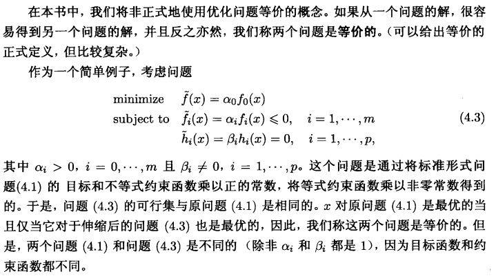
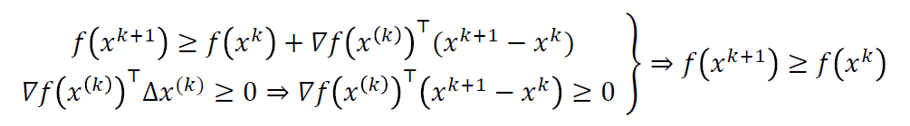

三次作业涵盖范围：

* 第一次：1-3
* 第二次：4；~~**第三题有疑问（已解决）**~~
* 第三次：5-6

# 数学优化

注意优化问题的通式里是没有等号约束的（应该是通过两个不等式约束实现一个等式约束）

| 类型         | 基本形式                                                     | 判断                                                         | 解                       |
| ------------ | ------------------------------------------------------------ | ------------------------------------------------------------ | ------------------------ |
| 最小二乘问题 | $\displaystyle minimize\quad \|Ax-b\|_2^2=\sum_{i=1}^k(a_i^Tx-b_i)^2$ | 目标函数是半正定的二次函数                                   | 有解析解                 |
| 线性规划     | minimize  $\quad c^{T} x$ subject to $\quad a_{i}^{T} x \leq b_{i}, \quad i=1, \ldots, m$ 其中 $c, a_{1}, \ldots, a_{m} \in \mathbf{R}^{n}, b_{1}, \ldots, b_{m} \in \mathbf{R}$ | 比最小二乘法更复杂，但仅需要一些标准的技巧 我们甚至可以通过程序半自动地识别。 | 可靠、高效、成熟         |
| 凸优化       | 目标和不等式约束函数是凸函数 等式约束是仿射函数           | 困难，需要更多技巧                                           | 可靠、高效、**但不成熟** |

非凸优化：

* 局部优化，放弃全局性，找到一个点 $x$ ，这个点在它周围的满足约束的点中使 $f_0(x)$ 最小
* 全局优化，放弃效率

**在非凸问题中运用凸优化**

* **为局部优化选取初始值**。将非凸问题**近似**为凸优化问题，将其精确解作为非凸问题的局部优化算法的初始值、
* **非凸优化中的凸启发式算法**（Convex heuristics for nonconvex optimization）
* **给出全局优化的下界**（Bounds for global optimization）。包括**松弛算法**（Relaxation），**Lagrange松弛**（Lagrangian relaxation）

# 凸集

## 凸集和仿射集

如果通过集合 $C \subseteq R^n$ 中任意两个不同点的**线段**仍然在 $C$ 中，那么称集合 $C$ 是**凸集**

即 $\forall x_1,x_2\in C,\forall \theta\in R,\quad0\leqslant\theta\leqslant1\Rightarrow\theta x_1+(1-\theta)x_2\in C$

空集、单点集是仿射的、凸的

仿射集合与凸集的不同：凸集限制了 $0\leqslant\theta\leqslant1$，而仿射不限制。即凸集要求线段仍在集合中，仿射集要求直线在集合中

仿射集与线性方程组的解一一对应

仿射组合/凸组合就是拓展到多个点

凸组合的概念可以拓展到无穷级数、积分、（大多数形式的）概率分布

### 仿射包

称集合 $C \subseteq R^n$ 中的点的**所有仿射组合组成的集合为 $C$ 的仿射包**，记为 $\operatorname{aff} C$

$\operatorname{aff} C=\{\theta_1x_1+\cdots+\theta_kx_k|\theta_1+\cdots+\theta_k=1,\quad x_1,\cdots,x_k\in C\}$

**仿射包是包含 $C$ 的最小的仿射集合**

定义 $C$ 的**仿射维数**(Affine dimension)为其仿射包的维数

* **仿射维数与其他维数定义可能不相容**，如 $R^2$ 上的单位圆维数为1，仿射维数为2

如果集合 $C \subseteq R^n$ 的仿射维数小于 $n$ ，那么这个集合在仿射集合 $\operatorname{aff} C\ne R^n$ 中，我们定义 $C$ 的**相对内部**为其相当于 $\operatorname{aff} C$ 的内部，记为 $\operatorname{relint} C$
* 即 $\operatorname{relint} C=\{x\in C|\exist r>0,(B(x,r)\cap\operatorname{aff} C)\subseteq C\}$

> 作为一个例子，可以考虑 $R^3$ 空间中的二维圆盘

**凸包同理**

### ==凸优化的一阶条件==

假设 $f_0$ 是可微的，而可行集 $X$ 是凸集

* 如果 $x^*$ 是 $f_0$ 在 $X$ 上的局部极小值，那么有 $\nabla f_0(x^*)^T(x-x^*)\geq0,\forall x\in X$
* 如果 $f_0$ 是凸的，那么上述条件还是充分的

## 锥

### 锥 (Cone)

若 $\forall x\in C,\forall\theta>0,\quad\theta x\in C$ 则称 $C$ 为**锥**

**凸锥**：$\forall x_1,x_2\in C,\forall\theta_1,\theta_2\geqslant0,\quad\theta_1 x_1+\theta_2 x_2\in C$

#### 锥组合 (conic combination)

若集合 $C$ 是凸锥，对于 $\theta_i\geqslant0,\quad x_1,\cdots,x_k\in C$

其**锥组合**为 $\theta_1x_1+\cdots+\theta_kx_k\in C$

**可以拓展到无穷级数和积分中**

#### 锥包

$\{\theta_1x_1+\cdots+\theta_kx_k|\theta_i\geqslant0,\quad x_1,\cdots,x_k\in C\}$

它是包含 $C$ 的最小凸锥

### ==真锥==

称锥 $K\subseteq \boldsymbol{R}^{n}$ 为**正常锥**，如果它满足下列条件：

* $K$ 是凸的
* $K$ 是闭的（单边区间 $[0,\infty)$ 是闭集）
* $K$ 是实的，即具有非空内部
* $K$ 是尖的，即不包含直线（$x\in K,-x\in K\Rightarrow x=0$）

正常锥 $K$ 可以用来定义广义不等式

### 广义不等式

广义不等式是 $\boldsymbol{R}^{n}$ 上的偏序关系，它和 $\boldsymbol{R}$ 准序有很多相同的性质。

对于正常锥 $K$ ，定义 $\boldsymbol{R}^{n}$ 上的偏序关系如下：

$x\preceq_K y\Leftrightarrow y-x\in K$

$x\prec_K y\Leftrightarrow y-x\in \boldsymbol{\operatorname{int}}K$ 

广义不等式 $\preceq_K$ 具有如下性质：

1. **对加法保序**：若有 $x\preceq_K y,u\preceq_K v$ ，则 $x+u\preceq_K y+v$
2. **传递性**：若有 $x\preceq_K y,y\preceq_K z$ ，则 $x\preceq_K z$
3. **对非负数乘保序**：若有 $x\preceq_K y,\alpha\geqslant 0$ ，则 $\alpha x\preceq_K \alpha y$
4. **自反性**：$\forall x,x\preceq_K x$
5. **反对称**：若有 $x\preceq_K y,y\preceq_K x$ ，则 $x=y$
6. **对极限运算保序**：若对于 $i=1,2,\cdots$ 均有 $x_i\preceq_K y_i$ ，且 $\displaystyle \lim_{i\to\infty}x_i=x,\;\lim_{i\to\infty}y_i=y$ 则 $x\preceq_K y$

#### 与普通不等式的区别

最明显的区别在于， $\boldsymbol{R}$ 上的 $\geqslant$ 是一个**线性序**，即任意两点是**可比**的。

这导致最大、最小这些概念在广义不等式环境下变得复杂

### 对偶锥

令 $K$ 为一个锥。

集合 $K^*=\{y\;|\;\forall x\in K,\;x^Ty\geqslant0\}$ 称为 $K$ 的**对偶锥**

$K^*$ 是一个锥，而且它总是凸的（即使 $K$ 不是凸锥）

几何上，$y\in K^*$ 当且仅当 $-y$ 是 $K$ 在原点的一个支撑超平面的法线

## 超平面

超平面和半空间都是凸集

### 超平面

**超平面**指 $\{x|a^Tx=b\}$ ，其中 $a\in R^n,a\ne0,b\in R$

* 超平面是一个线性方程组的解空间
* 超平面可以解释为与向量 $a$ 内积为常数的点的集合
* 超平面可以解释为法线方向为 $a$ 的超平面，$b$ 为其从原点的偏移
* 另一种写法：$\{x|a^T(x-x_0)=0\}$，也可以简写为 $x_0+a^\perp$
* 超平面是仿射的，当然也是凸的

### 半空间

一个超平面将全空间 $R^n$ 划分为两个半空间。

（闭的）**半空间**指 $\{x|a^Tx\leqslant b\}$ ，其中 $a\in R^n,a\ne0,b\in R$

* 半空间是凸的，**但不是仿射的**
* 也可以表示为 $\{x|a^T(x-x_0)\leqslant 0\}$
* 半空间可以解释为由 $x_0$ 加上与向量 $a$ 成钝角（或直角）的向量的集合
* 半空间的边界是超平面
* **开半空间**指 $\{x|a^Tx< b\}$，它是半空间的内部

### 超平面分离定理 (Separating Hyperplane Theorem)

对于不相交的两个凸集 $C,D,\quad \exist a\ne 0,b$ 使得对于所有 $x\in C$ 有 $a^Tx\leqslant b$  ，对于所有 $x\in D$ 有 $a^Tx\geqslant b$ 

换言之，使得仿射函数 $f(x)=a^Tx-b$ 在 $C$ 中非正，在 $D$ 中非负

超平面 $\{x\;|\;a^Tx=b\}$ 称为 $C,D$ 的**分离超平面**，或称它**分离**了 $C,D$ 

**严格分离不允许等于，两个凸集一定有分离超平面，但不一定有严格分离超平面**

#### 超平面分离定理的逆定理 (Converse separating hyperplane theorems)

直接的逆定理并不成立，但是如果给 $C,D$ 添加一些条件可以成立

任意两个凸集 $C,D$ ，如果其中**至少一个是开集**，那么当且仅当存在分离超平面时，它们不相交。

### 支撑超平面 (Supporting Hyperplanes)

设 $C \subseteq \boldsymbol{R}^n$ 而 $x_0$ 是其边界 $\boldsymbol{\operatorname{bd}} C$ 上的一点，即 $x_0\in \boldsymbol{\operatorname{bd}} C=\boldsymbol{\operatorname{cl}} C\;\backslash\boldsymbol{\operatorname{int}} C$

如果 $a\ne 0, \; \forall x\in C.(a^Tx\leqslant a^Tx_0)$ ，那么超平面 $\{x\;|\;a^Tx= a^Tx_0\}$ 称为集合 $C$ 在点 $x_0$ 处的**支撑超平面**

可以理解为几何上的切平面

#### 支撑超平面定理 (Supporting Hyperplane Theorem)

对于任意**非空凸集** $C$ 和任意的 $x_0\in \boldsymbol{\operatorname{bd}} C$ ，在 $x_0$ 处存在 $C$ 的支撑超平面

#### 不完全的逆定理

如果一个集合是**闭的**，具有**非空内部**，且边界上每个点都存在支撑超平面，那么它是凸的

## ==保凸运算==

* 交集

* 仿射函数 $f(x)=Ax+b$

* 和：$S_1+S_2=\{x+y|\;x\in S_1,y\in S_2\}$

* 部分和：$\{(x,y_1+y_2)\;|\;(x,y_1)\in S_1,(x,y_2)\in S_2,x\in R^n,y_i\in R^m\}$

* 直积（笛卡尔积）：$S_1\times S_2=\{(x_1,x_2)\;|\;x_1\in S_1,x_2\in S_2\}$

* 透视函数， $P:\boldsymbol{R}^{n+1}\to\boldsymbol{R}^{n},\; P(z,t)=z/t$

* 线性分式函数

  * 对于仿射函数 $g:\boldsymbol{R}^{n}\to\boldsymbol{R}^{m+1},g(x)=\begin{bmatrix}A\\c^T\end{bmatrix}x+\begin{bmatrix}b\\d\end{bmatrix}$

    其中 $A\in \boldsymbol{R}^{m\times n},b\in \boldsymbol{R}^m,c\in \boldsymbol{R}^n,d\in\boldsymbol{R}$

    则 $f=P\circ g$（$f:\boldsymbol{R}^{n}\to\boldsymbol{R}^{m}$）为**线性分式**（或**投射**）**函数**

    即 $\displaystyle f(x)=\frac{Ax+b}{c^T+d},\quad\operatorname{dom} f=\{x|c^Tx+d>0\}$

# 凸函数

## 凸函数

$f:\boldsymbol R^n\to\boldsymbol R$ 是凸函数当且仅当其同时满足：

* 定义域 $\operatorname{dom}f$ 是凸集
* $\forall \theta\in[0,1],\;x,y\in \operatorname{dom}f$ 有 $f(\theta x+(1-\theta)y)\leqslant \theta f(x)+(1-\theta)f(y)$

$f$ 是凹函数当且仅当 $-f$ 是凸函数

$f$ 是仿射函数当且仅当它既是凸函数也是凹函数

### 判定条件

#### 零阶

即为其定义：$\forall \theta\in[0,1]$ ，有 $f(\theta x+(1-\theta)y)\leqslant \theta f(x)+(1-\theta)f(y)$

**一个函数是凸函数当且仅当它被限制到任意与定义域相交的直线上时是凸函数**

> 即对于任意的 $x\in \operatorname{dom}f,v\in\boldsymbol R^n,t\in\boldsymbol R,x+tv\in\operatorname{dom}f$，有：
>
> $f$ 是凸函数当且仅当 $g(t)=f(x+tv)$ 是凸函数

使用：把 $x=x_0+tv$ 代入，这里只有 $t\in R$ 是变量

#### 一阶

假设 $f$​ 可微（即其梯度 $\triangledown f$​ 在开集 $\operatorname{dom}f$​ 上处处存在），则函数 $f$​​ 是凸函数当且仅当同时满足：

* $\operatorname{dom}f$ 是凸集
* $\forall x,y\in\operatorname{dom}f,\quad f(y)\geqslant f(x)+\triangledown f(x)^T (y-x)$

对于严格凸有同样的充分必要条件，将 $\geqslant$ 换成 $>$​ 即可​

#### 二阶

若 $f$​ 二阶可微（即其Hessian矩阵或二阶导数 $\triangledown^2 f$​ 在开集 $\operatorname{dom}f$​​​ 上处处存在），则函数 $f$ 是凸函数当且仅当其同时满足：

* $\operatorname{dom}f$​ 是凸集
* $\forall x\in\operatorname{dom}f,\quad \triangledown^2 f(x)\geqslant 0$​

**注意**：$\triangledown^2 f(x)> 0\Rightarrow f$​ 是严格凸函数，**反之不然**

* 例如 $f(x)=x^4$​ 是严格凸函数但 $f''(0)=0$

条件一是必要的，反例如 $\displaystyle f(x)=\frac{1}{x^2}$

### 保凸操作

#### 1 非负加权求和

**所有凸函数的集合是一个凸锥**

凸函数的非负加权求和是凸函数

凹函数的非负加权求和是凹函数

严格凸（凹）函数的正加权求和是严格凸（凹）函数

**可以拓展到无限级数和积分**

#### 2 复合仿射映射 (Composition with an affine mapping)

对于 $f:\boldsymbol R^n\to\boldsymbol R,\;A\in \boldsymbol R^{n\times m},\;b\in\boldsymbol R^n$

定义 $g:\boldsymbol R^n\to\boldsymbol R$ 为 $g(x)=f(Ax+b),\quad\operatorname{dom}g=\{x\;|\; Ax+b\in\operatorname{dom}f\}$

如果 $f$ 是凸（凹）函数，则 $g$​ 也是凸（凹）函数

#### 3 逐点最大函数

如果函数 $f_1,f_2$​​ 均为凸函数，则二者的**逐点最大函数** $f$​​ 定义为 

$f(x)=\max\{f_1(x),f_2(x)\},\quad\operatorname{dom}f=\operatorname{dom}f_1\cap\operatorname{dom}f_2$

逐点最大函数 $f$​​ 也是凸函数

易证有限个凸函数函数的逐点最大函数也是凸函数

#### 4 逐点上确界函数

逐点最大的性质可以**拓展至无限个**凸函数的逐点上确界。

如果对于 $\forall y\in \mathcal{A}$，$f(x,y)$​​ 关于 $x$​​ 都是凸的​，则函数 $\displaystyle g(x)=\sup_{y\in\mathcal{A}}f(x,y)$ 关于 $x$ 也是凸的。

其中 $\operatorname{dom}g=\{x\;|\;(x,y)\in \operatorname{dom}f,\;\forall y\in \mathcal{A},\;\displaystyle\sup_{y\in\mathcal{A}}f(x,y)<\infty\}$

类似地，一系列凹函数的逐点下确界仍然是凹函数

#### 5 复合

给定函数 $h:\boldsymbol R^k\to\boldsymbol R$​​ 和 $g:\boldsymbol R^n\to\boldsymbol R^k$​​，定义复合函数 $f=h\circ g:\boldsymbol R^n\to\boldsymbol R$​​ 为：

$f(x)=h(g(x)),\quad\operatorname{dom}f=\{x\in\operatorname{dom}g\;|\;g(x)\in \operatorname{dom}h\}$

标量复合：

| $h$ 的凸性 | 拓展值延伸 $\tilde{h}$​ 的增减性 | $g$ 的凸性 | $f$​ 的凸性 |
| :--------: | :-----------------------------: | :--------: | :--------: |
|     凸     |              非减               |     凸     |     凸     |
|     凸     |              非增               |     凹     |     凸     |
|     凹     |              非减               |     凹     |     凹     |
|     凹     |              非增               |     凸     |     凹     |

矢量复合：

| $h$ 的凸性 | $h$ 在每个维度分量上 | $g_i$​ 的凸性 | $f$​ 的凸性 |
| :--------: | :------------------: | :----------: | :--------: |
|     凸     |         非减         |      凸      |     凸     |
|     凸     |         非增         |      凹      |     凸     |
|     凹     |         非减         |      凹      |     凹     |

#### 6 最小化

如果 $f$ 关于 $(x,y)$ 是凸函数，集合 $C$ 是非空凸集

定义函数 $\displaystyle g(x)=\inf_{y\in C}f(x,y),\quad\operatorname{dom}g=\{x|\exist\, y\in C.((x,y)\in \operatorname{dom}f)\}$​

若存在某个 $x$ 使得 $g(x)>-\infty$（该条件意味着对于所有 $x$，$g(x)>-\infty$）

则函数 $g$ 关于 $x$ 是凸函数

#### 7 透视函数

给定函数 $f:\boldsymbol R^n\to\boldsymbol R$，则其透视函数 $g:\boldsymbol R^{n+1}\to\boldsymbol R$ 定义为

$g(x,t)=tf(x/t),\quad\operatorname{dom}g=\{(x,t)\;|\;x/t\in\operatorname{dom}f,t>0\}$

透视运算是保凸运算：

* 如果 $f$ 是凸函数，则 $g$ 也是凸函数
* 如果 $f$ 是凹函数，则 $g$ 也是凹函数

## 共轭函数

设函数 $f: \mathbf{R}^{n} \rightarrow \mathbf{R}$, 定义函数 $f^{*}: \mathbf{R}^{n} \rightarrow \mathbf{R}$ 为
$$
f^{*}(y)=\sup _{x \in \operatorname{dom} f}\left(y^{T} x-f(x)\right)
$$
此函数称为函数 $f$ 的共轭函数。使上述上确界有限, 即差值 $y^{T} x-f(x)$ 在 $\operatorname{dom} f$ 有 上界的所有 $y \in \mathbf{R}^{n}$ 构成了共轭函数的定义域。图3.8描述了此定义。

常见共轭函数：

## 拟凸函数

设函数 $f: S \rightarrow \mathbb{R}$ 定义在实向量空间的凸子集 $S$ 上。

我们称 $f$ 是拟凸的，如果对任意的 $x, y \in S$ 和 $\lambda \in[0,1]$ 都有 $f(\lambda x+(1-\lambda) y) \leq \max \{f(x), f(y)\}$ 。

另一种等价的定义则是任何的 $S_{\alpha}(f)=\{x \mid f(x) \leq \alpha\}$ 都是凸集。

如果有 $f(\lambda x+(1-\lambda) y)<\max \{f(x), f(y)\}$ ，则称 $f$ 是严格拟凸的。

类似地，可以定义拟凹函数和严格拟凹函数。我们称 $f$ 是拟凹的，如果对任意的 $x, y \in S$ 和 $\lambda \in[0,1]$ 都有 $f(\lambda x+(1-\lambda) y) \geq \min \{f(x), f(y)\}$ 。（等价于 $-f$ 是拟凸的）

如果一个函数既是拟凸的又是拟凹的，则称其为拟线性的。

**凸函数一定是拟凸函数，但反之则不然**

例子：$\text{ceil}(x)=\inf\{z\in Z| z\geq x\}$，这是一个拟线性的函数

### 一阶条件

若一阶可导有 $\forall x,y\in\operatorname{dom}f,\quad f(y)\leqslant f(x)\Rightarrow\triangledown f(x)^T (y-x)\leqslant 0$ 

### 二阶条件

斜率为 $0$ 的点，二阶导非负

### 保拟凸操作

* 非负加权最大

* 复合

  

* 最小化

# 等价问题

原问题：

* 变量代换（要全部换掉）
* 目标和约束函数代换
  * 在目标函数和每个不等式约束外面套一个**单增**的函数进行复合，函数可以不一样
  * 在每个等式约束外面套一个函数进行复合，该函数满足当且仅当自变量为 $0$ 时值为 $0$ ，可以不同
* 松弛变量：消去复杂的不等式约束
  * $f_i(x)\leq 0$ 等价于存在 $s_i\geq0$ 满足 $f_i(x)+s_i=0$
  * 这样将一个复杂的不等式约束变成一个简单的不等式约束和一个等式约束
  * $s_i$ 称为松弛变量
* 消除等号约束
  * 如果存在函数 $\Phi(z)$，使得 $\forall i,h_i(x)=0$ 等价于 $x=\Phi(z)$，那么可以进行变量代换并删去等号约束
  * 例如消除线性等号约束：
* 引入等号约束
  * 
* 优化部分变量：如果每个约束函数只和部分变量有关，以至于可以将其分成两个问题，可以这样做
* 上境图形式：将目标函数改成 $t$ ，添加约束 $f_0(x)-t\leq0$
* 显性和隐性约束：约束条件放在定义域里和放在约束函数里是一样的

## 凸优化

* 目标函数是凸的
* 不等式约束函数是凸的
* 等式约束函数是仿射的（$h_i(x)=a^T_ix-b_i$）

可以注意到，凸优化的可行集是凸的，我们是在一个凸集上极小化一个凸的目标函数

如果 $f_{0}$ 是拟凸而非凸的，且满足条件二三，称为拟凸优化问题

凸和拟凸优化的 $\epsilon$-次优集是凸的

> 回顾： $\epsilon$-次优解是无法达到优化变量时，近似的可行解 $x$，$f_0(x)\leq p^*+\varepsilon$。

基础性质：其任意局部最优解也是 (全局) 最优解

# 对偶函数

定义 Lagrange对偶函数 (或对偶函数) $g: \mathbf{R}^{m} \times \mathbf{R}^{p} \rightarrow \mathbf{R}$ 为 Lagrange 函数 $L$ 关于 $x$ 取得的最小值: 即对 $\lambda \in \mathbf{R}^{m}, \nu \in \mathbf{R}^{p}$, 有
$$
g(\lambda, \nu)=\inf _{x \in \mathcal{D}} L(x, \lambda, \nu)=\inf _{x \in \mathcal{D}}\left(f_{0}(x)+\sum_{i=1}^{m} \lambda_{i} f_{i}(x)+\sum_{i=1}^{p} \nu_{i} h_{i}(x)\right)
$$

如果 Lagrange 函数关于 $x$ 无下界，则对偶函数取值为 $-\infty$。

如果是把 Lagrange 函数作为目标函数，那么定义域为其关于 $x$ 有下界的集合

即对任意 $\lambda \succeq 0$ 和 $\nu$ 成立：$g(\lambda, \nu) \leqslant p^{\star}$

因为对偶函数是一族关于 $(\lambda,\nu)$ 的仿射函数的逐点下确界，所以对偶函数一定是凹的（无论原问题是不是凸的）

利用函数 $f_{0}$ 的共轭函数 $f_0^*(y)=\displaystyle \sup_{x\in dom f} (y^Tx-f(x))$ 可以转化对偶函数

例如对于：
$$
\begin{array}{ll}
\operatorname{minimize} & f_{0}(x) \\
\text { subject to } & A x \preceq b \\
& C x=d
\end{array}
$$

我们可以将对偶函数表述为
$$
\begin{aligned}
g(\lambda, \nu) &=\inf _{x}\left(f_{0}(x)+\lambda^{T}(A x-b)+\nu^{T}(C x-d)\right) \\
&=-b^{T} \lambda-d^{T} \nu+\inf _{x}\left(f_{0}(x)+\left(A^{T} \lambda+C^{T} \nu\right)^{T} x\right) \\
&=-b^{T} \lambda-d^{T} \nu-f_{0}^{*}\left(-A^{T} \lambda-C^{T} \nu\right)
\end{aligned}
$$

## 对偶问题

对于任意一组 $(\lambda, \nu)$, 其中 $\lambda \succeq 0$, Lagrange 对偶函数给出了优化问题 (5.1) 的最 优值 $p^{\star}$ 的一个下界。因此, 我们可以得到和参数 $\lambda 、 \nu$ 相关的一个下界。

一个自然的问题是：从 Lagrange 函数能够得到的最好下界是什么?

可以将这个问题表述为优化问题
$$
\begin{array}{ll}
\operatorname{maximize} & g(\lambda, \nu) \\
\text { subject to } & \lambda \succeq 0
\end{array}
$$
其定义域是 $\operatorname{dom} g=\{(\lambda, \nu) \mid g(\lambda, \nu)>-\infty\}$

上述问题称为问题 (5.1) 的Lagrange 对偶问题。在本书中, 原始问题 (5.1) 有时被称为原问题。

前面提到的对偶可行的概念, 即描述满足 $\lambda \succeq 0$ 和 $g(\lambda, \nu)>-\infty$ 的一组 $(\lambda, \nu)$, 此时具有意义。它意味着, 这样的一组 $(\lambda, \nu)$ 是对偶问题 (5.16) 的一个可行解。 

称解 $\left(\lambda^{\star}, \nu^{\star}\right)$ 是对偶最优解或者是最优 Lagrange 乘子, 如果它是对偶问题 (5.16) 的最优解。

**Lagrange 对偶问题 (5.16) 是一个凸优化问题**, 这是因为极大化的目标函数是凹函数, 且约束集合是凸集。

因此, **对偶问题的凸性和原问题 (5.1) 是否是凸优化问题无关**。

### 强弱对偶性

Lagrange 对偶问题的**最优值**, 我们用 $d^{\star}$ 表示, 根据定义, 这是通过 Lagrange 函数得到的原问题最优值 $p^{\star}$ 的最好下界。

* 弱对偶性，都具有的：$d^{\star} \leqslant p^{\star}$
* 强对偶性：$d^{\star}=p^{\star}$ ，即对偶间隙为 $0$，需要证明
  * 对于凸问题，强对偶性通常但不总是成立（需要有至少一个可行点才成立）

#### Slater条件

如果原问题是凸问题，即它可以表示为：
$$
\begin{array}{ll}
\text { minimize } & f_{0}(x) \\
\text { subject to } & f_{i}(x) \leqslant 0, \quad i=1, \cdots, m, \\
& A x=b,
\end{array}
$$
而且存在一点 $x \in$ relint $\mathcal{D}$ 使得 $f_{i}(x)<0, \quad i=1, \cdots, m, \quad A x=b$

那么强对偶性成立

**人话：如果一个凸问题有可行点，那么强对偶性成立**

## KKT 最优性条件

现在假设函数 $f_{0}, \cdots, f_{m}, h_{1}, \cdots, h_{p}$ **可微** (因此定义域是开集), 但是并**不假设这些函数是凸函数**。

### 非凸问题的 KKT 条件

和前面一样, 令 $x^{\star}$ 和 $\left(\lambda^{\star}, \nu^{\star}\right)$ 分别是原问题和对偶问题的某对最优解, 对偶间隙为零。因为 $L\left(x, \lambda^{\star}, \nu^{\star}\right)$ 关于 $x$ 求极小在 $x^{\star}$ 处取得最小值, 因此函数在 $x^{\star}$ 处的导数 必须为零, 即,
$$
\nabla f_{0}\left(x^{\star}\right)+\sum_{i=1}^{m} \lambda_{i}^{\star} \nabla f_{i}\left(x^{\star}\right)+\sum_{i=1}^{p} \nu_{i}^{\star} \nabla h_{i}\left(x^{\star}\right)=0
$$
因此, 我们有
$$
\begin{aligned}
f_{i}\left(x^{\star}\right) \leqslant 0, & i=1, \cdots, m \\
h_{i}\left(x^{\star}\right)=0, & i=1, \cdots, p \\
\lambda_{i}^{\star} \geqslant 0, & i=1, \cdots, m \\
\lambda_{i}^{\star} f_{i}\left(x^{\star}\right)=0, & i=1, \cdots, m \\
\nabla f_{0}\left(x^{\star}\right)+\sum_{i=1}^{m} \lambda_{i}^{\star} \nabla f_{i}\left(x^{\star}\right)+\sum_{i=1}^{p} \nu_{i}^{\star} \nabla h_{i}\left(x^{\star}\right)=0, &
\end{aligned}
$$
我们称上式为 Karush-Kuhn-Tucker (KKT) 条件。

总之, 对于目标函数和约束函数可微的任意优化问题, **如果强对偶性成立, 那么任何一对原问题最优解和对偶问题最优解必须满足 KKT 条件**。

**这是强对偶性的必要条件**

### 凸问题的 KKT 条件

当原问题是凸问题时, 满足 KKT 条件的点也是原、对偶最优解。换言之, 如果函 数 $f_{i}$ 是凸函数, $h_{i}$ 是仿射函数, $\tilde{x}, \tilde{\lambda}, \tilde{\nu}$ 是任意满足 KKT 条件的点,
$$
\begin{aligned}
f_{i}(\tilde{x}) \leqslant 0, & i=1, \cdots, m \\
h_{i}(\tilde{x})=0, & i=1, \cdots, p \\
\tilde{\lambda}_{i} \geqslant 0, & i=1, \cdots, m \\
\tilde{\lambda}_{i} f_{i}(\tilde{x})=0, & i=1, \cdots, m \\
\nabla f_{0}(\tilde{x})+\sum_{i=1}^{m} \tilde{\lambda}_{i} \nabla f_{i}(\tilde{x})+\sum_{i=1}^{p} \tilde{\nu}_{i} \nabla h_{i}(\tilde{x})=0, &
\end{aligned}
$$
那么 $\tilde{x}$ 和 $(\tilde{\lambda}, \tilde{\nu})$ 分别是原问题和对偶问题的最优解, 对偶间隙为零。

也就是说，**如果是凸问题，KKT是强对偶性的充要条件，任何一个满足KKT条件的点是最优解**

为了说明这一点, 注意到前两个条件说明了 $\tilde{x}$ 是原问题的可行解。因为 $\tilde{\lambda}_{i} \geqslant$ $0, L(x, \tilde{\lambda}, \tilde{\nu})$ 是 $x$ 的凸函数; 最后一个 KKT 条件说明在 $x=\tilde{x}$ 处, Lagrange 函数的导 数为零。因此, $L(x, \tilde{\lambda}, \tilde{\nu})$ 关于 $x$ 求极小在 $\tilde{x}$ 处取得最小值。我们得出结论
$$
\begin{aligned}
g(\tilde{\lambda}, \tilde{\nu}) &=L(\tilde{x}, \tilde{\lambda}, \tilde{\nu}) \\
&=f_{0}(\tilde{x})+\sum_{i=1}^{m} \tilde{\lambda}_{i} f_{i}(\tilde{x})+\sum_{i=1}^{p} \tilde{\nu}_{i} h_{i}(\tilde{x}) \\
&=f_{0}(\tilde{x})
\end{aligned}
$$
最后一行成立是因为 $h_{i}(\tilde{x})=0$ 以及 $\tilde{\lambda}_{i} f_{i}(\tilde{x})=0$ 。这说明原问题的解 $\tilde{x}$ 和对偶问题的 解 $(\tilde{\lambda}, \tilde{\nu})$ 之间的对偶间隙为零, 因此分别是原、对偶最优解。总之, **对目标函数和约束函数可微的任意凸优化问题, 任意满足 KKT 条件的点分别是原、对偶最优解, 对偶间隙为零**。

**若某个凸优化问题具有可微的目标函数和约束函数, 且其满足 Slater 条件, 那么 KKT 条件是最优性的充要条件**: Slater 条件意味着最优对偶间隙为零且对偶最优解可以达到, 因此 $x$ 是原问题最优解, 当且仅当存在 $(\lambda, \nu)$, 二者满足 KKT 条件。

KKT 条件在优化领域有着重要的作用。在一些特殊的情形下, 是可以解析求解 KKT 条件的 (也因此可以求解优化问题)。更一般地, 很多求解凸优化问题的方法可以认为或者理解为求解 KKT 条件的方法。

# 范数近似

基本、罚函数逼近、带约束

## 基本

最简单的范数逼近问题是具有下列形式的**无约束**问题
$$
\text { minimize }\|A x-b\|\quad\quad\quad\quad\quad(6.1)
$$
其中 $A \in \mathbf{R}^{m \times n}$ 和 $b \in \mathbf{R}^{m}$ 是问题的数据, $x \in \mathbf{R}^{n}$ 是变量, 而 $\|\cdot\|$ 是 $\mathbf{R}^{m}$ 上的一种范 数。范数逼近问题的解有时又被称为 $A x \approx b$ 在范数 $\|\cdot\|$ 下的近似解。向量
$$
r=A x-b
$$
称为这个问题的**残差**; 其分量有时也称为关于 $x$ 的个体残差。

范数逼近问题 (6.1) 是一个可解的凸问题, 也就是说, 总是存在至少一个最优解。 

当且仅当 $b \in \mathcal{R}(A)$ 时, 其最优值为零; 但是, 更有趣也更有用的是 $b \notin \mathcal{R}(A)$ 的情况。

我们可以不失一般性地假设 $A$ 的列向量独立; 特别地, 设 $m \geqslant n$ 。当 $m=n$ 时, 最优 解 $A^{-1} b$ 可以简单地得到, 因此我们可以假设 $m>n$ 。

## 罚函数逼近

对于 $1 \leqslant p<\infty, \ell_{p}$ 范数逼近问题的目标函数为
$$
\left(\left|r_{1}\right|^{p}+\cdots+\left|r_{m}\right|^{p}\right)^{1 / p}
$$
如同最小二乘问题一样, 我们可以考虑目标函数为
$$
\left|r_{1}\right|^{p}+\cdots+\left|r_{m}\right|^{p}
$$
的等价问题, 这一目标函数是残差的可分、对称函数。特别地, 目标函数值仅取决于残 差的幅值分布, 即排序的残差。
我们将考虑 $\ell_{p}$-范数逼近问题的一个有用推广, 其目标函数仅仅取决于残差的幅值 分布。这个罚函数逼近问题具有形式
$$
\begin{array}{ll}
\text { minimize } & \phi\left(r_{1}\right)+\cdots+\phi\left(r_{m}\right) \quad\quad\quad\quad\quad(6.2)\\
\text { subject to } & r=A x-b,
\end{array}
$$
其中 $\phi: \mathbf{R} \rightarrow \mathbf{R}$ 称为 (残差) 罚函数。设 $\phi$ 为凸函数, 则罚函数逼近问题是一个凸优化 问题。

在很多情况下, 罚函数 $\phi$ 是对称、非负的, 并且满足 $\phi(0)=0$ 。但是, 在我们的 分析中, 并不需要这些性质。

## 最小范数问题

基本的最小范数问题具有下列形式
$$
\begin{array}{ll}
\operatorname{minimize} & \|x\| \\
\text { subject to } & A x=b
\end{array}\quad\quad\quad\quad\quad(6.5)
$$
其中数据为 $A \in \mathbf{R}^{m \times n}$ 和 $b \in \mathbf{R}^{m}$, 变量为 $x \in \mathbf{R}^{n},\|\cdot\|$ 为 $\mathbf{R}^{n}$ 上的一种范数。这个 问题的解称为 $A x=b$ 的最小范数解, 如果 $A x=b$ 有解, 这样的解总是存在的。当然, 最小范数问题是一个凸优化问题。

我们可以不失一般性地假设 $A$ 的行独立, 因此 $m \leqslant n$ 。当 $m=n$ 时, 唯一的可行 解是 $x=A^{-1} b$; 只有当 $m<n$, 即方程 $A x=b$ 不定时, 最小范数问题才有意义。 

通过消去等式约束, 可以将最小范数问题 (6.5) 表示为一个范数逼近问题。令 $x_{0}$ 为 $A x=b$ 的一个任意解, 令 $Z \in \mathbf{R}^{n \times k}$ 的列为 $A$ 的零空间的基。于是, $A x=b$ 的通解可以表示为 $x_{0}+Z u$, 其中 $u \in \mathbf{R}_{\text {。 }}^{k}$ 最小范数问题 $(6.5)$ 可以写为

$$
minimize \left\|x_{0}+Z u\right\|
$$

其变量为 $u \in \mathbf{R}^{k}$, 这是一个范数逼近问题。特别地, (如果演绎正确) 关于范数逼近问题的讨论和分析都可以应用于最小范数问题。

### 线性方程组的最小二乘解

最常见的最小范数问题采用 Euclid 或 $\ell_{2}$-范数。通过将目标函数平方, 我们得到等价问题

$$
\begin{array}{ll}
\operatorname{minimize} & \|x\|^2 \\
\text { subject to } & A x=b
\end{array}
$$

其唯一解称为方程组 $A x=b$ 的最小二乘解。类似最小二乘逼近问题, 这一问题也可以 被解析地求解。引入对偶变量 $\nu \in \mathbf{R}^{m}$, 最优性条件为
$$
2 x^{\star}+A^{T} \nu^{\star}=0, \quad A x^{\star}=b,
$$
这是一组线性方程并容易求解。通过第一个方程, 我们可以得到 $x^{\star}=-(1 / 2) A^{T} \nu^{\star}$; 将 其带入第二个方程, 我们有 $-(1 / 2) A A^{T} \nu^{\star}=b$ 并且得到结论
$$
\nu^{\star}=-2\left(A A^{T}\right)^{-1} b, \quad x^{\star}=A^{T}\left(A A^{T}\right)^{-1} b .
$$
(因为 $\operatorname{rank} A=m<n$, 矩阵 $A A^{T}$ 可逆。) 

## 正则化

### 双准则式

在正则化逼近的基本形式中, 我们的目标是寻找向量 $x$ 使其较小 (如果可能的话), 同时使得残差 $A x-b$ 小。自然地, 这可以描述为双目标的 (凸) 向量优化问题, 这两个目标是 $\|A x-b\|$ 和 $\|x\|$ :

$$
minimize \;(关于 \mathbf{R}_{+}^{2} )\quad (\|A x-b\|,\|x\|)\quad\quad\quad\quad(6.7)
$$

这两个范数可能是不同的: 第一个在 $\mathbf{R}^{m}$ 中, 用以度量残差的规模; 第二个在 $\mathbf{R}^{n}$ 中,用以度量 $x$ 的规模。

### 正则化

正则化是求解双准则问题 (6.7) 的一个常用的标量化方法。正则化的一种形式是极小化目标函数的加权和:

$minimize  \|A x-b\|+\gamma\|x\|$

其中 $ \gamma>0$  为问题参数。当  $\gamma$  在 $ (0, \infty)$  上变化时, (6.8) 的解遍历了最优权衡曲线。

正则化的另一个常用方法是极小化加权范数平方和, 特别是在使用 Euclid 范数的 情形下。这一方法是对变化的 $ \delta>0$  求解

$minimize  \|A x-b\|^{2}+\delta\|x\|^{2}$

欧几里得范数下 $x=\left(A^{T} A+\delta I\right)^{-1} A^{T} b .$

# 投影

在范数 $\|\cdot\|$ 意义下, 点 $x_{0} \in \mathbf{R}^{n}$ 到闭集合 $C \subseteq \mathbf{R}^{n}$ 的距离定义为 $\operatorname{dist}\left(x_{0}, C\right)=\inf \left\{\left\|x_{0}-x\right\| \mid x \in C\right\} .$

这里的极小总是可达的。我们称 $C$ 中每一个最接近 $x_{0}$ 的点 $z$, 即满足 $\left\|z-x_{0}\right\|=$ $\operatorname{dist}\left(x_{0}, C\right)$, 为 $x_{0}$ 在 $C$ 上的投影。一般地, $x_{0}$ 在 $C$ 中可能有多于一个的投影, 即 $C$ 中有多个点都最接近 $x_{0}$ 。

在一些特殊情况下, 我们可以知道点向集合的投影是唯一的。例如, 如果 $C$ 是闭且凸的, 而范数严格凸 (例如, Euclid 范数), 那么, 对于任意 $x_{0}$, 正好存在一个 $z \in C$ 与 $x_{0}$ 最接近。作为一个有趣的逆命题, 我们有下面的结果: 如果对于每一个 $x_{0}$, 在 $C$ 中 都只有唯一的 Euclid 投影, 那么 $C$ 是闭和凸的 (参见习题 8.2)。

我们用符号 $P_{C}: \mathbf{R}^{n} \rightarrow \mathbf{R}^{n}$ 表示函数: $P_{C}\left(x_{0}\right)$ 为 $x_{0}$ 在 $C$ 上的投影, 即对于所有 $x_{0}$,
$$
P_{C}\left(x_{0}\right) \in C, \quad\left\|x_{0}-P_{C}\left(x_{0}\right)\right\|=\operatorname{dist}\left(x_{0}, C\right) .
$$
换言之, 我们有
$$
P_{C}\left(x_{0}\right)=\operatorname{argmin}\left\{\left\|x-x_{0}\right\| \mid x \in C\right\} .
$$
我们称 $P_{C}$ 为向 $C$ 的投影.

## 向凸集投影

如果 $C$ 是凸的, 那么, 我们可以通过凸优化问题计算投影 $P_{C}\left(x_{0}\right)$ 及距离 $\operatorname{dist}\left(x_{0}, C\right)$ 。我们将集合 $C$ 表示为一组线性等式和凸不等式,
$$
A x=b, \quad f_{i}(x) \leqslant 0, \quad i=1, \cdots, m,
$$
然后通过求解关于变量 $x$ 的问题
$$
\begin{array}{ll}
\text { minimize } & \left\|x-x_{0}\right\| \\
\text { subject to } & f_{i}(x) \leqslant 0, \quad i=1, \cdots, m \\
& A x=b,
\end{array}
$$
找到 $x_{0}$ 向 $C$ 的投影。当且仅当 $C$ 非空时, 这个问题可行：当它可行时, 其最优值为 $\operatorname{dist}\left(x_{0}, C\right)$, 并且任意最优解都是 $x_{0}$ 向 $C$ 的投影。

# 强凸性和平滑性

目标函数 $f(x)$ 是强凸的，指存在 $m>0$ 使得 $\nabla^{2} f(x) \succeq m I$ 对任意的 $x \in S$ 都成立。

强凸性能够导致若干有意义的结果：

* 二次下界 $f(y) \geqslant f(x)+\nabla f(x)^{T}(y-x)+\frac{m}{2}\|y-x\|_{2}^{2}$
* 次优解条件：任何梯度足够小的点都是最优解
* $\left\|x-x^{\star}\right\|_{2} \leqslant \frac{2}{m}\|\nabla f(x)\|_{2}$，最优解唯一
* 如果 $m I \preceq \nabla^{2} f(x) \preceq M I$，定义条件数 $\kappa=M / m$

平滑性：$f$ 在 $S$ 上是平滑的，指 $\exist M>0,\forall x\in S,\nabla^{2} f(x) \preceq M I$

*  $p^{\star} \leqslant f(x)-\frac{1}{2 M}\|\nabla f(x)\|_{2}^{2}$
* 强凸性一定有平滑性

# 下降法

本章描述的算法将产生一个优化点列 $x^{(k)}, k=1, \cdots$, 其中 

$$
x^{(k+1)}=x^{(k)}+t^{(k)} \Delta x^{(k)}
$$

并且 $t^{(k)}>0$ (除非 $x^{(k)}$ 已经是最优点)。

* $\Delta x^{(k)}$ 表示 $\mathbf{R}^{n}$ 的 一个向量, 被称为步径或搜索方向 (尽管它不需要具有单位范数)
* $k=0,1, \cdots$ 表 示迭代次数
* $x^{(k)}$ 是迭代器的输出
* 标量 $t^{(k)} \geqslant 0$ 被称为第 $k$ 次迭代的步进或步长 (尽管只有 $\left\|\Delta x^{(k)}\right\|=1$ 时它才等于 $\left.\left\|x^{(k+1)}-x^{(k)}\right\|\right)$ 。

我们有时会省略上标, 用 $x^{+}=x+t \Delta x$ 或 $x:=x+t \Delta x$ 这些简略的符号代替 $x^{(k+1)}=x^{(k)}+t^{(k)} \Delta x^{(k)}$.

我们讨论的所有方法都是下降方法, 只要 $x^{(k)}$ 不是最优点就成立
$$
f\left(x^{(k+1)}\right)<f\left(x^{(k)}\right) .
$$
这意味着对所有的 $k$ 都有 $x^{(k)} \in S$, 后者是初始下水平集, 特别是我们有 $x^{(k)} \in \operatorname{dom} f$ 。

由凸性可知, $\nabla f\left(x^{(k)}\right)^{T}\left(y-x^{(k)}\right) \geqslant 0$ 意味着 $f(y) \geqslant f\left(x^{(k)}\right)$, 因此一个下降方法中的搜索方向必须满足
$$
\nabla f\left(x^{(k)}\right)^{T} \Delta x^{(k)}<0,
$$
即它和负梯度方向的夹角必须是锐角。我们称这样的方向为下降方向 (对于 $x^{(k)}$ 处的 $f$ )。

> 推导（反证法）：
>
> 

下降方法由交替进行的两个步骤构成: 确定下降方向 $\Delta x$, 选择步长 $t$ 。其一般框架如下。

上述第二步选定的 $t$ 将决定从直线 $\left\{x+t \Delta x \mid t \in \mathbf{R}_{+}\right\}$上哪一点开始下一步迭代, 因此被称为**直线搜索**。(准确的术语可能是射线搜索。)

实用的下降方法均有相同的结构, 但组织方式可能不同。例如, 一般在计算下降方向 $\Delta x$ 的同时或之后检验停止准则。停止准则通常根据次优性条件 (9.9) 采用 $\|\nabla f(x)\|_{2} \leqslant \eta$, 其中 $\eta$ 是小正数。

## $t$ 的确定

关键：保证 $f(x+t \Delta x)<f(x)$

* 精确直线搜索：$t=\operatorname{argmin}_{s \geqslant 0} f(x+s \Delta x)$，需要进行最小化，如果新的最小化问题比较简单可以使用
* 回溯直线搜索：$t:=\beta t$ 直到 $f(x+t\Delta x)\leq f(x)+\alpha\nabla f(x)^T\Delta x$
  * 证明：$f(x+t \Delta x) \approx f(x)+t \nabla f(x)^{T} \Delta x<f(x)+\alpha t \nabla f(x)^{T} \Delta x$

## $\Delta x$ 的确定：梯度下降

用负梯度作搜索方向, 即令 $\Delta x=-\nabla f(x)$

