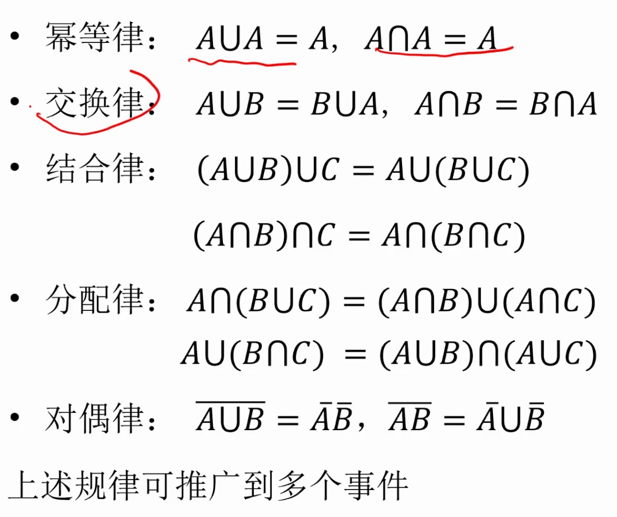
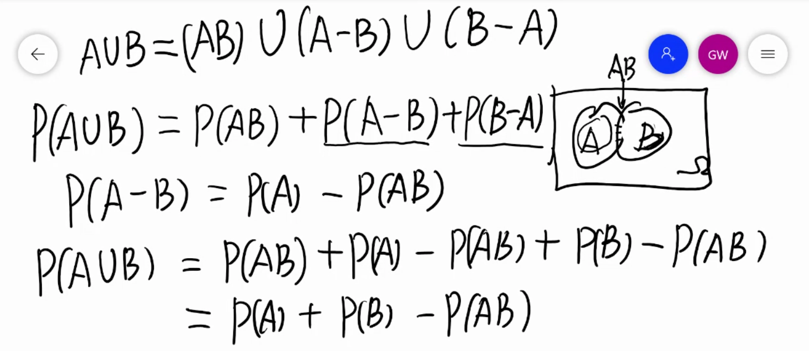

* 必然现象：在一定条件下必然发生的现象，条件完全决定结果
* 随机现象：在一定条件下可能出现、可能不出现，条件不能完全决定结果

## 随机现象

随机现象揭示了条件和结果之间的非确定关系，其数量关系无法用函数确切地描述

在一次观察中有偶然性，多种可能的结果中不能确定是哪一种

大量重复试验或观察中，结果的出现有一定的规律性

**二重性：偶然性与必然性**

* **偶然性：对随机现象做一次观察，观测结果不可预知**
* **必然性：对随机现象做大量观察，观察结果具有一定的规律性，即统计规律性**

定义：

* 试验：对某随机现象的观察或测量等
* 随机试验：具备以下三个特点的实验：
  * 可重复：可在相同条件下重复进行
  * 多结果：结果不止一个，**而且所有可能的结果事先已知**
  * 不确定：试验前无法预测/确定是哪一种结果

## 样本空间

* 样本点：试验的每一种可能结果，记为$\omega$
* 样本空间：试验中所有可能结果组成的集合，是所有样本点的集合，记为$\Omega$
* 随机事件：样本空间的子集，是由单个或多个样本点的集合
  * “随机事件A发生“当且仅当试验的结果是子集A的元素
  * 例如抛两枚骰子，样本点为二维空间中的点，A为点数相同
  * 基本事件：单个样本点构成的集合
  * 必然事件：全集
  * 不可能事件：空集
  * 事件间的关系：
    * 包含（A发生必然B发生，则B包含A）
    * 相等（互相包含）
    * 互斥（互不相容），不能同时发生，交为空集
    * 对立（逆）事件，事件A不发生，记为 $\bar A$ ，交集为空且并集为全集
  * 运算：
    * 并（至少发生一个），记为 $A\cup B$ 或 $\bigcup_{i=1}^n A_i$
    * 积（或交）（全部发生）记为 $A\cap B=AB$ 或 $\bigcap_{i=1}^n A_i$
    * 差：事件A发生而B不发生，记为 $A-B=A-AB=A\bar B=(A\cup B)-B$

### 类型

* 有限样本空间
* 无限可列样本空间
* 不可列样本空间

前两种称为离散样本空间

### 事件的运算律

## 频率与概率

### 频率

相同条件下进行 $n$ 次试验，事件A发生 $n_A$ 次（频数），则事件A发生的频率为 $f_n(A)=\frac{n_A}{n}$ 

频率在一定程度上反映事件发生的可能性

性质：

* $0\leqslant f_n(A)\leqslant1$
* $f_n(\Omega)=1$
* 若 $A_1,A_2\cdots A_k$ 两两互不相容，则 $f_n(A_1\cup \cdots \cup A_k)=\sum_{i=1}^kf_n(A_i)$

频率的随机性：在试验中表现出随机性：

* 同n不同次试验
* 不同n的实验中频率不是常数

频率的稳定性：大量重复试验中，通常在常数 $p$ 附近摆动，随次数增大摆幅越来越小

* 频率的稳定性即统计规律性，是随机事件本身具有的客观属性，这个稳定性可用于度量事件发生的可能性大小

### 概率

大量重复试验中，频率通常在常数 $p$ 附近摆动，随次数增大摆幅越来越小

称常数 $p$ 为时间A发生的概率，记为 $P(A)=p$

性质

* $0\leqslant P(A)\leqslant1$
* $P(\Omega)=1$
* 若 $A_1,A_2\cdots A_k$ 两两互不相容，则 $P(A_1\cup \cdots \cup A_k)=\sum_{i=1}^kP(A_i)$

### 异同

* 概率用于度量事件发生的可能性

* 频率在一定程度上反映了事件发生可能性

* 概率恒定，频率在试验中有随机性

* 若试验次数够多，两者非常接近

* 概率可以通过频率来测量，频率是概率的一个近似

## 概率的公理化定义

问题：概率的统计定义存在数学上的不严谨性，在实际中几乎不可能对每一个事件大量试验

受到频率的稳定性及其性质的启发给出严谨的概率功利化体系

### 公理化定义：

在随机试验的样本空间 $\Omega$ ，对每一个事件 A 赋予一个实数，记为 $P(A)$ ，若满足下列条件，称 $P(A)$ 为 A 发生的概率

* 非负性：$P(A)\geqslant 0$
* 规范性：$P(\Omega)=1$
* 可列可加性：若可列个事件 $A_1,A_2\cdots$ 两两互不相容，则 $P(\bigcup_{i=1}^\infty A_i)=\sum_{i=1}^\infty P(A_i)$

简明扼要地刻画了概率的定义，为现代概率论奠定了基础，是概率论发展历史上的一个里程碑，从此被公认为数学的一个分支

### 性质：

* 不可能事件 $\emptyset$ 有 $P(\emptyset)=0$ （反之不然，例如数轴上取有理数）
  * 证明通过可列可加性，若干不可能事件的并仍是不可能事件，又因每个事件非负，$\infty \cdot p=0\Rightarrow p=0$
  * 可以通过事件推概率，不能通过概率推事件，必然事件也一样
* 有限可加性，即把可列可加性变成有限个
  * 证明：把后面的可列多个用不可能事件填充即可
* 对任意事件A，$P(\bar A)=1-P(A)$，由上条得
* 若 $B\subset A$ ，则 $P(A-B)=P(A)-P(B)$ 且 $P(B)\leqslant P(A)$
  * 证明：$A=B\cup (A-B),\quad(A-B)B=\emptyset,\quad P(A)=P(B)+P(A-B)\geqslant P(B)$
* 对任意事件A，B，有 $P(A-B)=P(A)-P(AB)=P(A\cup B)-P(B)$
  * 证明：$A=(A-B)\cup (AB)$
* 必然事件
* 

### 容斥原理

对任意随机事件A，B有

 $P(A\cup B)=P(A)+P(B)-P(AB)$

证明：

#### 对任意三个随机事件

$P(A\cup B\cup C)=P(A)+P(B)+P(C)-P(AB)-P(BC)-P(AC)+P(ABC)$

证明：

$B\cup C$ 作为一个整体处理

#### 多个事件：

$\displaystyle P(\bigcup_{i=1}^n A_i)=\sum_{i=1}^n P(A_i)-\sum_{i<j}^n P(A_iA_j)+\sum_{i<j<k}^n P(A_iA_jA_k)+\cdots+(-1)^{n-1}P(A_1\cdots A_n)$

简化版：

$\displaystyle P(\bigcup_{i=1}^n A_i)=\sum_{r=1}^n(-1)^{r+1}\sum_{i_1<\cdots i_r}P(A_{i_1}\cdots A_{i_r})$

证明：数学归纳法

### 不等式：

* $\displaystyle P(\bigcup_{i=1}^n A_i)\leqslant \sum_{i=1}^n P(A_i)$   或者写成   $P(\exist i.A_i发生)\leqslant \sum_{i=1}^n P(A_i)$
  * 证明：归纳法
* Bonferroni不等式：对事件 $A_1\cdots A_k$
  * $\displaystyle P(\bigcup_{i=1}^n A_i)\leqslant \sum_{i=1}^n P(A_i)$
  * $\displaystyle P(\bigcup_{i=1}^n A_i)\geqslant \sum_{i=1}^n P(A_i)-\sum_{i<j}^n P(A_iA_j)$
  * $\displaystyle P(\bigcup_{i=1}^n A_i)\leqslant \sum_{i=1}^n P(A_i)-\sum_{i<j}^n P(A_iA_j)+\sum_{i<j<k}^n P(A_iA_jA_k)$
  * 以此类推

