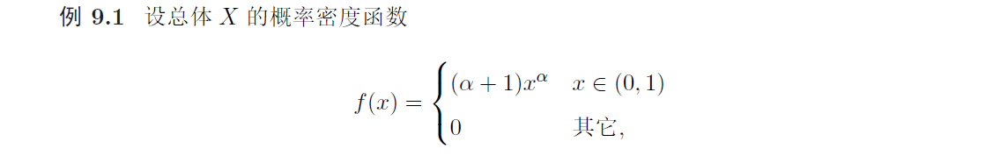
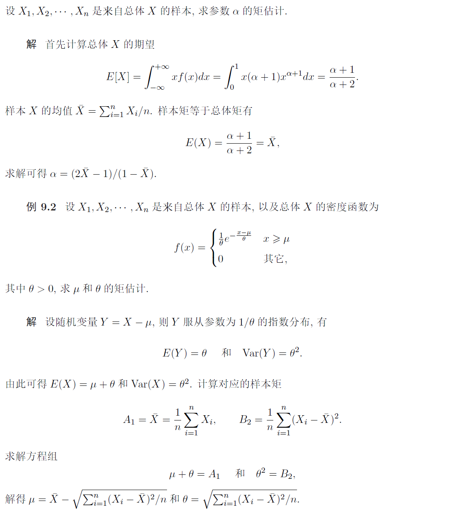
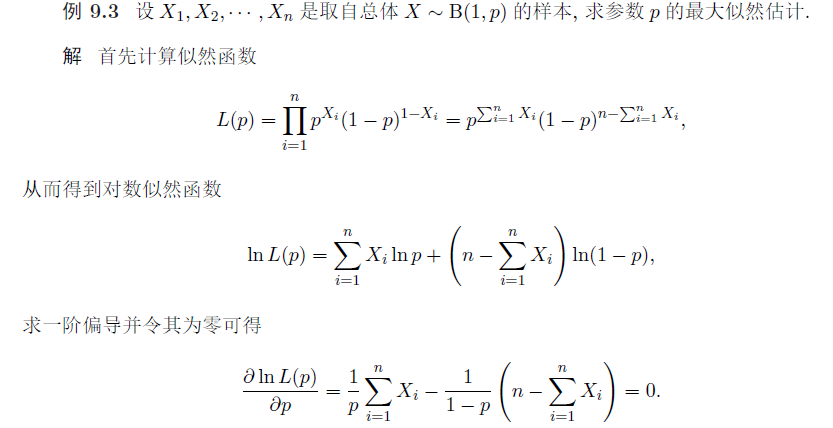

# 参数估计

设总体 $X$ 的分布函数为 $F(X, \theta)$, 其中 $\theta$ 为末知参数(也可为向量). 现从总体中抽取一样本 $X_{1}, X_{2}, \cdots, X_{n}$, 如何依据样本估计参数 $\theta$, 或 $\theta$ 的函数 $g(\theta)$, 此类问题称为参数估计问题. 内容包 括: 点估计, 估计量标准, 区间估计

## 点估计

### 矩估计法
总体 $X$ 的 $k$ 阶矩: $a_{k}=E\left[X^{k}\right]$ 

样本 $k$ 阶矩: $A_{k}=\frac{1}{n} \sum_{i=1}^{n} X_{i}^{k}$

用相应的样本矩去估计总体矩, 求解参数 $\theta$ 的方法称为矩估计法. 矩估计法的理论基础是大数 定理: $X_{1}, X_{2}, \cdots, X_{n}$ 为独立同分布的随机变量, 若 $E(X)=\mu$, 则当 $n \rightarrow \infty$ 时有
$$
\frac{1}{n} \sum_{i=1}^{n} X_{i} \stackrel{P}{\rightarrow} \mu .
$$
推论: 若 $E\left[X^{k}\right]=a_{k}$ 存在, 则当 $n \rightarrow \infty$ 时有
$$
\frac{1}{n} \sum_{i=1}^{n} X_{i}^{k} \stackrel{P}{\rightarrow} a_{k}=E\left[X^{k}\right]
$$
还可利用中心矩进行估计:

总体 $X$ 的 $k$ 阶中心矩: $b_{k}=E\left[(X-E(X))^{k}\right]$ 

样本 $k$ 阶中心矩: $B_{k}=\frac{1}{n} \sum_{i=1}^{n}\left(X_{i}-\bar{X}\right)^{k}$ 

矩估计方法: 总体 $X$ 的分布函数 $F$ 包含 $m$ 个末知参数 $\theta_{1}, \theta_{2}, \cdots, \theta_{m}$,

1) 求总体 $X$ 的 $k$ 阶矩: $a_{k}=a_{k}\left(\theta_{1}, \theta_{2}, \cdots, \theta_{m}\right)=E\left[X^{k}\right], k \in[m]\left(a_{k}\right.$ 一般为 $\theta_{1}, \theta_{2}, \cdots, \theta_{m}$ 的 函数).
   * 注意不一定是 $X^k$，比如 $X^2$ 可以用方差代替。我们只是想要 $m$ 条独立方程而已
2) 计算样本的 $k$ 阶矩: $A_{k}=\frac{1}{n} \sum_{i=1}^{n} X_{i}^{k}$.
3) 令样本矩等于总体矩 $A_{k}=a_{k}=a_{k}\left(\theta_{1}, \theta_{2}, \cdots, \theta_{m}\right)(k=1,2, \cdots, m)$, 得到 $m$ 个关于 $\theta_{1}, \theta_{2}, \cdots, \theta_{m}$ 的方程组.
4) 求解方程组得到估计量 $\widehat{\theta}_{1}, \widehat{\theta}_{2}, \cdots, \widehat{\theta}_{m}$.

> * **矩估计量是参数关于X（随机变量的总体）的函数**，例如 $\displaystyle \hat{\theta}=\frac{\overline{X}}{\overline{X}-c}$
> * **矩估计值是参数关于样本值的函数**，例如 $\displaystyle \hat{\theta}=\frac{\overline{x}}{\overline{x}-c}$

#### [例]

### 最大似然估计

设 $X_{1}, X_{2}, \cdots, X_{n}$ 是来自总体 $X$ 的一个样本。若总体 $X$ 为离散型随机变量, 其分布列为 $\operatorname{Pr}(X=x)=\operatorname{Pr}(X=x ; \theta)$, 则样本 $X_{1}, X_{2}, \cdots, X_{n}$ 的分布列为
$$
L(\theta)=L\left(x_{1}, x_{2}, \cdots, x_{n} ; \theta\right)=\prod_{i=1}^{n} \operatorname{Pr}\left(x_{i} ; \theta\right)
$$
这里 $L(\theta)$ 表示样本 $X_{1}=x_{1}, X_{2}=x_{2}, \cdots, X_{n}=x_{n}$ 发生的概率.

若总体 $X$ 为连续型随机变量, 其概率密度为 $f(x ; \theta)$, 则 $X_{1}=x_{1}, X_{2}=x_{2}, \cdots, X_{n}=x_{n}$ 的联合概率密度为
$$
L(\theta)=L\left(x_{1}, x_{2}, \cdots, x_{n} ; \theta\right)=\prod_{i=1}^{n} f\left(x_{i} ; \theta\right)
$$
根据概率密度定义可知 $L(\theta)$ 越大, 样本 $\left(X_{1}, X_{2}, \cdots, X_{n}\right)$ 落入 $\left(x_{1}, x_{2}, \cdots, x_{n}\right)$ 的邻域内概率越大. 综合上述离散和连续两种随机变量, 统称 $L(\theta)$ 为样本 $X_{1}, X_{2}, \cdots, X_{n}$ 的似然函数, 可以发现 $L(\theta)$ 是 $\theta$ 的函数, 若
$$
\hat{\theta}=\underset{\theta}{\arg \max } L\left(x_{1}, x_{2}, \cdots, x_{m} ; \theta\right),
$$
则称 $\hat{\theta}$ 为 $\theta$ 的最大似然估计量. 直觉而言：**最大似然估计量 $\hat{\theta}$ 是使观测值 $X_{1}=x_{1}, X_{2}=$ $x_{2}, \cdots, X_{n}=x_{n}$ 出现的概率最大.**

**求解最大似然估计量的步骤如下:**

1. 计算对数似然函数 $\ln \left(L\left(x_{1}, x_{2}, \cdots, x_{m} ; \theta\right)\right)$;
2. 求对数似然函数中参数 $\theta$ 的一阶偏导, 令其等于零;
3. 求解方程组得到最大似然估计量 $\hat{\theta}$.

#### [例]

#### 最大似然估计不可变性

性质 $9.1$ 设 $\mu(\theta)$ 为 $\theta$ 的函数, 且存在反函数 $\theta=\theta(\mu)$. 若 $\hat{\theta}$ 是 $\theta$ 的最大似然估计, 则 $\hat{\mu}=\mu(\hat{\theta})$ 是 $\mu$ 的最大似然估计.

例 $9.4$ 设 $X_{1}, X_{2}, \cdots, X_{n}$ 为总体 $X \sim \mathcal{N}\left(\mu, \sigma^{2}\right)$ 的样本, 求 $\mu$ 和 $\sigma>0$ 的最大似然估计.
解 根据高斯分布知 $X$ 的概率密度为 $f(x)=\frac{1}{\sqrt{2 \pi \sigma}} e^{-\frac{(x-\mu)^{2}}{2 \sigma^{2}}}$. 样本 $X_{1}, X_{2}, \cdots, X_{n}$ 的似然函数 为
$$
L(\mu, \sigma)=\frac{1}{(\sqrt{2 \pi} \sigma)^{n}} \exp \left(-\sum_{i=1}^{n} \frac{\left(X_{i}-\mu\right)^{2}}{2 \sigma^{2}}\right)
$$
其对数似然函数为 $\ln L(\mu, \sigma)=-n \ln (2 \pi)^{1 / 2}-n \ln \sigma-\sum_{i=1}^{n}\left(X_{i}-\mu\right)^{2} / 2 \sigma^{2}$. 对参数 $\mu$ 求导计算可 得
$$
\frac{\partial \ln L(\mu, \sigma)}{\partial \mu}=\sum_{i=1}^{n}\left(X_{i}-\mu\right)=0 \quad \longrightarrow \quad \mu=\frac{1}{n} \sum_{i=1}^{n} X_{i}=\bar{X},
$$
对 $\sigma$ 求导计算可得
$$
\frac{\partial \ln L(\mu, \sigma)}{\partial \sigma}=-\frac{n}{\sigma}+\frac{1}{\sigma^{3}} \sum_{i=1}^{n}\left(X_{i}-\mu\right)^{2}=0 \quad \Longrightarrow \quad \sigma=\sqrt{\frac{1}{n} \sum_{i=1}^{n}\left(X_{i}-\mu\right)^{2}}=\sqrt{\frac{1}{n} \sum_{i=1}^{n}\left(X_{i}-\bar{X}\right)^{2}}
$$

根据最大似然估计的不变性可知方差 $\sigma^{2}$ 的最大似然估计为 $\sigma^{2}=\sum_{i=1}^{n}\left(X_{i}-\bar{X}\right)^{2} / n$. 下面进行验证: 最大似然估计的不变性: 设 $X_{1}, X_{2}, \cdots, X_{n}$ 为总体 $X \sim \mathcal{N}(\mu, \nu)$ 的样本, 求 $\mu$ 和 $\nu$ 的最大似然估计. 根据题意可知样本 $X_{1}, X_{2}, \cdots, X_{n}$ 的对数似然函数为
$$
\ln L(\mu, \nu)=-\frac{n}{2} \ln (2 \pi)-\frac{n}{2} \ln \nu-\sum_{i=1}^{n} \frac{\left(X_{i}-\mu\right)^{2}}{2 \nu} .
$$
对参数 $\mu$ 求偏导计算其最大似然估计 $\mu=\sum_{i=1}^{n} X_{i} / n=\bar{X}$, 对 $\nu$ 求偏导计算可得
$$
\frac{\partial \ln L(\mu, \nu)}{\partial \nu}=-\frac{n}{2 \nu}+\frac{1}{2 \nu^{2}} \sum_{i=1}^{n}\left(X_{i}-\mu\right)^{2}=0 \quad \Longrightarrow \quad \nu=\frac{1}{n} \sum_{i=1}^{n}\left(X_{i}-\mu\right)^{2}=\frac{1}{n} \sum_{i=1}^{n}\left(X_{i}-\bar{X}\right)^{2},
$$
从而完成验证.

例 $9.5$ 设总体 $X$ 的密度函数为
$$
f(x)= \begin{cases}(\alpha+1) x^{\alpha} & x \in(0,1) \\ 0 & \text { 其它 }\end{cases}
$$
设 $X_{1}, X_{2}, \cdots, X_{n}$ 是总体 $X$ 的样本, 求 $\alpha$ 的最大似然估计

解 首先得到似然函数为
$$
L(\alpha)=(\alpha+1)^{n} \prod_{i=1}^{n} X_{i}^{\alpha}=(\alpha+1)^{n}\left(X_{1} X_{2} \cdots X_{n}\right)^{\alpha},
$$
以及其对数似然函数 $\ln L(\alpha)=n \ln (\alpha+1)+\alpha \ln \left(X_{1} X_{2} \cdots X_{n}\right)$. 求导并令偏导为零有
$$
\frac{\partial \ln L(\alpha)}{\partial \alpha}=\frac{n}{\alpha+1}+\ln \left(X_{1} X_{2} \cdots X_{n}\right)=0,
$$
求解得
$$
\alpha=\frac{-n}{\sum_{i=1}^{n} \ln \left(X_{i}\right)}-1=\frac{-1}{\frac{1}{n} \sum_{i=1}^{n} \ln \left(X_{i}\right)}-1
$$
对上例, 矩估计值为 $\alpha=(2 \bar{X}-1) /(1-\bar{X})$, 因此矩估计值与最大似然估计值可能不同.

例 $9.6$ 设 $X_{1}, X_{2}, \cdots, X_{n}$ 是总体 $X \sim \mathcal{U}(a, b)$ 的样本, 求 $a$ 和 $b$ 的最大似然估计.

解 当 $x \in[a, b]$ 时, 总体 $X$ 的概率密度为 $f(x)=1 /(b-a)$, 其它情况为零, 因此似然函数为
$$
L(a, b)= \begin{cases}\frac{1}{(b-a)^{n}} & a \leqslant X_{1}, X_{2}, \cdots, X_{n} \leqslant b \\ 0 & \text { 其它 }\end{cases}
$$
直接求偏导无法解出 $a$ 和 $b$, 此时可以从最大似然的定义出发, 应使得 $b$ 尽可能小且 $a$ 尽可能大, 但 需满足 $a \leqslant X_{1}, X_{2}, \cdots, X_{n} \leqslant b$, 因此最大似然估计量为:
$$
b=\max \left\{X_{1}, X_{2}, \cdots, X_{n}\right\} \quad \text { 和 } \quad a=\min \left\{X_{1}, X_{2}, \cdots, X_{n}\right\} \text {. }
$$
例 $9.7$ 设 $X_{1}, X_{2}, \cdots, X_{n}$ 是总体 $X$ 的样本, 以及总体 $X$ 的概率密度为
$$
f(x)= \begin{cases}\theta e^{-(x-\mu) \theta} & x \geqslant \mu \\ 0 & \text { 其它 }\end{cases}
$$
求 $\mu$ 和 $\theta$ 的最大似然估计

解 首先计算似然函数为
$$
L(\theta, \mu)= \begin{cases}\theta^{n} e^{-\theta \sum_{i=1}^{n}\left(X_{i}-\mu\right)} & X_{i} \geqslant \mu \\ 0 & \text { 其它 }\end{cases}
$$
进一步得到对数似然函数为
$$
\ln L(\theta, \mu)=n \ln \theta-\theta \sum_{i=1}^{n}\left(X_{i}-\mu\right)
$$
求偏导、并令偏导等于零有
$$
\frac{\partial \ln L(\theta, \mu)}{\partial \theta}=\frac{n}{\theta}-\sum_{i=1}^{n}\left(X_{i}-\mu\right)=0 \quad \Rightarrow \quad \theta=\frac{1}{\frac{1}{n} \sum_{i=1}^{n}\left(X_{i}-\mu\right)}
$$
另一方面有
$$
\frac{\partial \ln L(\theta, \mu)}{\partial \mu}=n \theta=0 \quad \Rightarrow \quad \theta=0,
$$
此时无法求解 $\theta$ 和 $\mu$ 的最大似然估计. 回到似然函数的定义
$$
L(\theta, \mu)= \begin{cases}\theta^{n} e^{-\theta \sum_{i=1}^{n}\left(X_{i}-\mu\right)} & X_{1}, X_{2}, \cdots, X_{n} \geqslant \mu \\ 0 & \text { 其它 }\end{cases}
$$
可以发现 $\mu$ 越大似然函数 $L(\theta, \mu)$ 越大, 但须满足 $X_{i} \geqslant \mu(i \in[n])$. 由此可得最大似然估计
$$
\hat{\mu}=\min \left\{X_{1}, X_{2}, \cdots, X_{n}\right\}
$$
进一步求解可得
$$
\hat{\theta}=\frac{1}{\frac{1}{n} \sum_{i=1}^{n}\left(X_{i}-\hat{\mu}\right)}
$$
## 估计的评价

### 无偏性

定义 $9.1$ 设 $X_{1}, X_{2}, \cdots, X_{n}$ 是来自总体 $X$ 的样本, 令 $\hat{\theta}=\hat{\theta}\left(X_{1}, X_{2}, \cdots, X_{n}\right)$ 是 $\theta$ 的一个估计量, 若

$$
E_{X_{1}, X_{2}, \ldots, X_{n}}[\hat{\theta}]=E_{X_{1}, X_{2}, \ldots, X_{n}}\left[\hat{\theta}\left(X_{1}, X_{2}, \cdots, X_{n}\right)\right]=\theta
$$

则称 $\hat{\theta}$ 为 $\theta$ 的无偏估计.

无偏估计不要求估计值 $\hat{\theta}$ 在任意情况下都等于 $\theta$, 但在期望的情形下有 $E(\hat{\theta})=\theta$ 成立. 其意义 在于无系统性偏差, 无偏性是一种对估计量常见而且重要的标准.

> 注意 $\hat{\theta}=\hat{\theta}\left(X_{1}, X_{2}, \ldots, X_{n}\right)$ 是 $\theta$ 的无偏估计, 但并不一定有 $g(\hat{\theta})$ 是 $g(\theta)$ 的无偏估计, 这是因为 $E[\hat{\theta}]=\theta$ 并不能推导出 $E[g(\hat{\theta})]=g(\theta)$. 例如
> $$
> E[\bar{X}]=E[X]=\mu \quad \text { 但 } \quad E\left[(\bar{X})^{2}\right] \neq \mu^{2} .
> $$

首先看看如下例子:

#### 矩估计法

例 $9.8$ (样本 $k$ 阶原点矩为总体 $k$ 阶原点矩的无偏估计) 设 $X_{1}, X_{2}, \cdots, X_{n}$ 是总体 $X$ 的样 本, 若 $E\left[X^{k}\right]$ 存在, 则 $A_{k}=\frac{1}{n} \sum_{i=1}^{n} X_{i}^{k}$ 是总体 $a_{k}=E\left[X^{k}\right]$ 的无偏估计.

#### 样本方差

例 $9.9$ 设 $X_{1}, X_{2}, \cdots, X_{n}$ 是来自总体 $X$ 的样本, 其期望为 $\mu$, 方差为 $\sigma^{2}$, 则: 1) $S_{0}^{2}=$ $\sum_{i=1}^{n}\left(X_{i}-\bar{X}\right)^{2} / n$ 是 $\sigma^{2}$ 的有偏估计; 2$) S^{2}=\sum_{i=1}^{n}\left(X_{i}-\bar{X}\right)^{2} /(n-1)$ 是 $\sigma^{2}$ 的无偏估计.

#### 指数分布

例 $9.10$ 设 $X_{1}, X_{2}, \cdots, X_{n}$ 是总体 $X$ 的样本, 以及总体 $X$ 的概率密度为
$$
f(x ; \theta)= \begin{cases}\frac{1}{\theta} e^{-\frac{x}{\theta}} & x \geqslant 0 \\ 0 & x<0\end{cases}
$$
证明: $\bar{X}=\sum_{i=1}^{n} X_{i} / n$ 和 $n \min \left\{X_{1}, X_{2}, \cdots, X_{n}\right\}$ 均是 $\theta$ 的无偏估计.

证明 根据期望和指数分布的性质有
$$
E[\bar{X}]=E[X]=\theta,
$$
由此可知 $\bar{X}$ 是 $E[X]$ 的无偏估计. 设随机变量 $Z=\min \left\{X_{1}, X_{2}, \cdots, X_{n}\right\}$, 则有
$$
\begin{aligned}
F_{Z}(z) &=\operatorname{Pr}[Z \leqslant z]=1-\operatorname{Pr}[Z>z] \\
&=1-\operatorname{Pr}\left[X_{1}>z\right] \operatorname{Pr}\left[X_{2}>z\right] \cdots \operatorname{Pr}\left[X_{n}>z\right] \\
&=1-\prod_{i=1}^{n}\left(1-\operatorname{Pr}\left[X_{i} \leqslant z\right]\right)= \begin{cases}0 & z<0 \\
1-e^{-n z / \theta} & z \geqslant 0\end{cases}
\end{aligned}
$$
于是当 $z \geqslant 0$ 时有
$$
\operatorname{Pr}[Z>z]=1-\operatorname{F}_{Z}(z)=e^{-n z / \theta} .
$$
根据期望的性质有
$$
E[Z]=\int_{0}^{+\infty} \operatorname{Pr}[Z>z] d z=\int_{0}^{+\infty} e^{-n z / \theta} d z=\frac{\theta}{n} .
$$
于是有 $\theta=E[n Z]$ 成立.

### 有效性

参数可能存在多个无偏估计, 若 $\hat{\theta}_{1}$ 和 $\hat{\theta}_{2}$ 都是 $\theta$ 的无偏估计, 则可以比较方差
$$
\operatorname{Var}\left(\hat{\theta}_{1}\right)=E\left[\left(\hat{\theta}_{1}-\theta\right)^{2}\right] \quad \text { 和 } \quad \operatorname{Var}\left(\hat{\theta}_{2}\right)=E\left[\left(\hat{\theta}_{2}-\theta\right)^{2}\right] .
$$
一般而言: 方差越小, 无偏估计越好

定义 $9.2$ 设 $\hat{\theta}_{1}=\hat{\theta}_{1}\left(X_{1}, X_{2}, \cdots, X_{n}\right)$ 和 $\hat{\theta}_{2}=\hat{\theta}_{2}\left(X_{1}, X_{2}, \cdots, X_{n}\right)$ 是 $\theta$ 的两个无偏估计, 若
$$
\operatorname{Var}\left(\hat{\theta}_{1}\right) \leqslant \operatorname{Var}\left(\hat{\theta}_{2}\right)
$$

则称 $\theta_{1}$ 比 $\theta_{2}$ 有效

#### 最有效估计

下面定义有效估计量:

定理 $9.1$ (Rao-Crammer 不等式) 设随机变量 $X$ 的概率密度为 $f(x ; \theta)$ 或分布函数为 $F(x ; \theta)$, 令
$$
\operatorname{Var}_{0}(\theta)=\frac{1}{n E\left[\left(\frac{\partial \ln f(X ; \theta)}{\partial \theta}\right)^{2}\right]} \quad \text { 或 } \quad \operatorname{Var}_{0}(\theta)=\frac{1}{n E\left[\left(\frac{\partial \ln F(X ; \theta)}{\partial \theta}\right)^{2}\right]},
$$
对任意的无偏估计量 $\hat{\theta}$ 有
$$
\operatorname{Var}(\hat{\theta}) \geqslant \operatorname{Var}_{0}(\theta),
$$
称 $\operatorname{Var}_{0}(\theta)$ 为估计量 $\hat{\theta}$ 方差的下界. 当 $\operatorname{Var}(\hat{\theta})=\operatorname{Var}_{0}(\theta)$ 时称 $\hat{\theta}$ 为达到方差下界的无偏估计量, 此时 $\hat{\theta}$ 为**最有效估计量, 简称有效估计量**

#### 指数分布

例 $9.11$ 设 $X_{1}, X_{2}, \cdots, X_{n}$ 是来自总体 $X$ 的样本, 且 $X$ 的概率密度为
$$
f(x ; \theta)=\left\{\begin{array}{ll}
\frac{1}{\theta} e^{-\frac{x}{\theta}} & x \geqslant 0 \\
0 & x<0
\end{array},\right.
$$
令 $Z=\min \left\{X_{1}, X_{2}, \cdots, X_{n}\right\}$, 证明: 当 $n>1$ 时 $\bar{X}=\sum_{i=1}^{n} X_{i} / n$ 比 $n Z$ 有效. 

证明 根据独立性有
$$
\operatorname{Var}(\bar{X})=\frac{1}{n^{2}} \sum_{i=1}^{n} \operatorname{Var}\left(X_{i}\right)=\frac{\theta^{2}}{n} .
$$
根据例 $9.10$ 可知随机变量 $Z$ 的概率密度为
$$
f(z)= \begin{cases}0 & z<0 \\ \frac{n}{\theta} e^{-\frac{n z}{\theta}} & z \geqslant 0\end{cases}
$$
从而得到
$$
\operatorname{Var}(n Z)=n^{2} \operatorname{Var}(Z)=n^{2} \frac{\theta^{2}}{n^{2}}=\theta^{2},
$$
因此当 $n \geqslant 1$ 时有 $\operatorname{Var}(\bar{X}) \leqslant \operatorname{Var}(n Z)$ 成立, 故 $\bar{X}$ 比 $n Z$ 有效.

#### 均值 vs 加权平均

例 $9.12$ 设 $X_{1}, X_{2}, \cdots, X_{n}$ 是总体 $X$ 的样本, 且 $E(X)=\mu$ 和 $\operatorname{Var}(X)=\sigma^{2}$. 设常数 $c_{1}, c_{2}, \cdots, c_{n} \geqslant 0$ 满足 $\sum_{i=1}^{n} c_{i}=1, c_{i} \neq 1 / n$, 求证: $\bar{X}$ 比 $\sum_{i=1}^{n} c_{i} X_{i}$ 有效.

证明 根据样本的独立同分布条件有
$$
E[\bar{X}]=\mu \quad \text { 和 } \quad \operatorname{Var}(\bar{X})=\sigma^{2} / n .
$$
根据期望的性质有 $E\left[\sum_{i=1}^{n} c_{i} X_{i}\right]=\mu$, 进一步有
$$
\operatorname{Var}\left(\sum_{i=1}^{n} c_{i} X_{i}\right)=\sum_{i=1}^{n} c_{i}^{2} \operatorname{Var}\left(X_{i}\right)=\sigma^{2} \sum_{i=1}^{n} c_{i}^{2} \geqslant \frac{\sigma^{2}}{n}
$$
这里利用不等式 $\sum_{i=1}^{n} c_{i}^{2} / n \geqslant\left(\sum_{i=1}^{n} c_{i} / n\right)^{2}=1 / n^{2}$, 所以有 $\operatorname{Var}\left(\sum_{i=1}^{n} c_{i} X_{i}\right) \geqslant \operatorname{Var}(\bar{X})$.

#### 指数分布的最有效估计

例 $9.13$ 设 $X_{1}, X_{2}, \cdots, X_{n}$ 为总体 $X$ 的样本, 令总体 $X$ 的密度函数为
$$
f(x ; \theta)= \begin{cases}\frac{1}{\theta} e^{-\frac{x}{\theta}} & x>0 \\ 0 & x \leqslant 0\end{cases}
$$
证明: $\theta$ 的最大似然估计为有效估计量

解 首先计算对数似然函数
$$
\ln L(\theta)=-n \ln \theta-\frac{1}{\theta} \sum_{i=1}^{n} X_{i} \Rightarrow \hat{\theta}=\frac{1}{n} \sum_{i=1}^{n} X_{i},
$$
进一步得到统计量的方差
$$
\operatorname{Var}(\hat{\theta})=\operatorname{Var}\left(\frac{1}{n} \sum_{i=1}^{n} X_{i}\right)=\frac{\theta^{2}}{n} .
$$
同时考察
$$
\ln f(X ; \theta)=-\ln \theta-\frac{X}{\theta}, \quad \frac{\partial \ln f(X ; \theta)}{\partial \theta}=-\frac{1}{\theta}+\frac{X}{\theta^{2}}
$$
所以
$$
E\left[\frac{\partial \ln f(X ; \theta)}{\partial \theta}\right]^{2}=E\left[\left(-\frac{1}{\theta}+\frac{X}{\theta^{2}}\right)^{2}\right]=\frac{1}{\theta^{4}} E\left[(X-E[X])^{2}\right]=\frac{1}{\theta^{2}},
$$
从而得到 $\operatorname{Var}_{0}(X)=\theta^{2} / n=\operatorname{Var}(\hat{\theta})$, 因此 $\theta$ 的最大似然估计是有效估计量.

### 一致性
定义 $9.3$ 设 $\hat{\theta}_{n}=\hat{\theta}_{n}\left(X_{1}, X_{2}, \cdots, X_{n}\right)$ 是 $\theta$ 的一个估计量, 若当 $n \rightarrow \infty$ 时有 $\hat{\theta}_{n} \stackrel{P}{\rightarrow} \theta$ 成立, 即 对任意 $\epsilon>0$ 有
$$
\lim _{n \rightarrow 0} \operatorname{Pr}\left[\left|\hat{\theta}_{n}-\theta\right|>\epsilon\right]=0,
$$
则称 $\hat{\theta}_{n}$ 为 $\theta$ 的一致估计量.

估计量的一致性刻画了在足够多样本情形下**估计量 $\hat{\theta}$ 能有效逼近真实值 $\theta$, 一致性是对估计的基本要求, 不满足一致性的估计量一般不予考虑.** 

#### 充分条件：期望等于实值且方差为零

定理 $9.2$ 设 $\hat{\theta}_{n}=\hat{\theta}_{n}\left(X_{1}, X_{2}, \cdots, X_{n}\right)$ 是 $\theta$ 的一个估计量, 若满足以下两个条件:
$$
\lim _{n \rightarrow \infty} E\left[\hat{\theta}_{n}\right]=\theta \quad \text { 和 } \quad \lim _{n \rightarrow \infty} \operatorname{Var}\left(\hat{\theta}_{n}\right)=0,
$$
则 $\hat{\theta}_{n}$ 为 $\theta$ 的一致估计量.

**证明** 根据 $\lim _{n \rightarrow \infty} E\left[\hat{\theta}_{n}\right]=\theta$ 知道对任意 $\epsilon>0$, 存在一个 $N_{0}$, 当 $n \geqslant N_{0}$ 有 $\left|E\left[\hat{\theta}_{n}\right]-\theta\right| \leqslant \theta / 2$, 于是有
$$
\lim _{n \rightarrow \infty} \operatorname{Pr}\left[\left|E\left[\hat{\theta}_{n}\right]-\theta\right|>\epsilon / 2\right]=0 .
$$
根据 Chebyshev 不等式有
$$
\lim _{n \rightarrow 0} \operatorname{Pr}\left[\left|\hat{\theta}_{n}-E\left[\hat{\theta}_{n}\right]\right|>\epsilon / 2\right] \leqslant \lim _{n \rightarrow 0} \frac{4}{\epsilon} \operatorname{Var}\left(\hat{\theta}_{n}\right)=0
$$
再根据
$$
\operatorname{Pr}\left[\left|\hat{\theta}_{n}-\theta\right|>\epsilon\right] \leqslant \operatorname{Pr}\left[\left|\hat{\theta}_{n}-E\left[\hat{\theta}_{n}\right]\right|>\epsilon / 2\right]+\operatorname{Pr}\left[\left|E\left[\hat{\theta}_{n}\right]-\theta\right|>\epsilon / 2\right]
$$
完成证明.

#### 复合函数性质

定理 $9.3$ 设 $\hat{\theta}_{n_{1}}, \hat{\theta}_{n_{2}}, \cdots, \hat{\theta}_{n_{k}}$ 分别为 $\theta_{1}, \theta_{2}, \cdots, \theta_{k}$ 满足一致性的估计量, 对连续函数 $g: \mathbb{R}^{n} \rightarrow$ $\mathbb{R}$, 有函数 $\hat{\eta}_{n}=g\left(\hat{\theta}_{n_{1}}, \hat{\theta}_{n_{2}}, \cdots, \hat{\theta}_{n_{k}}\right)$ 是 $\eta=g\left(\theta_{1}, \theta_{2}, \cdots, \theta_{k}\right)$ 满足一致性的估计量.

根据大数定理可知样本的 $k$ 阶矩是总体 $k$ 阶矩的一致估计量. 矩估计法得到的估计量一般是一致估 计量. 最大似然估计量在一定条件下是一致性估计量.

#### 指数分布的最大似然估计的一致性

例 $9.14$ 设 $X_{1}, X_{2}, \cdots, X_{n}$ 是来自总体 $X$ 的样本, 以及总体 $X$ 的密度函数为
$$
f(x ; \theta)=\left\{\begin{array}{ll}
\frac{1}{\theta} e^{-\frac{x}{\theta}} & x>0 \\
0 & x<0
\end{array},\right.
$$
则样本均值 $X_{n}=\sum_{i=1}^{n} X_{i} / n$ 为 $\theta$ 的无偏、有效、一致估计量.

由前面的例子可知估计的无偏性和有效性, 一致性可根据 $E\left[X_{n}\right]=\theta$ 以及
$$
\lim _{n \rightarrow \infty} \operatorname{Var}(\bar{X})=\lim _{n \rightarrow \infty} \frac{\theta^{2}}{n}=0 .
$$
#### 均匀分布的最大似然估计的一致性

例 $9.15$ 设 $X_{1}, X_{2}, \cdots, X_{n}$ 是来自总体 $X \sim U(0, \theta)$ 的样本, 证明: $\theta$ 的最大似然估计量是一致估计量.

证明 根据前面的例题可知 $\theta$ 的最大似然估计为 $\hat{\theta}_{n}=\max \left(X_{1}, X_{2}, \cdots, X_{n}\right)$. 设随机变量 $Z=\max \left(X_{1}, X_{2}, \cdots, X_{n}\right)$, 则由 $Z$ 的分布函数
$$
F_{Z}(z)=\operatorname{Pr}[Z \leqslant z]=\operatorname{Pr}\left[\max \left(X_{1}, X_{2}, \cdots, X_{n}\right) \leqslant z\right]=\prod_{i=1}^{n} \operatorname{Pr}\left[X_{i} \leqslant z\right]= \begin{cases}1 & z>\theta \\ \left(\frac{z}{\theta}\right)^{n} & z \in[0, \theta] \\ 0 & z<0\end{cases}
$$
由此得到当 $z \in[0, \theta]$ 时随机变量 $Z$ 的密度函数 $f_{Z}(z)=n z^{n-1} / \theta^{n}$, 进一步有
$$
E\left[\hat{\theta}_{n}\right]=E[Z]=\int_{0}^{\theta} \frac{n z^{n}}{\theta^{n}} d z=\frac{n}{n+1} \theta,
$$
因此 $\hat{\theta}$ 是 $\theta$ 的有偏估计. 另一方面有
$$
E\left[Z^{2}\right]=\int_{0}^{\theta} \frac{n z^{n+1}}{\theta^{n}} d z=\frac{n}{n+2} \theta^{2},
$$
从而得到
$$
\operatorname{Var}\left(\hat{\theta}_{n}\right)=\operatorname{Var}(Z)=E\left[Z^{2}\right]-(E[Z])^{2}=\frac{n}{n+2} \theta^{2}-\left(\frac{n \theta}{n+1}\right)^{2}=\frac{n}{(n+1)^{2}(n+2)} \theta^{2},
$$
于是有
$$
\lim _{n \rightarrow \infty} E\left[\hat{\theta}_{n}\right]=\theta \quad \text { 和 } \quad \lim _{n \rightarrow \infty} \operatorname{Var}\left(\hat{\theta}_{n}\right)=0,
$$
由此可得 $\hat{\theta}$ 是 $\theta$ 的有偏、但一致估计量

## 区间估计

设 $X_{1}, X_{2}, \cdots, X_{n}$ 是来自总体 $X$ 的样本, $\theta$ 为总体 $X$ 的分布函数 $F(x, \theta)$ 的未知参数, **根据样本估计 $\theta$ 的范围** $\left(\hat{\theta}_{1}, \hat{\theta}_{2}\right)$, 其中 $\hat{\theta}_{1}=\hat{\theta}_{1}\left(X_{1}, X_{2}, \cdots, X_{n}\right)$ 和 $\hat{\theta}_{2}=\hat{\theta}_{2}\left(X_{1}, X_{2}, \cdots, X_{n}\right)$, 使得以较大的概率保证有 $\theta \in\left(\hat{\theta}_{1}, \hat{\theta}_{2}\right)$ 成立. 具体而言, 对任意给定 $\alpha \in(0,1)$, 有
$$
\operatorname{Pr}\left[\hat{\theta}_{1}\left(X_{1}, X_{2}, \cdots, X_{n}\right)<\theta<\hat{\theta}_{2}\left(X_{1}, X_{2}, \cdots, X_{n}\right)\right] \geqslant 1-\alpha .
$$
### 置信区间与置信度

设 $X_{1}, X_{2} \cdots, X_{n}$ 是来自总体 $X$ 的样本, 总体 $X$ 的分布函数 含末知参数 $\theta$, 找出统计量 $\hat{\theta}_{1}=\hat{\theta}_{1}\left(X_{1}, X_{2}, \cdots, X_{n}\right)$ 和 $\hat{\theta}_{2}=\hat{\theta}_{2}\left(X_{1}, X_{2}, \cdots, X_{n}\right)\left(\hat{\theta}_{1}<\hat{\theta}_{2}\right)$, 使得
$$
\operatorname{Pr}\left[\hat{\theta}_{1}<\theta<\hat{\theta}_{2}\right] \geqslant 1-\alpha
$$
成立, 则称 $1-\alpha$ 为置信度, $\left[\hat{\theta}_{1}, \hat{\theta}_{2}\right]$ 为 $\theta$ 的置信度为 $1-\alpha$ 的置信区间.
注意: 置信区间 $\left[\hat{\theta}_{1}, \hat{\theta}_{2}\right]$ 是随机区间, $1-\alpha$ 为该区间包含 $\theta$ 的概率/可靠程度. 若 $\alpha=0.05$, 则置 信度为 $95 \%$. 通常采用 $95 \%$ 的置信度, 有时也可 $99 \%$ 或 $90 \%$ 等. 说明:

1. $\hat{\theta}_{2}-\hat{\theta}_{1}$ 反映了估计精度, 长度越小精度越大.
2. $\alpha$ 反映了估计的可靠度, $\alpha$ 越小可靠度越高.
3. 给定 $\alpha$, 区间 $\left[\hat{\theta}_{1}, \hat{\theta}_{2}\right]$ 的选取并不唯一确定, 通常选长度最小的一个区间

### 置信区间的求解方法: 枢轴变量法

1. 先找一样本函数 $W\left(X_{1}, X_{2}, \cdots, X_{n} ; \theta\right)$ 包含待估参数 $\theta$, 但不含其它参数, 函数 $W$ 的分布已知, 称 $W$ 为**枢轴变量**.
2. 给定置信度 $1-\alpha$, 根据 $W$ 的分布找出临界值 $a$ 和 $b$, 使得 $\operatorname{Pr}[a<W<b]=1-\alpha$ 成立.
3. 根据 $a<W<b$ 解出 $\hat{\theta}_{1}<\theta<\hat{\theta}_{2}$, 则 $\left(\hat{\theta}_{1}, \hat{\theta}_{2}\right)$ 为 $\theta$ 的置信度为 $1-\alpha$ 的置信区间

### 正态总体, 方差已知，求期望

设 $X_{1}, X_{2}, \cdots, X_{n}$ 是来自总体 $X \sim \mathcal{N}\left(\mu, \sigma^{2}\right)$ 的样本, 若方差 $\sigma^{2}$ 已知. 给定 $\alpha \in(0,1)$, 确定置 信度为 $1-\alpha$ 下 $\mu$ 的置信区间 $\left[\hat{\theta}_{1}, \hat{\theta}_{2}\right]$. 令样本均值为 $\bar{X}=\sum_{i=1}^{n} X_{i} / n$, 根据正太分布的性质找出枢轴变量:
$$
W=\frac{\bar{X}-\mu}{\sigma / \sqrt{n}} \sim \mathcal{N}(0,1),
$$
给定置信度 $1-\alpha$, 找出临界值 $a$ 和 $b$ 使得
$$
\operatorname{Pr}[a<W<b]=1-\alpha .
$$
根据正态分布的性质、对称性和上分位点可知
$$
\operatorname{Pr}\left[W \geqslant \mu_{\alpha / 2}\right]=1-\alpha / 2 \quad \text { 和 } \quad \operatorname{Pr}\left[W \leqslant-\mu_{\alpha / 2}\right]=1-\alpha / 2 .
$$

求解可得 $a=-\mu_{\alpha / 2}$ 和 $b=\mu_{\alpha / 2}$. 于是有
$$
\operatorname{Pr}\left[-\mu_{\alpha / 2}<W<\mu_{\alpha / 2}\right]=1-\alpha .
$$
根据 $W=(\bar{X}-\mu) /(\sigma / \sqrt{n})$ 可得
$$
\operatorname{Pr}\left[\bar{X}-\frac{\sigma}{\sqrt{n}} \mu_{\alpha / 2}<\mu<\bar{X}+\frac{\sigma}{\sqrt{n}} \mu_{\alpha / 2}\right]=1-\alpha
$$
例 $9.16$ 某地区儿童身高服从正态分布, 现随机抽查 9 人, 高度分别为 $115,120,131,115,109,115,115,105,110$, 已知 $\sigma^{2}=7$ 和置信度为 $95 \%$, 求期望 $\mu$ 的置信区间 $\left(\mu_{0.025}=1.96\right)$.

### 正态总体, 方差未知，求期望

设 $X_{1}, X_{2}, \cdots, X_{n}$ 是来自总体 $X \sim \mathcal{N}\left(\mu, \sigma^{2}\right)$ 的样本, 若方差 $\sigma^{2}$ 末知, 考虑期望 $\mu$ 的置信度为 $1-\alpha$ 的置信区间. 设 $\bar{X}=\sum_{i=1}^{n} X_{i} / n$ 和 $S^{2}=\sum_{i=1}^{n}\left(X_{i}-\bar{X}\right)^{2} /(n-1)$, 根据正态总体抽样定理可 知:
$$
\frac{\bar{X}-\mu}{S / \sqrt{n}} \sim t(n-1)
$$
由此设枢轴变量
$$
W=\frac{\bar{X}-\mu}{S / \sqrt{n}} \sim t(n-1)
$$
给定置信度 $1-\alpha$, 设临界值 $a$ 和 $b$ 满足
$$
\operatorname{Pr}[a \leqslant W \leqslant b]=1-\alpha \quad \Rightarrow \quad b=t_{\alpha / 2}(n-1), a=-t_{\alpha / 2}(n-1) .
$$
整理可得
$$
\operatorname{Pr}\left[\bar{X}-\frac{S}{\sqrt{n}} t_{\alpha / 2}(n-1)<\mu<\bar{X}+\frac{S}{\sqrt{n}} t_{\alpha / 2}(n-1)\right]=1-\alpha \text {. }
$$
### 正态总体, 求方差 $\sigma^{2}$ 的置信区间

设 $X_{1}, X_{2}, \cdots, X_{n}$ 是来自总体 $X \sim \mathcal{N}\left(\mu, \sigma^{2}\right)$ 的样本, 考虑方差 $\sigma^{2}$ 的置信度为 $1-\alpha$ 的置信区 间. 设修正样本方差 $S^{2}=\sum_{i=1}^{n}\left(X_{i}-\bar{X}\right)^{2} /(n-1)$, 根据正态总体抽样定理有
$$
\frac{(n-1) S^{2}}{\sigma^{2}} \sim \chi^{2}(n-1)
$$
由此设枢轴变量 $W=(n-1) S^{2} / \sigma^{2}$, 设临界值 $a$ 和 $b$ 满足
$$
\operatorname{Pr}[a \leqslant W \leqslant b]=1-\alpha .
$$
根据 $\chi^2$ 分布的不对称性, 采用概率对称的区间
$$
\operatorname{Pr}[W \leqslant a]=\operatorname{Pr}[\geqslant b]=\alpha / 2 \quad \Rightarrow \quad b=\chi_{\alpha / 2}^{2}(n-1), \quad a=\chi_{1-\alpha / 2}^{2}(n-1)
$$
根据枢轴变量 $W=(n-1) S^{2} / \sigma^{2}$ 可得
$$
\operatorname{Pr}\left[\frac{(n-1) S^{2}}{\chi_{1-\alpha / 2}^{2}(n-1)}<\sigma^{2}<\frac{(n-1) S^{2}}{\chi_{\alpha / 2}^{2}(n-1)}\right]=1-\alpha .
$$
### 双正态总体

设 $X_{1}, X_{2}, \cdots, X_{n}$ 是来自总体 $X \sim \mathcal{N}\left(\mu_{1}, \sigma_{1}^{2}\right)$ 的样本, 设 $Y_{1}, Y_{2}, \cdots, Y_{m}$ 是总体 $Y \sim$ $\mathcal{N}\left(\mu_{2}, \sigma_{2}^{2}\right)$ 的样本, 令
$$
\bar{X}=\frac{1}{n} \sum_{i=1}^{n} X_{i}, \quad \bar{Y}=\frac{1}{m} \sum_{i=1}^{m} Y_{i}, \quad S_{1}^{2}=\frac{1}{n-1} \sum_{i=1}^{n}\left(X_{i}-\bar{X}\right)^{2}, \quad S_{2}^{2}=\frac{1}{m-1} \sum_{i=1}^{m}\left(Y_{i}-\bar{Y}\right)^{2} .
$$
考虑 $\mu_{1}-\mu_{2}$ 和 $\sigma_{1}^{2} / \sigma_{2}^{2}$ 的置信度为 $1-\alpha$ 的区间估计.

#### 已知方差 $\sigma_{1}^{2}$ 和 $\sigma_{2}^{2}$, 求 $\mu_{1}-\mu_{2}$ 的置信区间. 

根据正态分布的性质有
$$
\bar{X} \sim \mathcal{N}\left(\mu_{1}, \frac{\sigma_{1}^{2}}{n}\right), \quad \bar{Y} \sim \mathcal{N}\left(\mu_{2}, \frac{\sigma_{2}^{2}}{m}\right) \quad \bar{X}-\bar{Y} \sim \mathcal{N}\left(\mu_{1}-\mu_{2}, \frac{\sigma_{1}^{2}}{n}+\frac{\sigma_{2}^{2}}{m}\right),
$$

进一步有
$$
\frac{(\bar{X}-\bar{Y})-\left(\mu_{1}-\mu_{2}\right)}{\sqrt{\frac{\sigma_{1}^{2}}{n}+\frac{\sigma_{2}^{2}}{m}}} \sim \mathcal{N}(0,1)
$$
于是设枢轴变量
$$
W=\frac{\bar{X}-\bar{Y}-\left(\mu_{1}-\mu_{2}\right)}{\sqrt{\frac{\sigma_{1}^{2}}{n}+\frac{\sigma_{2}^{2}}{m}}} \sim \mathcal{N}(0,1)
$$
求解置信区间
$$
\operatorname{Pr}\left[\bar{X}-\bar{Y}-\mu \frac{\alpha}{2} \sqrt{\frac{\sigma_{1}^{2}}{n}+\frac{\sigma_{2}^{2}}{m}}<\mu_{1}-\mu_{2}<\bar{X}-\bar{Y}+\mu \frac{\alpha}{2} \sqrt{\frac{\sigma_{1}^{2}}{n}+\frac{\sigma_{2}^{2}}{m}}\right]=1-\alpha .
$$
#### 若 $\sigma_{1}^{2}$ 和 $\sigma_{2}^{2}$ 末知, 但已知 $\sigma_{1}^{2}=\sigma_{2}^{2}$, 设

$$
S_{W}=\frac{(n-1) S_{1}^{2}+(m-1) S_{2}^{2}}{n+m-2}
$$
则考虑枢轴变量
$$
W=\frac{(\bar{X}-\bar{Y})-\left(\mu_{1}-\mu_{2}\right)}{S_{W} \sqrt{\frac{1}{n}+\frac{1}{m}}} \sim t(n+m-2)
$$
于是有
$$
\operatorname{Pr}\left[-t_{\alpha / 2}(n+m-2)<\frac{(\bar{X}-\bar{Y})-\left(\mu_{1}-\mu_{2}\right)}{S_{W} \sqrt{\frac{1}{n}+\frac{1}{m}}}<t_{\alpha / 2}(n+m-2)\right]=1-\alpha .
$$
#### 求方差比 $\sigma_{1}^{2} / \sigma_{2}^{2}$ 的置信度为 $1-\alpha$ 的置信区间. 设枢轴变量

$$
W=\frac{S_{1}^{2} / \sigma_{1}^{2}}{S_{2}^{2} / \sigma_{2}^{2}} \sim F(n-1, m-1)
$$
根据 $F$ 分布的不对称性, 采用概率对称的区间
$$
\operatorname{Pr}[W \leqslant a]=\operatorname{Pr}[W \geqslant b]=\alpha / 2 \quad \Rightarrow \quad b=F_{\frac{\alpha}{2}}(n-1, m-1), \quad a=F_{1-\alpha / 2}(n-1, m-1)
$$
由此可得置信区间
$$
\operatorname{Pr}\left[\frac{S_{1}^{2}}{S_{2}^{2}} \frac{1}{F_{\alpha / 2}(n-1, m-1)}<\frac{\sigma_{1}^{2}}{\sigma_{2}^{2}}<\frac{S_{1}^{2}}{S_{2}^{2}} \frac{1}{F_{1-\alpha / 2}(n-1, m-1)}\right]=1-\alpha .
$$
### 单侧置信区间

对某些实际问题, 我们往往只关心置信区间的上限或下限, 例如, 次品率只关心上限, 产品的寿 命只关心下限, 由此引入单侧置信区间及其估计.

定义 $9.5$ (单侧置信区间) 给定 $\alpha \in(0,1)$, 若 样本 $X_{1}, \cdots, X_{n}$ 的 统 计量 $\hat{\theta}_{1}=$ $\hat{\theta}_{1}\left(X_{1}, X_{2}, \cdots, X_{n}\right)$ 满足
$$
\operatorname{Pr}\left[\theta>\hat{\theta}_{1}\right] \geqslant 1-\alpha,
$$
则称 $\left(\hat{\theta}_{1},+\infty\right)$ 为 $\theta$ 的置信度为 $1-\alpha$ 的单侧置信区间, $\hat{\theta}_{1}$ 称为单侧置信下限.
同理定义单侧置信上限. 对正态总体, 可以将相关置信区间的估计都扩展到单侧置信估计, 枢轴变量 的定理类似, 我们将不再重复讨论, 下面仅举两个实例:

