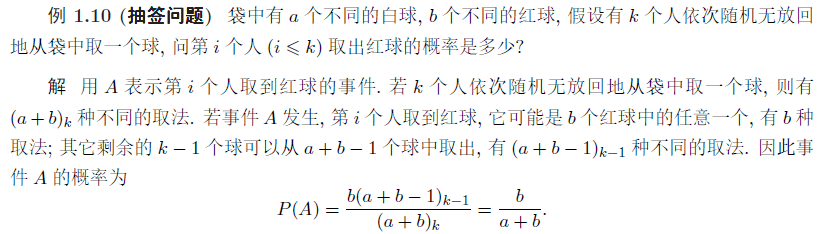
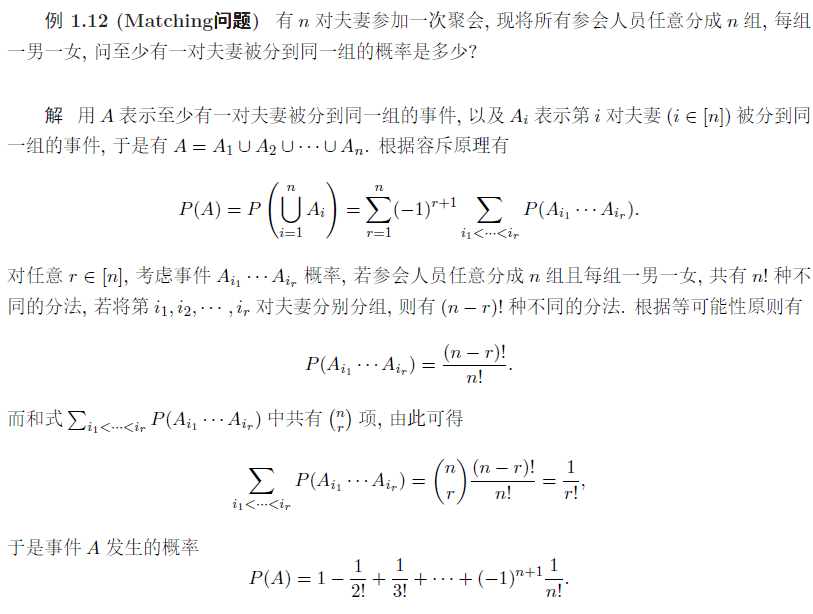
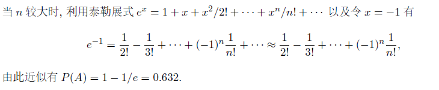

# 2 古典概型

定义：

如果试验 E 满足：

* 试验结果只有有限种可能
* 每种结果发生的可能性相同

这样的试验称为古典概型，又称等可能概型

## 计算

### 基本计数原理

加法原理，乘法原理

### 排列与组合

#### 排列

$r=n$ 时称为全排列

简写：$\displaystyle(n)_k=\frac{n!}{(n-k)!}$

比如：$\displaystyle(365)_k=\frac{365!}{(365-k)!}$

#### 组合

注意组合的简写：

$\displaystyle \begin{pmatrix}n\\r\end{pmatrix}=C_n^r=\frac{n!}{r!(n-r)!}$

称为组合数与二项系数

### 超几何分布

设一批 $𝑁$ 件产品中有 $𝑀$ 件次品, 现从 $𝑁$ 件产品中不放回地任选 $n$ 件, 求其中恰有 $k$ 件次品的事件 $A$ 的概率 $P(A)$

$\displaystyle P(A)=\frac{\begin{pmatrix}M\\k\end{pmatrix}\begin{pmatrix}N-M\\n-k\end{pmatrix}}{\begin{pmatrix}N\\n\end{pmatrix}}$

