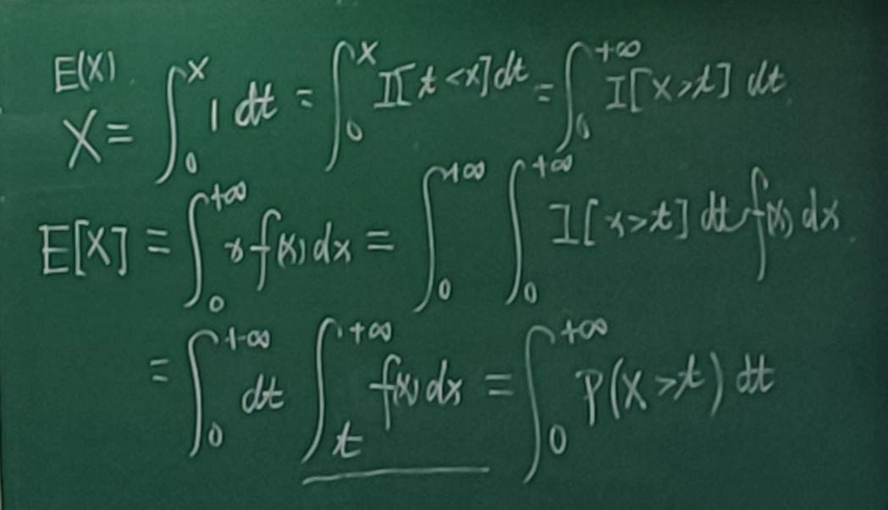
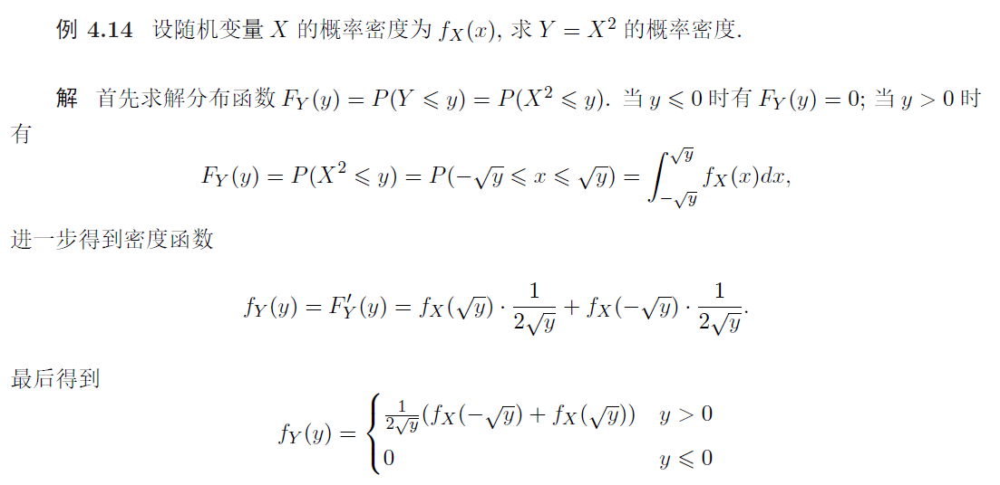

# 6 连续型随机变量

## 分布函数

定义 $4.1$ 给定任意随机变量 $X$ 和 实数 $x \in(-\infty,+\infty)$, 函数 $F(x)=P(X \leqslant x)$ 称为随机变量 $X$ 的 分布函数

分布函数的本质是概率

对任意实数 $x_{1}<x_{2}$, 有

$
P\left(x_{1}<X \leqslant x_{2}\right)=P\left(X \leqslant x_{2}\right)-P\left(X \leqslant x_{1}\right)=F\left(x_{2}\right)-F\left(x_{1}\right)
$

### 性质

* 单调性，$x_1<x_2\to F(x_1)\leq F(x_2)$
* 规范性，$F(-\infty)=0,F(+\infty)=1,F(x)\in[0,1]$
* 右连续性，$\displaystyle F(x+0)=\lim_{\triangle x\to0}F(x+\triangle x)=F(x)$

分布函数一定满足这三条性质

满足这三条性质的函数一定是某随机变量的分布函数

因此分布函数可以由上面三条性质完全刻画

## 概率密度函数

如果存在可积函数 $f(x)$，对于任意实数 $x$ 有

$\displaystyle F(x)=\int_{-\infty}^x f(t)dt$

则称 $X$ 为连续型随机变量，$f(x)$ 为其概率密度函数，简称概率密度

### 性质

* 非负性，$f(x)\geq 0$
* 规范性，$\displaystyle \int_{-\infty}^{+\infty} f(t)dt=1$

### 定理

$\displaystyle P(x_1\leq X\leq x_2)=F(x_2)-F(x_1)=\int_{x_1}^{x_2}f(t)dt$

对于连续型随机变量 $X$ ，其分布函数 $F(x)$ 在实数域上连续

如果 $f(x)$ 在 $x$ 点处连续，则 $F(x)$ 在 $x$ 点处可导，且 $F'(x)=f(x)$

## 期望

$E(X)=\int_{-\infty}^{+\infty}xf(x)dx$

要求绝对收敛

离散型随机变量的期望性质，连续型也有：

* 数乘和加法
* 复合
  * 推论：$\displaystyle E(\sum_{i=1}^n c_i g_i(X))=\sum_{i=1}^n c_i E(g_i(X))$
* $\displaystyle E(g(X))=\int_{-\infty}^{+\infty}g(t)f(t)dt$，f为概率密度函数
* Jensen不等式

当然证明不一样了，见第十一次课讲义

期望的其他计算公式：

* 对非负随机变量 $X$，$\displaystyle E[X]=\int_0^{+\infty}P(X>t)dt$
* 对非负随机变量 $g(X)$，$\displaystyle E[X]=\int_0^{+\infty}P(g(X)>t)dt$

## 方差

等价定义：

$\displaystyle Var(X)=E(X-E(X))^2=\int_{-\infty}^{+\infty}(t-E(X))^2f(t)dt$

$\displaystyle Var(X)=E(X^2)-(E(X))^2=\int_{-\infty}^{+\infty}t^2f(t)dt-(\int_{-\infty}^{+\infty}tf(t)dt)^2$

离散方差的性质与连续的相同，证明也一样

## 常用的连续型随机变量

### 均匀分布

随机变量 $X$ 落入区间 $[a,b]$ 内任何一个点的概率相等

如果随机变量 $X$ 的概率密度为：

$\displaystyle f(x)=\left\{\begin{matrix}
\frac{1}{b-a} &x\in[a,b]\\
0&otherwise
\end{matrix}\right.$

那么称 $X$ 满足 $[a,b]$ 上的均匀分布，记为 $X\sim U(a,b)$

几何解释：$X$ 落入 $[a,b]$ 任意一个子区间的概率与子区间长度称正比，与区间位置无关

$\displaystyle F(x)=\left\{\begin{matrix}
0 &x\leq a\\
\frac{x-a}{b-a}&a<x<b\\
1&x\geq b
\end{matrix}\right.$

$\displaystyle E(X)=\frac{a+b}{2}$

$\displaystyle Var(X)=\frac{(b-a)^2}{12}$

### 指数分布

$\displaystyle f(x)=\left\{\begin{matrix}
\lambda e^{-\lambda x} &x\geq0\\
0&otherwise
\end{matrix}\right.$

记为 $X\sim e(\lambda)$

一般用于时间等待等实际问题

$\displaystyle F(x)=\int_0^{x}\lambda e^{-\lambda t}dt=1-e^{-\lambda x}$

根据连续函数的定义有

$\displaystyle
\begin{gathered}
E(X)=\int_{0}^{+\infty} t \lambda e^{-\lambda t} d t=\left[-t e^{-\lambda t}\right]_{0}^{+\infty}+\int_{0}^{+\infty} e^{-\lambda t} d t=-\frac{1}{\lambda}\left[e^{-\lambda t}\right]_{0}^{+\infty}=\frac{1}{\lambda} \\
E\left(X^{2}\right)=\lambda \int_{0}^{+\infty} t^{2} e^{-\lambda t} d t=\left[-t^{2} e^{-\lambda t}\right]_{0}^{+\infty}+\int_{0}^{+\infty} 2 t e^{-\lambda t} d t=\frac{2}{\lambda} E(X)=\frac{2}{\lambda^{2}}
\end{gathered}
$

于是得到 $\operatorname{Var}(X)=E\left(X^{2}\right)-[E(X)]^{2}=1 / \lambda^{2} .$

#### 无记忆性

给定常数 $\lambda>0$, 若随机变量 $X \sim e(\lambda)$, 则对任意 $s>0, t>0$, 有

$\displaystyle
P(X>s+t \mid X>t)=P(X>s)
$

证明 根据指数分布函数的性质: 对任意 $x>0$, 有 $P(X>x)=1-F(x)=e^{-\lambda x}$, 从而直接验证 $P(X>s+t \mid X>t)=P(X>s)$

**指数分布是唯一具有无记忆性的连续型随机变量**

### 正态分布(高斯分布)

给定 $u \in(-\infty,+\infty)$ 和 $\sigma>0$, 如果随机变量 $X$ 的概率密度为

$\displaystyle
f(x)=\frac{1}{\sqrt{2 \pi} \sigma} e^{-\frac{(x-\mu)^{2}}{2 \sigma^{2}}} \quad x \in(-\infty,+\infty)
$

记为 $X\sim N(\mu,\sigma^2)$

$E(X)=\mu$

$Var(X)=\sigma^2$

特别地, 若 $\mu=0$ 和 $\sigma=1$, 称 $\mathcal{N}(0,1)$ 为标准正态分布, 其密度函数为
$$
f(x)=\frac{1}{\sqrt{2 \pi}} e^{-\frac{x^{2}}{2}} \quad x \in(-\infty,+\infty)
$$
对任意 $x \in(-\infty,+\infty)$ 有 $f(x) \geqslant 0$, 进一步有
$$
\begin{aligned}
&\left(\int_{-\infty}^{+\infty} e^{-\frac{x^{2}}{2}} d x\right)^{2}=\int_{-\infty}^{+\infty} \int_{-\infty}^{+\infty} e^{-\frac{x^{2}+y^{2}}{2}} d x d y \\
&\quad=\int_{0}^{2 \pi} d \theta \int_{0}^{+\infty} e^{-\frac{r^{2}}{2}} r d r=\int_{0}^{2 \pi} d \theta \int_{0}^{+\infty} e^{-\frac{r^{2}}{2}} d \frac{r^{2}}{2}=2 \pi
\end{aligned}
$$
这里使用极坐标变换, 由此可证 $\displaystyle\int_{-\infty}^{+\infty} \frac{1}{\sqrt{2 \pi} \sigma} e^{-\frac{(t-\mu)^{2}}{2 \sigma^{2}}} d t=1$

#### 图像

下面考虑正态分布概率密度 $f(x)=\frac{1}{\sqrt{2 \pi} \sigma} e^{-\frac{(x-\mu)^{2}}{2 \sigma^{2}}}$ 的图形：

1) 关于直线 $x=\mu$ 对称, 即 $f(\mu-x)=f(\mu+x)$.
2) 当 $x=\mu$ 时取最大值 $f(\mu)=\frac{1}{\sqrt{2 \pi} \sigma}$.
3) 概率密度函数的二阶导数
$$
f^{\prime \prime}(x)=\frac{1}{\sqrt{2 \pi} \sigma^{5}} e^{-\frac{(x-\mu)^{2}}{2 \sigma^{2}}}\left((x-\mu)^{2}-\sigma^{2}\right)
$$
可得其拐点为 $x=\mu \pm \sigma .$ 根据
$$
\lim _{x \rightarrow \infty} \frac{1}{\sqrt{2 \pi} \sigma} e^{-\frac{(x-\mu)^{2}}{2 \sigma^{2}}}=0
$$
可得渐近线为 $y=0$.
4) 当 $\sigma$ 固定时, 改变 $\mu$ 的值, $f(x)$ 沿 $x$ 轴左右平行移动, 不改变其形状.

5. 当 $\mu$ 固定时, 改变 $\sigma$ 的值, 根据 $f(x)$ 的最大值 $f(\mu)=\frac{1}{\sqrt{2 \pi} \sigma}$ 可知：当 $\sigma$ 越小, 图形越陡, $X \sim \mathcal{N}(\mu, \sigma)$ 落入 $\mu$ 附近的概率越大; 反之 $\sigma$ 越大, 图形越平坦, $X$ 落入 $\mu$ 附近的概率越小

#### 估计

若 $X\sim N(0,1)$，对任意 $\displaystyle \epsilon>0,P(X\geq \epsilon)\leq \frac{1}{2}e^{-\epsilon^2 /2}$

**Mill不等式：**

若 $X\sim N(0,1)$，对任意 $\displaystyle \epsilon>0,P(X\geq \epsilon)\leq \min(1,\sqrt{\frac{2}{\pi}}\frac{e^{-\epsilon^2 /2}}{\epsilon})$

## 连续随机变量函数的分布

前面研究了常用的连续型随机变量, 本节进一步研究连续随机变量的函数。

对给定的连续函数 $g(x): \mathbb{R} \rightarrow \mathbb{R}$, 已知连续随机变量 $X$ 的概率密度为 $f_{X}(x)$, 求解新的随机变量 $Y=g(X)$ 的概率密度 $f_{Y}(y) ?$ 

该问题的求解一般可分为如下两步:

1) 求解 $Y=g(X)$ 的分布函数 $\displaystyle F_{Y}(y)=P(Y \leqslant y)=P(g(X) \leqslant y)=\int_{g(x) \leqslant y} f_{X}(x) d x$;
2) 利用分布函数和概率密度之间的关系求解密度函数 $f_{Y}(y)=F_{Y}^{\prime}(y)$.

求解该问题常用到的数学工具为积分求导公式: 设函数 $\displaystyle F(y)=\int_{\psi(y)}^{\varphi(y)} f(x) d x$, 则有
$$
F^{\prime}(y)=f(\varphi(y)) \varphi^{\prime}(y)-f(\psi(y)) \psi^{\prime}(y)
$$

### 定理

#### 通用版

若连续函数 $g(x)$ 满足一定的条件, 可以直接写出概率密度函数:

设随机变量 $X$ 的概率密度为 $f_{X}(x)$, 其中 $x \in(-\infty,+\infty)$. 

函数 $y=g(x)$ 处处可导且严格单调 (即 $g^{\prime}(x)>0$ 或 $\left.g^{\prime}(x)<0\right)$，令其反函数 $x=g^{-1}(y)=h(y)$

则 $Y=g(X)$ 的概率密度为
$$
f_{Y}(y)= \begin{cases}f_{X}(h(y))\left|h^{\prime}(y)\right| & y \in(\alpha, \beta) \\ 0 & \text { 其它 }\end{cases}
$$
其中 $\alpha=\min \{g(-\infty), g(+\infty)\}$ 和 $\beta=\max \{g(-\infty), g(+\infty)\}$

可将上述定理推广至区间函数 $x \in[a, b]$, 上述定理依旧成立, 此时有 $\alpha=\min \{g(a), g(b)\}$ 和 $\beta=\max \{g(a), g(b)\}$

#### 正态分布

设 $X \sim \mathcal{N}\left(\mu, \sigma^{2}\right)$, 则 $Y=a X+b(a>0)$ 服从正态分布 $\mathcal{N}\left(a \mu+b, a^{2} \sigma^{2}\right)$

定理 $4.11$ 设随机变量 $X$ 的分布函数是严格单调的连续函数, 则 $Y=F(X) \sim U(0,1)$. 证明 令 $Y=F(X)$ 的分布函数为 $G(y)$, 则
$$
G(y)=P(Y \leqslant y)=P(F(X) \leqslant y)
$$
由于分布函数 $F(x) \in[0,1]$, 所以当 $y<0$ 时有 $G(y)=0$; 当 $y \geqslant 1$ 时有 $G(y)=1$; 当 $y \in[0,1]$ 时, 由于 $F(X)$ 严格单调, 所以 $F^{-1}(y)$ 存在且严格单调, 于是有 $G(y)=P(F(X) \leqslant y)=P(X \leqslant$ $\left.F^{-1}(y)\right)=F\left(F^{-1}(y)\right)=y$. 于是得到分布函数
$$
G(y)= \begin{cases}0 & y<0 \\ y & 0 \leqslant y \leqslant 1 \\ 1 & y \geqslant 1\end{cases}
$$
以及密度函数
$$
f_{Y}(y)= \begin{cases}1 & y \in[0,1] \\ 0 & \text { 其它. }\end{cases}
$$
