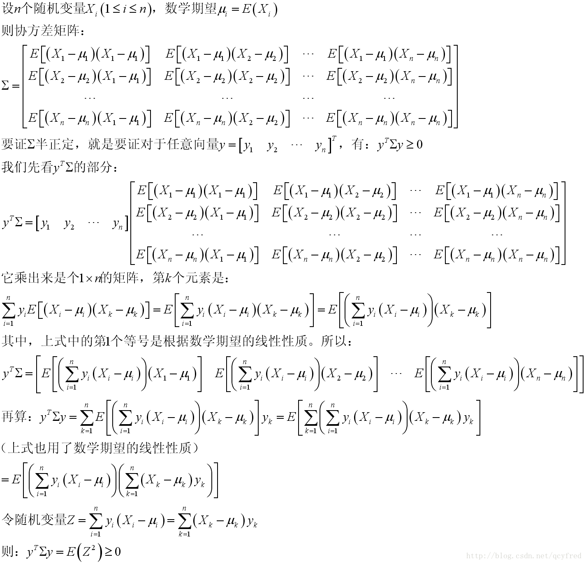

# 随机变量的数字特征

对任意随机变量 $X,Y$ 和常数 $a,b$，有 $E[aX+bY]=aE[X]+bE[Y]$

对独立的随机变量 $X,Y$ 和任意函数 $h(x),g(y)$ ，有 $E[h(X)g(Y)]=E[h(X)]E[g(Y)]$（反之不然，见独立性与相关性一节）

对任意随机变量 $X,Y$ 有Cauchy-Schwartz不等式 $E[XY]\leq \sqrt{E[X^2]E[Y^2]}$

## 期望

离散随机变量 $(X, Y)$ 的分布列为 $p_{i j}=P\left(X=x_{i}, Y=y_{j}\right)$, 则随机变量 $\boldsymbol{Z}=\boldsymbol{g}(\boldsymbol{X}, \boldsymbol{Y})$ 的期望为
$$
E[Z]=E[g(X, Y)]=\sum_{i, j} g\left(x_{i}, y_{j}\right) p_{i j}
$$
连续随机变量 $(X, Y)$ 的概率密度为 $f(x, y)$, 则随机变量 $\boldsymbol{Z}=\boldsymbol{g}(\boldsymbol{X}, \boldsymbol{Y})$ 的期望为
$$
E[Z]=E[g(X, Y)]=\int_{-\infty}^{+\infty} \int_{-\infty}^{+\infty} g(x, y) f(x, y) d x d y
$$

此外 $\displaystyle E[X]=\int_{-\infty}^{+\infty} \int_{-\infty}^{+\infty}xf(x,y)dxdy$

### 性质

* 对任意随机变量 $X, Y$ 和常数 $a, b$ 有 $E[a X+b Y]=a E[X]+b E[Y]$
* 对**独立**随机变量 $X$ 和 $Y$, 以及任意函数 $h(x)$ 和 $g(y)$, 有 $E[X Y]=E[X] E[Y]$ 和 $E[h(X) g(Y)]=E[h(X)] E[g(Y)]$
* 对任意随机变量 $X$ 和 $Y$, 有Cauchy-Schwartz不等式 $E[X Y] \leq \sqrt{E\left[X^{2}\right] E\left[Y^{2}\right]}$

## 方差

$Var(X+Y)=Var(X)+Var(Y)+2E[(X-E(X))(Y-E(Y))]$

当 $X,Y$ 独立时 $Var(X+Y)=Var(X)+Var(Y)$（反之不然，见独立性与相关性一节）

减法也是加号。

## 协方差

$Cov(X,Y)=E[(X-E(X))(Y-E(Y))]=E[XY]-E[X]E[Y]$

求协方差：求出三个期望（不需要求边缘分布函数，因为 $\displaystyle E[X]=\int_{-\infty}^{+\infty} \int_{-\infty}^{+\infty}xf(x,y)dxdy$）

### 性质

* $Cov(X,X)=Var(X)$
* 交换律：$Cov(X,Y)=Cov(Y,X)$
* $Cov(aX,bY)=abCov(X,Y)$
* $Cov(X+a,Y+b)=Cov(X,Y)$
* $Cov(X_1+X_2,Y)=Cov(X_1,Y)+Cov(X_2,Y)$
* 两个独立变量的协方差为 $0$
* $\displaystyle\operatorname{Cov}\left(\sum_{i=1}^{n} X_{i}, \sum_{j}^{m} Y_{j}\right)=\sum_{i=1}^{n} \sum_{j=1}^{m} \operatorname{Cov}\left(X_{i}, Y_{j}\right)$
* $\displaystyle \operatorname{Var}\left(\sum_{i}^{n} X_{i}\right)=\sum_{i}^{n} \operatorname{Var}\left(X_{i}\right)+2 \sum_{i<j} \operatorname{Cov}\left(X_{i}, X_{j}\right)$

### 相关性

根据前面的性质可知
$$
-1 \leq \frac{\operatorname{Cov}(X, Y)}{\sqrt{\operatorname{Var}(X) \operatorname{Var}(Y)}} \leq 1
$$
等号成立的充要条件是 $X$ 与 $Y$ 存在线性相关

上式一定程度上反应了随机变量 $X$ 和 $Y$ 的线性相关程度, 由此引入一个新概念一一相关系数

随机变量 $X$ 和 $Y$ 的方差 $\operatorname{Var}(X), \operatorname{Var}(Y)$ 存在且不为 0 , 称
$$
\rho_{X Y}=\frac{\operatorname{Cov}(X, Y)}{\sqrt{\operatorname{Var}(X) \operatorname{Var}(Y)}}
$$
为 $X$ 与 $Y$ 的相关系数, 简记 $\rho$

> 使用相关系数而不是 $\operatorname{Cov}(X, Y)$, 主要是规范 $\left|\rho_{X Y}\right| \leq 1$, 而 $\operatorname{Cov}(X, Y)$ 受数值大小影响

* 相关系数 $\left|\rho_{X Y}\right| \leq 1:$ 
  * 若 $\rho>0, X$ 与 $Y$ 正相关;
  * 若 $\rho<0, X$ 与 $Y$ 负相关;
*  $\left|\rho_{X Y}\right|=1$ 的充要条件为 $X$ 与 $Y$ 有线性关系 $Y=a X+b$
* 若相关系数 $\left|\rho_{X Y}\right|=0$, 则随机变量 $X$ 和 $Y$ 不相关，（不代表 $X$ 和 $Y$ 独立）

本质上 $\rho_{X Y}$ 刻画了 $X$ 与 $Y$ 的线性相关程度, 又称为 “线性相关系数”

#### 等价条件

以下条件相互等价：

* $\rho_{XY}=0$
* $Cov(X,Y)=0$
* $E(XY)=E(X)E(Y)$
* $Var(X\pm Y)=Var(X)+Var(Y)$

#### 独立与相关性

不相关只是没有线性关系，可能有其他关系

独立可以推到不相关，不相关不能推到独立

* 反例：
  * $X\sim U(-1,1)$
  * $Y=(X==0?1:0)$（这不是数学写法，明白就行）
  * 此时不独立，但不相关

#### 二维正态分布的相关系数

对于二维正态分布：
$$
\binom{X}{Y}\sim N\left(\binom{\mu_1}{\mu_2},\left(\begin{array}{cc}
\sigma_{x}^{2} & \rho \sigma_{x} \sigma_{y} \\
\rho \sigma_{x} \sigma_{y} & \sigma_{y}^{2}
\end{array}\right)\right)
$$

$Cov(X,Y)=\rho\sigma_1\sigma_2$

参数 $\rho$ 为两个随机变量的相关系数

**仅限于正态分布**：独立等价于不相关

#### 求相关系数

先求边缘分布，然后求方差，再求相关系数

## 多维随机变量的期望和协方差矩阵

设 $X=\left(X_{1}, X_{2}, \cdots, X_{n}\right)^{\top}$, 则随机向量的**期望**
$$
E(X)=\left(E\left(X_{1}\right), E\left(X_{2}\right), \cdots, E\left(X_{n}\right)\right)^{\top}
$$
称随机变量 $X$ 的**协方差矩阵**为
$$
\operatorname{Cov}(X)=\Sigma=\left(\begin{array}{ccc}
\operatorname{Cov}\left(X_{1}, X_{1}\right) & \cdots & \operatorname{Cov}\left(X_{1}, X_{n}\right) \\
\operatorname{Cov}\left(X_{2}, X_{1}\right) & \cdots & \operatorname{Cov}\left(X_{2}, X_{n}\right) \\
\vdots & & \vdots \\
\operatorname{Cov}\left(X_{n}, X_{1}\right) & \cdots & \operatorname{Cov}\left(X_{n}, X_{n}\right)
\end{array}\right)
$$
### 性质

#### 随机变量 $X$ 的协方差矩阵是对称半正定的矩阵

对称性由协方差的对称性得到（即 $\operatorname{Cov}\left(X_{i}, X_{j}\right)=\operatorname{Cov}\left(X_{j}, X_{i}\right)$）

下面证明半正定性：

$\begin{aligned} f\left(t_{1}, t_{2}, \ldots, t_{n}\right) &=\left(t_{1}, t_{2}, \ldots, t_{n}\right)\left(\begin{array}{ccc}\operatorname{Cov}\left(X_{1}, X_{1}\right) & \cdots & \operatorname{Cov}\left(X_{1}, X_{n}\right) \\ \operatorname{Cov}\left(X_{2}, X_{1}\right) & \cdots & \operatorname{Cov}\left(X_{2}, X_{n}\right) \\ \vdots && \vdots &  \\ \operatorname{Cov}\left(X_{n}, X_{1}\right) & \cdots & \operatorname{Cov}\left(X_{n}, X_{n}\right)\end{array}\right)\left(t_{1}, t_{2}, \ldots, t_{n}\right)^{\top} \\ &=E\left[\left(t_{1}\left(X_{1}-E\left[X_{1}\right]\right)+t_{2}\left(X_{2}-E\left[X_{2}\right]\right)+\cdots+t_{n}\left(X_{n}-E\left[X_{n}\right]\right)\right)^{2}\right] \geqslant 0 \end{aligned}$

上面是老师给的证明，省略了很多步骤。可以看这个（来自[CSDN用户qcyfred的文章](https://blog.csdn.net/qcyfred/article/details/71598815)）：

#### 在正态分布中的性质

定理 $5.22$ 设多维正态分布 $X=\left(X_{1}, X_{2}, \ldots, X_{n}\right)^{\top} \sim N(\mu, \Sigma)$, 则有
$$
\mu=\left(E\left[X_{1}\right], E\left[X_{2}\right], \ldots, E\left[X_{n}\right]\right)^{\top} \quad \text { 和 } \quad \Sigma=\left[\operatorname{Cov}\left(X_{i}, X_{j}\right)\right]_{n \times n}
$$
对多维随机变量 $X=\left(X_{1}, X_{2}, \cdots, X_{n}\right) \sim \mathcal{N}(\mu, \Sigma)$, 有
- 每个变量 $X_{i}$ 的边缘分布是正态分布;

- $X_{1}, X_{2}, \cdots, X_{n}$ 相互独立 $\Longleftrightarrow X_{1}, X_{2}, \cdots, X_{n}$ 相互不相关;

- $X \sim \mathcal{N}(\mu, \Sigma) \Longleftrightarrow \sum_{i=1}^{n} a_{i} X_{i}$ 是正态分布 $\left(\right.$ 对任意非全为 0 常数 $\left.a_{1}, a_{2}, \ldots, a_{n}\right)$

  - > 有点好奇这个怎么证，有空看看……

## 条件分布与期望

前面学过随机事件的条件概率, 即在事件 $B$ 发生的条件下事件 $A$ 发生的条件概率
$$
P(A \mid B)=P(A B) / P(B)
$$
相关概念可推广到随机变量: 给定随机变量 $Y$ 取值条件下求随机变量 $X$ 的概率分布, 即条件分布

### 离散型随机变量

设二维离散型随机变量 $(X, Y)$ 的分布列为 $\left\{p_{i j}\right\}$, 若 $Y$ 的边缘分布 $P\left(Y=y_{j}\right)=$ $p_{\cdot j}>0$, 称
$$
P\left(X=x_{i} \mid Y=y_{j}\right)=\frac{P\left(X=x_{i}, Y=y_{j}\right)}{P\left(Y=y_{j}\right)}=\frac{p_{i j}}{p_{\cdot j}} \quad(i=1,2, \cdots)
$$
为在 $Y=y_{j}$ 条件下随机变量 $X$ 的条件分布列。类似可定义在 $X=x_{i}$ 条件下随机变量 $Y$ 的条件分布列

条件分布是一种概率分布, 具有分布的性质：

* 非负性 $P\left(X=x_{i} \mid Y=y_{j}\right) \geqslant 0$
* 规范性 $\sum_{i=1}^{\infty} P\left(X=x_{i} \mid Y=y_{j}\right)=1$
* ……

#### [例题]

例 $5.22$ 一个选手击中目标的概率为 $p$, 射击进行到击中两次目标为止, 用 $X$ 表示首次击中目标所进行的射击次数, 用 $Y$ 表示第二次射中目标所进行的射击次数, 求 $X$ 和 $Y$ 的联合分布和条件分布.

解 随机变量 $X=m$ 表示首次击中目标射击了 $m$ 次, $Y=n$ 表示第二次次击中目标射击了 $n$ 次, 则 $X$ 和 $Y$ 的联合分布列为:
$$
P\{X=m, Y=n\}=f(x, y)= \begin{cases}p^{2}(1-p)^{n-2} & 1 \leqslant m<n<\infty \\ 0 & \text { 其它 }\end{cases}
$$
由此可得 $X$ 的边缘分布列为
$$
P\{X=m\}=\sum_{n=m+1}^{\infty} P\{X=m, Y=n\}=\sum_{n=m+1}^{\infty} p^{2}(1-p)^{n-2}=p^{2} \frac{(1-p)^{m-1}}{1-(1-p)}=p(1-p)^{m-1}
$$
同理得到随机变量 $Y$ 的边缘分布列为
$$
P\{Y=n\}=\sum_{m=1}^{n-1} P\{X=m, Y=n\}=\sum_{m=1}^{n-1} p^{2}(1-p)^{n-2}=(n-1) p^{2}(1-p)^{n-2}(n=2,3, \cdots)
$$
因此, 当 $n=2,3, \cdots$ 时, 随机变量 $X$ 在 $Y=n$ 条件下的分布列为:
$$
P\{X=m \mid Y=n\}=\frac{P\{X=m, Y=n\}}{P\{Y=n\}}=\frac{p^{2}(1-p)^{n-2}}{(n-1) p^{2}(1-p)^{n-2}}=\frac{1}{n-1} \quad m=1,2, \cdots, n-1
$$
当 $m=1,2,3, \cdots$ 时, 随机变量 $Y$ 在 $X=m$ 条件下的分布列为:
$$
P\{Y=n \mid X=m\}=\frac{P\{X=m, Y=n\}}{P\{X=m\}}=\frac{p^{2}(1-p)^{n-2}}{p(1-p)^{m-1}}=p(1-p)^{n-m-1} \quad n=m+1, m+2, \cdots
$$
### 连续型随机变量

对于连续型随机变量 $(X, Y)$, 对任意 $x, y \in(-\infty,+\infty)$, 有 $P(X=x)=0$ 和 $P(Y=y)=0$ 成 立, 因此不能利用离散随机变量的条件概率推导连续随机变量的条件分布. 下面给出条件概率的定义:

定义 $5.16$ 设连续随机变量 $(X, Y)$ 的联合概率密度为 $f(x, y)$, 以及 $Y$ 的边缘概率密度为 $f_{Y}(y)$, 对任意 $f_{Y}(y)>0$, 称
$$
f_{X \mid Y}(x \mid y)=\frac{f(x, y)}{f_{Y}(y)}
$$
在 $Y=y$ 条件下随机变量 $X$ 的条件概率密度; 称
$$
F_{X \mid Y}(x \mid y)=P\{X \leqslant x \mid Y=y\}=\int_{-\infty}^{x} f_{X \mid Y}(u \mid y) d u
$$
为 $Y=y$ 条件下 $X$ 的条件分布函数.

类似可定义在 $X=x$ 条件下随机变量 $Y$ 的条件概率密度和分布函数分别为
$$
f_{Y \mid X}(y \mid x)=\frac{f(x, y)}{f_{X}(x)} \quad F_{Y \mid X}(y \mid x)=\int_{-\infty}^{y} \frac{f(x, v)}{f_{X}(x)} d v
$$
##### 离散型随机变量的条件概率的一种解释

这里以 $\displaystyle f_{X \mid Y}=\frac{f(x, y)}{f_{Y}(y)}$ 为例, 首先分布函数有
$$
F_{X \mid Y}(x \mid y)=\lim _{\epsilon \rightarrow 0^{+}} P\{X \leqslant x \mid y \leqslant Y \leqslant y+\epsilon\}=\lim _{\epsilon \rightarrow 0^{+}} \frac{P\{X \leqslant x, y \leqslant Y \leqslant y+\epsilon\}}{P\{y \leqslant Y \leqslant y+\epsilon\}}
$$
根据积分中值定理有
$$
\frac{P\{X \leqslant x, y \leqslant Y \leqslant y+\epsilon\}}{P\{y \leqslant Y \leqslant y+\epsilon\}}=\frac{\int_{-\infty}^{x} \int_{y}^{y+\epsilon} f(u, v) d u d v}{\int_{y}^{y+\epsilon} f_{Y}(u) d v}=\frac{\epsilon \int_{-\infty}^{x} f\left(u, y+\theta_{1} \epsilon\right) d u}{\epsilon f_{Y}\left(y+\theta_{2} \epsilon\right)}
$$
其中 $\theta_{1}, \theta_{2} \in(0,1)$. 当 $\epsilon \rightarrow 0^{+}$时, 有
$$
F_{X \mid Y}(x \mid y)=\lim _{\epsilon \rightarrow 0^{+}} P\{X \leqslant x \mid y \leqslant Y \leqslant y+\epsilon\}=\frac{\int_{-\infty}^{x} f(u, y) d u}{f_{Y}(y)}=\int_{-\infty}^{x} \frac{f(u, y)}{f_{Y}(y)} d u
$$
由此可得条件概率密度 $f_{X \mid Y}(x \mid y)=f(x, y) / f_{Y}(y)$

### 条件概率的性质

#### 乘法公式

对于随机变量 $X$ 和 $Y$, 有
$$
\begin{aligned}
&f(x, y)=f_{X}(x) f_{Y \mid X}(y \mid x), \quad\left(f_{X}(x)>0\right) \\
&f(x, y)=f_{Y}(y) f_{X \mid Y}(x \mid y), \quad\left(f_{Y}(y)>0\right)
\end{aligned}
$$
若随机变量 $X$ 和 $Y$ 相互独立, 则有联合概率密度 $f(x, y)=f_{X}(x) f_{Y}(y)$, 由此可得：

如果随机变量 $X$ 和 $Y$ 相互独立, 则有
$$
f_{Y \mid X}(y \mid x)=f_{Y}(y) \quad \text { 和 } \quad f_{X \mid Y}(x \mid y)=f_{X}(x)
$$
由此可根据条件概率来可判别随机变量 $(X, Y)$ 的独立性

#### 多维正态分布的条件分布还是正态分布

第 19 次课讲义有二维证明

某次作业（6或7？）中我对多维情况做了证明

### 条件期望

定义 $5.17$ 对二维离散随机变量 $(X, Y)$, 在 $Y=y$ 条件下随机变量 $X$ 的期望为
$$
E[X \mid Y=y]=\sum_{i=1}^{\infty} x_{i} P\left(X=x_{i} \mid Y=y\right)
$$
对二维连续随机变量 $(X, Y)$, 在 $Y=y$ 条件下随机变量 $X$ 的期望为
$$
E[X \mid Y=y]=\int_{-\infty}^{+\infty} x f(x \mid y) d x
$$
注意 $E[X \mid Y=y]$ 是 $y$ 的函数

#### 性质

##### 线性性质

定理 $5.24$ 对离散随机变量 $X_{1}, X_{2}, \cdots, X_{n}$ 及常数 $c_{1}, c_{2}, \cdots, c_{n}$ 有
$$
E\left[\sum_{i=1}^{n} c_{i} X_{i} \mid Y=y\right]=\sum_{i=1}^{n} c_{i} E\left[X_{i} \mid Y=y\right]
$$
##### 全期望公式 (law of total expectation) 

对随机变量 $X$ 和事件 $A$ 有
$$
E[X]=E[X \mid A] P(A)+E[X \mid \bar{A}](1-P(A))
$$
其中事件 $\bar{A}$ 为事件 $A$ 的补.

全期望公式对应于全概率公式的期望版本, 在很多应用中有重要的性质。

推论：

对二维随机变量 $(X, Y)$ 有
$$
E[X]=E_{Y}[E(X \mid Y)]
$$
特别地, 对二维离散随机变量有
$$
E[X]=E[E(X \mid Y)]=\sum_{Y=y_{j}} P\left[Y=y_{j}\right] E\left[X \mid Y=y_{j}\right]
$$
