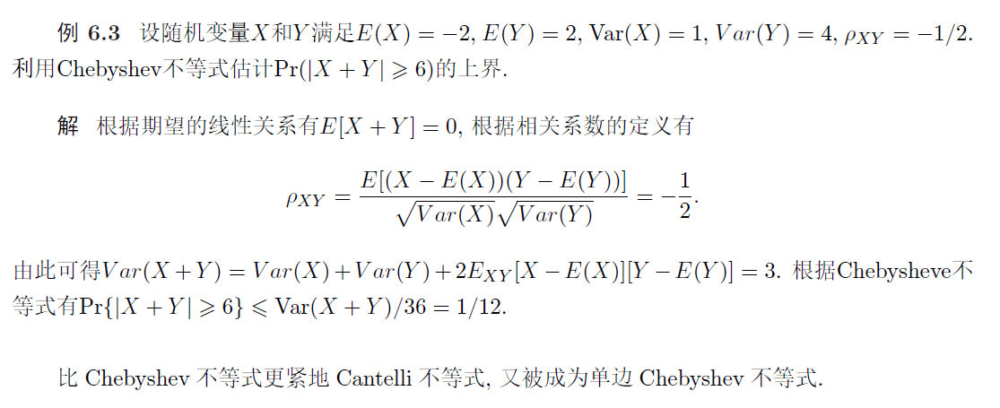

# 9 集中不等式(Concentration)

20-21次讲义

这里考基本的不等式、chernoff方法、二值、有界和高斯的chernoff

Bennet、Bernstein、JL不考

## 应用

给定一个训练数据集
$$
S_{n}=\left\{\left(x_{1}, y_{1}\right),\left(x_{2}, y_{2}\right), \ldots,\left(x_{n}, y_{n}\right)\right\}
$$
其中 $x_{i} \in \mathcal{X} \subseteq \mathbb{R}^{d}$ 表示第 $i$ 个训练样本的特征 (feature), $y_{i} \in \mathcal{Y}=\{0,1\}$ 表示第 $i$ 个训练样本的标记 (二分类). 假设 $\mathcal{D}$ 是空间 $\mathcal{X} \times \mathcal{Y}$ 的一个末知不可见的联合分布. 机器学习的经典假设是训练数据 集 $S_{n}$ 中每个数据 $\left(x_{i}, y_{i}\right)$ 是根据分布 $\mathcal{D}$ 独立同分布采样所得.
给定一个函数或分类器 $f: \mathcal{X} \rightarrow\{0,1\}$, 定义函数 $f$ 在训练数据集 $S_{n}$ 上的分类错误率为
$$
\hat{R}\left(f, S_{n}\right)=\frac{1}{n} \sum_{i=1}^{n} \mathbb{I}\left(f\left(x_{i}\right) \neq y_{i}\right)
$$
这里 $\mathbb{I}(\cdot)$ 表示指示函数, 当论断为真时其返回值为 1 , 否则为 0 . 在实际应用中我们更关心函数 $f$ 对 末见数据的分类性能, 即函数 $f$ 在分布 $\mathcal{D}$ 上的分类错误率, 称之为 '泛化错误率,
$$
R(f, \mathcal{D})=E_{(x, y) \sim \mathcal{D}}(\mathbb{I}(f(x) \neq y))=\operatorname{Pr}_{(x, y) \sim \mathcal{D}}[f(x) \neq y]
$$
由于分布 $\mathcal{D}$ 不可知, 不能直接计算 $R(f, \mathcal{D})$, 但我们已知训练数据集 $S_{n}$ 和训练错误率 $\hat{R}\left(f, S_{n}\right)$。

**如何基于训练错误率 $\hat{R}\left(f, S_{n}\right)$ 来有效估计 $R(f, \mathcal{D})$ ?** 我们可以**将问题归纳为**
$$
\operatorname{Pr}_{S_{n} \sim D^{n}}\left[\left|\hat{R}\left(f, D_{n}\right)-R(f)\right| \geqslant t\right] \text { 是否足够小? }
$$
即能否以很大的概率保证
$$
\left|\hat{R}\left(f, D_{n}\right)-R(f)\right|<t
$$
从而在理论上保证 $\hat{R}\left(f, D_{n}\right)$ 是 $R(f)$ 的一个有效估计. 上述性质在机器学习中被称为'泛化性', 是机器学习模型理论研究的根本性质, **研究模型能否从可见的训练数据推导出对末见数据的处理能力**

### [例]

假设训练数据集 $S_{n}=\left\{\left(x_{1}, y_{1}\right),\left(x_{2}, y_{2}\right), \ldots,\left(x_{n}, y_{n}\right)\right\}$ 根据分布 $\mathcal{D}$ 独立采样所得, 分类器 $f$ 在训练集 $S_{n}$ 的错误率为零 (全部预测正确), 求分类器 $f$ 在分布 $\mathcal{D}$ 上的错误率介于 0 和 $\epsilon$ 之 间的概率 $(\epsilon>0)$.

设随机变量
$$
X_{i}=\mathbb{I}\left[f\left(x_{i}\right) \neq y_{i}\right] \quad(i \in[n])
$$

根据数据集的独立同分布假设可知 $X_{1}, X_{2}, \ldots, X_{n}$ 是独立同分布的随机变量. 令 $p=E\left[X_{i}\right]$, 则有 $X_{i} \sim \operatorname{Ber}(p)$. 分类器 $f$ 在训练集 $S_{n}$ 的错误率为零, 且在分布 $\mathcal{D}$ 上的错误率大于 $\epsilon$ 的概率为
$$
\begin{aligned}
&\operatorname{Pr}\left[\sum_{i=1}^{n} X_{i}=0, p>\epsilon\right] \leqslant \operatorname{Pr}\left[\sum_{i=1}^{n} X_{i}=0 \mid p>\epsilon\right] \\
&\quad=\operatorname{Pr}\left[X_{1}=0, X_{2}=0, \ldots, X_{n}=0 \mid p>\epsilon\right] \quad \text { (根据独立性假设) } \\
&\quad=\prod_{i=1}^{n} \operatorname{Pr}\left[X_{i}=0 \mid p>\epsilon\right] \leqslant(1-\epsilon)^{n} \leqslant \exp (-n \epsilon)
\end{aligned}
$$
因此当分类器 $f$ 在训练集 $S_{n}$ 的错误率为零且 $p \in(0, \epsilon)$ 的概率至少以 $1-\exp (-n \epsilon)$ 成立

对上例的求解进一步进行归纳, 设随机变量
$$
X_{i}=\mathbb{I}\left(f\left(x_{i}\right) \neq y_{i}\right)
$$
则机器学习问题可通过概率统计抽象描述为: 假设有 $n$ 个独立同分布的随机变量 $X_{1}, X_{2}, \ldots, X_{n}$, 如何从 $n$ 个独立同分布的随机变量中以很大概率地获得期望 $E[X]$ 的一个估计, 即 $\operatorname{Pr}\left[\left|\frac{1}{m} \sum_{i=1}^{m} X_{i}-E\left(X_{i}\right)\right|>\epsilon\right] \quad$ 非常小.

## 基础不等式

### Markov不等式

对任意随机变量 $X \geqslant 0$ 和 $\epsilon>0$, 有
$$
P(X \geqslant \epsilon) \leqslant \frac{E(X)}{\epsilon}
$$
**证明** 利用全期望公式考虑随机事件 $X \geqslant \epsilon$ 有
$$
E[X]=E[X \mid X \geqslant \epsilon] P(X \geqslant \epsilon)+E[X \mid X \leqslant \epsilon] P(X \leqslant \epsilon) \geqslant P(X \geqslant \epsilon) \epsilon
$$
从而完成证明

#### 推论

对任意随机变量 $X$ 和 $\epsilon \geqslant 0$, 以及单调递增的非负函数 $g(x)$, 有
$$
P(X \geqslant \epsilon) \leqslant \frac{E[g(X)]}{g(\epsilon)}
$$
### Chebyshev 不等式

利用 Markov 不等式可以推导 Chebyshev 不等式:

定理 $6.2$ (Chebyshev 不等式) 设随机变量 $X$ 的均值为 $\mu$, 则有
$$
P(|X-\mu|>\epsilon) \leqslant \frac{\operatorname{Var}(X)}{\epsilon^{2}}
$$
**证明** 根据 Markov 不等式有
$$
P(|X-\mu|>\epsilon)=P\left((X-\mu)^{2} \geqslant \epsilon^{2}\right) \leqslant \frac{E[(X-\mu)^{2}]}{\epsilon^{2}}=\frac{\operatorname{Var}(X)}{\epsilon^{2}}
$$

#### [例]

#### 推论 1

引理 $6.1$ 随机变量 $X$ 的均值 $\mu>0$, 方差 $\sigma^{2}$, 则对任意 $\epsilon>0$ 有
$$
P(X-\mu \geqslant \epsilon) \leqslant \frac{\sigma^{2}}{\sigma^{2}+\epsilon^{2}} \quad \text { 和 } \quad P(X-\mu \leqslant-\epsilon) \leqslant \frac{\sigma^{2}}{\sigma^{2}+\epsilon^{2}}
$$
证明 设随机变量 $Y=X-\mu$, 有 $E(Y)=0$ 以及 $\operatorname{Var}(Y)=\sigma^{2}$. 对任意 $t>0$ 有
$$
\begin{aligned}
P(X-\mu \geqslant \epsilon) &=P(Y \geqslant \epsilon)=P(Y+t \geqslant \epsilon+t) \leqslant P\left((Y+t)^{2} \geqslant(\epsilon+t)^{2}\right) \\
& \leqslant \frac{E\left((Y+t)^{2}\right)}{(\epsilon+t)^{2}}=\frac{\sigma^{2}+t^{2}}{(\epsilon+t)^{2}}
\end{aligned}
$$
对 $\left(\sigma^{2}+t^{2}\right) /(\epsilon+t)^{2}$ 求关于 $t$ 的最小值, 求解可得 $t=\sigma^{2} / \epsilon$, 由此得到
$$
P(X-\mu \geqslant \epsilon) \leqslant \min _{t>0} \frac{\sigma^{2}+t^{2}}{(\epsilon+t)^{2}}=\frac{\sigma^{2}}{\epsilon^{2}+\sigma^{2}}
$$
另一方面, 对任意 $t>0$ 有
$$
\begin{aligned}
P(X-\mu \leqslant-\epsilon) &=P(Y \leqslant-\epsilon)=P(Y-t \leqslant-\epsilon-t) \leqslant P\left((Y-t)^{2} \geqslant(\epsilon+t)^{2}\right) \\
& \leqslant \frac{E\left((Y-t)^{2}\right)}{(\epsilon+t)^{2}}=\frac{\sigma^{2}+t^{2}}{(\epsilon+t)^{2}}
\end{aligned}
$$
> 注意讲义里面上面的公式有两个符号错了，以笔记为准

同理完成证明

#### 推论 2

推论 $6.2$ 设独立同分布的随机变量 $X_{1}, X_{2}, \ldots, X_{n}$ 满足 $E\left(X_{i}\right)=\mu$ 和 $\operatorname{Var}\left(X_{i}\right) \leqslant \sigma^{2}$, 对任意 $\epsilon>0$ 有
$$
\operatorname{Pr}\left(\left|\frac{1}{n} \sum_{i=1}^{n} X_{i}-\mu\right| \geqslant \epsilon\right) \leqslant \frac{\sigma^{2}}{n \epsilon^{2}}
$$
**证明** 根据 Chebyshev 不等式有
$$
\operatorname{Pr}\left(\left|\frac{1}{n} \sum_{i=1}^{n} X_{i}-\mu\right| \geqslant \epsilon\right) \leqslant \frac{1}{\epsilon^{2}} \operatorname{Var}\left(\frac{1}{n} \sum_{i=1}^{n} X_{i}\right)
$$
而独立同分布的假设有
$$
\operatorname{Var}\left(\frac{1}{n} \sum_{i=1}^{n} X_{i}\right)=\frac{1}{n^{2}} \operatorname{Var}\left(\sum_{i=1}^{n} X_{i}\right)=\frac{1}{n} \operatorname{Var}\left(X_{i}\right) \leqslant \frac{\sigma^{2}}{n}
$$
由此得到
$$
\operatorname{Pr}\left(\left|\frac{1}{n} \sum_{i=1}^{n} X_{i}-\mu\right| \geqslant \epsilon\right) \leqslant \frac{\sigma^{2}}{n \epsilon^{2}}
$$
从而完成证明

### Young 不等式

给定常数 $a>0, b>0$, 对满足 $1 / p+1 / q=1$ 的实数 $p>0, q>0$ 有（其实是 $p,q>1$）
$$
a b \leqslant \frac{1}{p} a^{p}+\frac{1}{q} b^{q}
$$
**证明** 根据凸函数性质有
$$
\begin{aligned}
a b &=\exp (\ln (a b))=\exp (\ln a+\ln b)=\exp \left(\frac{1}{p} \ln a^{p}+\frac{1}{q} \ln b^{q}\right) \\
& \leqslant \frac{1}{p} \exp \left(\ln a^{p}\right)+\frac{1}{q} \exp \left(\ln b^{q}\right)=\frac{1}{p} a^{p}+\frac{1}{q} b^{q}
\end{aligned}
$$
得证

###  Hölder 不等式

对任意随机变量 $X$ 和 $Y$ 以及实数 $p>0$ 和 $q>0$ 满足 $1 / p+1 / q=$ 1 , 有
$$
E(|X Y|) \leqslant\left(E\left(|X|^{p}\right)\right)^{\frac{1}{p}}\left(E\left(|Y|^{q}\right)\right)^{\frac{1}{q}}
$$
特别地, 当 $p=q=2$ 时 Hölder 不等式变成为 Cauchy-Schwartz 不等式.

**证明** 设 $c=\left(E\left(|X|^{p}\right)\right)^{\frac{1}{p}}$ 和 $d=\left(E\left(|Y|^{q}\right)\right)^{\frac{1}{q}}$, 根据 Young 不等式有
$$
\frac{|X Y|}{c d}=\frac{|X|}{c} \frac{|Y|}{d} \leqslant \frac{1}{p} \frac{|X|^{p}}{c^{p}}+\frac{1}{q} \frac{|Y|^{q}}{d^{q}}
$$
两边同时取期望：
$$
\frac{E(|X Y|)}{c d}\leqslant \frac{1}{p} \frac{E(|X|^{p})}{c^{p}}+\frac{1}{q} \frac{E(|Y|^{q})}{d^{q}}=\frac1p+\frac1q=1
$$

## Chernoff 不等式

### 矩生成函数(Moment Generating Function)

定义随机变量 $X$ 的矩生成函数为 $M_X(t)=E[e^{tX}]$

#### 性质

##### 1

设随机变量 $X$ 的矩生成函数为 $M_{X}(t)$, 对任意 $n \geqslant 1$ 有
$$
E\left[X^{n}\right]=M_{X}^{(n)}(0)
$$
这里 $M_{X}^{(n)}(t)$ 表示矩生成函数在 $t=0$ 的 $n$ 阶导数, 而 $E\left[X^{n}\right]$ 被称为随机变量 $X$ 的 $n$ 阶矩 (moment)

**证明** 由 Tayler 公式有
$$
e^{t X}=\sum_{i=1}^{\infty} \frac{(t X)^{i}}{i !}
$$
两边同时取期望有
$$
E\left[e^{t X}\right]=\sum_{i=1}^{\infty} \frac{t^{i}}{i !} E\left[X^{i}\right]
$$
对上式两边分别对 $t$ 求 $n$ 阶导数并取 $t=0$ 有 $M_{X}^{(n)}(t)=E\left[X^{n}\right]$

##### 2

对随机变量 $X$ 和 $Y$, 如果存在常数 $\delta>0$, 使得当 $t \in(-\delta, \delta)$ 时有 $M_{X}(t)=M_{Y}(t)$ 成立, 那么 $X$ 与 $Y$ 有相同的分布

上述定理表明**随机变量的矩生成函数可唯一确定随机变量的分布**（其证明超出了本书的范围）

若随机变量 $X$ 与 $Y$ 独立, 则有
$$
M_{X+Y}(t)=E\left[e^{(X+Y) t}\right]=E\left[e^{t X} e^{t Y}\right]=E\left[e^{t X}\right] \cdot E\left[e^{t Y}\right]=M_{X}(t) M_{Y}(t)
$$
于是得到对任意独立的随机变量 $X$ 和 $Y$ 有 $M_{X+Y}(t)=M_{X}(t) M_{Y}(t)$

### Chernoff 方法

下面将利用矩生成函数来证明一系列不等式. 给定任意随机变量 $X$ 和任意 $t>0$ 和 $\epsilon>0$, 利用 Markov 不等式有
$$
\operatorname{Pr}[X \geqslant E[X]+\epsilon]=\operatorname{Pr}\left[e^{t X} \geqslant e^{t E[X]+t \epsilon}\right] \leqslant e^{-t \epsilon-t E[X]} E\left[e^{t X}\right]
$$
特别地, 有
$$
\operatorname{Pr}[X-E[X] \geqslant \epsilon] \leqslant \min _{t>0}\left\{e^{-t \epsilon-t E[X]} E\left[e^{t X}\right]\right\}
$$
> 复习时注意讲义里面上面的公式是写错了的

类似地, 对任意 $\epsilon>0$ 和 $t<0$ 有
$$
\operatorname{Pr}[X \leqslant E[X]-\epsilon]=\operatorname{Pr}\left[e^{t X} \geqslant e^{t E[X]-t \epsilon}\right] \leqslant e^{t \epsilon-t E[X]} E\left[e^{t X}\right]
$$
同理有
$$
\operatorname{Pr}[X \leqslant \epsilon] \leqslant \min _{t<0}\left\{e^{t \epsilon-t E[X]} E\left[e^{t X}\right]\right\}
$$
上述方法称为 **Chernoff 方法**，是证明集中不等式一种最根本最重要的方法. 下面将针对特定的分布或特定的条件, 先求解矩生成函数 $E\left[e^{t X}\right]$, 然后求解最小值 $t$ 的取值

### 二值随机变量的Chernoff不等式

#### $\epsilon >0$ 时

定理 $6.5$ 设随机变量 $X_{1}, X_{2}, \cdots, X_{n}$ 相互独立且满足 $X_{i} \sim \operatorname{Ber}\left(p_{i}\right)$, 令 $\mu=\sum_{i=1}^{n} E\left[X_{i}\right]=$ $\sum_{i=1}^{n} p_{i}$. 对任意 $\epsilon>0$ 有
$$
\operatorname{Pr}\left[\sum_{i=1}^{n} X_{i} \geqslant(1+\epsilon) \mu\right] \leqslant\left(\frac{e^{\epsilon}}{(1+\epsilon)^{(1+\epsilon)}}\right)^{\mu}
$$
对任意 $\epsilon \in(0,1)$ 有
$$
\operatorname{Pr}\left[\sum_{i=1}^{n} X_{i} \geqslant(1+\epsilon) \mu\right] \leqslant e^{-\mu \epsilon^{2} / 3}
$$
上述第一个不等式给出了最紧的不等式上界, 第二个不等式是第一个不等式的适当放松

**证明** 令 $\bar{X}=\sum_{i=1}^{n} X_{i}$. 对任意 $t>0$, 根据 Chernoff 方法有
$$
\operatorname{Pr}[\bar{X} \geqslant(1+\epsilon) \mu]=\operatorname{Pr}\left[e^{t \bar{X}} \geqslant e^{t(1+\epsilon) \mu}\right] \leqslant e^{-t(1+\epsilon) \mu} E\left[e^{t \bar{X}}\right]
$$
利用随机变量的独立性以及 $1+x \leqslant e^{x}$ 有
$$
\begin{aligned}
E\left[e^{t \bar{X}}\right] &=E\left[e^{\sum_{i=1}^{n} t X_{i}}\right]=\prod_{i=1}^{n} E\left[e^{t X_{i}}\right] \\
&=\prod_{i=1}^{n}\left[\left(1-p_{i}\right)+p_{i} e^{t}\right]=\prod_{i=1}^{n}\left[1+p_{i}\left(e^{t}-1\right)\right]\\
&\leqslant \exp \left(\sum_{i=1}^{n} p_{i}\left(e^{t}-1\right)\right)=\exp \left(\mu\left(e^{t}-1\right)\right)
\end{aligned}
$$
由此可得
$$
\operatorname{Pr}[\bar{X} \geqslant(1+\epsilon) \mu] \leqslant \exp \left(-t(1+\epsilon) \mu+\mu\left(e^{t}-1\right)\right)
$$
对上式求最小值解得 $t_{\min }=\ln (1+\epsilon)$, 代入可得
$$
\operatorname{Pr}[\bar{X} \geqslant(1+\epsilon) \mu] \leqslant\left(\frac{e^{\epsilon}}{(1+\epsilon)^{(1+\epsilon)}}\right)^{\mu}
$$
对第二个不等式, 只需证明当 $\epsilon \in(0,1)$ 有
$$
f(\epsilon)=\ln \left(\frac{e^{\epsilon}}{(1+\epsilon)^{(1+\epsilon)}}\right)+\frac{\epsilon^{2}}{3}=\epsilon-(1+\epsilon) \ln (1+\epsilon)+\frac{\epsilon^{2}}{3} \leqslant 0
$$
易知 $f(0)=0$ 和 $f(1)<0$. 当 $\epsilon \in(0,1)$,
$$
f^{\prime}(\epsilon)=-\ln (1+\epsilon)+2 \epsilon / 3, \quad f^{\prime \prime}(\epsilon)=-\frac{1}{1+\epsilon}+\frac{2}{3}
$$
于是得到 $f^{\prime}(0)=0, f^{\prime}(1)=-0.0265<0$ 和 $f^{\prime}(1 / 2)=-0.0721<0$, 由连续函数性质有 $f^{\prime}(\epsilon) \leqslant 0$, 即函数 $f(\epsilon)$ 在 $[0,1]$ 上单调递减. 当 $\epsilon \geqslant 0$ 时有 $f(\epsilon) \leqslant f(0)=0$, 所以 $\exp (f(\epsilon)) \leqslant 1$.

#### $\epsilon <0$ 时

同理，设随机变量 $X_{1}, X_{2}, \cdots, X_{n}$ 相互独立且满足 $X_{i} \sim \operatorname{Ber}\left(p_{i}\right)$, 令 $\mu=\sum_{i=1}^{n} E\left[X_{i}\right]=$ $\sum_{i=1}^{n} p_{i}$. 对任意 $\epsilon \in(0,1)$ 有
$$
\operatorname{Pr}\left[\sum_{i=1}^{n} X_{i} \leqslant(1-\epsilon) \mu\right] \leqslant\left(\frac{e^{-\epsilon}}{(1-\epsilon)^{(1-\epsilon)}}\right)^{\mu} \leqslant \exp \left(-\mu \epsilon^{2} / 2\right)
$$
#### Rademacher 随机变量

定义 $6.2$ 若随机变量 $X \in\{+1,-1\}$ 满足
$$
\operatorname{Pr}(X=+1)=\operatorname{Pr}(X=-1)=1 / 2
$$
则称 $X$ 为 Rademacher 随机变量

我们有如下定理

定理 $6.7$ 对 $n$ 个独立的 Rademacher 随机变量 $X_{1}, X_{2}, \cdots, X_{n}$, 有
$$
\operatorname{Pr}\left(\frac{1}{n} \sum_{i=1}^{n} X_{i} \geqslant \epsilon\right) \leqslant \exp \left(-n \epsilon^{2} / 2\right)\\
\quad \operatorname{Pr}\left(\frac{1}{n} \sum_{i=1}^{n} X_{i} \leqslant-\epsilon\right) \leqslant \exp \left(-n \epsilon^{2} / 2\right)
$$
证明 根据 Taylor 展开式有
$$
\frac{1}{2} \exp (t)+\frac{1}{2} \exp (-t)=\sum_{i \geqslant 0} \frac{t^{2 i}}{(2 i) !} \leqslant \sum_{i \geqslant 0} \frac{\left(t^{2} / 2\right)^{i}}{i !}=\exp \left(t^{2} / 2\right)
$$
若随机变量 $X \in\{+1,-1\}$ 且满足 $\operatorname{Pr}(X=1)=\operatorname{Pr}(X=-1)=1 / 2$, 则有
$$
E\left[e^{t X}\right]=\frac{1}{2} e^{t}+\frac{1}{2} e^{-t} \leqslant \exp \left(t^{2} / 2\right)
$$
对任意 $t>0$, 根据 Chernoff 方法有
$$
\begin{aligned}
\operatorname{Pr}\left(\frac{1}{n} \sum_{i=1}^{n} X_{i} \geqslant \epsilon\right)&=\operatorname{Pr}\left(\sum_{i=1}^{n} X_{i} \geqslant n\epsilon\right)\\ & \leqslant \exp (-n t \epsilon) E\left[\exp \left(\sum_{i=1}^{n} t X_{i}\right)\right] \\
&=\exp (-n t \epsilon) \prod_{i=1}^{n} E\left[\exp \left(t X_{i}\right)\right] \leqslant \exp \left(-n t \epsilon+n t^{2} / 2\right)
\end{aligned}
$$
通过对上式右边求最小值解得 $t=\epsilon$, 带入上式得到
$$
\operatorname{Pr}\left(\frac{1}{n} \sum_{i=1}^{n} X_{i} \geqslant \epsilon\right) \leqslant \exp \left(-n \epsilon^{2} / 2\right)
$$
同理证明另一个不等式

**推论**

对独立同分布的随机变量 $X_{1}, X_{2}, \cdots, X_{n}$ ，若满足 $P\left(X_{1}=0\right)=P\left(X_{1}=1\right)=1 / 2$, 有

$$
\operatorname{Pr}\left(\frac{1}{n} \sum_{i=1}^{n} X_{i}-\frac{1}{2} \geqslant \epsilon\right) \leqslant \exp \left(-2 n \epsilon^{2}\right) \\
\operatorname{Pr}\left(\frac{1}{n} \sum_{i=1}^{n} X_{i}-\frac{1}{2} \leqslant-\epsilon\right) \leqslant \exp \left(-2 n \epsilon^{2}\right)
$$

### 有界随机变量的Chernoff不等式

本节研究有界的随机变量 $X_{i} \in[a, b]$ 的 Chernoff 不等式. 首先介绍著名的 Chernoff 引理

#### Chernoff 引理

设随机变量 $X \in[0,1]$ 的期望 $\mu=E[X]$. 对任意 $t>0$ 有
$$
E\left[e^{t X}\right] \leqslant \exp \left(t \mu+t^{2} / 8\right)
$$
**证明** 由凸函数的性质可知
$$
e^{t X}=e^{t X+(1-X) 0} \leqslant X e^{t}+(1-X) e^{0}
$$
两边再同时取期望有
$$
E\left(e^{t X}\right) \leqslant 1-\mu+\mu e^{t}=\exp \left(\ln \left(1-\mu+\mu e^{t}\right)\right)
$$
令 $f(t)=\ln \left(1-\mu+\mu e^{t}\right)$, 我们有 $f(0)=0$ 以及
$$
f^{\prime}(t)=\frac{\mu e^{t}}{1-\mu+\mu e^{t}} \Rightarrow f^{\prime}(0)=\mu
$$
进一步有
$$
f^{\prime \prime}(t)=\frac{\mu e^{t}}{1-\mu+\mu e^{t}}-\frac{\mu^{2} e^{2 t}}{\left(1-\mu+\mu e^{t}\right)^{2}} \leqslant 1 / 4
$$
> 这里利用了 $x-x^2\leqslant 1/4$

根据泰勒中值定理有
$$
f(t)=f(0)+t f^{\prime}(0)+f^{\prime \prime}(\xi) t^{2} / 2 \leqslant t \mu+t^{2} / 8
$$
引理得证.

##### 推理

由上面的 Chernoff 引理进一步推导出

设随机变量 $X \in[a, b]$ 的期望 $\mu=E[x]$. 对任意 $t>0$ 有
$$
E\left(e^{t X}\right) \leqslant \exp \left(\mu t+t^{2}(b-a)^{2} / 8\right)
$$
#### 不等式本体

根据上述推论, 我们得到有界随机变量的 Chernoff 不等式:

假设 $X_{1}, \ldots, X_{n}$ 是 $n$ 独立的随机变量、且满足 $X_{i} \in[a, b]$. 对任意 $\epsilon>0$ 有
$$
\begin{aligned}
\operatorname{Pr}\left[\frac{1}{n} \sum_{i=1}^{n} X_{i}-\frac{1}{n} \sum_{i=1}^{n} E\left[X_{i}\right] \geqslant \epsilon\right] & \leqslant \exp \left(-2 n \epsilon^{2} /(b-a)^{2}\right) \\
\operatorname{Pr}\left[\frac{1}{n} \sum_{i=1}^{n} X_{i}-\frac{1}{n} \sum_{i=1}^{n} E\left[X_{i}\right] \leqslant-\epsilon\right] & \leqslant \exp \left(-2 n \epsilon^{2} /(b-a)^{2}\right)
\end{aligned}
$$
**证明** 这里给出第一个不等式的证明, 第二个不等式证明作为习题. 对任意 $t>0$, 根据 Chernoff 方法有
$$
\begin{aligned}
\operatorname{Pr} &\left[\frac{1}{n} \sum_{i=1}^{n} X_{i}-\frac{1}{n} \sum_{i=1}^{n} E\left[X_{i}\right] \geqslant \epsilon\right] \\
&=\operatorname{Pr}\left[\sum_{i=1}^{n} t\left(X_{i}-E\left[X_{i}\right]\right) \geqslant n t \epsilon\right] \\
& \leqslant \exp (-n t \epsilon) E\left[\exp \left(\sum_{i=1}^{n} t\left(X_{i}-E\left[X_{i}\right]\right)\right)\right] \\
&=\exp (-n t \epsilon) \prod_{i=1}^{n} E\left[\exp \left(t\left(X_{i}-E\left[X_{i}\right]\right)\right)\right]
\end{aligned}
$$

根据 Chernoff 引理, 对任意 $X_{i} \in[a, b]$ 有
$$
E\left[\exp \left(t\left(X_{i}-E\left[X_{i}\right]\right)\right)\right] \leqslant \exp \left((b-a)^{2} t^{2} / 8\right)
$$
田此得到
$$
\operatorname{Pr}\left[\frac{1}{n} \sum_{i=1}^{n} X_{i}-\frac{1}{n} \sum_{i=1}^{n} E\left[X_{i}\right] \geqslant \epsilon\right] \leqslant \exp \left(-n t \epsilon+n t^{2}(b-a)^{2} / 8\right)
$$
对上式右边取最小值求解 $t=4 \epsilon /(b-a)^{2}$, 然后带入上式可得:
$$
\operatorname{Pr}\left[\frac{1}{n} \sum_{i=1}^{n} X_{i}-\frac{1}{n} \sum_{i=1}^{n} E\left[X_{i}\right] \geqslant \epsilon\right] \leqslant \exp \left(-2 n \epsilon^{2} /(b-a)^{2}\right)
$$
从而完成证明

### Gaussian 和 Sub-Gaussian 随机变量不等式(正态分布)

首先考虑独立同分布的 Gaussian 随机变量

定理 $6.9$ 设随机变量 $X_{1}, \ldots, X_{n}$ 相互独立、且服从 $X_{i} \sim \mathcal{N}(\mu, \sigma)$, 对任意 $\epsilon>0$ 有
$$
\operatorname{Pr}\left[\frac{1}{n} \sum_{i=1}^{n}\left(X_{i}-\mu\right) \geqslant \epsilon\right]=\operatorname{Pr}\left[\frac{1}{n} \sum_{i=1}^{n}\left(X_{i}-\mu\right) \leqslant-\epsilon\right] \leqslant \frac{1}{2} \exp \left(-n \epsilon^{2} / 2 \sigma^{2}\right)
$$

**证明** 对随机变量 $X_{i} \sim \mathcal{N}(\mu, \sigma)$, 根据正态分布的性质有
$$
\frac{1}{n} \sum_{i=1}^{n}\left(X_{i}-\mu\right) \sim \mathcal{N}\left(0, \sigma^{2} / n\right) \quad \Rightarrow \quad \frac{1}{\sqrt{n} \sigma} \sum_{i=1}^{n}\left(X_{i}-\mu\right) \sim \mathcal{N}(0,1)
$$
若 $X^{\prime} \sim \mathcal{N}(0,1)$, 对任意 $\epsilon>0$, 根据以前的定理（见笔记6 连续型随机变量）有
$$
P\left(X^{\prime} \geqslant \epsilon\right) \leqslant \frac{1}{2} e^{-\epsilon^{2} / 2}
$$
因此得到
$$
\operatorname{Pr}\left[\frac{1}{n} \sum_{i=1}^{n}\left(X_{i}-\mu\right) \geqslant \epsilon\right]=\operatorname{Pr}\left[\frac{1}{\sqrt{n} \sigma} \sum_{i=1}^{n}\left(X_{i}-\mu\right) \geqslant \epsilon \sqrt{n} / \sigma\right] \leqslant \frac{1}{2} \exp \left(-n \epsilon^{2} / 2 \sigma^{2}\right)
$$
定理得证

#### Sub-Gaussian

下面定义 **Sub-Gaussian 随机变量**, 将有界随机变量和 Gaussian 随机变量统一起来: 

对任意 $t \in(-\infty,+\infty)$, 若随机变量 $X$ 满足
$$
E\left[e^{(X-E[X]) t}\right] \leqslant \exp \left(b t^{2} / 2\right)
$$

则称随机变量 $X$ 是服从参数为 $b$ 的亚高斯(sub_Gaussian)随机变量

亚高斯随机变量表示随机变量的尾部分布不会比一个高斯分布更严重

#### [例]

**例** $6.5$ 对任意有界的随机变量 $X \in[a, b]$, 根据 Chernoff 引理有
$$
E\left[e^{(X-\mu) t}\right] \leqslant \exp \left(t^{2}(b-a)^{2} / 8\right)
$$
即有界的随机变量是参数为 $(b-a)^{2} / 4$ 的亚高斯随机变量.

**例** $6.6$ 如果随机变量 $X$ 服从高斯分布 $\mathcal{N}\left(\mu, \sigma^{2}\right)$, 则有
$$
E\left[e^{(X-\mu) t}\right]=\int_{-\infty}^{+\infty} \frac{1}{\sqrt{2 \pi} \sigma} e^{x t} e^{-x^{2} / 2 \sigma^{2}} d x=e^{\sigma^{2} t^{2} / 2} \int_{-\infty}^{+\infty} \frac{1}{\sqrt{2 \pi}} e^{-(t \sigma-x / \sigma)^{2} / 2} d(x / \sigma)=e^{\sigma^{2} t^{2} / 2}
$$
Gaussian 随机变量是参数为 $\sigma^{2}$ 的亚高斯随机变量

### 不等式

由前面的例子可知**高斯随机变量和有界的随机变量都是亚高斯随机变量**. 根据 Chernoff 方法有：

定理 $6.10$ 设 $X_{1}, \ldots, X_{n}$ 是 $n$ 个独立的且参数为 $b$ 的亚高斯随机变量, 对任意 $\epsilon>0$ 有
$$
\operatorname{Pr}\left[\frac{1}{n} \sum_{i=1}^{n}\left(X_{i}-\mu\right) \geqslant \epsilon\right] \leqslant \exp \left(-n \epsilon^{2} / 2 b\right) \quad \text { 和 } \quad \operatorname{Pr}\left[\frac{1}{n} \sum_{i=1}^{n}\left(X_{i}-\mu\right) \leqslant-\epsilon\right] \leqslant \exp \left(-n \epsilon^{2} / 2 b\right) \text {. }
$$
**证明** 对任意 $t>0$, 根据 Chernoff 方法有
$$
\operatorname{Pr}\left[\frac{1}{n} \sum_{i=1}^{n}\left(X_{i}-\mu\right) \geqslant \epsilon\right] \leqslant \exp \left(-n \epsilon^{2} / 2 b\right) \quad \text { 和 } \quad \operatorname{Pr}\left[\frac{1}{n} \sum_{i=1}^{n}\left(X_{i}-\mu\right) \leqslant-\epsilon\right] \leqslant \exp \left(-n \epsilon^{2} / 2 b\right)
$$
证明 对任意 $t>0$, 根据 Chernoff 方法有
$$
\operatorname{Pr}\left[\frac{1}{n} \sum_{i=1}^{n}\left(X_{i}-\mu\right) \geqslant \epsilon\right] \leqslant e^{-t n \epsilon} \prod_{i=1}^{n} E\left[e^{\left(X_{i}-\mu\right) t}\right] \leqslant e^{-t n \epsilon+n b t^{2} / 2}
$$
通过求解上式最小值可得 $t_{\min }=\epsilon / b$, 代入完成证明

#### 另一种表达形式

可以用另外一种表达形式给出：

假设 $X_{1}, \ldots, X_{n}$ 是独立的、且参数为 $b$ 的亚高斯随机变量, 对任意 $\epsilon>0$ 有
$$
\operatorname{Pr}\left[\frac{1}{n} \sum_{i=1}^{n}\left(X_{i}-\mu\right) \geqslant \epsilon\right] \leqslant \exp \left(-n \epsilon^{2} / 2 b\right)
$$
令 $\delta=\exp \left(-n \epsilon^{2} / 2 b\right)$, 求解出
$$
\epsilon=\sqrt{2 b \ln (1 / \delta) / n}
$$
代入整理可得: 至少以 $1-\delta$ 的概率有下面的不等式成立
$$
\frac{1}{n} \sum_{i=1}^{n}\left(X_{i}-\mu\right) \leqslant \sqrt{\frac{2 b}{n} \ln \frac{1}{\delta}}
$$
**前面讲的所有不等式都可以采用 $1-\delta$ 的形式描述.**

### 最大值期望

对亚高斯型随机变量, 还可以给出最大值期望的估计:

定理 $6.11$ 设 $X_{1}, \ldots, X_{n}$ 是 $n$ 个相互独立的、参数为 $b$ 的亚高斯随机变量, 且满足 $E\left[X_{i}\right]=0$, 我们有
$$
E\left[\max _{i \in[n]} X_{i}\right] \leqslant \sqrt{2 b \ln n}
$$
**证明** 对任意 $t>0$, 根据 Jensen 不等式有
$$
\begin{aligned}
&\exp \left(t E\left[\max _{i \in[n]} X_{i}\right]\right) \leqslant E\left[\exp \left(t \max _{i \in[n]} X_{i}\right)\right] \\
&\quad=E\left[\max _{i \in[n]} \exp \left(t X_{i}\right)\right] \leqslant \sum_{i=1}^{n} E\left[\exp \left(t X_{i}\right)\right] \leqslant n \exp \left(t^{2} b / 2\right)
\end{aligned}
$$
对上式两边同时取对数整理可得
$$
E\left[\max _{i \in[n]} X_{i}\right] \leqslant \frac{\ln n}{t}+\frac{b t}{2}
$$

通过求解上式最小值可得 $t_{\min }=\sqrt{2 \ln n / b}$, 代入完成证明

## Bennet 和 Bernstein 不等式

通过考虑随机变量的方差, 可能推导出更紧地集中不等式, 下面介绍两个基于方差的不等式.

### Bennet不等式

设 $X_{1}, \ldots, X_{n}$ 是独立同分布的随机变量且满足 $X_{i}-E\left[X_{i}\right] \leqslant 1$, 其均值为 $\mu$ 和方差为 $\sigma^{2}$, 我们有
$$
\operatorname{Pr}\left[\frac{1}{n} \sum_{i=1}^{n}\left(X_{n}-\mu\right) \geqslant \epsilon\right] \leqslant \exp \left(-\frac{n \epsilon^{2}}{2 \sigma^{2}+2 \epsilon / 3}\right)
$$
**证明** 对任意 $t>0$, 根据 Chernoff 方法有
$$
\operatorname{Pr}\left[\frac{1}{n} \sum_{i=1}^{n}\left(X_{n}-\mu\right) \geqslant \epsilon\right] \leqslant e^{-n t \epsilon} E\left[\exp \left(\sum_{i=1}^{n} t\left(X_{i}-\mu\right)\right)\right]=e^{-n t \epsilon}\left(E\left[e^{t\left(X_{1}-\mu\right)}\right]\right)^{n}
$$
设 $Y=X_{1}-\mu$, 利用公式 $\ln z \leqslant z-1$ 得到
$$
\begin{aligned}
\ln E\left[e^{t\left(X_{1}-\mu\right)}\right] &=\ln E\left[e^{t Y}\right] \leqslant E\left[e^{t Y}\right]-1=t^{2} E\left[\frac{e^{t Y}-t Y-1}{t^{2} Y^{2}} Y^{2}\right] \\
& \leqslant t^{2} E\left[\frac{e^{t}-t-1}{t^{2}} Y^{2}\right]=\left(e^{t}-t-1\right) \sigma^{2}
\end{aligned}
$$
这里利用 $t Y \leqslant t$ 以及 $\left(e^{z}-z-1\right) / z^{2}$ 是一个非单调递减的函数. 进一步有
$$
e^{t}-t-1 \leqslant \frac{t^{2}}{2} \sum_{k=0}^{\infty}(t / 3)^{k}=\frac{t^{2}}{2(1-t / 3)}
$$
因此可得
$$
\operatorname{Pr}\left[\frac{1}{n} \sum_{i=1}^{n}\left(X_{n}-\mu\right) \geqslant \epsilon\right] \leqslant \exp \left(-n t \epsilon+\frac{n t^{2} \sigma^{2}}{2(1-t / 3)}\right)
$$

猜出 $t=\epsilon /\left(\sigma^{2}+\epsilon / 3\right)$, 带入完成证明

对于 Bennet 不等式, 令
$$
\operatorname{Pr}\left[\frac{1}{n} \sum_{i=1}^{n}\left(X_{n}-\mu\right) \geqslant \epsilon\right] \leqslant \exp \left(-n \epsilon^{2} /\left(2 \sigma^{2}+2 \epsilon / 3\right)\right)=\delta
$$
可以给出不等式的另外一种表述: 至少以 $1-\delta$ 的概率有以下不等式成立
$$
\frac{1}{n} \sum_{i=1}^{n} X_{n} \leqslant \mu+\frac{2 \ln 1 / \delta}{3 n}+\sqrt{\frac{2 \sigma^{2}}{n} \ln \frac{1}{\delta}}
$$
当方法 $\sigma^{2}$ 非常小, 或趋于 0 时, 得到更紧的收敛率 $\bar{X}_{n}-\mu \leqslant O(1 / n)$.

### Bernstein不等式

下面考虑另一种基于方差的不等式, 与 Bennet 不等式不同之处在于约束随机变量的矩:

设 $X_{1}, \ldots, X_{n}$ 是独立同分布的随机变量, 其均值为 $\mu$ 和方差 为 $\sigma^{2}$, 若存在常数 $b>0$, 使得对任意正整数 $m \geqslant 2$ 有$E\left[X_{i}^{m}\right] \leqslant m ! b^{m-2} \sigma^{2} / 2$, 那么我们有
$$
\operatorname{Pr}\left[\frac{1}{n} \sum_{i=1}^{n}\left(X_{n}-\mu\right) \geqslant \epsilon\right] \leqslant \exp \left(-\frac{n \epsilon^{2}}{2 \sigma^{2}+2 b \epsilon}\right)
$$
证明 对任意 $t>0$, 根据 Chernoff 方法有
$$
\operatorname{Pr}\left[\frac{1}{n} \sum_{i=1}^{n}\left(X_{n}-\mu\right) \geqslant \epsilon\right] \leqslant e^{-n t \epsilon} E\left[\exp \left(\sum_{i=1}^{n}\left(X_{i}-\mu\right)\right)\right]=e^{-n t \epsilon-n \mu t}\left(E\left[e^{t X_{1}}\right]\right)^{n}
$$
利用公式 $\ln z \leqslant z-1$ 有
$$
\ln E\left[e^{t X_{1}}\right] \leqslant E\left[e^{t X}\right]-1=\sum_{m=1}^{\infty} E\left[X^{m}\right] \frac{t^{m}}{m !} \leqslant t \mu+\frac{t^{2} \sigma^{2}}{2} \sum_{m=2}^{\infty}(b t)^{m-2}=t \mu+\frac{t^{2} \sigma^{2}}{2(1-b t)}
$$
由此可得
$$
\operatorname{Pr}\left[\frac{1}{n} \sum_{i=1}^{n}\left(X_{n}-\mu\right) \geqslant \epsilon\right] \leqslant=\exp \left(-n t \epsilon+\frac{t^{2} n \sigma^{2}}{2(1-b t)}\right)
$$
取 $t=\epsilon /\left(\sigma^{2}+b \epsilon\right)$ 完成证明

### 应用：随机投影

设高维空间 $\mathbb{R}^{d}$ 有 $n$ 个点 $\boldsymbol{x}_{1}, \boldsymbol{x}_{2}, \cdots, \boldsymbol{x}_{n}(d$ 非常大, 如 100 万或 1 亿). 处理这样一个高维的问题很难, 实际中的一种解决方案是能否找到一个保距变换: $f: \mathbb{R}^{d} \rightarrow \mathbb{R}^{k}(k \ll d)$, 使得以较大概率有
$$
(1-\epsilon)\left\|x_{i}-x_{j}\right\|_{2}^{2} \leqslant\left\|f\left(x_{i}\right)-f\left(x_{j}\right)\right\|_{2}^{2} \leqslant(1+\epsilon)\left\|x_{i}-x_{j}\right\|_{2}^{2}
$$
随机投影广泛应用于高维的机器学习问题, 例如最近邻、 $k$-近邻、降维、聚类等问题. 随机投影可以简单的表示为
$$
f(x)=x P / c
$$
其中 $P$ 是一个 $d \times k$ 的随机矩阵, 其每个元素之间相互独立, $c$ 为一常数 (根据随机矩阵 $P$ 确定). 下 面介绍三种常见的随机矩阵:
- $P=\left(p_{i j}\right)_{d \times k} \in \mathbb{R}^{d \times k}, p_{i j} \sim \mathcal{N}(0,1)$, 此时 $c=\sqrt{k}$;
- $P=\left(p_{i j}\right)_{d \times k} \in\{-1,1\}^{d \times k}, p_{i j}$ 为 Rademacher 随机变量, 即 $\operatorname{Pr}\left(p_{i j}=1\right)=\operatorname{Pr}\left(p_{i j}=-1\right)=$ $1 / 2$, 此时 $c=\sqrt{k}$;
- $P=\left(p_{i j}\right)_{d \times k} \in\{-1,0,1\}^{d \times k}$, 满足 $\operatorname{Pr}\left(p_{i j}=1\right)=\operatorname{Pr}\left(p_{i j}=-1\right)=1 / 6$ 和 $\operatorname{Pr}\left(p_{i j}=0\right)=2 / 3$, 此时 $c=\sqrt{k / 3}$. 【主要用于sparse 投影, 减少计算量】

#### JL引理

下面我们重点理论分析 Gaussian 随机变量, 其它随机变量可参考相关资料, 对 Gaussian 随机 变量, 这里介绍著名的 Johnson - Lindenstrauss 引理, 简称 JL 引理

引理 $6.5$ 设 $\boldsymbol{x}_{1}, \boldsymbol{x}_{2}, \cdots, \boldsymbol{x}_{n}$ 为 $\mathbb{R}^{d}$ 空间的 $n$ 个点, 随机矩阵 $P=\left(p_{i j}\right)_{d \times k} \in \mathbb{R}^{d \times k}, p_{i j} \sim \mathcal{N}(0,1)$ 且每个元素相互独立, 令
$$
y_{i}=f\left(x_{i}\right)=x_{i} P / \sqrt{k}, \quad i \in[n]
$$
将 $d$ 维空间中 $n$ 个点 $x_{1}, x_{2}, \cdots, x_{n}$ 通过随机矩阵 $P$ 投影到 $k$ 维空间. 对任意 $\epsilon \in(0,1 / 2)$, 当 $k \geqslant 8 \log 2 n /\left(\epsilon^{2}-\epsilon^{3}\right)$ 时至少以 $1 / 2$ 的概率有
$$
(1-\epsilon)\left\|x_{i}-x_{j}\right\|_{2}^{2} \leqslant\left\|y_{i}-y_{j}\right\|_{2}^{2} \leqslant(1+\epsilon)\left\|x_{i}-x_{j}\right\|_{2}^{2} \quad(i, j \in[n])
$$

#### JL引理的证明

下面分三步证明 J-L 引理

**第一步**: 对任意非零 $\boldsymbol{x}=\left(x_{1}, x_{2}, \cdots, x_{d}\right) \in \mathbb{R}^{d}$, 首先证明
$$
E\left[\|x P / \sqrt{k}\|_{2}^{2}\right]=\|x\|_{2}^{2}
$$
即在期望的情况下, 随机投影变换前后的点到原点的距离相同. 根据 $P=\left(p_{i j}\right)_{d \times k}\left(p_{i j} \sim \mathcal{N}(0,1)\right)$ 有
$$
\begin{aligned}
E\left[\left\|\frac{x P}{\sqrt{k}}\right\|_{2}^{2}\right] &=E\left[\sum_{j=1}^{k}\left(\sum_{i=1}^{d} \frac{x_{i} p_{i j}}{\sqrt{k}}\right)^{2}\right]=\sum_{j=1}^{k} \frac{1}{k} E\left[\left(\sum_{i=1}^{d} x_{i} p_{i j}\right)^{2}\right] \\
&=\sum_{j=1}^{k} \frac{1}{k} \sum_{i=1}^{d} x_{i}^{2}=\frac{1}{k} \sum_{j=1}^{k}\|x\|_{2}^{2}=\|x\|_{2}^{2}
\end{aligned}
$$
**第二步**: 对任意非零 $\boldsymbol{x}=\left(x_{1}, x_{2}, \cdots, x_{d}\right) \in \mathbb{R}^{d}$, 证明
$$
\operatorname{Pr}\left[\left\|\frac{x P}{\sqrt{k}}\right\|_{2}^{2} \geqslant(1+\epsilon)\|x\|_{2}^{2}\right] \leqslant \exp \left(-\left(\epsilon^{2}-\epsilon^{3}\right) k / 4\right)
$$
将矩阵 $P$ 表示为 $P=\left(P_{1}, P_{2}, \ldots, P_{k}\right)$, 其中 $P_{i}(i \in[d])$ 是一个 $d \times 1$ 的列向量, 令 $v_{j}=x P_{j} /\|x\|_{2}$, 即
$$
\left(v_{1}, v_{2}, \ldots, v_{k}\right)=\left(\frac{x}{\|x\|_{2}} P_{1}, \frac{x}{\|x\|_{2}} P_{2}, \ldots, \frac{x}{\|x\|_{2}} P_{k}\right)
$$

根据 Gaussian 分布的性质有 $v_{j} \sim \mathcal{N}(0,1)$, 且 $v_{1}, v_{2}, \ldots, v_{k}$ 是 $k$ 个独立的随机变量. 对任意 $t \in(0,1 / 2)$, 根据 Chernoff 方法有
$$
\begin{aligned}
&\operatorname{Pr}\left[\left\|\frac{x P}{\sqrt{k}}\right\|_{2}^{2} \geqslant(1+\epsilon)\|x\|_{2}^{2}\right]=\operatorname{Pr}\left[\left\|\frac{x P}{\|x\|_{2}}\right\|_{2}^{2} \geqslant(1+\epsilon) k\right] \\
&\quad=\operatorname{Pr}\left[\sum_{j=1}^{k} v_{j}^{2} \geqslant(1+\epsilon) k\right] \leqslant e^{-(1+\epsilon) k t}\left(E\left[e^{t \sum_{j=1}^{k} v_{j}^{2}}\right]\right)^{k}=e^{-(1+\epsilon) k t}\left(E\left[e^{t v_{1}^{2}}\right]\right)^{k}
\end{aligned}
$$
对标准 Gaussian 分布有
$$
E\left[e^{t v_{1}^{2}}\right]=\int_{-\infty}^{+\infty} \frac{e^{t u^{2}}}{\sqrt{2 \pi}} e^{-\frac{u^{2}}{2}} d u=\int_{-\infty}^{+\infty} \frac{e^{-\frac{u^{2}}{2}(1-2 t)}}{\sqrt{2 \pi}} d u=\frac{1}{\sqrt{1-2 t}}
$$
代入可得
$$
\operatorname{Pr}\left[\|x P / \sqrt{k}\|_{2}^{2} \geqslant(1+\epsilon)\|x\|_{2}^{2}\right] \leqslant\left(\frac{e^{-2(1+\epsilon) t}}{1-2 t}\right)^{k / 2}
$$
上式右边对 $t$ 求最小解得 $t_{\min }=\frac{\epsilon}{2(1+\epsilon)}$, 代入可得
$$
\operatorname{Pr}\left[\|x P / \sqrt{k}\|_{2}^{2} \geqslant(1+\epsilon)\|x\|_{2}^{2}\right] \leqslant\left((1+\epsilon) e^{-\epsilon}\right)^{k / 2}
$$
设 $f(\epsilon)=\ln (1+\epsilon)$, 根据 $\epsilon \in(0,1 / 2)$ 有
$$
f^{\prime}(\epsilon)=\frac{1}{1+\epsilon}, f^{\prime \prime}(\epsilon)=-\frac{1}{(1+\epsilon)^{2}}, f^{\prime \prime \prime}(\epsilon)=\frac{2}{(1+\epsilon)^{3}} \leqslant 2
$$
根据泰勒中值定理有
$$
f(\epsilon)=f(0)+f^{\prime}(0) \epsilon+\frac{f^{\prime \prime}(0) \epsilon^{2}}{2 !}+\frac{f^{\prime \prime \prime}(\xi) \epsilon^{3}}{3 !} \leqslant \epsilon-\frac{\epsilon^{2}}{2}+\frac{\epsilon^{2}}{3} \leqslant \epsilon-\frac{\epsilon^{2}-\epsilon^{3}}{2}
$$
于是得到
$$
\operatorname{Pr}\left[\left\|\frac{x P}{\sqrt{k}}\right\|_{2}^{2} \geqslant(1+\epsilon)\|x\|_{2}^{2}\right] \leqslant e^{-k\left(\epsilon^{2}-\epsilon^{3}\right) / 4}
$$
同理可证:
$$
\operatorname{Pr}\left[\left\|\frac{x P}{\sqrt{k}}\right\|_{2}^{2} \geqslant(1-\epsilon)\|x\|_{2}^{2}\right] \leqslant e^{-k\left(\epsilon^{2}-\epsilon^{3}\right) / 4}
$$
第三步: 对任意给定 $i \neq j$, 根据第二步的结论可知
$$
\begin{aligned}
&\operatorname{Pr}\left[\left\|\boldsymbol{y}_{i}-\boldsymbol{y}_{j}\right\|_{2}^{2} \geqslant(1+\epsilon)\left\|\boldsymbol{x}_{i}-\boldsymbol{x}_{j}\right\|_{2}^{2}\right] \leqslant e^{-k\left(\epsilon^{2}-\epsilon^{3}\right) / 4} \\
&\operatorname{Pr}\left[\left\|\boldsymbol{y}_{i}-\boldsymbol{y}_{j}\right\|_{2}^{2} \leqslant(1-\epsilon)\left\|\boldsymbol{x}_{i}-\boldsymbol{x}_{j}\right\|_{2}^{2}\right] \leqslant e^{-k\left(\epsilon^{2}-\epsilon^{3}\right) / 4}
\end{aligned}
$$
由于 $i, j \in[n]$, 因此共有 $n(n-1)$ 对 $(i, j)$, 根据 Union 不等式有
$$
\operatorname{Pr}\left[\exists i \neq j:\left\|\boldsymbol{y}_{i}-\boldsymbol{y}_{j}\right\|_{2}^{2} \geqslant(1+\epsilon)\left\|\boldsymbol{x}_{i}-\boldsymbol{x}_{j}\right\|_{2}^{2} \quad \text { 或 } \quad\left\|\boldsymbol{y}_{i}-\boldsymbol{y}_{j}\right\|_{2}^{2} \leqslant(1-\epsilon)\left\|\boldsymbol{x}_{i}-\boldsymbol{x}_{j}\right\|_{2}^{2}\right] \leqslant 2 n^{2} e^{-k\left(\epsilon^{2}-\epsilon^{3}\right) / 4},
$$
设 $2 n^{2} e^{-k\left(\epsilon^{2}-\epsilon^{3}\right) / 4} \leqslant 1 / 2$, 求解 $k \geqslant 8 \log 2 n /\left(\epsilon^{2}-\epsilon^{3}\right)$. 引理得证

