# 复习课

难度不超过作业和例题

可能有：选择题、填空题、大题

## 一、概率

### 概率统计

1. 了解概率统计的发展历程
2. **概率与统计**的关系
3. 随机现象：**二重性**
4. 随机试验：三大特点（可重复，多结果，不确定）
5. 样本空间，样本点
6. 随机事件：基本事件，不可能事件，必然事件
7. 事件关系：$\subset,=,\cup,-,\cap,\overline{A}$，**互质与对立**
8. 事件运算：幂等，交换，结合，**分配**，**对偶**

**注意 $A-B$ 有多种表示形式**

### 概率公理化

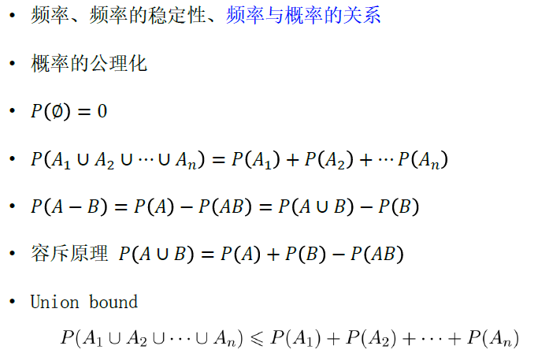

### 古典概型、几何概型

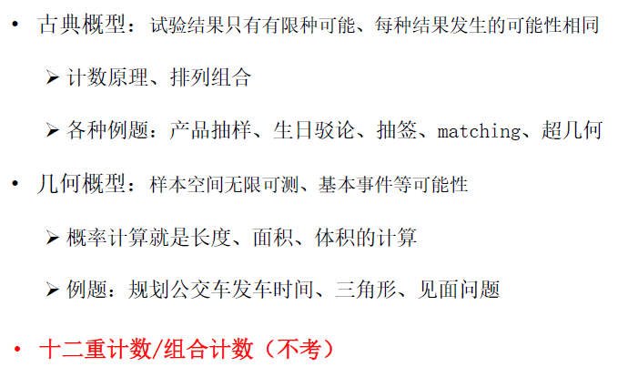

**十二重计数、组合计数不考**

## 二、条件概率与独立性

### 条件概率

全概率公式，贝叶斯公式（记）

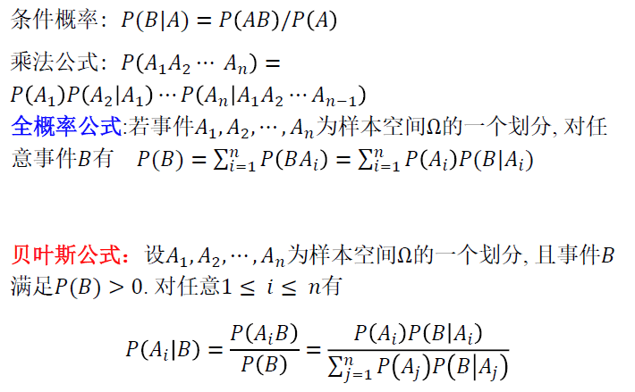

### 独立性

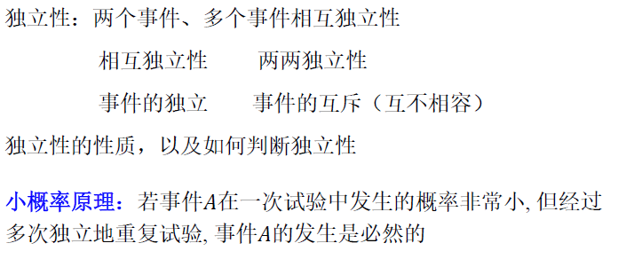

独立性、小概率定理（小概率事件在多次试验中一定发生）

## 三、随机变量

### 离散

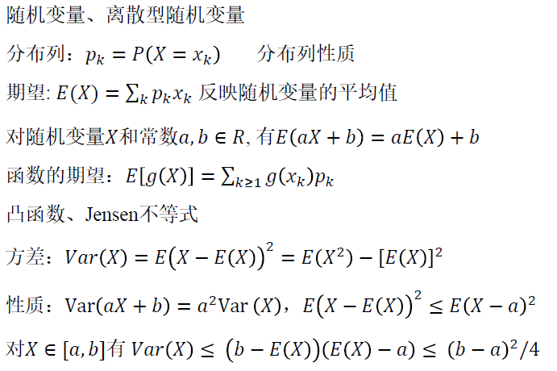

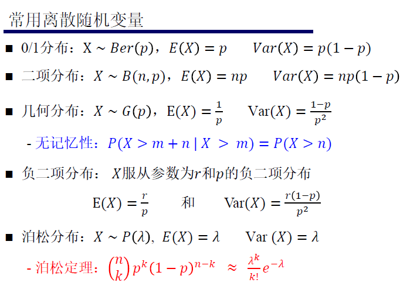

分布列，期望，方差

方差的两种定义

期望和方差的线性性质、函数的期望

凸函数、Jensen不等式

常见的（背）：0/1分布，二项分布、几何分布、负二项分布、泊松分布

泊松定理

### 连续

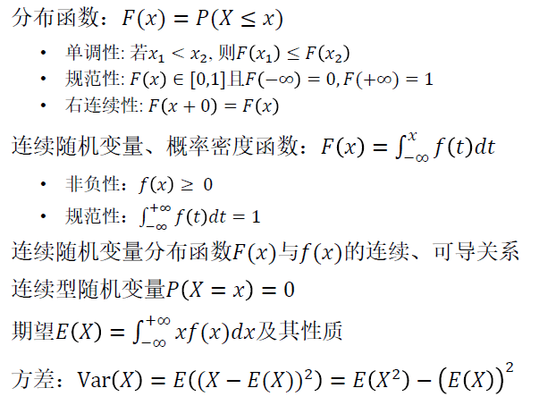

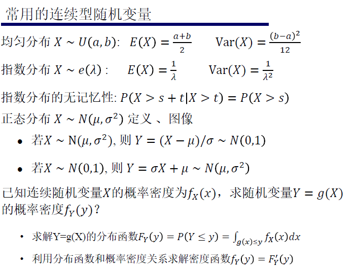

分布函数的性质：单调性、规范性、右连续性

概率密度函数：非负性、规范性

上面两个函数的连续、可导关系

概率不能得到事件的信息，因为连续型随机变量在任一点的概率等于0

常用：均匀、指数、**正态**

$Y=g(X)$ ，求分布函数和密度函数

## 四、多维随机变量

**一般只考虑二维**

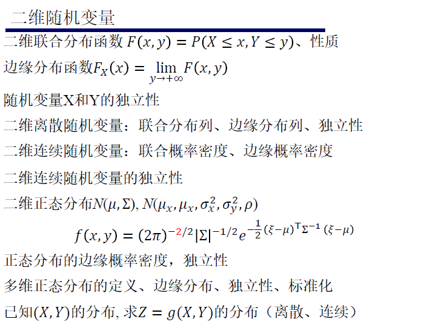

联合分布，边缘分布

二维正态分布

正态分布的边缘概率密度，独立性

多维正态分布

已知 $(X,Y)$ 分布，求 $Z=g(X,Y)$

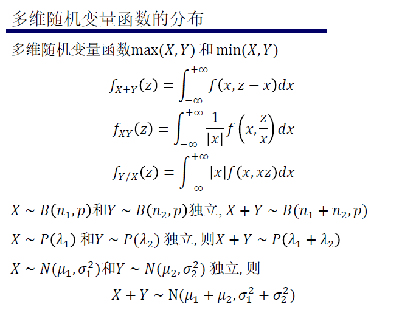

### 数字特征

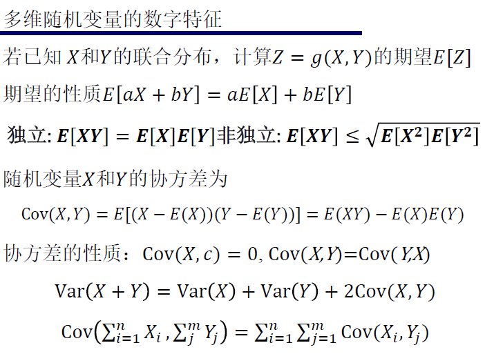

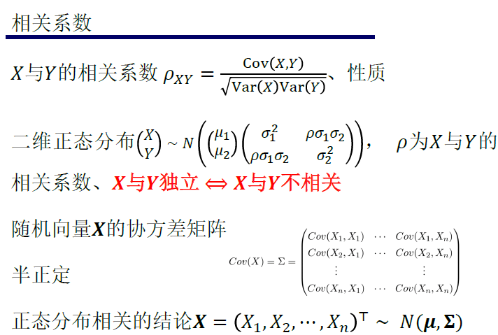

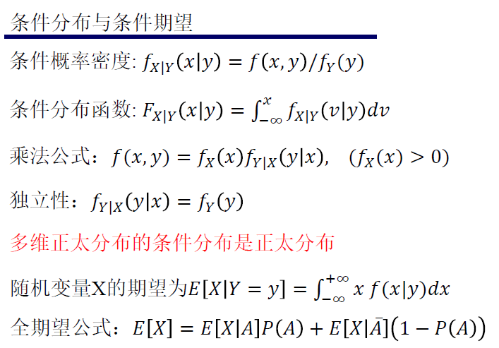

 $Z=g(X,Y)$的期望

独立，协方差……

相关系数

## 五、集中不等式

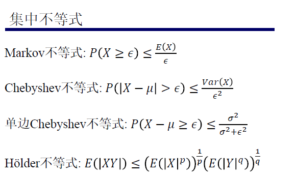

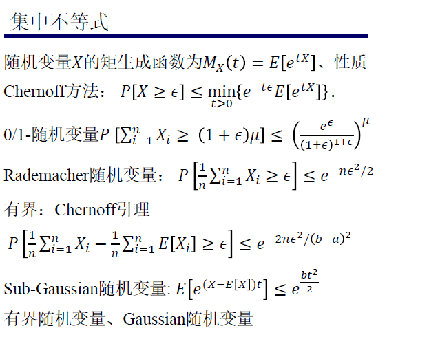

**不考**：所有涉及方差的，不考bennet，bernstein，随机投影，JL引理

## 六、大数定理和中心极限定理

用文字写出什么是大数定理

依概率收敛

依分布收敛

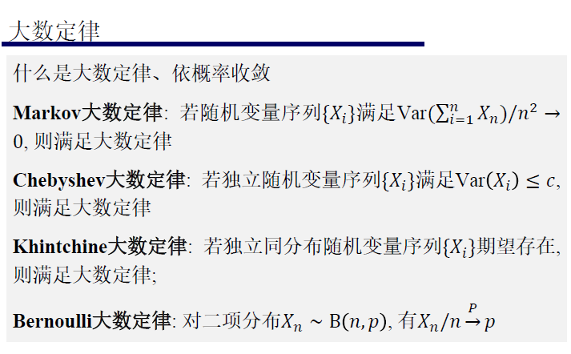

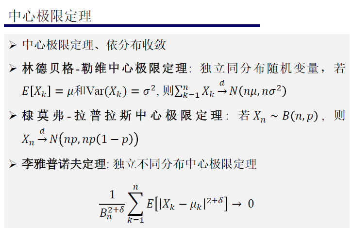

## 七、统计

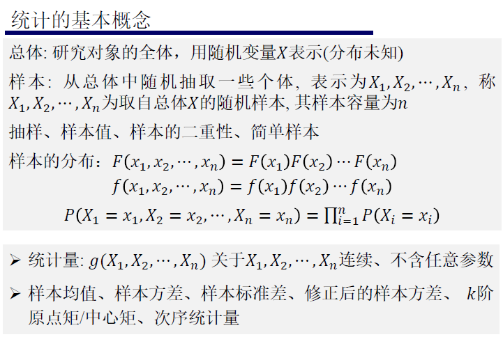

**不考：**两类积分函数与分布（beta，gamma，dirichlet

考统计三大分布：卡方分布，t，F

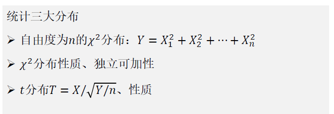

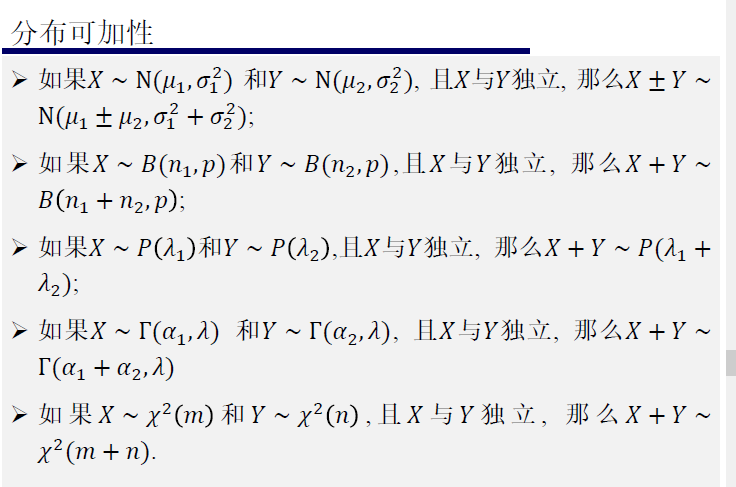

五大抽样定理，背：

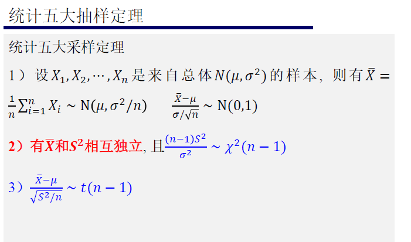

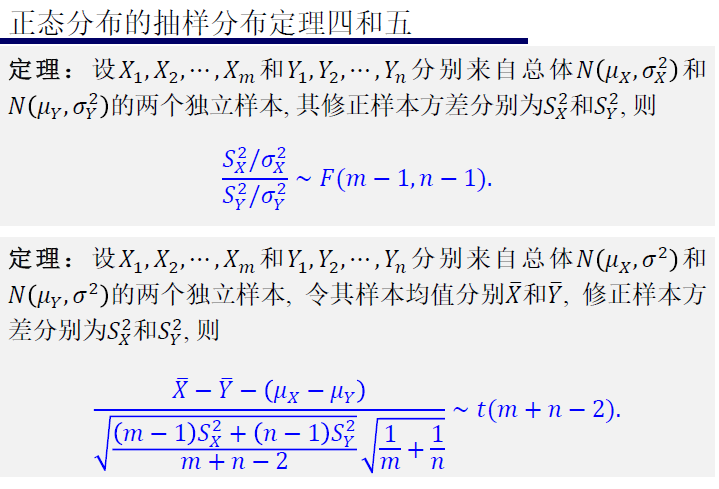

### 参数估计

点估计：矩估计、最大似然估计（及其不变性）

衡量估计量的常用标准：无偏性、有效性、一致性

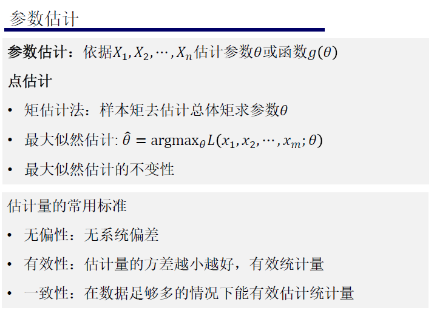

