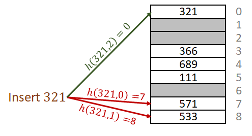
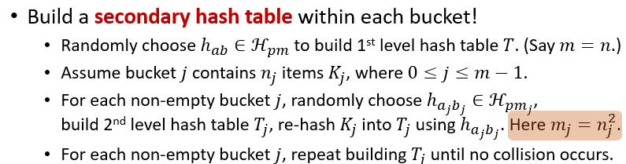
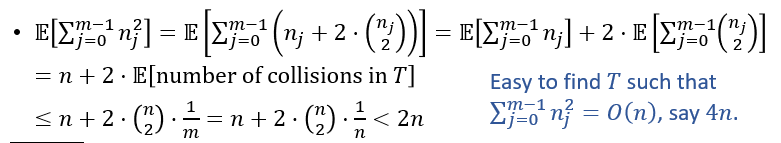
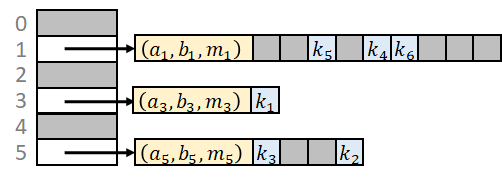
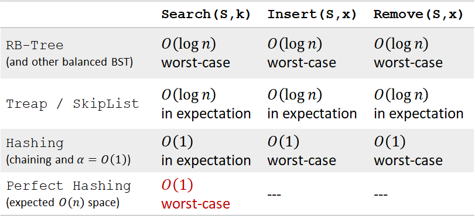

# 08 哈希

hashing，又叫散列

## 思想

### 直接寻址表(direct-address tables)

假设要储存非负整数 $\{0,1,\cdots ,m-1\}$

申请规模为 $m$ 的存储空间，将每个数存入对应的存储空间

可以在 $O(1)$ 内完成查找，插入，删除

### 用直接寻址表储存一般元素

问题：

* 储存的不是正整数
* 储存的元素可能有一个极大的值域

解决：

* 在计算机中所有东西都是二进制数
* 需要找到一个映射 $h$（哈希函数），把一个元素从值域映射到集合 $[m]$ 上
  * $h(k)$ 决定了 $k$ 所存储的位置
  * $m$ 远小于值域，但是和需要储存的元素数量大致相当

### 哈希函数

需要的性质：

* 均匀（随机）地返回 $[0,m-1]$ 中的一个整数
* 对相同的参数返回相同的结果

#### 哈希碰撞

哈希函数不能唯一地代表元素：哈希函数的值域要小于元素的值域

$k_1,k_2$ 满足 $h(k_1)=h(k_2)$ 时称为哈希冲突或哈希碰撞（hash collision)

**解决办法**：每个哈希值对应一个链表的头指针，链表储存同一个哈希值的所有元素（Hashing with chaining）

## hashing with chaining

搜索：

* `Search(k)` ，`k` 是一个元素的值
* 时间复杂度：
  * 如果插入的元素是均匀分布的（即生成的哈希值是随机分布的，称为 Simple Uniform Hashing）
  * 定义 load factor $\alpha=n/m$，这是每个哈希值的链表的期望元素个数
  * 时间复杂度 $\Theta(1+\alpha)$

删除：

* `Remove(x)` ，`x` 是指向该元素的指针
* $O(1)$

插入：

* `Insert(x)`，`x` 是指向该元素的指针
* $O(1)$

## 构造哈希函数

### 主要方法

* 取模
* 乘法
  * 假设输入的长度最长为 $w$
  * 固定 $m=2^r,r\leq w$
  * 固定整数 $A,0<A<2^w$
  * 哈希函数：$((A\cdot k)\mod{2^w})>>(w-r)$

### Universal Hashing（全域散列）

对于确定的哈希函数，一定可以构造一组坏的输入，哈希值相同

所以在创建哈希表时随机选择一个哈希函数

一个哈希函数的集合是 universal 的，当且仅当它满足：

$\underset{h \in \mathcal{H}}{\operatorname{Pr}}[h(x)=h(y)] \leq \frac{1}{m}$ for all $x \neq y$


### 构建 universal hash family

一种典型的 universal hash family（by Carter and Wegman in 1977）

* 找到输入值域的一个上界 $p$
* $\Z_p=\{0,1,2,\cdots,p-1\},\Z_p^*=\{1,2,\cdots,p-1\}$
* $h_{ab}(k)=((ak+b)\mod p)\mod m$
* $\mathcal{H}_{pm}=\{h_{ab}|a\in\Z_p^*\; and\;b\in \Z_p\}$


## 开放寻址（Open Addressing）

处理哈希碰撞的另一种方法，放弃之前链表的做法

重新定义哈希函数：接受两个参数，元素和 $i$

即 $h:U\times\{0,1,\cdots,m-1\}\to\{0,1,\cdots,m-1\}$

```pseudocode
HashInsert(T,k):
i=0
repeat
  j=h(k,i)
  if (T[j]==NIL)
    T[j]=k
    return j
  else i=i+1
until (i==m)
return “overflow”
```

```pseudocode
HashSearch(T,k):
i=0
repeat
  j=h(k,i)
  if (T[j]==k)
    return j
  i=i+1
until (i==m or T[j]==NIL)
return NIL
```

```pseudocode
HashRemove(T,k):
pos=HashSearch(T,k)
if (pos!=NIL)
  T[pos]=DEL
return pos
```

### 构建新定义的哈希函数

#### 线性探查（Linear Probing）

$h(k,i)=(h'(k)+i)\mod m$

缺点：Clustering（翻译成聚类？）

* 在聚类之后的空闲空间有更大可能性被选择，导致聚类逐渐变大

* 理论上，聚类导致更长的搜索时间

* 聚类在实践上可能是没问题的

  > “Cluster” may be okay in practice (caching).



#### 二次探查（Quadratic Probing）

$h(k,i)=(h'(k)+c_1i+c_2i^2)$

仍然可能有二次聚类的问题。

#### 双重哈希（Double Hashing）

$h(k,i)=(h_1(k)+i\cdot h_2(k))\mod m$

解决了聚类的问题，保证了 $h(k,0)$ 和探查序列（Probe sequence）的随机性，线性探查和二次探查不提供后者。

双重哈希满足Uniform Hashing的要求

### 性能

假设满足Uniform Hashing


### 优缺点（相对于使用链表）

优点：

* 不需要额外分布存储空间

  * 链表需要

  * 因为存储在连续空间上，它具有更好的缓存性能

  * > Fewer accesses brings table into cache

缺点：

* 对哈希函数的选择敏感（聚类是一个普遍问题）
* 对 load factor 敏感（当 $\alpha\approx1$ 时性能较差）

## Perfect Hashing

将哈希表的大小 $m$ 设为 $n^2$

$\displaystyle E[\text{哈希碰撞次数}]=\binom{n}{2}\cdot \frac{1}{m}=\binom{n}{2}\cdot \frac{1}{n^2}\leq \frac{1}{2}$

大概率可以获得一个不存在碰撞的表，但是要消耗 $\Theta(n)$ 空间

### O(n) 的 Perfect Hashing

双重哈希表







## 总结



