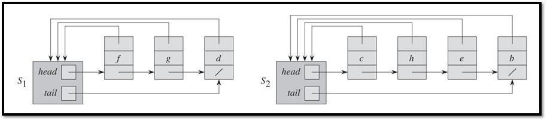
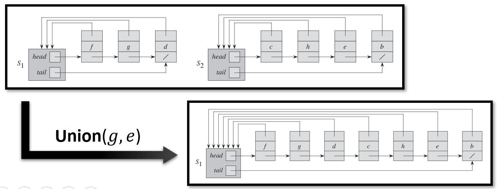
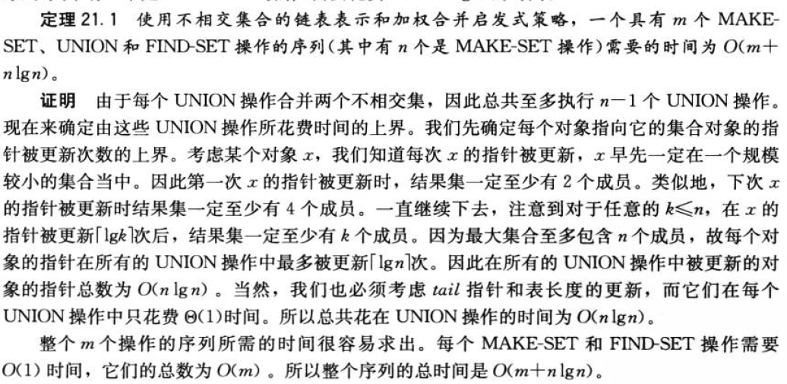
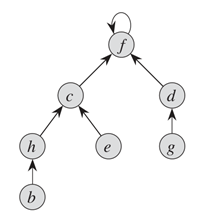
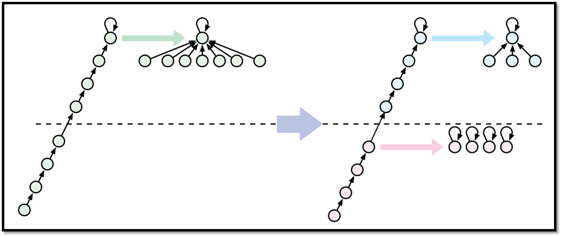

# 10 Disjoint Set（不相交集，并查集）

## Disjoint-set ADT

一个不相交集维护一组集合，这些集合是不相交且动态的

$\mathcal{S}=\{S_1,S_2,\cdots,S_k\}$

每一个 $S_i$ 具有一个“代表性”（representative）成员（leader）

不相交集支持以下操作：

* `MakeSet(x)` ，创建一个只包含 `x` 的集合并将该集合加入 $\mathcal{S}$
* `Union(x,y)` 找到包含 `x` ，`y` 的集合 $S_x,S_y$，从 $\mathcal{S}$ 中删除，并将 $S_x\cup S_y$ 加入 $\mathcal{S}$
* `Find(x)` 找到包含 `x` 的集合，返回其leader的指针

不支持删除或分割集合的操作

也称为**UnionFind ADT**（并查集）

应用：


## 用链表实现



### 时间复杂度

* `MakeSet(x)` ，创建一个新链表，$\Theta(1)$

* `Find(x)` ，通过 `x` 的指针得到集合，再取第一个元素即可，$\Theta(1)$

*  `Union(x,y)`，将 $S_y$ 的链表加到 $S_x$ 末尾，释放 $S_y$，更改 $S_y$ 中元素（指向集合）的指针。$\Theta(sizeof(S_y))$

  * 最坏情况下为 $\Theta(n)$，$n$ 为 $\mathcal{S}$ 的总元素个数，即使均摊分析也并不降低。

  * 改进：选择短的集合接到长的集合末尾（union-by-size），这需要额外维护保存集合大小的变量（代价不大）。不会降低最坏情况渐进时间复杂度，但是降低平均到 $O(\lg n)$ ，而且可能大幅降低某些调用它的函数的时间复杂度，比如：

    ```pseudocode
    MakeSet(x0)
    for (i=1 to n)
    	MakeSet(xi)
    	Union(xi,x0)
    ```

    $\Theta(n^2)\to \Theta(n)$



改进之后，对于任意`MakeSet`，`Find`，`Union` 组成的序列：



## 用有根树实现

使用有根树来表现一个集合，树根是集合的leader

每一个节点有一个指向它父亲的指针，根节点的父亲是它自己



### 时间复杂度

* `MakeSet(x)` ，创建一个新树，$\Theta(1)$
* `Find(x)` ，从根开始找，$\Theta(h)$
* `Union(x)`，先查找，再将 `x` 的树的根节点指向 `y` 的树的根节点，$\Theta(h)$

### Union by height

额外维护树的高度

在 `Union` 时总是将高度更小的插入更大的

减少了 `Find` 的时间复杂度

通过归纳法不难证明此时 `Find` 和 `Union` 的最坏时间复杂度为 $O(\log n)$

### Union by rank

#### Path-Compression in find

在 `Find` 时将遍历到的所有节点的父指针直接指向根节点

不会提高 `Find` 的渐进时间复杂度，但是降低了未来的 `Find` 的时间复杂度

问题：此时难以维护树的高度了

解决：维护一个rank，定义为“不考虑Path-Compression的树高”，也就是忽略 `Find` 对树高的影响

#### 时间复杂度

* `MakeSet`：$\Theta(1)$
* `Find` 和 `Union` ：几乎 $O(1)$

实际上是 $O(\alpha(n))=o(\log^* n)$

如果将已知宇宙的原子数作为 $n$，$\alpha(n)\leq3,\log^*n\leq 6$

我们不证明得这么紧

#### 时间复杂度的证明

下面证明它的三种操作的序列具有很低的平均时间复杂度

证明方法和课本不同

> 这个方法是比较近代的方法，课本的方法比较老了

##### 转化问题

* 可以将 `MakeSet` 移动到开头，不影响时间复杂度
  * 问题转化为证明：对于有 $n$ 个节点的森林，`Find` 和 `Union` 的序列具有很低的平均时间复杂度

* Cost[`Union(x,y)`] = Cost[`Find(x)`] + Cost[`Find(y)`] + $O(1)$
  * 问题转化为证明：对于有 $n$ 个节点的森林，`Find` 和输入为leader（根节点）的 `Union` 的序列具有很低的平均时间复杂度
* 引入 `partialFind(x,y)`
  * `y` 必须是 `x` 的祖先节点之一（祖先节点为父节点或者祖先节点的父节点）
  * `partialFind(x,y)` 从 `x` 开始沿着父节点指针一路遍历到 `y`，路径上的所有节点的父节点指向 `y` 的父节点
  * 每个 `Find` 都可以被一个 `partialFind(x,y)` 代替
  * 问题转化为证明：对于有 $n$ 个节点的森林，`partialFind` 和输入为leader（根节点）的 `Union` 的序列具有很低的平均时间复杂度
* 把所有 `Union` 移动到操作序列的开始处
  * 能这么做是因为 `Find` 变成了 `partialFind`，否则不行
  * 改变顺序不影响操作结果
  * 问题转化为证明：对于有 $n$ 个节点的森林，`partialFind` 和输入为leader（根节点）的 `Union` 的序列具有很低的平均时间复杂度，这里所有 `partialFind` 都在 `Union` 之后
* 输入为leader的 `Union` 是 $O(1)$ 的
  * 问题转化为证明：对于有 $n$ 个节点的森林，`partialFind` 的序列具有很低的平均时间复杂度
* `PartialFind` 的时间复杂度与指针的重新分配次数成线性关系（正比例）
  * 问题转化为证明：对于有 $n$ 个节点的森林，`partialFind` 的序列具有很低的指针重新分配次数
* 定义 $T(m,n,r)$ 为 $n$ 个节点的森林进行 $m$ 次 `PartialFind` 的开销，所有节点中rank的最大值为 $r$
  * 问题转化为证明：$T(m,n,r)$ 很小

##### 证明（松）

待证：$T(m,n,r)\leq nr$

证明：每个节点最多重新分配指针 $r$ 次（每次重新分配之后 $r$ 一定增加）

##### 证明（稍紧）

记森林 $F$ 为有 $n$ 个节点的森林，每个节点最大rank为 $k$

记施加在 $F$ 上的 `PartialFind` 序列为 $C$，进行指针重新分配的次数为 $T'(F,C)$

取任意正数 $s$，将 $F$ 分为 $F_+,F_-$：

* $F_+$ 包含rank $>s$ 的节点，节点数为 $n_+$，影响它的操作数记为 $m_+$
* $F_-$ 包含rank $\leq s$ 的节点，节点数为 $n_-$，影响它的操作数记为 $m_-$
* $n_++n_-=n;\quad m_++m_-=m$

考虑某一个 `PartialFind(x,y)`：

* 如果 $rank(x)>s$，这是一个 $F_+$ 上的 `PartialFind`
* 如果 $rank(y)\leq s$，这是一个 $F_-$ 上的 `PartialFind`
* 如果 $rank(x)>s$ 且 $rank(y)\leq s$，将操作分为：
  * 一个 $F_+$ 上的 `PartialFind`
  * 一些 $F_-$ 上的打碎（shatter）操作（将父指针指向自己），打碎后成为 `topmost` 
  * 将 $F_-$ 中的 `topmost` 重新分配指针。
    * 这是因为打碎操作之后需要模拟后面的 `PartialFind` 开销
    * 显然，这样“分割”操作之后操作的效果不同了（分割操作后的森林结构与分割前不同），但是我们只关心时间复杂度，而时间复杂度并没有改变。



此时可以将 $C$ 转换为：

* $C_+$
* $C_-$
* 打碎操作，至多 $n$ 次（其实是 $n_-$，为了后面计算方便放缩成 $n$ ）
* topmost的指针分配，至多 $m_+$

即 $T'(F,C)\leq T'(F_+,C_+)+T'(F_-,C_-)+n+m_+$

利用之前那个松的证明以及结论“一个有 $n$ 个节点的森林至多有 $\displaystyle \frac{n}{2^i}$ 个 rank 为 $i$ 的节点”：

$\displaystyle T'(F_+,C_+)\leq n_+\cdot r\leq \left(\sum_{i>s}\frac{n}{2^i}\right)\cdot r=\frac{nr}{2^s}$

取 $s=\log r$ ，有 $T'(F,C)\leq T'(F_-,C_-)+2n+m_+$

所以 $T''(m,n,r)\leq T''(m,n,\lg r)+2n$

* 这里 $T''(m,n,r)=T(m,n,r)-m$

$T''(m,n,r)\leq 2n \lg^* r$

所以 $T(m,n,r)\leq m+2n\lg^* r$

**综上所述**，对 $n$ 个节点的森林施加的任意的 `Union` 和 `Find` 组成的操作序列的最坏时间复杂度为 $O(m+2n\lg^* n)$
