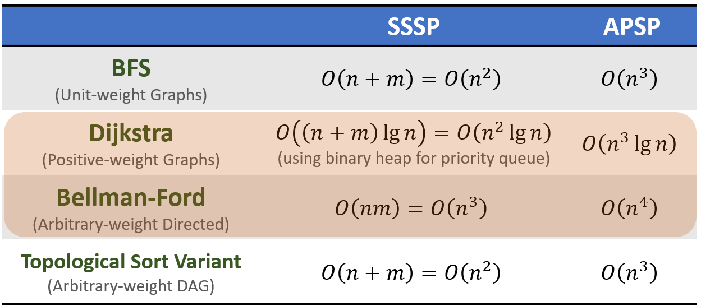
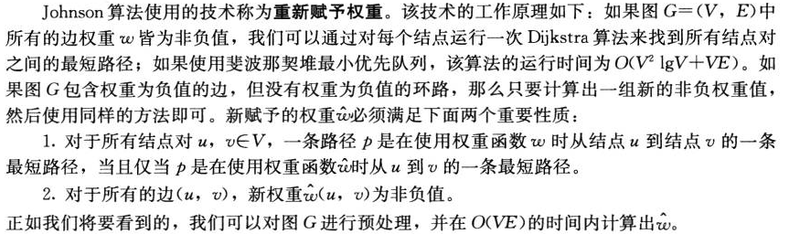
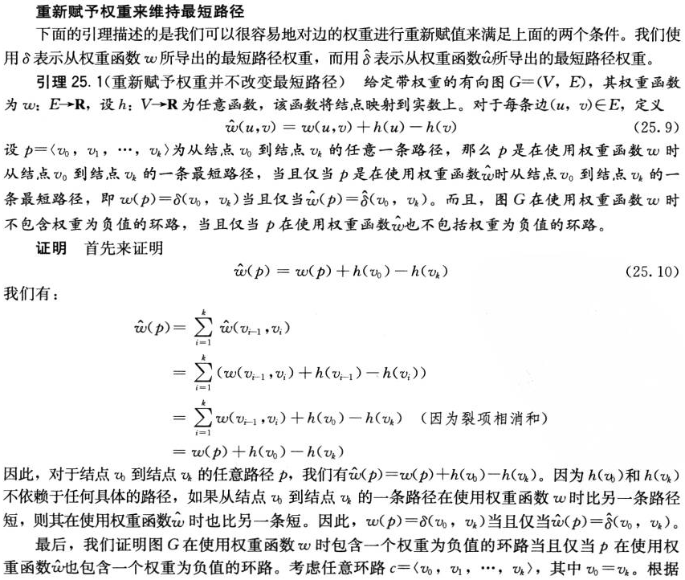
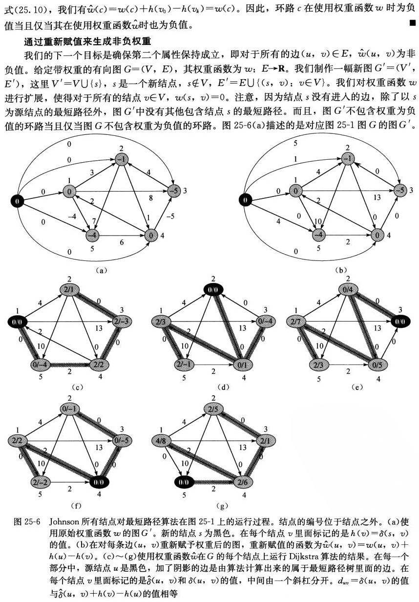
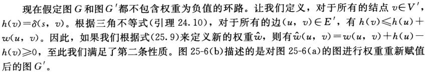
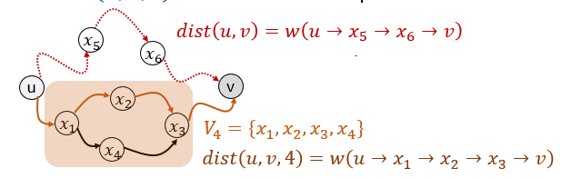
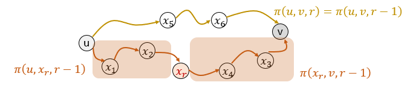

# All-Pairs Shortest Paths

给定图 $G=(V,E)$ 和权重函数 $w$，对于每一对节点 $(u,v)\in V\times V$，找到 $u$ 到 $v$ 的最短路径

## 从SSSP到APSP

简单的对于每一个节点运行一次SSSP的算法（注意每种算法的限制条件）：

> 使用斐波那契堆作为最小堆，可以将Dijkstra的SSSP复杂度降低到 $O(m+n\log n)$，APSP复杂度降低到 $O(mn+n^2\log n)$



## JohnsonAPSP

在 $O(n^2\lg n+nm)$ 内给出任意（包含负数）权重图的APSP

> 需要基于斐波那契堆的Dijkstra



```pseudocode
JohnsonAPSP(G):
Create H=(V+{z},E+{(z,v)|v∈V}) with w(z,v)=0
Bellman-FordSSSP(H,z) to obtain distH
for (each edge (u,v) in H.E)
  w’(u,v) = distH(z,u)+w(u,v)-distH(z,v)
for (each node u in G.V)
  DijkstraSSSP(G,u) with w’ to obtain distG,w’
  for (each node v in G.V)
    distG(u,v) = distG,w’(u,v)+distH(z,v)-distH(z,u)
```

### 正确性







## 递归算法

基于这样的递推式：

$\operatorname{dist}(u, v)=\left\{\begin{array}{cc}0 & \text { if } u=v \\ \min _{(x, v) \in E}\{\operatorname{dist}(u, x)+w(x, v)\} & \text { otherwise }\end{array}\right.$

这是一个正确的递推式，但是这并不能直接导出一个正确的结果。事实上，如果图是有环的，直接使用这条递推式将导致死循环

向递归中增加一个新的变量 $l$，表示找到从 $u$ 到 $v$ 的使用至多 $l$ 条边的最短路径：

$$
\operatorname{dist}(u, v, l)=\left\{\begin{array}{cc}
0 & \text { if } l=0 \text { and } u=v \\
\infty& \text { if } l=0 \text { and } u \neq v \\
\min \left\{\text{dist}(u,v,l-1),\min _{(x, v) \in E}\{\operatorname{dist}(u, x, l-1)+w(x, v)\}\right\}& \text { otherwise }
\end{array}\right.
$$

* $\operatorname{dist}(\cdot, \cdot, 0)$ 可以从输入的图直接得出
* $\operatorname{dist}(\cdot, \cdot, 1)$ 很容易从 $\operatorname{dist}(\cdot, \cdot, 0)$ 得到
* $\operatorname{dist}(\cdot, \cdot, l+1)$ 可以从 $\operatorname{dist}(\cdot, \cdot, l)$ 得到
* $\operatorname{dist}(\cdot, \cdot, n-1)$ 正是我们所需要的

### 朴素算法 

基于上面的推理可以得到 $O(n^4)$ 的算法：

```pseudocode
RecursiveAPSP(G):
for (every pair (u,v) in V*V)
  if (u=v) then dist[u,v,0]=0
  else dist[u,v,0]=INF
for (l=1 to n-1)
  for (each node u)
    for (each node v)
      dist[u,v,l] = dist[u,v,l-1]
      for (each edge (x,v) going to v)
        if (dist[u,v,l] > dist[u,x,l-1] + w(x,v))
          dist[u,v,l] = dist[u,x,l-1]+w(x,v)
```

### 第一次升级

朴素算法类似于 $1,l-1$ 型递归算法

是否存在 $l/2,l/2$ 类型的递归算法？
$$
\operatorname{dist}(u, v, l)=\left\{\begin{array}{cc}
w(u,v) & \text { if } l=1 \text { and } u=v \\
\infty& \text { if } l=1 \text { and } u \neq v \\
\displaystyle\min_{x\in V} \left\{dist(u,x,l/2)+dist(x,v,l/2)\}\right. & \text { otherwise }
\end{array}\right.
$$
从 $\operatorname{dist}(\cdot, \cdot, 1)$ 开始，每次对 $l$ 乘 $2$，直到 $l=2^{\left\lceil \lg n \right\rceil}$

这样得到一个 $O(n^3\lg n)$ 的算法

```pseudocode
FasterRecursiveAPSP(G):
for (every pair (u,v) in V*V)
  if ((u,v) in E) then dist[u,v,1]=w(u,v)
  else dist[u,v,1]=INF
for (i=1 to Ceil(lg(n)))
  for (each node u)
    for (each node v)
      dist[u,v,i] = INF
      for (each node x)
        if (dist[u,v,i] > dist[u,x,i-1] + dist[x,v,i-1])
          dist[u,v,i] = dist[u,x,i-1] + dist[x,v,i-1]
```

### Floyd-Warshall

随机地为节点排序：$x_1,x_2,\cdots,x_n$

定义 $V_r=\{x_1,x_2,\cdots,x_r\}$

定义 $\text{dist}(u,v,r)$ 为以 $V_r$ 中的点为中间节点时，$u$ 到 $v$ 的最短路径长度

记 $\pi(u,v,r)$ 为这样的一条最短路径



易知 $\pi(u,v,r)$ 要么经过 $x_r$，要么不经过它

* 后一种情况（不经过）：$\pi(u,v,r)=\pi(u,v,r-1)$
* 前一种情况（经过）：$\pi(u,v,r)=\pi(u,x_r,r)+\pi(x_r,v,r)=\pi(u,x_r,r-1)+\pi(x_r,v,r-1)$


$$
\operatorname{dist}(u, v, l)=\left\{\begin{array}{cc}
w(u,v) & \text { if } r=0 \text { and } u=v \\
\infty& \text { if } r=0 \text { and } u \neq v \\
\min \left\{\text{dist}(u,v,r-1),\min _{(x, v) \in E}\{\operatorname{dist}(u, x_r, r-1)+\operatorname{dist}(x_r, v, r-1)\}\}\right. & \text { otherwise }
\end{array}\right.
$$

```pseudocode
FloydWarshallAPSP(G):
for (every pair (u,v) in V*V)
  if ((u,v) in E) then dist[u,v,0]=w(u,v)
  else dist[u,v,0]=INF
for (r=1 to n)
  for (each node u)
    for (each node v)
      dist[u,v,r] = dist[u,v,r-1]
      if (dist[u,v,r] > dist[u,xr,r-1] + dist[xr,v,r-1])
        dist[u,v,r] = dist[u,xr,r-1] + dist[xr,v,r-1]
```

**应用：计算传递闭包（算法与离散数学的梦幻联动）**

理论基础：$t_{u, v}^{(r)}=t_{u, v}^{(r-1)} \vee\left(t_{u, x_{r}}^{(r-1)} \wedge t_{x_{r}, v}^{(r-1)}\right)$

```pseudocode
FloydWarshallTransitiveClosure(G):
for (every pair (u,v) in V*V)
  if ((u,v) in E) then t[u,v,0] = TRUE
  else t[u,v,0] = FALSE
for (r=1 to n)
  for (each node u)
    for (each node v)
      t[u,v,r] = t[u,v,r-1]
      if (t[u,xr,r-1] AND t[xr,v,r-1])
        t[u,v,r] = TRUE
```


