## 关系代数

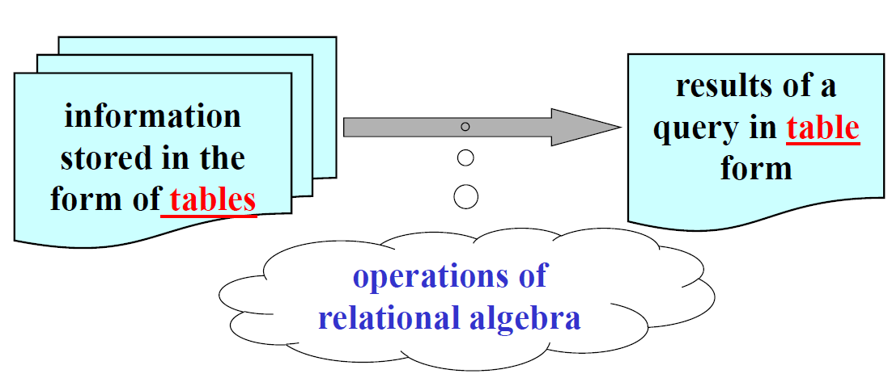

### 分类

集合运算(set-theoretic operations)：基于表是行的集合这一事实

自然关系（纯关系）运算(native relational operations)：基于表的结构

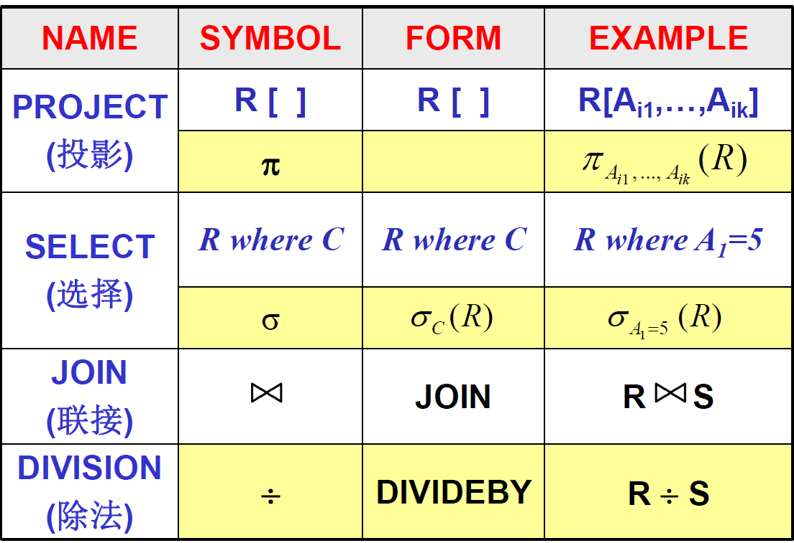

本课程中分别用`R[...]`,`R where C`,`R join S`,`R ÷ S`表示四种自然关系运算

### 集合运算

虽然我们认为列之间没有顺序，但是为了方便，我们表示一行的所有元素时要固定这些元素的顺序

#### 相容表（兼容表，Compatible Tables）

两张表的关系模式（标题，即属性名的集合）是相同的（且具有相同的含义），称为相容表

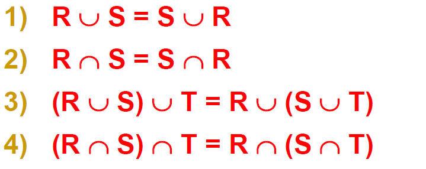

#### 赋值、别名

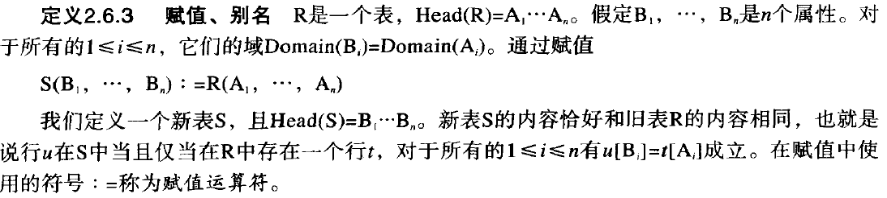

#### 乘积（笛卡尔积）

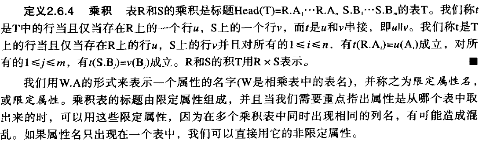

### 自然关系运算

#### 投影

#### 选择

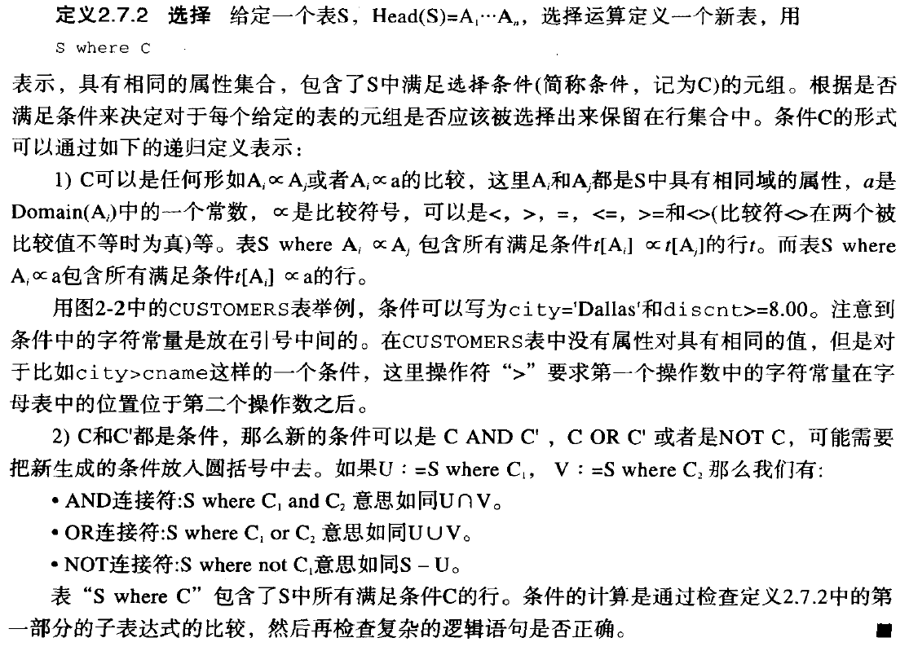

#### 连接

#### 除

**例1**：注意 $T_3$ 是前两者的**交集**

**例2**：输出可以是空集

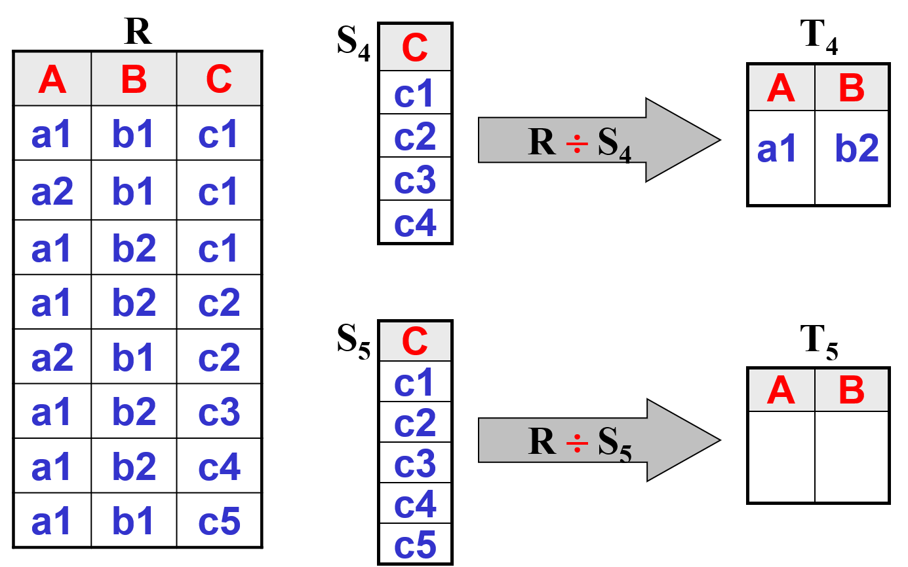

### 优先级

## 其他运算

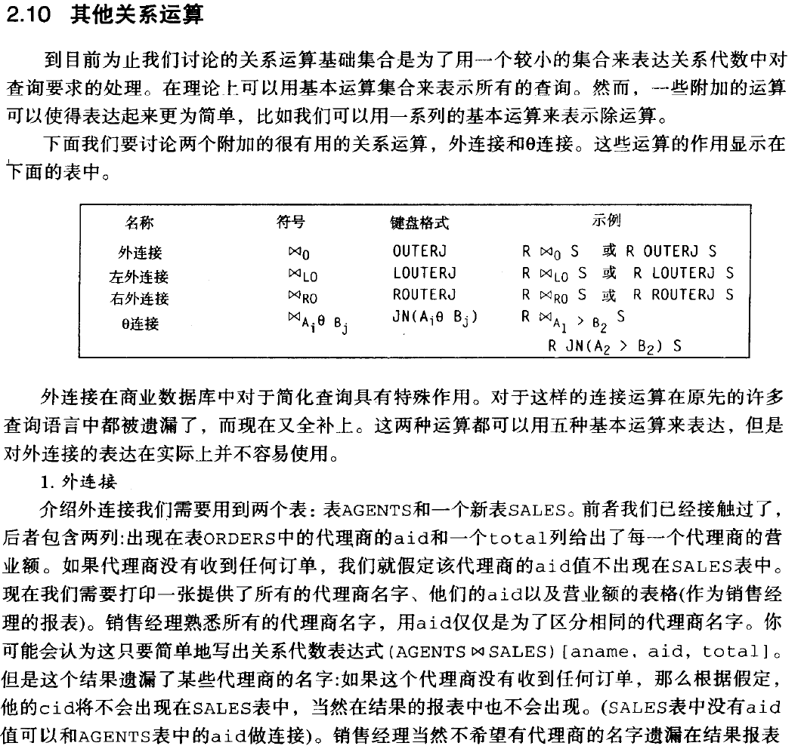

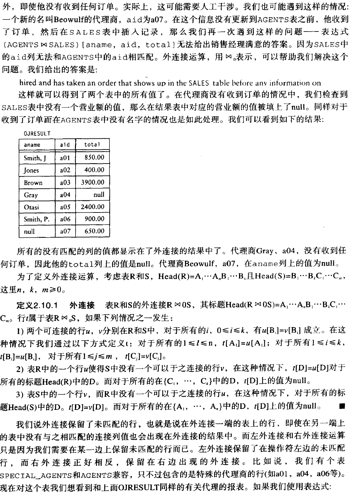

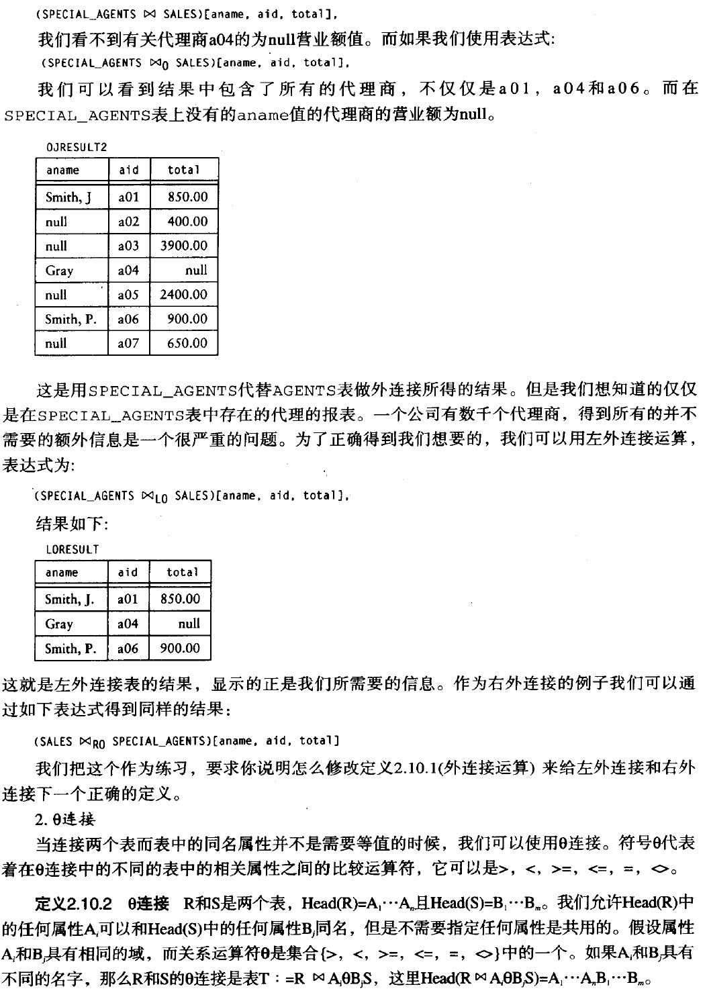

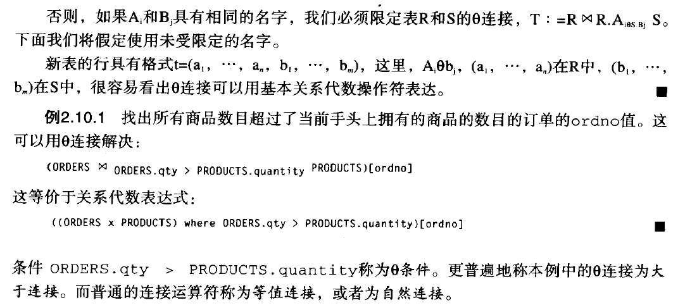