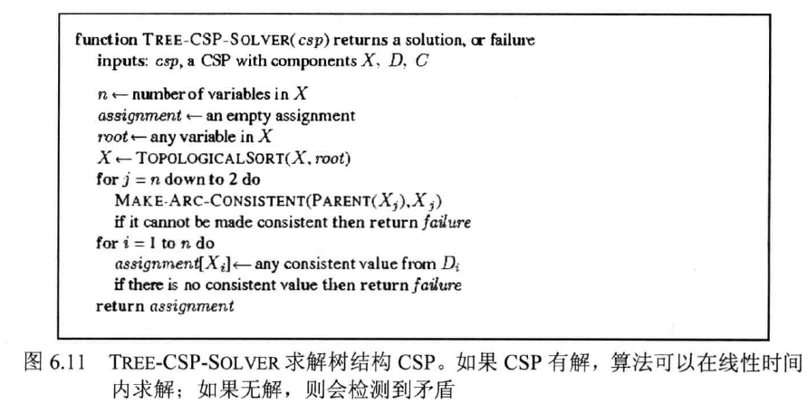

# 5 CSP（约束满足问题）

constraint satisfaction problems

包括：

* 值域：有限或无限
* 变量：连续或离散

## 定义

约束满足问题包含三个成分 $X 、 D$ 和 $C$ :

$X$ 是变量集合 $\left\{X_{1}, \cdots, X_{n}\right\}$ 。

$D$ 是值域集合 $\left\{D_{1}, \cdots, D_{n}\right\}$, 每个变量有自己的值域。

$C$ 是描述变量取值的约束集合。

值域 $D_{i}$ 是由变量 $X_{i}$ 的可能取值 $\left\{v_{1}, \cdots, v_{k}\right\}$ 组成的集合。

每个约束 $C_{i}$ 是有序对 $<$ scope,rel $>$, 其中 scope 是约束中的变量组, $r e l$ 则定义了这些变量取值应满足的关系。

关系可以显式地列出所有关系元组, 也可以是支持如下两个操作的抽象关系: 测试一个元组是否为一个关系的成员和枚举所有关系成员。

例如, 如果 $X_{1} 、 X_{2}$ 的值域均为 $\{\mathrm{A}, \mathrm{B}\}$, 约束是二者不能取相同值, 关系可如下描述: $<\left(X_{1}, X_{2}\right),[(\mathrm{A}, \mathrm{B}),(\mathrm{B}, \mathrm{A})]>$ 或 $<\left(X_{1}, X_{2}\right), X_{1} \neq X_{2}>$

### 与标准搜索的异同

标准搜索问题：

* 状态state是一个黑箱，支持goal test、分析、successor

CSP问题：

* 状态有内部结构（变量），goal test表示变量是否满足约束

### 结构

初始状态：无变量

后继函数（successor function）：为一个未赋值变量赋值，这个赋值不能与当前赋值冲突

Goal test：当前赋值已完成

## Backtracing

搜索问题的通用解法

用树搜索穷举，节点指数增长

//Todo:伪代码

## Backtracing的提升：

* 接下来应该给哪个变量赋值？
* 应该用怎样的顺序尝试给这个变量赋值（值域中各值的尝试顺序）？
* 我们是否能提前探测到不可避免的失败？
* 我们能否利用问题结构提高效率？

### MRV（最少剩余值）

minimum remaining values

**用于选择将变量赋为哪个值**

### Degree heuristic（度启发式）

**用于决定选择哪个变量**

**选择对其他未赋值变量约束最多的变量**

### Least constraining value（最少约束值）

**用于选择将变量赋为哪个值**

**给邻居变量留下更多选择**

### 前向检验

### Arc consistency（弧相容）

应用 AC-3 之后，要么所有变量弧相容，否则有变量的值域为空（无解）

时间复杂度 $O(n^2d^3)$，可以减少到 $O(n^2d^2)$

因为树搜索是指数的，所以用一个幂级的算法是划算的

### 树形结构的CSP

约束图没有环

#### 可以通过删除节点或合并节点化简为树结构

## 多维关系转换为二维关系

引入隐变量

## 迭代算法

**不同于树搜索算法**

* 允许不满足约束的状态

* 操作会重新为变量赋值

* 选择赋值的变量：随机选择存在冲突的变量
* 选择赋的值：选择与约束冲突最小的值

