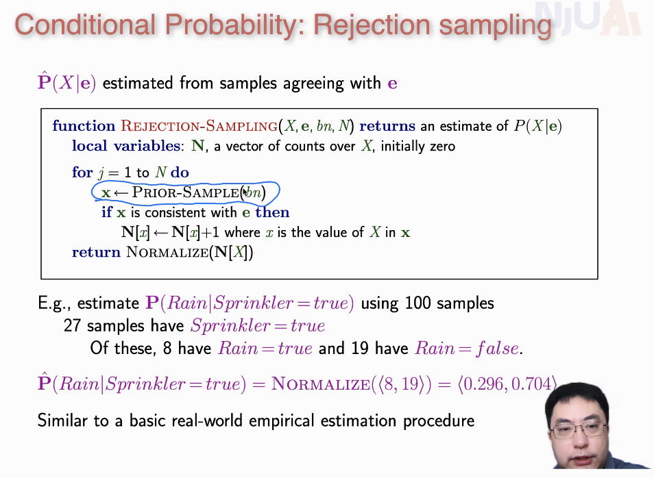
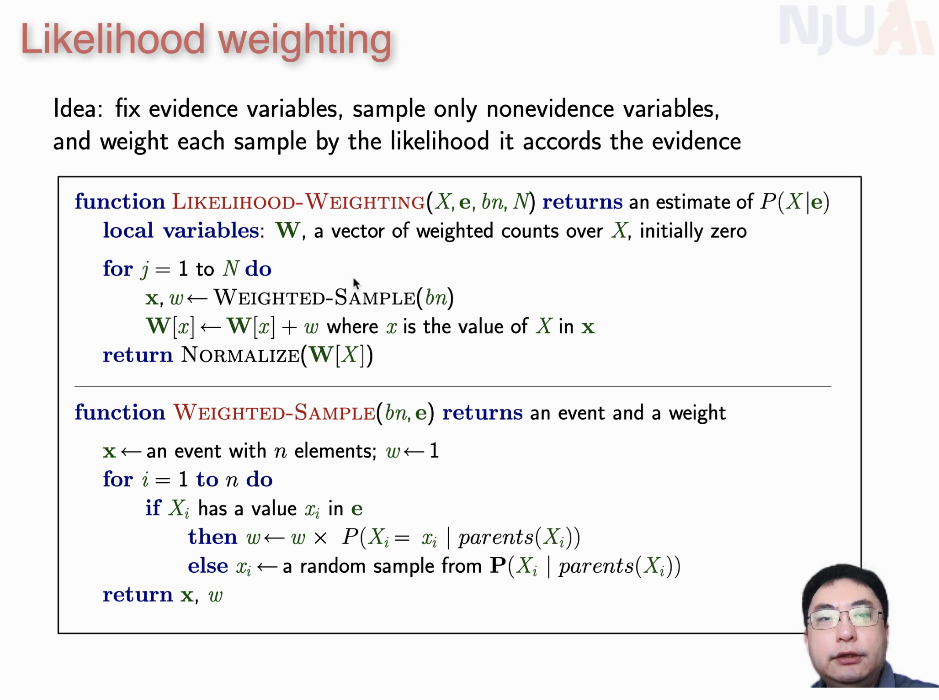
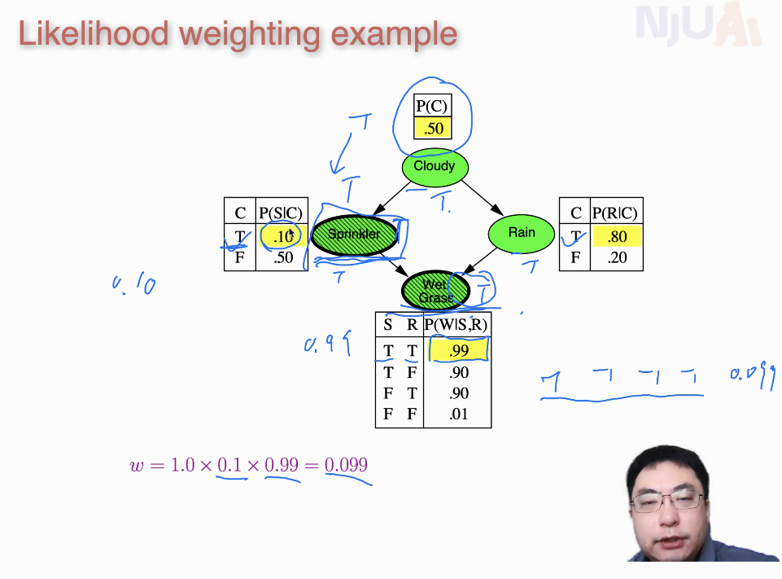
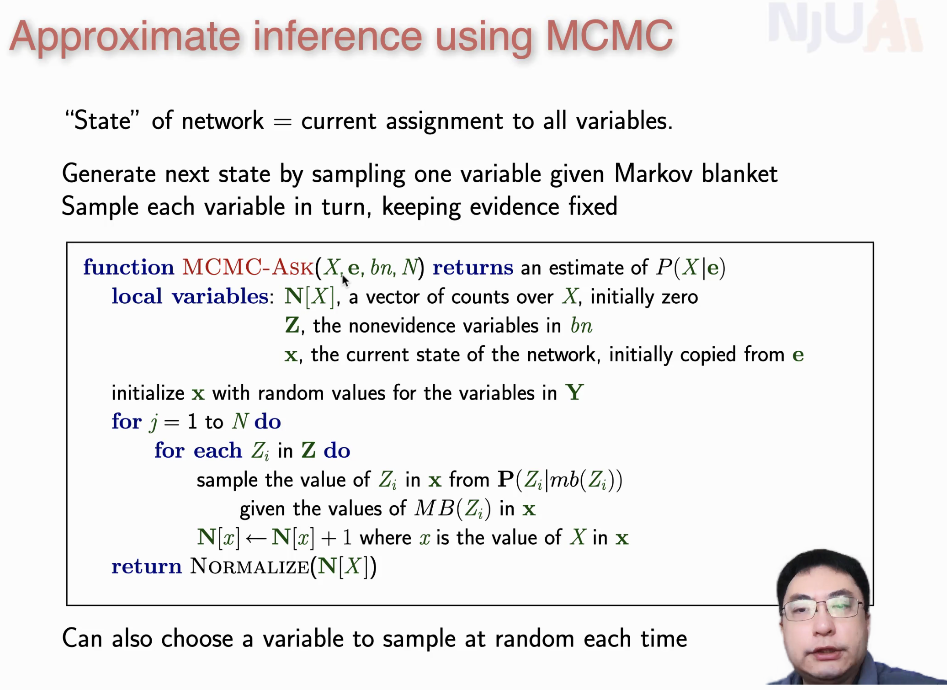
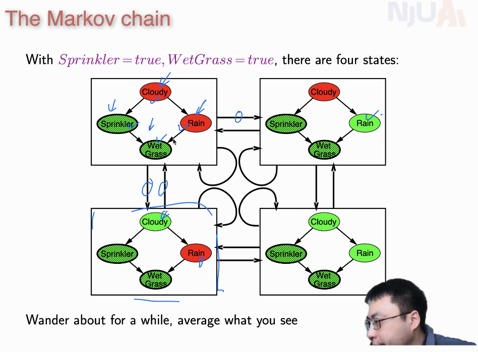
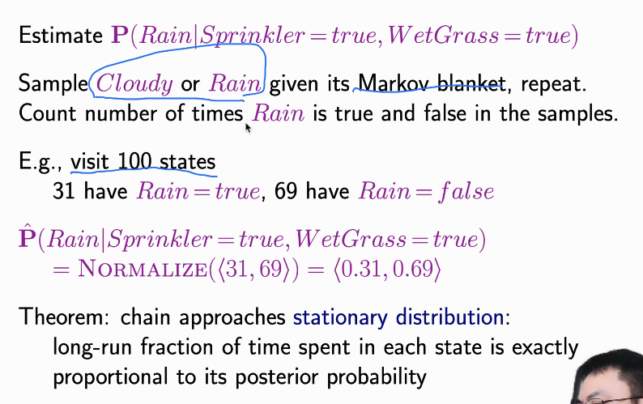

# 8  不确定环境的决策

基于条件概率

决策的过程就是计算概率的过程

**归一化**：从联合分布概率计算条件概率

思路：求出联合分布并根据联合分布计算

贝叶斯网：bn，[维基百科](https://zh.wikipedia.org/wiki/%E8%B2%9D%E6%B0%8F%E7%B6%B2%E8%B7%AF)

## 采样计算概率

### 拒绝式采样

分母可以通过归一化得到，不用记录

缺点：条件极难满足的情况下效率低

## 自然加权

举例：

条件变量：S=T，W=T

需要乘权重的原因是，这样等价于丢弃了非条件变量的样本，节省计算次数但结果不变

## MCMC

利用[马尔科夫毯](https://en.wikipedia.org/wiki/Markov_blanket)构建一个新的[马尔科夫链](https://zh.wikipedia.org/wiki/%E9%A9%AC%E5%B0%94%E5%8F%AF%E5%A4%AB%E9%93%BE)，进行随机游走，得到条件分布

