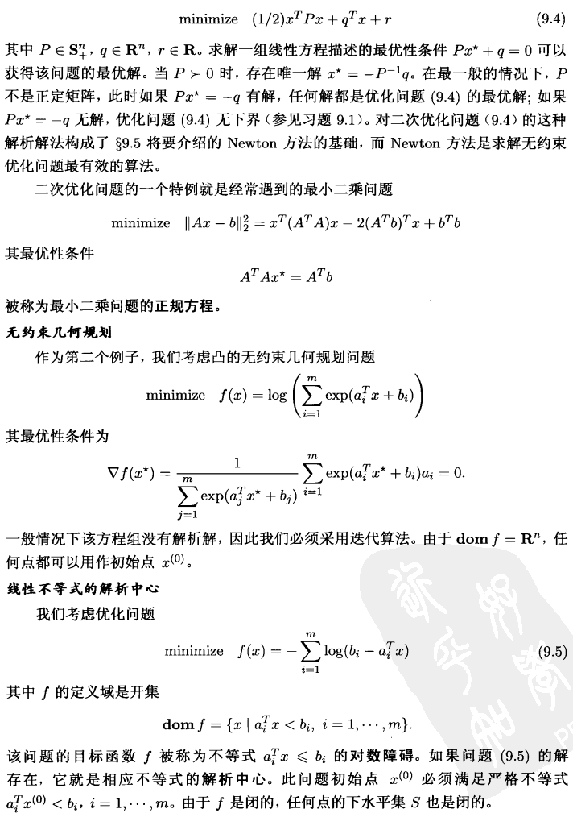
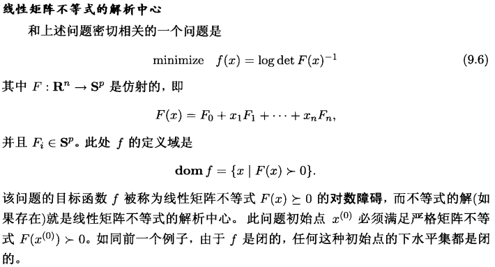
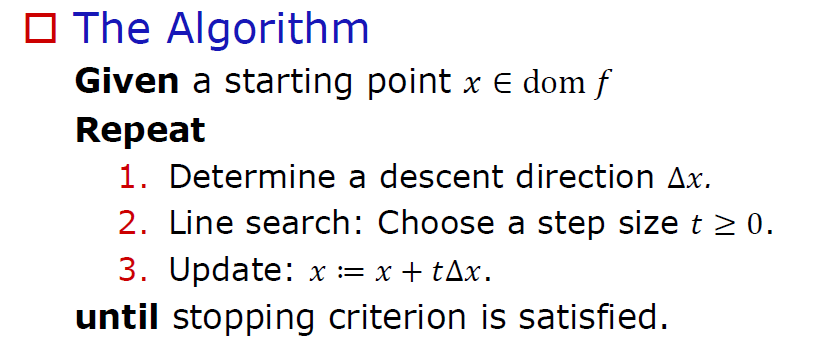
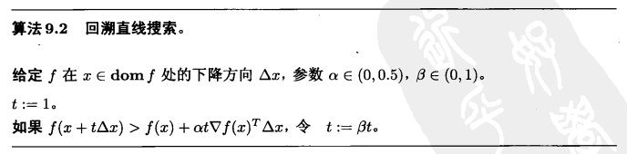
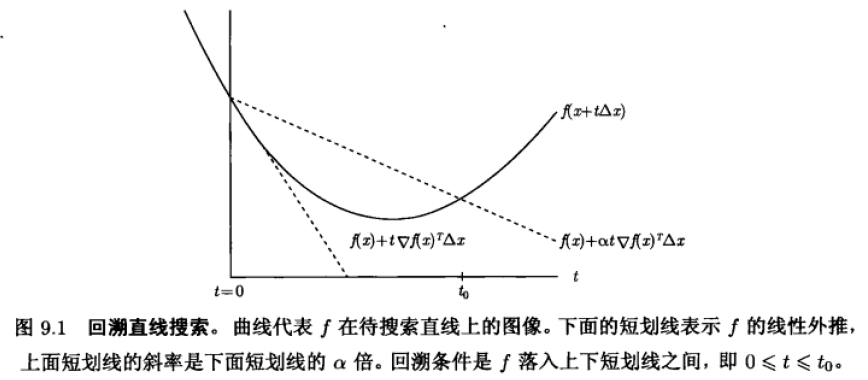
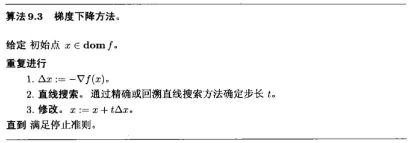

# 8 无约束优化

## 8.1 定义

本章讨论下述无约束优化问题的求解方法

$$
\operatorname{minimize} f(x)\quad\quad\quad(9.1)
$$

其中 $f: \mathbf{R}^{n} \rightarrow \mathbf{R}$ 是二次可微凸函数 (这意味着 $\operatorname{dom} f$ 是开集)。

我们假定该问题可解, 即存在最优点 $x^{\star}$ 。 (更准确地说, 本章后面用到的假定意味着 $x^{\star}$ 不仅存在, 并且唯一。）

我们用 $p^{\star}$ 表示最优值 $\inf _{x} f(x)=f\left(x^{\star}\right)$ 。

既然 $f$ 是可微凸函数, 最优点 $x^{\star}$ 应满足下述充要条件

$$
\nabla f\left(x^{\star}\right)=0,\quad\quad\quad(9.2)
$$

(参见 $\S 4.2 .3$ )。

因此, 求解无约束优化问题 (9.1) 等价于求解 $n$ 个变量 $x_{1}, \cdots, x_{n}$ 的 $n$ 个方程 (9.2)。

在一些特殊情况下, 我们可以通过解析求解最优性方程 (9.2) 确定优化问题 (9.1) 的解, 但一般情况下, 必须采用迭代算法求解方程 (9.2), 即计算点列 $x^{(0)}, x^{(1)}, \cdots \in \operatorname{dom} f$ 使得 $k \rightarrow \infty$ 时 $f\left(x^{(k)}\right) \rightarrow p^{\star}$ 。 

这样的点列被称为优化问题 (9.1) 的极小化点列。

当 $f\left(x^{(k)}\right)-p^{*} \leqslant \epsilon$ 时算法将终止, 其中 $\epsilon>0$ 是设定的容许误差值。 

### 8.1.1 初始点和下水平集

本章介绍的方法需要一个适当的初始点 $x^{(0)}$, 该初始点必须属于 $\operatorname{dom} f$, 并且下 水平集

$$
S=\left\{x \in \operatorname{dom} f \mid f(x) \leqslant f\left(x^{(0)}\right)\right\}
$$

必须是闭集。如果 $f$ 是闭函数, 即它的所有下水平集是闭集, 上述条件对所有的 $x^{(0)} \in \operatorname{dom} f$ 均能满足 (参见 $\S \mathrm{A} .3 .3$ )。

因为 $\operatorname{dom} f=\mathbf{R}^{n}$ 的连续函数是闭函数, 所以如果 $\operatorname{dom} f=\mathbf{R}^{n}$, 任何 $x^{(0)}$ 均能满足初始下水平集条件. 

另一类重要的闭函数是其定义域为开集的连续函数, 这类 $f(x)$ 将随着 $x$ 趋近 $\operatorname{bd}\operatorname{dom}f$ 而趋于无穷。

### 8.1.2 例子

## 8.2 强凸性

在本章大部分内容中 (除了 $\S 9.6$ ), 我们都假设目标函数在 $S$ 上是强凸的, 这是指存在 $m>0$ 使得
$$
\nabla^{2} f(x) \succeq m I
$$
对任意的 $x \in S$ 都成立。

强凸性能够导致若干有意义的结果。

### 8.2.1二次下界

对于 $x, y \in S$, 我们有
$$
f(y)=f(x)+\nabla f(x)^{T}(y-x)+\frac{1}{2}(y-x)^{T} \nabla^{2} f(z)(y-x),
$$
其中 $z$ 属于线段 $[x, y]$ 。利用强凸性假设 (9.7), 上式右边最后一项不会小于 $(m / 2) \| y-$ $x \|_{2}^{2}$, 因此不等式
$$
f(y) \geqslant f(x)+\nabla f(x)^{T}(y-x)+\frac{m}{2}\|y-x\|_{2}^{2}\quad\quad\quad(9.8)
$$
对 $S$ 中任意的 $x$ 和 $y$ 都成立。当 $m=0$ 时, 上式变回描述凸性的基本不等式; 当 $m>0$ 时, 对 $f(y)$ 的下界我们可以得到比单独利用凸性更好的结果。

### 8.2.2 次优解条件

我们首先说明不等式 (9.8) 可以用来界定 $f(x)-p^{\star}$, 所得上界可表明 $x$ 是其目标值和最优目标值的偏差正比于 $\|\nabla f(x)\|_{2}$ 的次优解。

对任意固定的 $x$, 式 (9.8) 的 右边是 $y$ 的二次凸函数。令其关于 $y$ 的导数等于零, 可以得到该二次函数的最优解 $\tilde{y}=x-(1 / m) \nabla f(x)$ 。因此, 我们有
$$
\begin{aligned}
f(y) & \geqslant f(x)+\nabla f(x)^{T}(y-x)+\frac{m}{2}\|y-x\|_{2}^{2} \\
& \geqslant f(x)+\nabla f(x)^{T}(\tilde{y}-x)+\frac{m}{2}\|\tilde{y}-x\|_{2}^{2} \\
&=f(x)-\frac{1}{2 m}\|\nabla f(x)\|_{2}^{2} .
\end{aligned}
$$
既然该式对任意的 $y \in S$ 成立, 我们又可得到
$$
p^{\star} \geqslant f(x)-\frac{1}{2 m}\|\nabla f(x)\|_{2}^{2} .\quad\quad\quad(9.9)
$$
由此可见, **任何梯度足够小的点都是近似最优解**。不等式 (9.9) 是最优性条件 (9.2) 的 推广。由于
$$
\|\nabla f(x)\|_{2} \leqslant(2 m \epsilon)^{1 / 2} \Longrightarrow f(x)-p^{\star} \leqslant \epsilon
$$
我们可以将其解释为**次优性条件**。

### 8.2.3 $\left\|x-x^{\star}\right\|_{2}$ 的上界

对于 $x$ 和任意最优解 $x^{\star}$ 之间的距离 $\left\|x-x^{\star}\right\|_{2}$, 也可以建立正比于 $\|\nabla f(x)\|_{2}$ 的 上界
$$
\left\|x-x^{\star}\right\|_{2} \leqslant \frac{2}{m}\|\nabla f(x)\|_{2} .\quad\quad\quad(9.11)
$$
为了获得该不等式, 我们首先将 $y=x^{\star}$ 代入式 (9.8), 由此可得
$$
\begin{aligned}
p^{\star}=f\left(x^{\star}\right) & \geqslant f(x)+\nabla f(x)^{T}\left(x^{\star}-x\right)+\frac{m}{2}\left\|x^{\star}-x\right\|_{2}^{2} \\
& \geqslant f(x)-\|\nabla f(x)\|_{2}\left\|x^{\star}-x\right\|_{2}+\frac{m}{2}\left\|x^{\star}-x\right\|_{2}^{2},
\end{aligned}
$$
其中导出第二个不等式时用了 Cauchy-Schwarz 不等式。因为 $p^{\star} \leqslant f(x)$, 必须成立
$$
-\|\nabla f(x)\|_{2}\left\|x^{\star}-x\right\|_{2}+\frac{m}{2}\left\|x^{\star}-x\right\|_{2}^{2} \leqslant 0 .
$$
由此可直接得到式 (9.11)。从式 (9.11) 可以看出, **最优解 $x^{\star}$ 是唯一的**。

### 8.2.4 平滑性

$f$ 在 $S$ 上是平滑的，指 $\exist M>0,\forall x\in S,\nabla^{2} f(x) \preceq M I$

不等式 (9.8) 表明, $S$ 所包含的所有下水平集都有界, 因此, $S$ 本身作为一个下水平集也有界。由于 $\nabla^{2} f(x)$ 的最大特征值是 $x$ 在 $S$ 上的连续函数, 所以它在 $S$ 上有界, 即存在常数 $M$ 使得
$$
\nabla^{2} f(x) \preceq M I
$$
对所有 $x \in S$ 都成立。

关于 Hessian 矩阵的这个上界意味着对任意的 $x, y \in S$,
$$
f(y) \leqslant f(x)+\nabla f(x)^{T}(y-x)+\frac{M}{2}\|y-x\|_{2}^{2},
$$
该式和式 (9.8) 类似。在上式两边关于 $y$ 求极小, 又可得到
$$
p^{\star} \leqslant f(x)-\frac{1}{2 M}\|\nabla f(x)\|_{2}^{2},
$$
这是式 (9.9) 的对应不等式。

### 8.2.5下水平集的条件数

从强凸性不等式 (9.7) 和不等式 (9.12) 可以看出, 对任意的 $x \in S$ 都成立
$$
m I \preceq \nabla^{2} f(x) \preceq M I .
$$
因此, 比值 $\kappa=M / m$ 是矩阵 $\nabla^{2} f(x)$ 的条件数 (其最大特征值和最小特征值之比) 的 上界。对于式 (9.15), 我们也可以基于 $f$ 的下水平集给出一个几何解释。

对任意满足 $\|q\|_{2}=1$ 的方向向量 $q$, 我们定义凸集 $C \subseteq \mathbf{R}^{n}$ 的宽度如下
$$
W(C, q)=\sup _{z \in C} q^{T} z-\inf _{z \in C} q^{T} z
$$
再定义 $C$ 的最小宽度和最大宽度
$$
W_{\min }=\inf _{\|q\|_{2}=1} W(C, q), \quad W_{\max }=\sup _{\|q\|_{2}=1} W(C, q) .
$$
于是, 凸集 $C$ 的条件数可以表示成
$$
\operatorname{cond}(C)=\frac{W_{\max }^{2}}{W_{\min }^{2}}
$$
即最大宽度和最小宽度的平方比值。

该式说明, $C$ 的条件数给出了各向异性或离心率的 一种测度。

* 如果 $C$ 的条件数小 (比如接近 1), 说明集合在所有方向上的宽度近似相 同, 即几乎是一个球体。
* 如果 $C$ 的条件数大, 说明集合在某些方向上的宽度远比其他一 些方向上的宽度大。

现在假定对所有的 $x \in S, f$ 满足 $m I \preceq \nabla^{2} f(x) \preceq M I$ 。下面将对 $\alpha$-下水平集 $C_{\alpha}=\{x \mid f(x) \leqslant \alpha\}$ 的条件数建立一个上界, 其中 $p^{\star}<\alpha \leqslant f\left(x^{(0)}\right)$. 将 $x=x^{\star}$ 代入 式 (9.13) 和式 (9.8) 可得
$$
p^{\star}+(M / 2)\left\|y-x^{\star}\right\|_{2}^{2} \geqslant f(y) \geqslant p^{\star}+(m / 2)\left\|y-x^{\star}\right\|_{2}^{2} .
$$
该式意味着 $B_{\text {imner }} \subseteq C_{\alpha} \subseteq B_{\text {outer }}$, 其中
$$
\begin{aligned}
&B_{\text {inner }}=\left\{y \mid\left\|y-x^{\star}\right\|_{2} \leqslant\left(2\left(\alpha-p^{\star}\right) / M\right)^{1 / 2}\right\} \\
&B_{\text {outer }}=\left\{y \mid\left\|y-x^{\star}\right\|_{2} \leqslant\left(2\left(\alpha-p^{\star}\right) / m\right)^{1 / 2}\right\}
\end{aligned}
$$
换言之, $\alpha$-下水平集包含 $B_{\text {inner }}$, 但被 $B_{\text {outer }}$ 所包含, 它们分别是具有下述半径的球
$$
\left(2\left(\alpha-p^{\star}\right) / M\right)^{1 / 2}, \quad\left(2\left(\alpha-p^{\star}\right) / m\right)^{1 / 2} .
$$
其平方半径的比值给出了 $C_{\alpha}$ 的条件数的一个上界:
$$
\operatorname{cond}\left(C_{\alpha}\right) \leqslant \frac{M}{m} .
$$
我们也可以对最优解处 Hessian 矩阵的条件数 $\kappa\left(\nabla^{2} f\left(x^{\star}\right)\right)$ 给出一种儿何解释。根 据 $f$ 在 $x^{\star}$ 处的 Taylor 展开
$$
f(y) \approx p^{\star}+\frac{1}{2}\left(y-x^{\star}\right)^{T} \nabla^{2} f\left(x^{\star}\right)\left(y-x^{\star}\right),
$$
可以看出, 对于充分靠近 $p^{\star}$ 的 $\alpha$,
$$
C_{\alpha} \approx\left\{y \mid\left(y-x^{\star}\right)^{T} \nabla^{2} f\left(x^{\star}\right)\left(y-x^{\star}\right) \leqslant 2\left(\alpha-p^{\star}\right)\right\},
$$
即中心为 $x^{\star}$ 的椭球可以很好地逼近下水平集。因此
$$
\lim _{\alpha \rightarrow p^{*}} \operatorname{cond}\left(C_{\alpha}\right)=\kappa\left(\nabla^{2} f\left(x^{\star}\right)\right) .
$$
我们将发现, 对于一些常用的无约束优化算法, $f$ 的下水平集的条件数 (上界为 $M / m$ ) 是影响其计算效率的重要因素。

### 8.2.6 关于强凸性常数

必须记住, 只有在很少情况下才可能知道常数 $m$ 和 $M$, 因此不等式 (9.10) 并不能 用作算法停止准则。我们只能把它视为一个概念上的停止准则; 它表明只要 $f$ 在 $x$ 处 的梯度足够小, $f(x)$ 和 $p^{\star}$ 之间的偏差就会变小。如果我们在 $\left\|\nabla f\left(x^{(k)}\right)\right\|_{2} \leqslant \eta$ 时终止 算法, 其中 $\eta$ 是选定的 (非常可能) 小于 $(m \epsilon)^{1 / 2}$ 的充分小的数, 那么我们就 (非常可 能) 得到 $f\left(x^{(k)}\right)-p^{\star} \leqslant \epsilon_{0}$

## 8.3 下降方法

### 8.3.1 通用下降方法

本章描述的算法将产生一个优化点列 $x^{(k)}, k=1, \cdots$, 其中 

$$
x^{(k+1)}=x^{(k)}+t^{(k)} \Delta x^{(k)}
$$

并且 $t^{(k)}>0$ (除非 $x^{(k)}$ 已经是最优点)。

* $\Delta x^{(k)}$ 表示 $\mathbf{R}^{n}$ 的 一个向量, 被称为步径或搜索方向 (尽管它不需要具有单位范数)
* $k=0,1, \cdots$ 表 示迭代次数
* $x^{(k)}$ 是迭代器的输出
* 标量 $t^{(k)} \geqslant 0$ 被称为第 $k$ 次迭代的步进或步长 (尽管只有 $\left\|\Delta x^{(k)}\right\|=1$ 时它才等于 $\left.\left\|x^{(k+1)}-x^{(k)}\right\|\right)$ 。

我们有时会省略上标, 用 $x^{+}=x+t \Delta x$ 或 $x:=x+t \Delta x$ 这些简略的符号代替 $x^{(k+1)}=x^{(k)}+t^{(k)} \Delta x^{(k)}$.

我们讨论的所有方法都是下降方法, 只要 $x^{(k)}$ 不是最优点就成立
$$
f\left(x^{(k+1)}\right)<f\left(x^{(k)}\right) .
$$
这意味着对所有的 $k$ 都有 $x^{(k)} \in S$, 后者是初始下水平集, 特别是我们有 $x^{(k)} \in \operatorname{dom} f$ 。

由凸性可知, $\nabla f\left(x^{(k)}\right)^{T}\left(y-x^{(k)}\right) \geqslant 0$ 意味着 $f(y) \geqslant f\left(x^{(k)}\right)$, 因此一个下降方法中的搜索方向必须满足
$$
\nabla f\left(x^{(k)}\right)^{T} \Delta x^{(k)}<0,
$$
即它和负梯度方向的夹角必须是锐角。我们称这样的方向为下降方向 (对于 $x^{(k)}$ 处的 $f$ )。

> 推导（反证法）：
>
> 

下降方法由交替进行的两个步骤构成: 确定下降方向 $\Delta x$, 选择步长 $t$ 。其一般框架如下。

上述第二步选定的 $t$ 将决定从直线 $\left\{x+t \Delta x \mid t \in \mathbf{R}_{+}\right\}$上哪一点开始下一步迭代, 因此被称为**直线搜索**。(准确的术语可能是射线搜索。)

实用的下降方法均有相同的结构, 但组织方式可能不同。例如, 一般在计算下降方向 $\Delta x$ 的同时或之后检验停止准则。停止准则通常根据次优性条件 (9.9) 采用 $\|\nabla f(x)\|_{2} \leqslant \eta$, 其中 $\eta$ 是小正数。

### 8.3.2 精确直线搜索
实践中有时采用被称为精确直线搜索的直线搜索方法, 其中 $t$ 是通过沿着射线 $\{x+t \Delta x \mid t \geqslant 0\}$ 优化 $f$ 而确定:
$$
t=\operatorname{argmin}_{s \geqslant 0} f(x+s \Delta x) \quad\quad\quad(9.16)
$$
当求解式 (9.16) 中的单变量优化问题
$$
\min_{s\geq0}f(x+s\Delta x)
$$
的成本同计算搜索方向的成本相比比较低时, 适合进行精确直线搜索。一般情况下可以有效的求解该优化问题, 特殊情况下可以用解析方法确定其最优解。

### 8.3.3 回溯直线搜索

**实践中主要采用**非精确直线搜索方法: 

沿着射线 $\{x+t \Delta x \mid t \geqslant 0\}$ 近似优化 $f$ 确定步长, 甚至只要 $f$ 有 “足够的” 减少即可。

业已提出了很多非精确直线搜索方法, 其中回溯方法既非常简单又相当有效。

它取决于满足 $0<\alpha<0.5,0<\beta<1$ 的两个常 数 $\alpha, \beta$ 。

正如其名称所示, 回溯搜索从单位步长开始, 按比例逐渐减小, 直到满足停止条件 $f(x+t \Delta x) \leqslant f(x)+\alpha t \nabla f(x)^{T} \Delta x$ 。

由于 $\Delta x$ 是下降方向, $\nabla f(x)^{T} \Delta x<0$, 所以只要 $t$ 足够小, 就一定有
$$
f(x+t \Delta x) \approx f(x)+t \nabla f(x)^{T} \Delta x<f(x)+\alpha t \nabla f(x)^{T} \Delta x,
$$
因此回溯直线搜索方法最终会停止。常数 $\alpha$ 表示可以接受的 $f$ 的减少量占基于线性外推预测的减少量的比值。(关于要求 $\alpha$ 小于 $0.5$ 的理由将在后面给出。)

图 $9.1$ 对回溯条件进行了说明。可以看出, 回溯终止不等式 $f(x+t \Delta x) \leqslant f(x)+$ $\alpha t \nabla f(x)^{T} \Delta x$ 将在区间 $\left(0, t_{0}\right]$ 中的某个 $t \geqslant 0$ 处被满足。因此, 回溯搜索方法停止时步长 $t$ 将满足
$$
t=1 \text {, 或者 } t \in\left(\beta t_{0}, t_{0}\right] \text {. }
$$
当步长 $t=1$ 满足回湖条件, 即 $1 \leqslant t_{0}$ 时, 第一种情况会发生。特别是, 可以断定, 由回溯直线搜索方法确定的步长将满足
$$
t \geqslant \min \left\{1, \beta t_{0}\right\} .
$$

如果 $\operatorname{dom} f$ 不等于 $\mathbf{R}^{n}$, 对于回溯直线搜索中的条件 $f(x+t \Delta x) \leqslant f(x)+$ $\alpha t \nabla f(x)^{T} \Delta x$ 需要进行仔细的解释。

按照我们的约定, $f$ 在其定义域之外等于无穷大, 所以上述不等式意味着 $x+t \Delta x \in \operatorname{dom} f$ 。在实际计算中, 我们首先用 $\beta$ 乘 $t$ 直到 $x+t \Delta x \in \operatorname{dom} f$; 然后才开始检验不等式 $f(x+t \Delta x) \leqslant f(x)+\alpha t \nabla f(x)^{T} \Delta x$ 是否 成立。

参数 $\alpha$ 的正常取值在 $0.01$ 和 $0.3$ 之间, 表示我们可以接受的 $f$ 的减少量在基于线 性外推预测的减少量的 $1 \%$ 和 $30 \%$ 之间。参数 $\beta$ 的正常取值在 $0.1$ (对应于非常粗糙的搜索) 和 $0.8$ (对应于不太粗糙的搜索) 之间。

## 8.4 梯度下降法

用负梯度作搜索方向, 即令 $\Delta x=-\nabla f(x)$, 是一种自然的选择。相应的方法被称为梯度方法或梯度下降方法。

停止准则通常取为 $\|\nabla f(x)\|_{2} \leqslant \eta$, 其中 $\eta$ 是小正数。大部分情况下, 步㵵 1 完成后就 检验停止条件, 而不是在修改后才检验。

### 8.4.1 收敛性分析

本节我们对梯度方法给出一个简单的收敛性分析

为书写方便, 用 $x^{+}=x+t \Delta x$ 代替 $x^{(k+1)}=x^{(k)}+t^{(k)} \Delta x^{(k)}$, 其中 $\Delta x=-\nabla f(x)$ 。

我们假定 $f$ 是 $S$ 上的强凸函数, 因此存在正数 $m$ 和 $M$ 使得 $m I \preceq \nabla^{2} f(x) \preceq M I$ 对所有 $x \in S$ 成立。

定义 $\tilde{f}: \mathbf{R} \rightarrow \mathbf{R}$ 为 $\tilde{f}(t)=f(x-t \nabla f(x))$, 它是 $f$ 在负梯度方向上以步长 $t$ 为变量的函数。

在以下讨论 中, 我们只考虑满足 $x-t \nabla f(x) \in S$ 的 $t$ 。

将 $y=x-t \nabla f(x)$ 代入不等式 $(9.13)$, 可以 得到 $\tilde{f}$ 的二次型上界:
$$
\tilde{f}(t) \leqslant f(x)-t\|\nabla f(x)\|_{2}^{2}+\frac{M t^{2}}{2}\|\nabla f(x)\|_{2}^{2}\quad\quad\quad(9.17)
$$
#### 8.4.1.1 采用精确直线搜索

假定采用精确直线搜索方法, 在不等式 (9.17) 两边同时关于 $t$ 求最小。左边等于 $\tilde{f}\left(t_{\text {exact }}\right)$, 其中 $t_{\text {exact }}$ 是使 $\tilde{f}$ 最小的步长。右边是一个简单的二次型函数, 其最小解为 $t=1 / M$, 最小值为 $f(x)-(1 /(2 M))\|\nabla f(x)\|_{2}^{2}$ 。因此我们有
$$
f\left(x^{+}\right)=\tilde{f}\left(t_{\text {exact }}\right) \leqslant f(x)-\frac{1}{2 M}\|\nabla(f(x))\|_{2}^{2} .
$$
从该式两边同时减去 $p^{\star}$, 我们得到
$$
f\left(x^{+}\right)-p^{\star} \leqslant f(x)-p^{\star}-\frac{1}{2 M}\|\nabla f(x)\|_{2}^{2} .
$$
将该式与 $\|\nabla f(x)\|_{2}^{2} \geqslant 2 m\left(f(x)-p^{\star}\right)$ (从式 (9.9) 导出) 相结合, 可以断定
$$
f\left(x^{+}\right)-p^{\star} \leqslant(1-m / M)\left(f(x)-p^{\star}\right) .
$$
重复应用以上不等式, 可以看出
$$
f\left(x^{(k)}\right)-p^{\star} \leqslant c^{k}\left(f\left(x^{(0)}\right)-p^{\star}\right),
$$
其中 $c=1-m / M<1$, 由此可知当 $k \rightarrow \infty$ 时 $f\left(x^{(k)}\right)$ 将收敛于 $p^{\star}$ 。 特别是, 至多经过
$$
\frac{\log \left(\left(f\left(x^{(0)}\right)-p^{\star}\right) / \epsilon\right)}{\log (1 / c)}
$$
次迭代, 一定可以得到 $f\left(x^{(k)}\right)-p^{*} \leqslant \epsilon$ 。

以上关于迭代次数的上界, 尽管比较粗䊁, 仍然可以揭示梯度方法的一些本质特性。其中分子
$$
\log \left(\left(f\left(x^{(0)}\right)-p^{\star}\right) / \epsilon\right)
$$
可以解释为初始次优性 (即 $f\left(x^{(0)}\right)$ 和 $p^{\star}$ 之间的缺口) 和最终次优性 (即小于或等于 $\epsilon$ ) 的比值的对数。它表明所需要的迭代次数依赖于初始点的质量和对最终解的精度要求。

上界 (9.19) 的分母 $\log (1 / c)$ 是 $M / m$ 的函数, 而后者已经说明是 $\nabla^{2} f(x)$ 在 $S$ 上 的条件数的上界, 或者是下水平集 $\{z \mid f(z) \leqslant \alpha\}$ 的条件数的上界。对于较大的条件数 上界 $M / m$, 我们有
$$
\log (1 / c)=-\log (1-m / M) \approx m / M .
$$
因此所需迭代次数的上界将随着 $M / m$ 增大而近似线性的增长。

我们将看到当 $x^{\star}$ 附近 $f$ 的 Hessian 矩阵具有很大的条件数时, 实际上确实需要进 行很多次迭代。反之, 当 $f$ 的下水平集相对而言各向同性较好时, 可以选择相对较小的 条件数上界 $M / m$, 此时由上界 (9.18) 可知收敛速度将比较快, 因为 $c$ 比较小, 或者至 少不会非常接近 1 。

上界 (9.18) 表明, 误差 $f\left(x^{(k)}\right)-p^{\star}$ 将至少像几何数列那样快的收敛于零。按照迭代数值方法的术语, 这种情况被称为**线性收敛**, 因为误差位于误差和迭代次数的对数线 性坐标图中一根直线的下方。

#### 8.4.1.2 采用回溯直线搜索

现在考虑在梯度下降方法中采用回溯直线搜索的情况。我们将说明, 只要 $0 \leqslant t \leqslant$ $1 / M$, 就能满足回溯停止条件
$$
\tilde{f}(t) \leqslant f(x)-\alpha t\|\nabla f(x)\|_{2}^{2}
$$
首先注意到
$$
0 \leqslant t \leqslant 1 / M \Longrightarrow-t+\frac{M t^{2}}{2} \leqslant-t / 2 .
$$
(从 $-t+M t^{2} / 2$ 的凸性导出)。由于 $\alpha<1 / 2$, 利用上述结果和上界 (9.17), 可以对 $0 \leqslant t \leqslant 1 / M$ 得到
$$
\begin{aligned}
\tilde{f}(t) & \leqslant f(x)-t\|\nabla f(x)\|_{2}^{2}+\frac{M t^{2}}{2}\|\nabla(f(x))\|_{2}^{2} \\
& \leqslant f(x)-(t / 2)\|\nabla f(x)\|_{2}^{2} \\
& \leqslant f(x)-\alpha t\|\nabla f(x)\|_{2}^{2} .
\end{aligned}
$$
因此, 回溯直线搜索将终止于 $t=1$ 或者 $t \geqslant \beta / M$ 。 这为目标函数的减少提供了一个下 界。在第一种情况下我们有
$$
f\left(x^{+}\right) \leqslant f(x)-\alpha\|\nabla f(x)\|_{2}^{2} .
$$
而在第二种情况下可以得到
$$
f\left(x^{+}\right) \leqslant f(x)-(\beta \alpha / M)\|\nabla f(x)\|_{2}^{2} .
$$
将它们结合在一起, 任何情况下总是成立
$$
f\left(x^{+}\right) \leqslant f(x)-\min \{\alpha, \beta \alpha / M\}\|\nabla f(x)\|_{2}^{2} .
$$
现在可以完全类似精确直线搜索的情况进行分析。对上式两边同时减去 $p^{*}$ 可得
$$
f\left(x^{+}\right)-p^{*} \leqslant f(x)-p^{\star}-\min \{\alpha, \beta \alpha / M\}\|\nabla f(x)\|_{2}^{2} .
$$
与 $\|\nabla f(x)\|_{2}^{2} \geqslant 2 m\left(f(x)-p^{\star}\right)$ 结合又可导出
$$
f\left(x^{+}\right)-p^{\star} \leqslant(1-\min \{2 m \alpha, 2 \beta \alpha m / M\})\left(f(x)-p^{*}\right) .
$$
由此可知
$$
f\left(x^{(k)}\right)-p^{\star} \leqslant c^{k}\left(f\left(x^{(0)}\right)-p^{\star}\right),
$$
其中
$$
c=1-\min \{2 m \alpha, 2 \beta \alpha m / M\}<1 .
$$
特别是, $f\left(x^{(k)}\right)$ (至少是其中的一部分) 将至少像几何数列那样快的收敛于 $p^{*}$, 其收敛 指数依赖于条件数上界 $M / m$ 。按照迭代方法的术语, 这种收敛至少是线性的。

