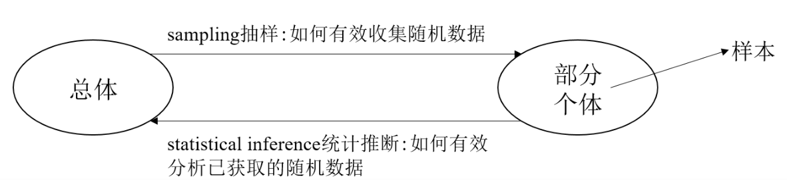

# 1 统计学基本概念

**统计学**是以概率论为基础，研究如何有效收集研究对象的随机数据，以及如何运用所获得的数据揭示统计规律的一门学科

**研究内容**：

* 抽样
* 参数估计
* 假设检验

## 总体与个体

'**总体**' 是研究问题所涉及的对象全体; 总体中每个元素称为 '**个体**'. 总体分为有限或无限总体. 例如: 全国人民的收入是总体, 一个人的收入是个体.

在研究总体时, 通常关心总体的某项或某些数量指标, 总体中的每个个体是随机试验的一个观察值, 即随机变量 $X$ 的值. 对总体的研究可转化为对随机变量 $X$ 的分布或数字特征的研究, 后面总体与随机变量 $X$ 的分布不再区分, 简称总体 $X$.

**总体**: 研究对象的全体 $\Rightarrow$ 数据 $\Rightarrow$ 随机变量 (分布末知).

**样本**: 从总体中随机抽取一些个体, 一般表示为 $X_{1}, X_{2}, \cdots, X_{n}$, 称 $X_{1}, X_{2}, \cdots, X_{n}$ 为取自总 体 $X$ 的随机样本, 其样本容量为 $n$

**抽样**: 抽取样本的过程

**样本值**: 观察样本得到的数值, 例如: $X_{1}=x_{1}, X_{2}=x_{2}, \cdots, X_{n}=x_{n}$ 为样本观察值或样本值

**样本的二重性**：

* 就一次具体观察而言, 样本值是确定的数
* 不同的抽样下, 样本值会发生变化, 可看作随机变量

### 简单随机样本

称样本 $X_{1}, X_{2}, \cdots, X_{n}$ 是总体 $X$ 的简单随机样本, 简称样本, 是指样本满足: 

1. 代表性, 即 $X_{i}$ 与 $X$ 同分布;
2. 独立性, 即 $X_{1}, X_{2}, \cdots, X_{n}$ 之间相互独立.

本书后面所考虑的样本均为简单随机样本.

设总体 $X$ 的联合分布函数为 $F(x)$, 则 $X_{1}, X_{2}, \cdots, X_{n}$ 的联合分布函数为

$$
F\left(x_{1}, x_{2}, \cdots, x_{n}\right)=\prod_{i=1}^{n} F\left(x_{i}\right)
$$

若总体 $X$ 的概率密度为 $f(x)$, 则样本 $X_{1}, X_{2}, \cdots, X_{n}$ 的联合概率密度为
$$
f\left(x_{1}, x_{2}, \cdots, x_{n}\right)=\prod_{i=1}^{n} f\left(x_{i}\right)
$$
若总体 $X$ 的分布列 $\operatorname{Pr}\left(X=x_{i}\right)$, 则样本 $X_{1}, X_{2}, \cdots, X_{n}$ 的联合分布列为
$$
\operatorname{Pr}\left(X_{1}=x_{1}, X_{2}=x_{2}, \cdots, X_{n}=x_{n}\right)=\prod_{i=1}^{n} \operatorname{Pr}\left(X_{i}=x_{i}\right)
$$
## 常用统计量

为研究样本的特性, 我们引入统计量:

设：

* $X_{1}, X_{2}, \cdots, X_{n}$ 是来自总体 $X$ 的一个样本
* $g\left(X_{1}, X_{2}, \cdots, X_{n}\right)$ 是关于 $X_{1}, X_{2}, \cdots, X_{n}$ 的一个连续、且不含任意参数的函数

称 $g\left(X_{1}, X_{2}, \cdots, X_{n}\right)$ 是一个**统计量**.

由于 $X_{1}, X_{2}, \cdots, X_{n}$ 是随机变量, 因此统计量 $g\left(X_{1}, X_{2}, \cdots, X_{n}\right)$ **是一个随机变量**

而 $g\left(x_{1}, x_{2}, \cdots, x_{n}\right)$ 为 $g\left(X_{1}, X_{2}, \cdots, X_{n}\right)$ 的一次观察值

下面研究一些常用统计量

### 样本均值

假设 $X_{1}, X_{2}, \cdots, X_{n}$ 是来自总体 $X$ 的一个样本, 定义**样本均值**为

$$
\bar{X}=\frac{1}{n} \sum_{i=1}^{n} X_{i}
$$

根据样本的独立同分布性质有：

设总体 $X$ 的期望为 $E[X]=\mu$, 方差 $\operatorname{Var}(X)=\sigma^{2}$, 则有
$$
E[\bar{X}]=\mu, \quad \operatorname{Var}(\bar{X})=\sigma^{2} / n, \quad \bar{X} \stackrel{d}{\rightarrow} \mathcal{N}\left(\mu, \sigma^{2} / n\right)
$$
### 样本方差

假设 $X_{1}, X_{2}, \cdots, X_{n}$ 是米自总体 $X$ 的一个样本, 定义样本方差为
$$
S_{0}^{2}=\frac{1}{n} \sum_{i=1}^{n}\left(X_{i}-\bar{X}\right)^{2}=\frac{1}{n} \sum_{i=1}^{n} X_{i}^{2}-\bar{X}^{2} .
$$
设总体 $X$ 的期望为 $E[X]=\mu$, 方差 $\operatorname{Var}(X)=\sigma^{2}$, 则有
$$
E\left[S_{0}^{2}\right]=\frac{n-1}{n} \sigma^{2} .
$$
**证明** 根据 $E\left[X_{i}^{2}\right]=\sigma^{2}+\mu^{2}$ 有
$$
E\left(\bar{X}^{2}\right)=E\left[\left(\frac{1}{n} \sum_{i=1}^{n} X_{i}\right)^{2}\right]=\frac{1}{n^{2}} E\left[\left(\sum_{i=1}^{n} X_{i}\right)^{2}\right]=\frac{1}{n^{2}} E\left[\sum_{i=1}^{n} X_{i}^{2}+\sum_{i \neq j} X_{i} X_{j}\right]=\frac{\sigma^{2}}{n}+\mu^{2},
$$

### 样本标准差

$$
S_{0}=\sqrt{S_{0}^{2}}=\sqrt{\frac{1}{n} \sum_{i=1}^{n}\left(X_{i}-\bar{X}\right)^{2}}
$$

### 修正的标准差与方差

#### 样本方差与总体方差存在差距

设总体 $X$ 的期望为 $E[X]=\mu$, 方差 $\operatorname{Var}(X)=\sigma^{2}$, 则有
$$
E\left[S_{0}^{2}\right]=\frac{n-1}{n} \sigma^{2} .
$$
**证明** 根据 $E\left[X_{i}^{2}\right]=\sigma^{2}+\mu^{2}$ 有
$$
E\left(\bar{X}^{2}\right)=E\left[\left(\frac{1}{n} \sum_{i=1}^{n} X_{i}\right)^{2}\right]=\frac{1}{n^{2}} E\left[\left(\sum_{i=1}^{n} X_{i}\right)^{2}\right]=\frac{1}{n^{2}} E\left[\sum_{i=1}^{n} X_{i}^{2}+\sum_{i \neq j} X_{i} X_{j}\right]=\frac{\sigma^{2}}{n}+\mu^{2}
$$

于是有
$$
E\left(S_{0}^{2}\right)=E\left(X_{i}^{2}\right)-E\left(\bar{X}^{2}\right)=\sigma^{2}+\mu^{2}-\frac{\sigma^{2}}{n}-\mu^{2}=\frac{n-1}{n} \sigma^{2} .
$$
由此可知样本方差 $S_{0}^{2}$ 与总体方差 $\sigma^{2}$ 之间存在偏差.

#### 修正的样本方差

定义修正后的样本方差为:
$$
S^{2}=\frac{1}{n-1} \sum_{i=1}^{n}\left(X_{i}-\bar{X}\right)^{2} \quad \text { 即 } \quad S^{2}=\frac{n}{n-1} S_{0}^{2} \text {, }
$$

设总体 $X$ 的期望为 $E[X]=\mu$, 方差 $\operatorname{Var}(X)=\sigma^{2}$, 则有
$$
E\left[S^{2}\right]=\sigma^{2} .
$$
**证明** 根据期望的性质有
$$
E\left[S^{2}\right]=E\left[\frac{n}{n-1} S_{0}^{2}\right]=\frac{n}{n-1} E\left[S_{0}^{2}\right]=\sigma^{2} .
$$

如果总体是正态分布，那么 $n$ 个样本的方差满足：

$$
(n-1)S^2/\sigma^2\sim \chi^2(n-1)
$$
证明见[维基百科](https://en.wikipedia.org/wiki/Variance#Distribution_of_the_sample_variance)

### 中心矩和原点矩

假设 $X_{1}, X_{2}, \cdots, X_{n}$ 是来自总体 $X$ 的一个样本, 定义样本 $k$ 阶原点矩 为:
$$
A_{k}=\frac{1}{n} \sum_{i=1}^{n} X_{i}^{k}, \quad k=1,2, \cdots
$$
定义样本 $k$ 阶中心矩为:
$$
B_{k}=\frac{1}{n} \sum_{i=1}^{n}\left(X_{i}-\bar{X}\right)^{k}, \quad k=1,2, \cdots
$$
**[例]** 设总体 $X \sim \mathcal{N}(20,3)$, 从总体中抽取两独立样本, 容量分别为 10 和 15 . 求这两个样本 均值之差的绝对值大于 $0.3$ 的概率

解 设 $X_{1}, X_{2}, \ldots, X_{10}$ 和 $X_{1}^{\prime}, X_{2}^{\prime}, \ldots, X_{15}^{\prime}$ 分别为来自总体 $X \sim \mathcal{N}(20,3)$ 的两个独立样本. 根 据正态分布的性质有
$$
\bar{X}_{1}=\frac{1}{10} \sum_{i=1}^{10} X_{i} \sim \mathcal{N}(20,3 / 10), \quad \bar{X}_{2}=\frac{1}{15} \sum_{i=1}^{15} X_{i}^{\prime} \sim \mathcal{N}(20,1 / 5)
$$

进一步根据正态分布的性质有 $\bar{X}_{1}-\bar{X}_{2} \sim \mathcal{N}(0,1 / 2)$, 于是可得

$$
\operatorname{Pr}\left(\left|\bar{X}_{1}-\bar{X}_{2}\right|>0.3\right)=2-2 \Phi(0.3 / \sqrt{1 / 2})
$$

### 次序统计量和极差

假设 $X_{1}, X_{2}, \cdots, X_{n}$ 是来自总体 $X$ 的一个样本, 定义最小次序统计量和 最大次序统计量 分 别为:
$$
X_{(1)}=\min \left\{X_{1}, X_{2}, \cdots, X_{n}\right\} \quad \text { 和 } \quad X_{(n)}=\max \left\{X_{1}, X_{2}, \cdots, X_{n}\right\} \text {, }
$$
以及定义样本极差为
$$
R_{n}=X_{(n)}-X_{(1)}
$$
设总体 $X$ 的分布函数为 $F(x)$, 则有
$$
F_{X_{(1)}}(x)=\operatorname{Pr}\left(X_{(1)} \leqslant x\right)=1-\operatorname{Pr}\left(X_{(1)}>x\right)=1-(1-F(x))^{n}, \quad F_{X_{(n)}}(x)=F^{n}(x) .
$$
定理 $8.1$ 设总体 $X$ 的密度函数为 $f(x)$, 分布函数为 $F(x), X_{1}, X_{2}, \cdots, X_{n}$ 是来自总体 $X$ 的一个样本, 则第 $k$ 次序统计量 $X_{(k)}$ 的分布函数和密度函数分别为
$$
\begin{aligned}
F_{k}(x) &=\sum_{r=k}^{n}\left(\begin{array}{l}
n \\
r
\end{array}\right)[F(x)]^{r}[1-F(x)]^{n-r} \\
f_{k}(x) &=\frac{n !}{(k-1) !(n-k) !}[F(x)]^{k-1}[1-F(x)]^{n-k} f(x)
\end{aligned}
$$
证明 根据题意有第 $k$ 次序统计量 $X_{(k)}$ 的分布函数为
$$
\begin{aligned}
F_{k}(x) &=\operatorname{Pr}\left[X_{(k)} \leqslant x\right]=\operatorname{Pr}\left[X_{1}, X_{2}, \cdots, X_{n} \text { 中至少有 } k \text { 个随机变量 } \leqslant x\right] \\
&=\sum_{r=k}^{n} \operatorname{Pr}\left[X_{1}, X_{2}, \cdots, X_{n} \text { 中恰有 } r \text { 个随机变量 } \leqslant x, n-r \text { 个随机变量 }>x\right] \\
&=\sum_{r=k}^{n}\left(\begin{array}{l}
n \\
r
\end{array}\right)[F(x)]^{r}[1-F(x)]^{n-r} .
\end{aligned}
$$
利用恒等式
$$
\sum_{r=k}^{n}\left(\begin{array}{l}
n \\
r
\end{array}\right) p^{r}(1-p)^{n-r}=\frac{n !}{(k-1) !(n-k) !} \int_{0}^{p} t^{k-1}(1-t)^{n-k} d t \quad(r \in[n], p \in[0,1])
$$
由此可知
$$
F_{k}(x)=\frac{n !}{(k-1) !(n-k) !} \int_{0}^{F(x)} t^{k-1}(1-t)^{n-k} d t
$$
根据积分函数求导完成证明.

## Beta，Gamma，Dirichlet分布

Beta等两个函数不考，但是最好背下来

### 欧拉积分函数

不考

#### Beta函数

定义 $8.3$ (Beta-函数) 对任意给定 $\alpha_{1}>0$ 和 $\alpha_{2}>0$, 定义 Beta 函数为
$$
\operatorname{Beta}\left(\alpha_{1}, \alpha_{2}\right)=\int_{0}^{1} x^{\alpha_{1}-1}(1-x)^{\alpha_{2}-1} d x
$$
有些书简记为 $B\left(\alpha_{1}, \alpha_{2}\right)$, 被称为**第一类欧拉积分**函数

#### Beta函数的对称性

根据数学分析可知 $\operatorname{Beta}\left(\alpha_{1}, \alpha_{2}\right)$ 在定义域 $(0,+\infty) \times(0,+\infty)$ 连续. 利用变量替换 $t=1-x$, 根据定 义有
$$
\begin{aligned}
\operatorname{Beta}\left(\alpha_{1}, \alpha_{2}\right) &=\int_{0}^{1} t^{\alpha_{1}-1}(1-t)^{\alpha_{2}-1} d t=\int_{1}^{0}(1-x)^{\alpha_{1}-1} x^{\alpha_{2}-1} d(1-x) \\
&=\int_{0}^{1} x^{\alpha_{2}-1}(1-x)^{\alpha_{1}-1} d x=\operatorname{Beta}\left(\alpha_{2}, \alpha_{1}\right)
\end{aligned}
$$
由此可知 **Beta 函数的对称性**: $\operatorname{Beta}\left(\alpha_{1}, \alpha_{2}\right)=\operatorname{Beta}\left(\alpha_{2}, \alpha_{1}\right)$

#### Gamma函数

定义 $8.4$ ( $\Gamma$-函数) 对任意给定 $\alpha>0$, 定义 $\Gamma$-函数为
$$
\Gamma(\alpha)=\int_{0}^{+\infty} x^{\alpha-1} e^{-x} d x
$$
又被称为**第二类欧拉积分**函数.

#### Gamma函数性质

性质 $8.1$ 对 $\Gamma$-函数, 有 $\Gamma(1)=1$ 和 $\Gamma(1 / 2)=\sqrt{\pi}$, 以及对 $\alpha>1$ 有 $\Gamma(\alpha)=(\alpha-1) \Gamma(\alpha-1)$. 

**证明** 根据定义有
$$
\Gamma(1)=\int_{0}^{+\infty} e^{-x} d x=1 \text {. }
$$
利用变量替换 $x=t^{1 / 2}$ 有
$$
\Gamma(1 / 2)=\int_{0}^{+\infty} t^{-\frac{1}{2}} e^{-t} d t=\int_{0}^{+\infty} x^{-1} e^{-x^{2}} d x^{2}=2 \int_{0}^{+\infty} e^{-x^{2}} d x=\int_{-\infty}^{+\infty} e^{-x^{2}} d x=\sqrt{\pi}
$$
进一步有
$$
\Gamma(\alpha)=-\int_{0}^{\infty} x^{\alpha-1} d e^{-x}=-\left[x^{\alpha-1} e^{-x}\right]_{0}^{+\infty}+(\alpha-1) \int_{0}^{+\infty} x^{\alpha-2} e^{-x} d x=(\alpha-1) \Gamma(\alpha-1)
$$
对任意正整数 $n$, 根据上面的性质有
$$
\Gamma(n)=(n-1) !
$$

#### Beta与Gamma的关系

定理 $8.2$ 对任意给定 $\alpha_{1}>0$ 和 $\alpha_{2}>0$, 有
$$
\operatorname{Beta}\left(\alpha_{1}, \alpha_{2}\right)=\frac{\Gamma\left(\alpha_{1}\right) \Gamma\left(\alpha_{2}\right)}{\Gamma\left(\alpha_{1}+\alpha_{2}\right)} .
$$
**证明** 根据 $\Gamma$-函数的定义有
$$
\Gamma\left(\alpha_{1}\right) \Gamma\left(\alpha_{2}\right)=\int_{0}^{+\infty} t^{\alpha_{1}-1} e^{-t} d t \int_{0}^{+\infty} s^{\alpha_{2}-1} e^{-s} d s=\int_{0}^{+\infty} \int_{0}^{+\infty} e^{-(t+s) t^{\alpha_{1}-1} s^{\alpha_{2}-1} d t d s .}
$$
引入变量替换 $x=t+s$ 和 $y=t /(t+s)$, 反解可得 $t=x y$ 和 $s=x-x y$, 计算雅可比行列式有
$$
\left|\begin{array}{cc}
\frac{\partial t}{\partial x} & \frac{\partial t}{\partial y} \\
\frac{\partial s}{\partial x} & \frac{\partial s}{\partial y}
\end{array}\right|=\left|\begin{array}{cc}
y & x \\
1-y & -x
\end{array}\right|=-x
$$
同时有 $x \in(0,+\infty)$ 和 $y \in(0,1)$ 成立, 由此可得
$$
\begin{aligned}
\Gamma\left(\alpha_{1}\right) \Gamma\left(\alpha_{2}\right) &=\int_{0}^{1} \int_{0}^{+\infty} e^{-x} x^{\alpha_{1}-1} y^{\alpha_{1}-1} x^{\alpha_{2}-1}(1-y)^{\alpha_{2}-1}|x| d x d y \\
&=\int_{0}^{1} \int_{0}^{+\infty} e^{-x} x^{\alpha_{1}+\alpha_{2}-1} y^{\alpha_{1}-1}(1-y)^{\alpha_{2}-1} d x d y \\
&=\int_{0}^{+\infty} e^{-x} x^{\alpha_{1}+\alpha_{2}-1} d x \int_{0}^{1} y^{\alpha_{1}-1}(1-y)^{\alpha_{2}-1} d y \\
&=\Gamma\left(\alpha_{1}+\alpha_{2}\right) \operatorname{Beta}\left(\alpha_{1}, \alpha_{2}\right)
\end{aligned}
$$
定理得证.

#### Beta的递推公式

根据上述定理可知

推论 $8.1$ 对任意 $\alpha_{1}>1$ 和 $\alpha_{2}>0$, 有
$$
\operatorname{Beta}\left(\alpha_{1}, \alpha_{2}\right)=\frac{\alpha_{1}-1}{\alpha_{1}+\alpha_{2}-1} \operatorname{Beta}\left(\alpha_{1}-1, \alpha_{2}\right)
$$
**证明** 根据前面的定理有

$\displaystyle\operatorname{Beta}\left(\alpha_{1}, \alpha_{2}\right)=\frac{\Gamma\left(\alpha_{1}\right) \Gamma\left(\alpha_{2}\right)}{\Gamma\left(\alpha_{1}+\alpha_{2}\right)}=\frac{\left(\alpha_{1}-1\right) \Gamma\left(\alpha_{1}-1\right) \Gamma\left(\alpha_{2}\right)}{\left(\alpha_{1}+\alpha_{2}-1\right) \Gamma\left(\alpha_{1}+\alpha_{2}-1\right)}=\frac{\alpha_{1}-1}{\alpha_{1}+\alpha_{2}-1} \operatorname{Beta}\left(\alpha_{1}-1, \alpha_{2}\right) .$

#### 多维Beta函数

定义 $8.5$ 对任意 $\alpha_{1}, \alpha_{2}, \cdots, \alpha_{k}>0$, 定义多维 Beta 函数为
$$
\operatorname{Beta}\left(\alpha_{1}, \alpha_{2}, \cdots, \alpha_{k}\right)=\frac{\Gamma\left(\alpha_{1}\right) \Gamma\left(\alpha_{2}\right) \cdots \Gamma\left(\alpha_{k}\right)}{\Gamma\left(\alpha_{1}+\alpha_{2}+\cdots+\alpha_{k}\right)} .
$$

### Beta分布

定义 $8.6$ (Beta 分布) 给定 $\alpha_{1}>0$ 和 $\alpha_{2}>0$, 若随机变量 $X$ 的概率密度为
$$
f(x)= \begin{cases}\displaystyle\frac{x^{\alpha_{1}-1}(1-x)^{\alpha_{2}-1}}{B\left(\alpha_{1}, \alpha_{2}\right)} & x \in(0,1) \\ 0 & \text { 其它. }\end{cases}
$$
称 $X$ 服从参数为 $\alpha_{1}$ 和 $\alpha_{2}$ 的 Beta 分布, 记 $X \sim B\left(\alpha_{1}, \alpha_{2}\right)$.

#### 期望与方差

$$
E[X]=\frac{\alpha_{1}}{\alpha_{1}+\alpha_{2}} \quad \text { 和 } \operatorname{Var}(X)=\frac{\alpha_{1} \alpha_{2}}{\left(\alpha_{1}+\alpha_{2}\right)^{2}\left(\alpha_{1}+\alpha_{2}+1\right)} \text {. }
$$
**证明** 根据期望的定义有
$$
\begin{aligned}
E[X] &=\frac{1}{B\left(\alpha_{1}, \alpha_{2}\right)} \int_{0}^{1} x \cdot x^{\alpha_{1}-1}(1-x)^{\alpha_{2}-1} d x=\frac{B\left(\alpha_{1}+1, \alpha_{2}\right)}{B\left(\alpha_{1}, \alpha_{2}\right)}=\frac{\alpha_{1}}{\alpha_{1}+\alpha_{2}} \\
E\left[X^{2}\right] &=\frac{1}{B\left(\alpha_{1}, \alpha_{2}\right)} \int_{0}^{1} x^{\alpha_{1}+1}(1-x)^{\alpha_{2}-1} d x=\frac{B\left(\alpha_{1}+2, \alpha_{2}\right)}{B\left(\alpha_{1}, \alpha_{2}\right)}=\frac{\alpha_{1}+1}{\alpha_{1}+\alpha_{2}+1} \frac{\alpha_{1}}{\alpha_{1}+\alpha_{2}},
\end{aligned}
$$
由此可得
$$
\operatorname{Var}(X)=E\left[X^{2}\right]-E[X]^{2}=\frac{\alpha_{1}\left(1+\alpha_{1}\right)}{\left(\alpha_{1}+\alpha_{2}\right)\left(\alpha_{1}+\alpha_{2}+1\right)}-\left(\frac{\alpha_{1}}{\alpha_{1}+\alpha_{2}}\right)^{2}=\frac{\alpha_{1} \alpha_{2}}{\left(\alpha_{1}+\alpha_{2}\right)^{2}\left(\alpha_{1}+\alpha_{2}+1\right)} .
$$

### Gamma分布

定义 $8.7$ 如果随机变量 $X$ 的概率密度
$$
f(x)= \begin{cases}\frac{\lambda^{\alpha}}{\Gamma(\alpha)} x^{\alpha-1} e^{-\lambda x} & x>0 \\ 0 & x \leqslant 0\end{cases}
$$

#### 期望与方差

若随机变量 $X \sim \Gamma(\alpha, \lambda)$, 则有 $E(X)=\alpha / \lambda$ 和 $\operatorname{Var}(X)=\alpha / \lambda^{2}$

**证明** 根据期望的定义有
$$
E[X]=\int_{0}^{\infty} \frac{\lambda^{\alpha}}{\Gamma(\alpha)} x^{\alpha} e^{-\lambda x} d x=\frac{\Gamma(\alpha+1)}{\lambda \Gamma(\alpha)} \int_{0}^{\infty} \frac{\lambda^{\alpha+1}}{\Gamma(\alpha+1)} x^{\alpha} e^{-\lambda x} d x=\alpha / \lambda .
$$
以及
$$
E\left[X^{2}\right]=\int_{0}^{\infty} \frac{\lambda^{\alpha}}{\Gamma(\alpha)} x^{\alpha+1} e^{-\lambda x} d x=\frac{\Gamma(\alpha+2)}{\lambda^{2} \Gamma(\alpha)} \int_{0}^{\infty} \frac{\lambda^{\alpha+2}}{\Gamma(\alpha+2)} x^{\alpha+1} e^{-\lambda x} d x=\alpha(\alpha+1) / \lambda^{2}
$$
由此可得
$$
\operatorname{Var}(X)=E\left[X^{2}\right]-(E[X])^{2}=\alpha(\alpha+1) / \lambda^{2}-\alpha^{2} / \lambda^{2}=\alpha / \lambda^{2}
$$
#### 可加性

若随机变量 $X \sim \Gamma\left(\alpha_{1}, \lambda\right)$ 和 $Y \sim \Gamma\left(\alpha_{2}, \lambda\right)$, 且 $X$ 与 $Y$ 相互独立, 则 $X+Y \sim$ $\Gamma\left(\alpha_{1}+\alpha_{2}, \lambda\right)$

**证明** 设随机变量 $Z=X+Y$, 根据独立同分布随机变量和函数的分布有随机变量 $Z$ 的概率密度为
$$
\begin{aligned}
f_{Z}(z)=& \int_{-\infty}^{\infty} f_{X}(x) f_{Y}(z-x) d x=\int_{0}^{z} \frac{\lambda^{\alpha_{1}}}{\Gamma\left(\alpha_{1}\right)} x^{\alpha_{1}-1} e^{-\lambda x} \frac{\lambda^{\alpha_{2}}}{\Gamma\left(\alpha_{2}\right)}(z-x)^{\alpha_{2}-1} e^{-\lambda(z-x)} d x \\
=& \frac{\lambda^{\alpha_{1}+\alpha_{2}}}{\Gamma\left(\alpha_{1}\right) \Gamma\left(\alpha_{2}\right)} e^{-\lambda z} \int_{0}^{z} x^{\alpha_{1}-1}(z-x)^{\alpha_{2}-1} d x
\end{aligned}
$$
令变量替换 $x=z t$ 有
$$
\int_{0}^{z} x^{\alpha_{1}-1}(z-x)^{\alpha_{2}-1} d x=z^{\alpha_{1}+\alpha_{2}-1} \int_{0}^{1} t^{\alpha_{1}-1}(1-t)^{\alpha_{2}-1} d t=z^{\alpha_{1}+\alpha_{2}-1} \mathcal{B}\left(\alpha_{1}, \alpha_{2}\right)
$$
在利用 Beta 函数的性质
$$
\mathcal{B}\left(\alpha_{1}, \alpha_{2}\right)=\int_{0}^{1} t^{\alpha_{1}-1}(1-t)^{\alpha_{2}-1} d t=\frac{\Gamma\left(\alpha_{1}\right) \Gamma\left(\alpha_{2}\right)}{\Gamma\left(\alpha_{1}+\alpha_{2}\right)}
$$
代入完成证明

特别地, 若随机变量 $X \sim \Gamma(1 / 2,1 / 2)$, 则其密度函数为
$$
f(x)= \begin{cases}\frac{1}{\sqrt{2 \pi}} x^{-\frac{1}{2}} e^{-\frac{1}{2} x} & x>0 \\ 0 & x \leqslant 0\end{cases}
$$

#### [记忆]正态分布的平方

若随机变量 $X \sim \mathcal{N}(0,1)$, 则有 $X^{2} \sim \Gamma(1 / 2,1 / 2)$

解 首先求解随机变量函数 $Y=X^{2}$ 的分布函数. 当 $y \leqslant 0$ 时有 $F_{Y}(y)=0$; 当 $y>0$ 时有
$$
F_{Y}(y)=\operatorname{Pr}\left(X^{2} \leqslant y\right)=\operatorname{Pr}(-\sqrt{y} \leqslant X \leqslant \sqrt{y})=\int_{-\sqrt{y}}^{\sqrt{y}} \frac{1}{\sqrt{2 \pi}} e^{-\frac{x^{2}}{2}} d x,
$$
由此得到概率密度为 $f_{Y}(y)=\frac{1}{\sqrt{2\pi}} \frac{1}{\sqrt{y}} e^{-\frac{y}{2}}$. 从而得到 $X^{2} \sim \Gamma(1 / 2,1 / 2)$

### Dirichlet 分布

**Dirichlet分布记到二维，高维的不考**

给定 $\alpha_{1}, \alpha_{2}, \cdots, \alpha_{k} \in(0,+\infty)$, 若多元随机向量 $X=\left(X_{1}, X_{2}, \cdots, X_{k}\right)$ 的密度函数 为
$$
f\left(x_{1}, x_{2}, \cdots, x_{k}\right)= \begin{cases}\frac{x_{1}^{\alpha_{1}-1} x_{2}^{\alpha_{2}-1} \ldots x_{k}^{\alpha_{k}-1}}{\operatorname{Beta}\left(\alpha_{1}, \alpha_{2}, \cdots, \alpha_{k}\right)} & \sum_{i=1}^{k} x_{i}=1, x_{i}>0(i \in[k]), \\ 0 & \text { 其它 }\end{cases}
$$
则称 $X$ 服从参数为 $\alpha_{1}, \alpha_{2}, \cdots, \alpha_{k}$ 的 Dirichlet 分布, 记 $X \sim \operatorname{Dir}\left(\alpha_{1}, \alpha_{2}, \cdots, \alpha_{k}\right)$

Dirichlet 分布是 Beta 分布的一种推广, 当 $k=2$ 时 Dirichlet 分布退化为 Beta 分布

#### 期望与方差

若随机向量 $X=\left(X_{1}, X_{2}, \cdots, X_{k}\right) \sim \operatorname{Dir}\left(\alpha_{1}, \alpha_{2}, \cdots, \alpha_{k}\right)$, 设 $\tilde{\alpha}=\alpha_{1}+\alpha_{2}+\cdots+\alpha_{k}$ 和 $\tilde{\alpha}_{i}=\alpha_{i} / \tilde{\alpha}$, 则
$$
E\left[X_{i}\right]=\tilde{\alpha}_{i} \quad \operatorname{Cov}\left(X_{i}, X_{j}\right)= \begin{cases}\frac{\tilde{\alpha}_{i}\left(1-\tilde{\alpha}_{i}\right)}{\tilde{\alpha}+1} & i=j, \\ -\tilde{\alpha}_{i} \tilde{\alpha}_{j} & i \neq j .\end{cases}
$$
**证明** 根据期望的定义有
$$
\begin{aligned}
E\left[X_{i}\right] &=\frac{\iint_{\sum_{i} x_{i}=1, x_{i} \geqslant 0} x_{1}^{\alpha_{1}-1} x_{2}^{\alpha_{2}-1} \cdots x_{k}^{\alpha_{k}-1} \cdot x_{i} d x_{1} \cdots d x_{k}}{\operatorname{Beta}\left(\alpha_{1}, \alpha_{2}, \cdots, \alpha_{k}\right)} \\
&=\frac{\operatorname{Beta}\left(\alpha_{1}, \cdots, \alpha_{i}+1, \cdots, \alpha_{k}\right)}{\operatorname{Beta}\left(\alpha_{1}, \cdots, \alpha_{i}, \cdots, \alpha_{k}\right)}=\frac{\alpha_{i}}{\alpha_{1}+\alpha_{2}+\cdots+\alpha_{k}}=\tilde{\alpha}_{i}
\end{aligned}
$$
若 $i=j$, 则有
$$
\operatorname{Cov}\left(X_{i}, X_{i}\right)=E\left[X_{i}^{2}\right]-\left(E\left[X_{i}\right]\right)^{2}=\frac{\operatorname{Beta}\left(\alpha_{1}, \cdots, \alpha_{i}+2, \cdots, \alpha_{k}\right)}{\operatorname{Beta}\left(\alpha_{1}, \cdots, \alpha_{i}, \cdots, \alpha_{k}\right)}-\left(\tilde{\alpha}_{i}\right)^{2}=\frac{\tilde{\alpha}_{i}\left(1-\tilde{\alpha}_{i}\right)}{\tilde{\alpha}+1} .
$$
若 $i \neq j$, 则有
$$
\begin{aligned}
\operatorname{Cov}\left(X_{i}, X_{j}\right) &=E\left[X_{i} X_{j}\right]-E\left[X_{i}\right] E\left[X_{j}\right]=\frac{\operatorname{Beta}\left(\alpha_{1}, \cdots, \alpha_{i}+1, \cdots, \alpha_{j}+1, \cdots, \alpha_{k}\right)}{\operatorname{Beta}\left(\alpha_{1}, \cdots, \alpha_{i}, \cdots, \alpha_{j}, \cdots, \alpha_{k}\right)}-\tilde{\alpha}_{i} \tilde{\alpha}_{j} \\
&=\frac{\alpha_{i} \alpha_{j}}{\tilde{\alpha}(\tilde{\alpha}+1)}-\tilde{\alpha}_{i} \tilde{\alpha}_{j}=-\frac{\tilde{\alpha}_{i} \tilde{\alpha}_{j}}{\tilde{\alpha}+1}
\end{aligned}
$$

## 正态总体抽样分布定理

五大定理：背下来，搞清楚什么时候用什么公式

### $\chi^{2}$ 分布

定义 $8.9$ 若 $X_{1}, X_{2}, \cdots, X_{n}$ 是来自总体 $X \sim \mathcal{N}(0,1)$ 的一个样本, 称 $Y=X_{1}^{2}+X_{2}^{2}+\cdots+X_{n}^{2}$ 为服从自由度为 $n$ 的 $\chi^{2}$ 分布, 记 $Y \sim \chi^{2}(n)$

根据 $X_{1}^{2} \sim \Gamma(1 / 2,1 / 2)$ 和 $\Gamma$ 函数的可加性可得 $Y \sim \Gamma(n / 2,1 / 2)$. 于是有随机变量 $Y$ 的概率密度为
$$
f_{Y}(y)= \begin{cases}\frac{\left(\frac{1}{2}\right)^{\frac{n}{2}}}{\Gamma(n / 2)} y^{\frac{n}{2}-1} e^{-\frac{y}{2}} & y>0 \\ 0 & y \leqslant 0\end{cases}
$$
#### 期望与方差

若随机变量 $X \sim \chi^{2}(n)$, 则 $E(X)=n$ 和 $\operatorname{Var}(X)=2 n$

证明 若随机变量 $X \sim \chi^{2}(n)$, 则有 $X=X_{1}^{2}+X_{2}^{2}+\cdots+X_{n}^{2}$, 其中 $X_{1}, X_{2}, \cdots, X_{n}$ 是总体为 $X^{\prime} \sim \mathcal{N}(0,1)$ 的一个样本. 我们有
$$
\begin{aligned}
E[X] &=E\left[X_{1}^{2}+X_{2}^{2}+\cdots+X_{n}^{2}\right]=n E\left[X_{1}^{2}\right]=n \\
\operatorname{Var}(X) &=n \operatorname{Var}\left(X_{1}^{2}\right)=n\left[E\left(X_{1}^{4}\right)-\left(E\left(X_{1}^{2}\right)\right)^{2}\right]=n\left(E\left(X_{1}^{4}\right)-1\right)
\end{aligned}
$$
计算
$$
E\left(X_{1}^{4}\right)=\int_{-\infty}^{+\infty} \frac{x^{4}}{\sqrt{2 \pi}} e^{-\frac{x^{2}}{2}} d x=-\int_{-\infty}^{+\infty} \frac{x^{3}}{\sqrt{2 \pi}} d e^{-\frac{x^{2}}{2}}=3 \int_{-\infty}^{+\infty} \frac{x^{2}}{\sqrt{2 \pi}} e^{-\frac{x^{2}}{2}} d x=3
$$
可得 $\operatorname{Var}(X)=2 n$

若随机变量 $X \sim \mathcal{N}(0,1)$, 则
$$
E\left(X^{k}\right)= \begin{cases}(k-1) ! ! & k \text { 为偶数 } \\ 0 & k \text { 为奇数 }\end{cases}
$$
其中 $(2 k) ! !=2 k \cdot(2 k-2) \cdots 2$ 和 $(2 k+1) ! !=(2 k+1) \cdot(2 k-1) \cdots 1$

#### 可加性

若随机变量 $X \sim \chi^{2}(m)$ 和 $Y \sim \chi^{2}(n)$ 相互独立, 则 $X+Y \sim \chi^{2}(m+n)$

回顾分布可加性:
- 如果 $X \sim \mathcal{N}\left(\mu_{1}, a_{1}^{2}\right)$ 和 $Y \sim \mathcal{N}\left(\mu_{2}, a_{2}^{2}\right)$, 且. $X$ 与 $Y$ 独立, 那么 $X \pm Y \sim \mathcal{N}\left(\mu_{1} \pm \mu_{2}, a_{1}^{2}+a_{2}^{2}\right)$;
- 如果 $X \sim B\left(n_{1}, p\right)$ 和 $Y \sim B\left(n_{2}, p\right)$, 且 $X$ 与 $Y$ 独立, 那么 $X+Y \sim B\left(n_{1}+n_{2}, p\right)$;
- 如果 $X \sim P\left(\lambda_{1}\right)$ 和 $Y \sim P\left(\lambda_{2}\right)$, 且 $X$ 与 $Y$ 独立, 那么 $X+Y \sim P\left(\lambda_{1}+\lambda_{1}\right)$;
- 如果 $X \sim \Gamma\left(\alpha_{1}, \lambda\right)$ 和 $Y \sim \Gamma\left(\alpha_{2}, \lambda\right)$, 且. $X$ 与 $Y$ 独立, 那么 $X+Y \sim \Gamma\left(\alpha_{1}+\alpha_{2}, \lambda\right)$.
- 如果 $X \sim \chi^2(m)$ 和 $Y \sim \chi^2(n)$, 且 $X$ 与 $Y$ 独立, 那么 $X+Y \sim \chi^2(m+n)$.

### t 分布 (student distribution)

定义 $8.10$ 随机变量 $X \sim \mathcal{N}(0,1)$ 和 $Y \sim \chi^{2}(n)$ 相互独立, 则随机变量
$$
T=\frac{X}{\sqrt{Y / n}}
$$
服从自由度为 $n$ 的 $t$-分布, 记 $T \sim t(n)$.

随机变量 $T \sim t(n)$ 的概率密度为
$$
f(x)=\frac{\Gamma\left(\frac{n+1}{2}\right)}{\Gamma\left(\frac{n}{2}\right) \sqrt{n \pi}}\left(1+\frac{x^{2}}{n}\right)^{-\frac{n+1}{2}} \quad x \in(-\infty,+\infty) .
$$

由此可知 $t$-分布的密度函数 $f(x)$ 是偶函数. 当 $n>1$ 为偶数时有
$$
\frac{\Gamma\left(\frac{n+1}{2}\right)}{\Gamma\left(\frac{n}{2}\right) \sqrt{n \pi}}=\frac{(n-1)(n-3) \cdots 5 \cdot 3}{2 \sqrt{n}(n-2)(n-4) \cdots 4 \cdot 2}
$$
当 $n>1$ 为奇数时有
$$
\frac{\Gamma\left(\frac{n+1}{2}\right)}{\Gamma\left(\frac{n}{2}\right) \sqrt{n \pi}}=\frac{(n-1)(n-3) \cdots 4 \cdot 2}{\pi \sqrt{n}(n-2)(n-4) \cdots 5 \cdot 3} .
$$
当 $n \rightarrow \infty$ 时, 随机变量 $T \sim t(n)$ 的概率密度
$$
f(x) \rightarrow \frac{1}{\sqrt{2 \pi}} e^{-\frac{x^{2}}{2}}
$$
因此当 $n$ 足够大时, $f(x)$ 可被近似为 $\mathcal{N}(0,1)$ 的密度函数

### F 分布

定义 $8.11$ 设随机变量 $X \sim \chi^{2}(m)$ 和 $Y \sim \chi^{2}(n)$ 相互独立, 称随机变量
$$
F=\frac{X / m}{Y / n}
$$

服从自由度为 $(m, n)$ 的 $F$-分布, 记 $F \sim F(m, n)$.

随机变量 $F \sim F(m, n)$ 的概率密度为
$$
f(x)= \begin{cases}\frac{\Gamma\left(\frac{m+n}{2}\right)\left(\frac{m}{n}\right)^{\frac{m}{2}} x^{\frac{m}{2}-1}}{\Gamma\left(\frac{m}{2}\right) \Gamma\left(\frac{n}{2}\right)\left(1+\frac{m x}{n}\right)^{\frac{m+n}{2}}} & x>0 \\ 0 & x \leqslant 0\end{cases}
$$
若随机变量 $F \sim F(m, n)$, 则 $\frac{1}{F}=F(n, m)$.

### 抽样分布定理一

定理 $8.8$ 设 $X_{1}, X_{2}, \cdots, X_{n}$ 是来自总体 $\mathcal{N}\left(\mu, \sigma^{2}\right)$ 的样本, 则有
$$
\bar{X}=\frac{1}{n} \sum_{i=1}^{n} X_{i} \sim \mathcal{N}\left(\mu, \frac{\sigma^{2}}{n}\right), \quad \frac{\bar{X}-\mu}{\sigma / \sqrt{n}} \sim \mathcal{N}(0,1)
$$
### 抽样分布定理二

定理 $8.9$ 设 $X_{1}, X_{2}, \cdots, X_{n}$ 是来自总体 $\mathcal{N}\left(\mu, \sigma^{2}\right)$ 的样本, 其样本均值和修正样本方差分别为
$$
\bar{X}=\sum_{i=1}^{n} X_{i} / n \quad \text { 和 } \quad S^{2}=\frac{1}{n-1} \sum_{i=1}^{n}\left(X_{i}-\bar{X}\right)^{2} \text {, }
$$
则有 $\bar{X}$ 和 $S^{2}$ 相互独立, 且.
$$
\frac{(n-1) S^{2}}{\sigma^{2}} \sim \chi^{2}(n-1)
$$
此定理证明参考书的附件

### 抽样分布定理三

定理 $8.10$ 设 $X_{1}, X_{2}, \cdots, X_{n}$ 是来自总体 $\mathcal{N}\left(\mu, \sigma^{2}\right)$ 的样本, 其样本均值和修正样本方差分别 为
$$
\bar{X}=\sum_{i=1}^{n} X_{i} / n \quad \text { 和 } \quad S^{2}=\frac{1}{n-1} \sum_{i=1}^{n}\left(X_{i}-\bar{X}\right)^{2} \text {, }
$$
则有
$$
\frac{\bar{X}-\mu}{S / \sqrt{n}} \sim t(n-1)
$$
**证明** 根据前面两个定理可知 $(\bar{X}-\mu) / \sigma \sqrt{n} \sim \mathcal{N}(0,1)$ 和 $(n-1) S^{2} / \sigma^{2} \sim \chi^{2}(n-1)$, 于是有
$$
\frac{\bar{X}-\mu}{S / \sqrt{n}}=\frac{\bar{X}-\mu}{\sigma / \sqrt{n}} / \sqrt{\frac{(n-1) S^{2}}{\sigma^{2}(n-1)}} \sim t(n-1) .
$$
### 抽样分布定理四

定理 $8.11$ 设 $X_{1}, X_{2}, \cdots, X_{m}$ 和 $Y_{1}, Y_{2}, \cdots, Y_{n}$ 分别来自总体 $\mathcal{N}\left(\mu_{X}, \sigma^{2}\right)$ 和 $\mathcal{N}\left(\mu_{Y}, \sigma^{2}\right)$ 的两个 独立样本, 令其样本均值分别 $\bar{X}$ 和 $\bar{Y}$, 修正样本方差分别为 $S_{X}^{2}$ 和 $S_{Y}^{2}$, 则
$$
\frac{\bar{X}-\bar{Y}-\left(\mu_{X}-\mu_{Y}\right)}{\sqrt{\frac{(m-1) S_{X}^{2}+(n-1) S_{Y}^{2}}{m+n-2} \sqrt{\frac{1}{m}+\frac{1}{n}}}} \sim t(m+n-2)
$$
证明 根据正太分布的性质有 $\bar{X} \sim \mathcal{N}\left(\mu_{X}, \sigma^{2} / m\right)$ 和 $\bar{Y} \sim \mathcal{N}\left(\mu_{Y}, \sigma^{2} / n\right)$, 以及
$$
\bar{X}-\bar{Y} \sim \mathcal{N}\left(\mu_{X}-\mu_{Y},\left(\frac{1}{m}+\frac{1}{n}\right) \sigma^{2}\right),
$$
进一步有
$$
\frac{\bar{X}-\bar{Y}-\left(\mu_{X}-\mu_{Y}\right)}{\sigma \sqrt{\frac{1}{m}+\frac{1}{n}}} \sim \mathcal{N}(0,1)
$$
根据定理 $8.9$ 有 $\frac{(m-1) S_{X}^{2}}{\sigma^{2}} \sim \chi^{2}(m-1)$ 和 $\frac{(n-1) S_{Y}^{2}}{\sigma^{2}} \sim \chi^{2}(n-1)$, 由此得到
$$
\frac{(m-1) S_{X}^{2}+(n-1) S_{Y}^{2}}{\sigma^{2}} \sim \chi^{2}(m+n-2)
$$
从而完成证明

### 抽样分布定理五

定理 $8.12$ 设 $X_{1}, X_{2}, \cdots, X_{m}$ 和 $Y_{1}, Y_{2}, \cdots, Y_{n}$ 分别来自总体 $\mathcal{N}\left(\mu_{X}, \sigma_{X}^{2}\right)$ 和 $\mathcal{N}\left(\mu_{Y}, \sigma_{Y}^{2}\right)$ 的两 个独立样本, 令其修正样本方差分别为 $S_{X}^{2}$ 和 $S_{Y}^{2}$, 则有
$$
\frac{S_{X}^{2} / \sigma_{X}^{2}}{S_{Y}^{2} / \sigma_{Y}^{2}} \sim F(m-1, n-1)
$$
证明 根据定理 $8.9$ 有 $\frac{(m-1) S_{X}^{2}}{\sigma_{X}^{2}} \sim \chi^{2}(m-1)$ 和 $\frac{(n-1) S_{Y}^{2}}{\sigma_{Y}^{2}} \sim \chi^{2}(n-1)$, 由此得到
$$
\frac{\frac{(m-1) S_{X}^{2}}{\sigma_{X}^{2}} /(m-1)}{\frac{(n-1) S_{Y}^{2}}{\sigma_{Y}^{2}} /(n-1)} \sim F(m-1, n-1) .
$$

### 分位数（点）

定义 $8.12$ 对给定 $\alpha \in(0,1)$ 和随机变量 $X$, 称满足 $\operatorname{Pr}\left(X>\lambda_{\alpha}\right)=\alpha$ 的实数 $\lambda_{\alpha}$ 为上侧 $\alpha$ 分位 数 (点).

* 对正态分布 $X \sim \mathcal{N}(0,1)$, 给定 $\alpha \in(0,1)$, 满足 $\operatorname{Pr}\left(X>\mu_{\alpha}\right)=\int_{\mu_{\alpha}}^{\infty} f(x) d x=\alpha$ 的点 $\mu_{\alpha}$ 称为正 态分布上侧 $\alpha$ 分位点, 由对称性可知 $\mu_{1-\alpha}=-\mu_{\alpha}$.
* 对 $\chi^{2}(n)$ 分布 $X \sim \chi^{2}(n)$, 给定 $\alpha \in(0,1)$, 满足 $\operatorname{Pr}\left(X \geqslant \chi_{\alpha}^{2}(n)\right)=\alpha$ 的点 $\chi_{\alpha}^{2}(n)$ 称为 $\chi^{2}(n)$ 分 布上侧 $\alpha$ 分位点. 当 $n \rightarrow \infty$ 时有 $\chi_{\alpha}^{2}(n) \approx \frac{1}{2}\left(\mu_{\alpha}+\sqrt{2 n-1}\right)^{2}$, 其中 $\mu_{\alpha}$ 表示正态分布上侧 $\alpha$ 分位点.
* 对 $t$-分布 $X \sim t(n)$, 给定 $\alpha \in(0,1)$, 满足 $\operatorname{Pr}\left(X>t_{\alpha}(n)\right)=\alpha$ 的点 $t_{\alpha}(n)$ 称为 $t(n)$-分布上侧 $\alpha$ 分位点. 由对称性可知 $t_{(1-\alpha)}(n)=-t_{\alpha}(n)$.
* 对 $F$-分布 $X \sim F(m, n)$, 给定 $\alpha \in(0,1)$, 满足 $\operatorname{Pr}\left[X>F_{\alpha}(m, n)\right]=\alpha$ 的点 $F_{\alpha}(m, n)$ 称为 $F(m, n)$ 分布上侧 $\alpha$ 分位点.

对于 $F$-分布, 有如下性质:

引理 $8.4$ 对 $F$ 分布的分位点有
$$
F_{(1-\alpha)}(m, n)=\frac{1}{F_{\alpha}(n, m)}
$$
证明 设 $X \sim F(m, n)$, 根据定义有
$$
1-\alpha=\operatorname{Pr}\left(X>F_{1-\alpha}(m, n)\right)=\operatorname{Pr}\left(\frac{1}{X}<\frac{1}{F_{1-\alpha}(m, n)}\right)=1-\operatorname{Pr}\left(\frac{1}{X} \geqslant \frac{1}{F_{1-\alpha}(m, n)}\right) .
$$
再根据 $1 / X \sim F(n, m)$, 结合上式有
$$
\alpha=\operatorname{Pr}\left(\frac{1}{X} \geqslant \frac{1}{F_{1-\alpha}(m, n)}\right)=\operatorname{Pr}\left(\frac{1}{X}>\frac{1}{F_{1-\alpha}(m, n)}\right)
$$
于是有 $F_{\alpha}(n, m)=1 / F_{1-\alpha}(m, n)$.

