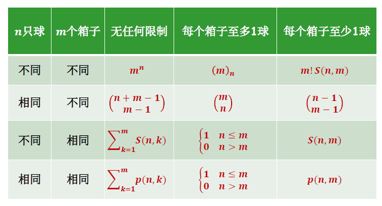

# 几何概型与十二重计数

## 定义

### 特点

* 样本空间无限可测（无限不可列），可以用几何图形表示，其相应的几何测度是一个非零有限的实数
* 每个基本事件发生的可能性大小相等，从而每个事件发生的概率与该事件的几何测度相关，与具体位置无关

### 严格定义

在一个测度有限的区域 $\Omega$  内等可能性投点，落入其中的任意子区域 $A$ 的可能性和 $A$ 的测度成正比，与 $A$ 的位置与形状无关，这样的概率模型称为几何概型

事件 $A$ 发生的概率为 $\displaystyle P(A)=\frac{A的测度}{\Omega 的测度}=\frac{\mu(A)}{\mu(\Omega)}$

## 计算概率

### 统计模拟法

通过计算机模拟仿真近似计算几何概型的概率

先构造模型，再进行计算机模拟试验，用统计的方法计算其估计值近似概率。

### 十二重计数

概率的计算往往与组合计数密切相关，且组合计数在人工智能、计算机领域有广泛的应用

#### 环排列

从 $n$ 个不同的元素中无放回地取出 $r$ 个元素排成一个圆环，有 $(n)_r/r$ 种不同排法，称为环排列数

特别地，n个不同元素的环排列数为 $(n-1)!$

#### 多重组合

将 $n$ 个不同的元素分成 $k$ 组，组内元素无顺序关系，每组有 $r_1,\cdots ,r_k$ 个元素，$n=r_1+\cdots+r_k$

有$\displaystyle\binom{n}{r_1,\cdots ,r_k} =\binom{n}{r_1}\binom{n-r_1}{r_2}\binom{n-r_1-r_2}{r_3}\cdots\binom{r_k}{r_k}=\frac{n!}{r_1!r_2!\cdots r_k!}$ 种分组方法

$\displaystyle(x_1+x_2+\cdots+x_k)^n=\sum_{n=r_1+\cdots+r_k}\binom{n}{r_1,r_2,\cdots,r_k}x_1^{r_1}x_2^{r_2}\cdots x_k^{r_k}$

#### 多重排列

如果一个集合中的元素可以重复，且重复的元素间不可分辨，这个集合称为**多重集**

假设多重集 $A$ 有 $k$ 类不同的元素, 每类元素的个数分别为 $r_{1}, r_{2}, \cdots, r_{k}$, 即 $n=r_{1}+r_{2}+\cdots+r_{k}$. 若将此多重集 $A$ 中的所有元素排列成一排, 则相当于从 $n$ 个位置中选取出 $r_{1}$ 个位置放第一类元素， 再从剩下的从 $n-r_{1}$ 个位置中选取出 $r_{2}$ 个位置放第二类元素, $\cdots$, 从最后 $r_{k}$ 个位置放第 $k$ 类元素. 因此该多重集 $A$ 有

$
\left(\begin{array}{c}
n \\
r_{1}, r_{2}, \cdots, r_{k}
\end{array}\right)
$

种不同的排列方法, 即多重组合数.

#### 整数的有序分解

将 $n$ 个完全相同不可分辨的球放入 $m$ 个不同的箱子

即求方程 $x_1+\cdots+x_m=n$ 的非负整数解个数

个数为 $\displaystyle\binom{n+m-1}{m-1}$ （用高中的球之间插入隔板的办法）

#### 第二类Stirling数

$n$ 个不同元素分成 $m$ 个非空子集，不同的划分数称为第二类Stirling数，记为 $S(n,m)$

我们首先以集合 $\{1,2,3\}$ 为例, 讨论不同的划分数:
- 若分成 $m=1$ 个非空的子集, 则有 $\{1,2,3\}$, 因此 $S(3,1)=1$;
- 若分成 $m=2$ 个非空的子集, 则有 $\{\{1\},\{2,3\}\},\{\{2\},\{1,3\}\},\{\{3\},\{1,2\}\}$, 因此 $S(3,2)=3$;
- 若分成 $m=3$ 个非空的子集, 则有 $\{\{1\},\{2\},\{3\}\}$, 因此 $S(3,3)=1$.

遵从惯例设 $S(0,0)=1$. 当 $n \geqslant 1$ 时有 $S(n, n)=S(n, 1)=1$ 和 $S(n, 0)=0$. 当 $m>n \geqslant 1$ 时有 $S(n, m)=0$. 

针对更一般情况, 第二类 Stirling 数有如下的递推关系:

**定理 $1.2$** 对 $n \geqslant 1, m \geqslant 1$ 有

$S(n, m)=m S(n-1, m)+S(n-1, m-1)$

**证明** 

根据定义可知将集合 $\{1,2, \ldots, n\}$ 划分成 $m$ 个非空的子集, 有 $S(n, m)$ 种不同的划分数, 将这些不同的划分可以分成两种情况考虑:

- 若元素 $n$ 被划分为单独的子集 $\{n\}$, 则其它剩余的元素被划分成 $m-1$ 个非空的子集, 此时 有 $S(n-1, m)$ 种不同的划分数;
- 若元素 $n$ 未被划分为单独的子集, 其它剩余元素被划分成 $m$ 个非空的子集, 有 $S(n-1, m)$ 种不同的划分数; 再将元素 $n$ 放入已经划分好的 $m$ 个子集之一, 共 $m S(n-1, m)$ 种划分数. 由此完成证明.

根据上面的递推关系, 并利用归纳法证明可得：

**推论 $1.2$** 第二类 Stirling 数满足

$
S(n, m)=\frac{1}{m !} \sum_{i=0}^{m}(-1)^{i}\left(\begin{array}{c}
m \\
i
\end{array}\right)(m-i)^{n} \quad \text { 和 } \quad \sum_{m=1}^{n} S(n, m)(x)_{m}=x^{n}
$

这里 $(x)_{m}=x(x-1) \cdots(x-m+1) .$

#### 整数的无序分拆

考虑将 $n$ 只相同的球放入 $m$ 个相同的箱子

等价于将正整数 $n$ 划分成 $m$ 个无序的正整数之和，划分数记为 $p(n,m)$

等价于 $x_1+x_2+\cdots+x_m=n\quad s.t.\quad x_1\geq x_2 \geq x_m\geq 1$

定义 $p(0,0)=1$

$n\geq1$ 时有 $p(n,n)=p(n,1)=1$ 和 $P(n,0)=0$

$m>n\geq1$ 时有 $p(n,m)=0$

**递推**：

对 $n\geq1,m\geq1$ 有：

$p(n,m)=p(n-1,m-1),+p(n-m,m)$

$p(n,m)=\sum_{i=1}^mp(n-m.i)$

**估算**：

对 $n\geq1,m\geq1$ 有：

$\displaystyle \frac{1}{m!}\binom{n-1}{m-1}\leq p(n,m)\leq \frac{1}{m!}\binom{n-1+m(m-1)/2}{m-1}$

故对于给定整数 $m\geq1$，当 $n$ 非常大或趋近正无穷时

$\displaystyle p(n,m)\approx \frac{n^{m-1}}{m!(m-1)!}$

### 最终结论

