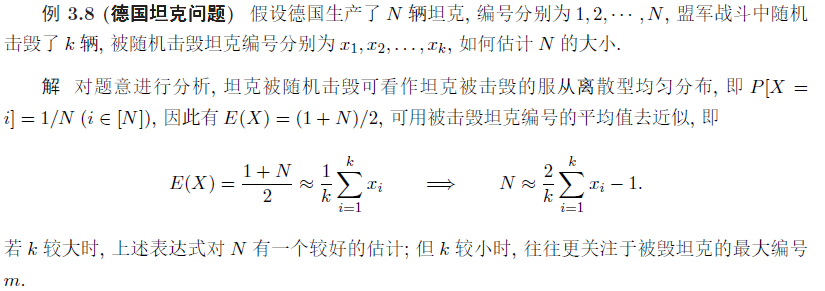
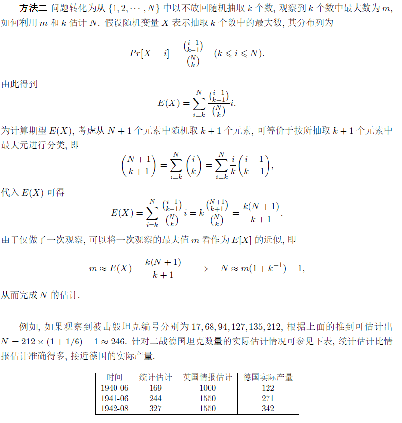
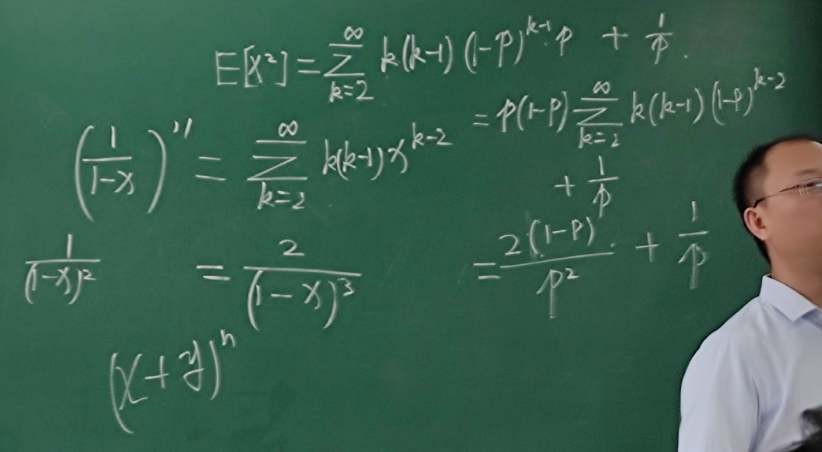

# 离散型随机变量

注意：离散型随机变量 $+$ 连续型随机变量 $\ne$ 所有随机变量

## 概述

离散型随机变量 $X$ 的取值是**有限或可列**的（否则称为非离散型随机变量）

不妨假设其取值为 $x_1,x_2,\cdots,x_k,\cdots$ ，事件 $X=x_k$ 的概率记为

$p_k=P(X=x_k)\quad k=1,2,\cdots$

称为随机变量 $X$ 的分布列

分布列包含离散型随机变量的取值和概率，完全刻画了其概率属性

## 性质

**非负性**：$p_k\geq0$（严格地，$p_k>0$，因为离散型考虑 $0$ 是没有意义的）

**完备性**：$\sum_{k} p_k=1$

## 期望

若级数 $\displaystyle\sum_{k=1}^\infty p_kx_k$ 绝对收敛，称其为随机变量 $X$ 的期望，又称均值，记为 $E(X)$

$\displaystyle E(X)=\sum_{k=1}^\infty p_kx_k$

期望反映随机变量的平均值，由分布列决定，是一个常量

本质是随机变量的取值根据概率加权所得，可以由分布列直接计算

级数的绝对收敛保证级数和不随次序的改变而改变

期望是一阶统计量

### 计算

#### 数乘和加法

$E(aX+b)=aE(X)+b$

#### 与函数的复合

设 $X$ 为离散型随机变量，$g:R\rightarrow R$ 是连续函数，$\sum_{k\geq1}g(x_k)p_k$ 绝对收敛，则有：

$\displaystyle E[g(X)]=\sum_{k=1}^\infty g(x_k)p_k$

即求 $Y=g(X)$ 的期望不需要 $Y$ 的分布列

**推论**：

$\displaystyle E(\sum_{i=1}^n c_i g_i(X))=\sum_{i=1}^n c_i E(g_i(X))$

例：$E(X^2+X+\sin X+4)=E(X^2)+E(X)+E(\sin X)+4$

### Jensen不等式

实际运用中，我们往往不知道随机变量的分布，但是需要对期望进行一定的估计，为此需要引入一些不等式

下面探讨 $g(E(X))$ 与 $E(g(X))$ 的大小关系（ $X\in[a,b],\quad g:[a,b]\to R$ ）

* 当 $g:[a,b]\to R$ 为**连续凸函数** $g(E(X))\leq E(g(X))$
* 当 $g:[a,b]\to R$ 为**连续凹函数** $g(E(X))\geq E(g(X))$

#### 证明

## 方差

尽管随机变量的均值相同 $E X=E Y=E Z=0$, 但这三个陏机变量与期望的偏离程度有很大的差异, 本节研究随机变量 $X$ 与期望 $E(X)$ 的偏离程度, 即方差。

设离散性随机变量 $X$ 的分布列为 $p_{k}=P\left(X=x_{k}\right)(k \geqslant 0)$, 若期望 $E(X)=\sum_{k} x_{k} p_{k}$ 存在, 以及 $E(X-E(X))^{2}=\sum_{k} p_{k}\left(x_{k}-E(X)\right)^{2}$ 存在, 称 $E(X-E(X))^{2}$ 为随机变量 $X$ 的**方差** (variance), 记为 $\operatorname{Var}(X)$ 或 $D(X)$, 即

$\operatorname{Var}(X)=\mathrm{D}(X)=E(X-E(X))^{2}=\sum_{k} p_{k}\left(x_{k}-E(X)\right)^{2}=\sum_{k} p_{k}\left(x_{k}-\sum_{k} x_{k} p_{k}\right)^{2}$

称 $\sqrt{\operatorname{Var}(X)}$ 为标准差 (standard deviation), 记为 $\sigma(X)$.

方差是二阶统计量

根据方差的绝对收敛性可知方差不会随随机变量取值的顺序改变而改变, 进而根据期望的性质有

$\begin{aligned}
\operatorname{Var}(X) &=E(X-E(X))^{2} \\
&=E\left(X^{2}-2 X E(X)+E^{2}(X)\right)
\end{aligned}$

方差的另一种等价定义：$Var(X)=E(X^2)-[E(X)]^2$

证明：$Var(X)=E\left(X^{2}-2 X E(X)+E^{2}(X)\right)=E(X^2)-2E(X)E(X)+(E(X))^2$

可以用于简化计算：

### 性质

对于随机变量 $X$ 和常数 $a\in R$，有 $Var(X)=E(X-E(X))^2\leq E(X-a)^2$

## 特殊的离散分布

方差和均值的证明见第九、十次课讲义

### 离散均匀分布

定义 $3.4$ 设随机变量 $X$ 的取值为 $x_{1}, x_{2}, \cdots, x_{n}$, 且 $P\left(X=x_{i}\right)=1 / n$, 称 $X$ 服从离散型均匀 分布.
由定义可知
$$
\begin{aligned}
E(X) &=\frac{1}{n} \sum_{i=1}^{n} x_{i} \\
\operatorname{Var}(X) &=\frac{1}{n} \sum_{i=1}^{n} x_{i}^{2}-\left(\frac{1}{n} \sum_{i=1}^{n} x_{i}\right)^{2}
\end{aligned}
$$
下面来看一个离散型均匀分布的例子.
例 $3.8$ (德国坦克问题) 假设德国生产了 $N$ 辆坦克, 编号分别为 $1,2, \cdots, N$, 盟军战斗中随机 击毁了 $k$ 辆, 被随机击毁坦克编号分别为 $x_{1}, x_{2}, \ldots, x_{k}$, 如何估计 $N$ 的大小.

### 0/1分布

随机变量 $X$ 的取值为 ${0,1}$，分布列为 $P(X=1)=p,\quad P(x=0)=1-p$

称其服从参数为 $p$ 的 $0-1$ 分布，或 Bernoulli 分布，记 $X \sim Ber(p)$

此时 $E(X)=p,Var(X)=p(1-p)$

### 二项分布

Bernoulli 试验有两个结果：$A,\overline{A}$，设 $P(A)=p$

将 Bernoulli 试验重复进行 $n$ 次，称为 $n$ 重 Bernoulli 试验

用随机变量 $X$ 表示 $n$ 重 Bernoulli 试验中事件 $A$ 发生的次数，则：

$\displaystyle P(X=k)=\binom{n}{k}p^k(1-p^{n-k})\quad\quad k\in\{0,1,2,\cdots ,n\}$

称 $X$ 服从参数为 $n,p$ 的二项分布，记为 $X\sim B(n,p)$

$E(X)=np\quad Var(X)=np(1-p)$

### 几何分布

在多重Bernoulli试验，设事件 $A$ 发生的概率为 $p$

用随机变量 $X$ 表示事件 $A$ 首次发生时的试验次数，则 $X$ 的取值为正整数集，分布列为 $P(X=k)=(1-p)^{k-1}p$

称 $X$ 服从参数为 $p$ 的几何分布，记为 $X\sim G(p)$

期望为 $\displaystyle E(X)=\frac{1}{p}$

方差为 $\displaystyle Var(X)=\frac{1-p}{p^2}$

$\displaystyle E[X^2]=\sum_{k=2}^\infty k(k-1)(1-p)^{k-1}p+\frac{1}{p}$

**无记忆性**： $P(X>m+n|X>m)=p(X>n)$

介绍的其他几种离散分布都没有无记忆性

### 负二项分布（Pascal分布）

在多重Bernoulli试验，设事件 $A$ 发生的概率为 $p$

用 $X$ 表示事件 $A$ 第 $r$ 次成功时发送的试验次数，则 $X$ 取值 $r,r+1,\cdots$ ，其分布列为

$\displaystyle P(X=n)=\binom{n-1}{r-1}p^{r-1}(1-p)^{n-r}p\quad\quad(n\geq r)$

则称 $X$ 满足参数为 $r,p$ 的负二项分布，记为 $X\sim NB(r,p)$

$\displaystyle E(X)=\frac{r}{p};\quad Var(X)=\frac{r(1-p)}{p^2}$

### 泊松分布

如果随机变量的分布列为 $\displaystyle P(X=k)=\frac{\lambda^k}{k!}e^{-\lambda}$

其中 $\lambda>0$ 是一个常数，称随机变量 $X$ 服从参数为 $\lambda$ 的泊松分布，记为 $X\sim P(\lambda)$

$E(X)=\lambda,Var(X)=\lambda$

描述大量试验中稀有事件出现次数：

* 一段时间内电话收到的呼叫次数
* 一段时间内通过某路口的出租车数

不知道是什么分布的时候假设为泊松分布

是最重要的离散分布

#### 泊松定理

对任意常数 $\lambda>0$ ， $n$ 为任意正整数，设 $np_n=\lambda$ ，则对任意给定的非负整数 $k$ 有：

$\displaystyle \lim_{n\to \infty}\binom{n}{k}p_n^k(1-p_n)^{n-k}=\frac{\lambda^k}{k!}e^{-\lambda}$

这样就可以用泊松分布近似二项分布。

