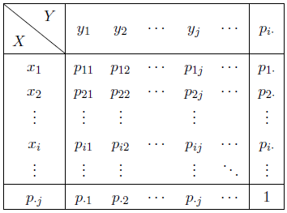
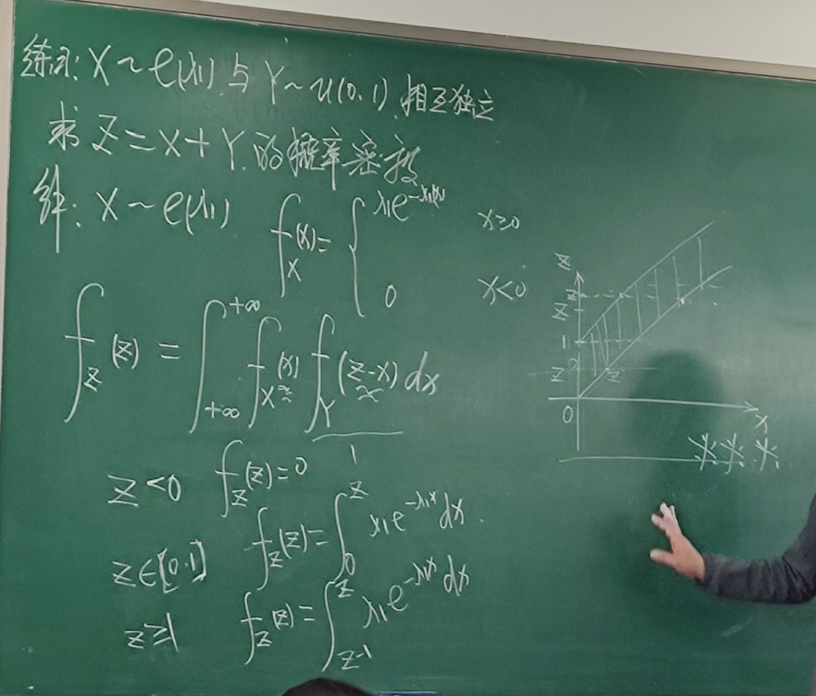

## 7 多维随机变量

设 $X=X(\omega),Y=Y(\omega)$ 为定义在样本空间 $\Omega$ 上的随机变量

由它们构成的向量 $(X,Y)$ 称为二维随机向量（二维随机变量）

## 分布函数

对任意实数 $x,y\in(-\infty,+\infty)$，称 $F(x,y)=P(X\leq x,Y\leq y)$ 为二维随机变量 $(X,Y)$ 的**分布函数**，或称为随机变量 $X$ 和 $Y$ 的**联合分布函数**

分布函数 $F(x,y)$ 的几何意义为随机点 $(X,Y)$ 落入以 $(x,y)$ 为右上顶点的无穷矩形的概率

### 性质

单调性：分布函数对每个变量单调递增（不一定是严格单调）

规范性：

* $F(+\infty,+\infty)=1$
* $F(-\infty,y)=F(x,-\infty)=F(-\infty,-\infty)=0$
* 通过规范性，最多可以求三个参数

右连续性：

关于每个变量右连续。

### 概率估计

$P(x_1\leq X\leq x_2,y_1\leq Y\leq y_2)=F(x_2,y_2)-F(x_2,y_1)-F(x_1,y_2)+F(x_1,y_1)$

### 边缘分布函数

称 $\displaystyle F_X(x)=P(X\leq x)=P(X\leq x,Y\leq +\infty)=\lim_{y\to+\infty}F(x,y)$ 为 $X$ 的边缘分布函数

$Y$ 同理

#### 独立性

对任意实数 $x,y$，若事件 $X\leq x$ 和 $Y\leq y$ 相互独立，即

$P(X\leq x,Y\leq y)=P(X\leq x)P(Y\leq y)$ 或者 $F(x,y)=F_X(x)F_Y(y)$

则称随机变量 $X,Y$ 相互独立

此时有 $f(X),g(Y)$ 相互独立，其中 $f,g$ 是连续或者分段连续函数。

## 二维离散型随机变量

若$(X,Y)$ 的取值是有限个或者无限可列的，称其为二维离散型随机变量

设其取值为 $(x_i,y_j)$，则称 $p_{ij}=P(X=x_i,Y=y_j)$ 为 $(X,Y)$ 的联合分布列

二维离散型随机变量的联合分布列可以表示为：

根据分布列的性质可知 $p_{i j} \geqslant 0$ 和 $\sum_{i, j} p_{i j}=1 .$ 根据二维随机变量 $(X, Y)$ 的联合分布列 $p_{i j}$, 可 得到随机变量 $X$ 的边缘分布列

$\displaystyle P\left(X=x_{i}\right)=\sum_{j=1}^{\infty} P\left(X=x_{i}, Y=y_{j}\right)=\sum_{j=1}^{\infty} p_{i j}=p_{i}$

同理可得随机变量 $Y$ 的边缘分布列

$\displaystyle P\left(Y=y_{j}\right)=\sum_{i=1}^{\infty} P\left(X=x_{i}, Y=y_{j}\right)=\sum_{i=1}^{\infty} p_{ij}=p_{\cdot j}$

将二维随机变量的联合分布列和边缘分布表示在同一个表格中有

对离散型随机变量 $(X, Y)$, 若对所有 $\left(x_{i}, y_{j}\right)$ 有

$P\left(X=x_{i}, Y=y_{j}\right)=P\left(X=x_{i}\right) P\left(Y=y_{j}\right)$，即 $p_{i j}=p_{i} \cdot p_{\cdot j}$

则离散随机变量 $X$ 与 $Y$ 相互独立

## 二维连续型随机变量

如果存在非负可积函数 $f(x,y)$ 使对任意实数对 $(x,y)$：

$\displaystyle F(x,y)=\int_{-\infty}^x\int_{-\infty}^y f(u,v)dudv$

则称 $(X,Y)$ 为二维连续型随机变量，称 $f(x,y)$ 为其联合概率密度函数

根据概率密度的定义可知概率密度函数 $f(x, y)$ 满足如下性质:

1) $\displaystyle f(x, y) \geqslant 0$.
2) $\displaystyle \int_{-\infty}^{+\infty} \int_{-\infty}^{+\infty} f(x, y) d x d y=1$
3) 若 $f(x, y)$ 在 $(x, y)$ 连续, 则 $\displaystyle f(x, y)=\frac{\partial^{2} F(x, y)}{\partial x \partial y}$.
4) 若 $G$ 为平面上的一个区域, 则点 $(X, Y)$ 落入 $G$ 的概率为$\displaystyle P((X, Y) \in G)=\iint_{(x, y) \in G} f(x, y) d x d y$
5) 边缘概率密度函数 $\displaystyle f_X(x)=\int_{-\infty}^{+\infty} f(x,y)dy$，$y$ 同理。

对任意 $x \in(-\infty,+\infty)$ 和 $y \in(-\infty,+\infty)$, 若二维连续随机变量 $(X, Y)$ 的概率密度 与边缘概率密度满足

$f(x, y)=f_{X}(x) f_{Y}(y)$

则随机变量 $X$ 和 $Y$ 相互独立

### 二维正态分布

设 $|\rho|<1$, 令
$$
\mu=\left(\mu_{x}, \mu_{y}\right)^{\top}=\left(\begin{array}{c}
\mu_{x} \\
\mu_{y}
\end{array}\right) \quad \text { 和 } \quad \Sigma=\left(\begin{array}{cc}
\sigma_{x}^{2} & \rho \sigma_{x} \sigma_{y} \\
\rho \sigma_{x} \sigma_{y} & \sigma_{y}^{2}
\end{array}\right)
$$
若随机变量 $X$ 和 $Y$ 的联合概率密度函数为
$$
\begin{aligned}
&f(x, y)=(2 \pi)^{-2 / 2}|\Sigma|^{-1 / 2} \exp \left(-\frac{1}{2}(\xi-\mu)^{\top} \Sigma^{-1}(\xi-\mu)\right) \quad \xi=(x, y)^{\top} \\
&\quad=\frac{1}{2 \pi \sqrt{1-\rho^{2}} \sigma_{x} \sigma_{y}} \exp \left(-\frac{1}{2\left(1-\rho^{2}\right)}\left[\frac{\left(x-\mu_{x}\right)^{2}}{\sigma_{x}^{2}}+\frac{\left(y-\mu_{y}\right)^{2}}{\sigma_{y}^{2}}-\frac{2 \rho}{\sigma_{x} \sigma_{y}}\left(x-\mu_{x}\right)\left(y-\mu_{y}\right)\right]\right)
\end{aligned}
$$
这里利用 $|\Sigma|=\left(1-\rho^{2}\right) \sigma_{x}^{2} \sigma_{y}^{2}$, 以及
$$
\Sigma^{-1}=\frac{1}{\left(1-\rho^{2}\right) \sigma_{x}^{2} \sigma_{y}^{2}}\left(\begin{array}{cc}
\sigma_{y}^{2} & -\rho \sigma_{x} \sigma_{y} \\
-\rho \sigma_{x} \sigma_{y} & \sigma_{x}^{2}
\end{array}\right)=\frac{1}{1-\rho^{2}}\left(\begin{array}{cc}
1 / \sigma_{x}^{2} & -\rho / \sigma_{x} \sigma_{y} \\
-\rho / \sigma_{x} \sigma_{y} & 1 / \sigma_{y}^{2}
\end{array}\right)
$$
则称随机变量 $X$ 和 $Y$ 服从参数为 $\mu$ 和 $\Sigma$ 的**正态分布**, 记为 $(X, Y) \sim \mathcal{N}(\mu, \Sigma)$

若 $\mu=(0,0)^{\top}$ 和 $\Sigma$ 为二维单位阵, 则称为**二维标准正态分布**

#### 边缘分布

设二维随机变量 $(X, Y)$ 服从正态分布 $\mathcal{N}(\mu, \Sigma)$, 其中
$$
\mu=\left(\begin{array}{c}
\mu_{x} \\
\mu_{y}
\end{array}\right) \quad \text { 和 } \quad \Sigma=\left(\begin{array}{cc}
\sigma_{x}^{2} & \rho \sigma_{x} \sigma_{y} \\
\rho \sigma_{x} \sigma_{y} & \sigma_{y}^{2}
\end{array}\right)
$$
则有边缘分布为 $X \sim \mathcal{N}\left(\mu_{x}, \sigma_{x}^{2}\right)$ 和 $Y \sim \mathcal{N}\left(\mu_{y}, \sigma_{y}^{2}\right)$.

#### 独立性

若二维随机变量 $(X, Y) \sim \mathcal{N}(\mu, \Sigma)$, 则 $X$ 与 $Y$ 独立的充要条件为 $\Sigma=\left(\begin{array}{cc}\sigma_{x}^{2} & 0 \\ 0 & \sigma_{y}^{2}\end{array}\right)$

## 多维正态分布

定义 $5.11$ 设向量 $\mu \in \mathbb{R}^{n}$ 和正定矩阵 $\Sigma \in \mathbb{R}^{n \times n}$, 若随机向量 $\left(X_{1}, X_{2}, \cdots, X_{n}\right)$ 的概率密度函数为
$$
f\left(x_{1}, \ldots, x_{n}\right)=(2 \pi)^{-n / 2}|\Sigma|^{-1 / 2} \exp \left(-\frac{1}{2}(\xi-\mu)^{\top} \Sigma^{-1}(\xi-\mu)\right)
$$
其中 $\xi=\left(x_{1}, \ldots, x_{n}\right)^{\top}$, 则称随机向量 $\left(X_{1}, X_{2}, \cdots, X_{n}\right)$ 服从参数为 $\mu$ 和 $\Sigma$ 的多维正态分布, 记
$$
\left(X_{1}, X_{2}, \cdots, X_{n}\right) \sim \mathcal{N}(\mu, \Sigma)
$$
其概率密度函数为 $p_{X}(x)$, 则有
$$
\int p_{X}(\boldsymbol{x}) d \boldsymbol{x}=1
$$
**证明**根据概率密度的定义有
$$
\iint p_{X}(x) d x=\iint \frac{1}{(2 \pi)^{n / 2}} \exp \left(-\frac{1}{2} x^{\top} x\right) d x=\prod_{i=1}^{n} \frac{1}{\sqrt{2 \pi}} \int_{-\infty}^{\infty} e^{-x_{i}^{2} / 2} d x_{i}=1
$$

### 性质

设随机向量 $(X, Y)=\left(X_{1}, X_{2}, \cdots, X_{n}, Y_{1}, Y_{2}, \cdots, Y_{m}\right) \sim \mathcal{N}(\mu, \Sigma)$, 其中
$$
\mu=\left(\begin{array}{c}
\mu_{x} \\
\mu_{y}
\end{array}\right), \quad \mu_{x}=\left(\mu_{x_{1}}, \mu_{x_{2}}, \cdots, \mu_{x_{n}}\right)^{\top}, \quad \mu_{y}=\left(\mu_{y_{1}}, \mu_{y_{2}}, \cdots, \mu_{y_{m}}\right)^{\top}, \quad \Sigma=\left(\begin{array}{cc}
\sum_{x x} & \sum_{y x} \\
\sum_{x y} & \sum_{y y}
\end{array}\right)
$$
则有：

- 随机向量 $X$ 和 $Y$ 分布服从 $X \sim \mathcal{N}\left(\mu_{x}, \Sigma_{x x}\right)$ 和 $Y \sim \mathcal{N}\left(\mu_{y}, \Sigma_{y y}\right)$;
- 随机向量 $X$ 与 $Y$ 相互独立的充要条件是 $\Sigma=\left(\begin{array}{cc}\sum_{x x} & 0 \\ 0 & \sum_{y y}\end{array}\right)$.

### 多维正态分布的标准正态化

这里我们回顾正定矩阵的特征值分解, 对正定矩阵 $\Sigma$, 其特征值分解为
$$
\Sigma=U^{\top} \Lambda U
$$
其中 $\Lambda=\operatorname{diag}\left(\lambda_{1}, \lambda_{2}, \cdots, \lambda_{n}\right)$ 为特征值构成的对角阵, $U$ 为特征向量构成的正交矩阵. 我们有如下多维正态分布的标准正态化:

若随机向量 $X=\left(X_{1}, X_{2}, \cdots, X_{n}\right) \sim \mathcal{N}(\mu, \Sigma)$, 且正定矩阵 $\Sigma$ 的特征值分解为 $\Sigma=U^{\top} \Lambda U$, 则随机向量
$$
Y=\Lambda^{-1 / 2} U(X-\mu) \sim \mathcal{N}\left(0_{n}, I_{n}\right)
$$
其中 $0_{n}$ 为全为零的 $n$ 维向量, $I_{n}$ 表示 $n \times n$ 的单位阵.

### 线性变换

定理 $5.9$ 若随机向量 $X=\left(X_{1}, X_{2}, \cdots, X_{n}\right) \sim \mathcal{N}(\mu, \Sigma)$, 则
$$
Y=A X+b \sim \mathcal{N}\left(A \mu+b, A \Sigma A^{\top}\right)
$$
其中 $A \in \mathbb{R}^{m \times n}$ 和 $b \in \mathbb{R}^{m \times 1}$

## 多维随机变量的分布

对于**离散型**随机变量 $Z=g(X_1,\cdots,X_n)$，计算不同组合下的取值，然后合并 $Z$ 相同的组合

对于**连续**随机变量 $(X, Y)$, 其联合概率密度为 $f(x, y)$, 如何求解随机变量 $Z=g(X, Y)$ 的概率 密度. 针对此类问题, 主要求解思路为分布函数法, 即

1. 求 $Z=g(X, Y)$ 的分布函数

$$
F_{Z}(z)=P(Z \leqslant z)=P(g(x, y) \leqslant z)=\iint_{g(x, y) \leqslant z} f(x, y) d x d y
$$
2. 求 $Z$ 的密度函数

$$
f_{Z}(z)=F_{Z}^{\prime}(z)
$$
### 极大极小分布

设随机变量 $X$ 和 $Y$ 相互独立, 其分布函数分别为 $F_{X}(x)$ 和 $F_{Y}(y)$, 求随机变量$Z_{1}=\max (X, Y)$ 和 $Z_{2}=\min (X, Y)$ 的分布函数和概率密度函数

首先求 $Z_{1}$ 的分布函数为
$$
\begin{aligned}
F_{Z_{1}}\left(z_{1}\right) &=P\left(Z_{1} \leqslant z_{1}\right) \\
&=P\left(\max (X, Y) \leqslant z_{1}\right)=P\left(X \leqslant z_{1}, Y \leqslant z_{1}\right) \\
&=P\left(X \leqslant z_{1}\right) P\left(Y \leqslant z_{1}\right)=F_{X}\left(z_{1}\right) F_{Y}\left(z_{1}\right)
\end{aligned}
$$
进一步求解 $Z_{2}$ 的分布函数为
$$
\begin{aligned}
F_{Z_{2}}\left(z_{2}\right) &=P\left(Z_{2} \leqslant z_{2}\right) \\
&=P\left(\min (X, Y) \leqslant z_{2}\right)=1-P\left(\min (X, Y)>z_{2}\right) \\
&=1-P\left(X \geqslant z_{2}\right) P\left(Y>z_{2}\right)=1-\left(1-F_{X}\left(z_{2}\right)\right)\left(1-F_{Y}\left(z_{2}\right)\right)
\end{aligned}
$$
上述结论可进一步推广到 $n$ 个独立的随机变量：

设 $X_{1}, X_{2}, \cdots, X_{n}$ 为 $n$ 个相互独立的随机变量, 其分布函数分别为 $F_{X_{i}}\left(x_{i}\right)$, 则随机 变量 $Y=\max \left(X_{1}, X_{2}, \cdots, X_{n}\right)$ 的分布函数为
$$
F_{Y}(y)=F_{X_{1}}(y) F_{X_{2}}(y) \cdots F_{X_{n}}(y)
$$
随机变量 $Z=\min \left(X_{1}, X_{2}, \cdots, X_{n}\right)$ 的分布函数为
$$
F_{Z}(z)=1-\left(1-F_{X_{1}}(z)\right)\left(1-F_{X_{2}}(z)\right) \cdots\left(1-F_{X_{n}}(z)\right)
$$
特别地, 当 $X_{1}, X_{2}, \cdots, X_{n}$ 独立同分布时, 则有
$$
F_{Y}(y)=\left(F_{X_{1}}(y)\right)^{n} \quad \text { 和 } \quad F_{Z}(z)=1-\left(1-F_{X_{1}}(z)\right)^{n}
$$
根据分布函数可进一步求得概率密度

### 和的分布

设随机变量 $(X, Y)$ 的联合密度为 $f(x, y)$, 则随机变量 $Z=X+Y$ 的概率密度为
$$
f_{Z}(z)=\int_{-\infty}^{+\infty} f(x, z-x) d x \quad \text { 或 } \quad f_{Z}(z)=\int_{-\infty}^{+\infty} f(z-y, y) d y
$$
解 首先求解分布函数
$$
\begin{aligned}
F_{Z}(z) &=P(Z \leqslant z)=P(X+Y \leqslant z) \\
&=\iint_{x+y \leqslant z} f(x, y) d x d y=\int_{-\infty}^{+\infty} d x \int_{-\infty}^{z-x} f(x, y) d y \\
&=\int_{-\infty}^{+\infty} d x \int_{-\infty}^{z} f(x, u-x) d u \quad(\text { 变量替换 } u=y+x) \\
&=\int_{-\infty}^{z}\left(\int_{-\infty}^{+\infty} f(x, u-x) d x\right) d u
\end{aligned}
$$
两边同时对 $z$ 求导数可得
$$
f_{Z}(z)=\int_{-\infty}^{+\infty} f(x, z-x) d x
$$
#### 卷积公式

若连续随机变量 $X$ 与 $Y$ 相互独立, 其概率密度函数分别为 $f_{X}(x)$ 和 $f_{Y}(y)$, 则随机 变量 $Z=X+Y$ 的密度函数为
$$
f_{Z}(z)=\int_{-\infty}^{+\infty} f_{X}(x) f_{Y}(z-x) d x=\int_{-\infty}^{+\infty} f_{X}(z-y) f_{Y}(y) d y
$$

#### 二项分布

$X\sim B(n_1,p),Y\sim B(n_2,p)$

则 $Z=X+Y\sim B(n_1+n_2,p)$

#### 泊松分布

$X\sim P(\lambda_1),Y\sim P(\lambda_2)$

则 $Z=X+Y=P(\lambda_1+\lambda_2)$

#### 正态分布

$X\sim N(\mu_1,a_1^2),Y\sim N(\mu_2,a_2^2)$

则 $Z=X+Y\sim N(\mu_1+\mu_2,a_1^2+a_2^2)$

#### 均匀分布

$X\sim U(0,1),Y\sim U(0,1)$

则 $Z=X+Y$ 满足

积分区域为 $X\leq Z\leq X+1,0\leq X\leq 1$ 

所以：

$\displaystyle f_Z(z)=0,\quad z\leq0\; or \;z\geq2$

$\displaystyle f_Z(z)=\int_0^z dx=z,\quad z\in(0,1)$

$\displaystyle f_Z(z)=\int_{z-1}^1 dx=2-z,\quad z\in(1,2)$

#### [例题] 混合

$X\sim e(\lambda_1),Y\sim U(0,1)$ ，求 $Z=X+Y$

### 除的分布

$X,Y$ 的密度为 $f(x,y)$

$Z=X/Y$ 满足：

$\displaystyle f_Z(z)=\int_{-\infty}^{+\infty}|x|f(x,xz)dx$

### 积的分布

$X,Y$ 的密度为 $f(x,y)$

$Z=XY$ 满足：

$\displaystyle f_Z(z)=\int_{-\infty}^{+\infty}\frac{1}{|x|}f(x,\frac {z}{x})dx=\int_{-\infty}^{+\infty}\frac{1}{|y|}f(\frac {z}{y},y)dy$

## 随机变量的联合分布函数

已知随机变量 $(X,Y)$ 的联合概率密度为 $f(x,y)$，设有 $U=g_1(X,Y),V=g_2(X,Y)$，求 $(U,V)$ 的联合分布

