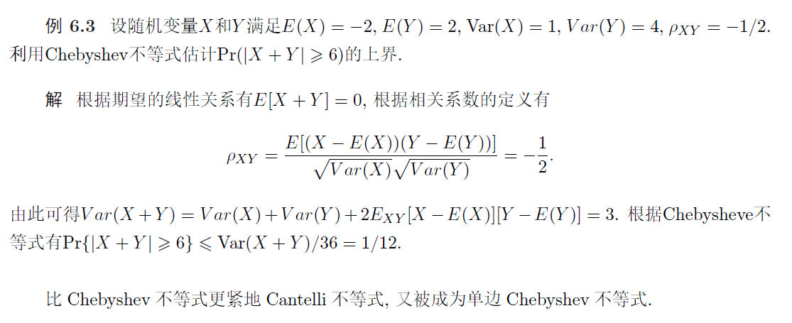

# 9 集中不等式(Concentration)

20-21次讲义

## 应用

给定一个训练数据集
$$
S_{n}=\left\{\left(x_{1}, y_{1}\right),\left(x_{2}, y_{2}\right), \ldots,\left(x_{n}, y_{n}\right)\right\}
$$
其中 $x_{i} \in \mathcal{X} \subseteq \mathbb{R}^{d}$ 表示第 $i$ 个训练样本的特征 (feature), $y_{i} \in \mathcal{Y}=\{0,1\}$ 表示第 $i$ 个训练样本的标记 (二分类). 假设 $\mathcal{D}$ 是空间 $\mathcal{X} \times \mathcal{Y}$ 的一个末知不可见的联合分布. 机器学习的经典假设是训练数据 集 $S_{n}$ 中每个数据 $\left(x_{i}, y_{i}\right)$ 是根据分布 $\mathcal{D}$ 独立同分布采样所得.
给定一个函数或分类器 $f: \mathcal{X} \rightarrow\{0,1\}$, 定义函数 $f$ 在训练数据集 $S_{n}$ 上的分类错误率为
$$
\hat{R}\left(f, S_{n}\right)=\frac{1}{n} \sum_{i=1}^{n} \mathbb{I}\left(f\left(x_{i}\right) \neq y_{i}\right)
$$
这里 $\mathbb{I}(\cdot)$ 表示指示函数, 当论断为真时其返回值为 1 , 否则为 0 . 在实际应用中我们更关心函数 $f$ 对 末见数据的分类性能, 即函数 $f$ 在分布 $\mathcal{D}$ 上的分类错误率, 称之为 '泛化错误率,
$$
R(f, \mathcal{D})=E_{(x, y) \sim \mathcal{D}}(\mathbb{I}(f(x) \neq y))=\operatorname{Pr}_{(x, y) \sim \mathcal{D}}[f(x) \neq y]
$$
由于分布 $\mathcal{D}$ 不可知, 不能直接计算 $R(f, \mathcal{D})$, 但我们已知训练数据集 $S_{n}$ 和训练错误率 $\hat{R}\left(f, S_{n}\right)$。

**如何基于训练错误率 $\hat{R}\left(f, S_{n}\right)$ 来有效估计 $R(f, \mathcal{D})$ ?** 我们可以**将问题归纳为**
$$
\operatorname{Pr}_{S_{n} \sim D^{n}}\left[\left|\hat{R}\left(f, D_{n}\right)-R(f)\right| \geqslant t\right] \text { 是否足够小? }
$$
即能否以很大的概率保证
$$
\left|\hat{R}\left(f, D_{n}\right)-R(f)\right|<t
$$
从而在理论上保证 $\hat{R}\left(f, D_{n}\right)$ 是 $R(f)$ 的一个有效估计. 上述性质在机器学习中被称为'泛化性', 是机器学习模型理论研究的根本性质, **研究模型能否从可见的训练数据推导出对末见数据的处理能力**

### [例]

假设训练数据集 $S_{n}=\left\{\left(x_{1}, y_{1}\right),\left(x_{2}, y_{2}\right), \ldots,\left(x_{n}, y_{n}\right)\right\}$ 根据分布 $\mathcal{D}$ 独立采样所得, 分类器 $f$ 在训练集 $S_{n}$ 的错误率为零 (全部预测正确), 求分类器 $f$ 在分布 $\mathcal{D}$ 上的错误率介于 0 和 $\epsilon$ 之 间的概率 $(\epsilon>0)$.

设随机变量
$$
X_{i}=\mathbb{I}\left[f\left(x_{i}\right) \neq y_{i}\right] \quad(i \in[n])
$$

根据数据集的独立同分布假设可知 $X_{1}, X_{2}, \ldots, X_{n}$ 是独立同分布的随机变量. 令 $p=E\left[X_{i}\right]$, 则有 $X_{i} \sim \operatorname{Ber}(p)$. 分类器 $f$ 在训练集 $S_{n}$ 的错误率为零, 且在分布 $\mathcal{D}$ 上的错误率大于 $\epsilon$ 的概率为
$$
\begin{aligned}
&\operatorname{Pr}\left[\sum_{i=1}^{n} X_{i}=0, p>\epsilon\right] \leqslant \operatorname{Pr}\left[\sum_{i=1}^{n} X_{i}=0 \mid p>\epsilon\right] \\
&\quad=\operatorname{Pr}\left[X_{1}=0, X_{2}=0, \ldots, X_{n}=0 \mid p>\epsilon\right] \quad \text { (根据独立性假设) } \\
&\quad=\prod_{i=1}^{n} \operatorname{Pr}\left[X_{i}=0 \mid p>\epsilon\right] \leqslant(1-\epsilon)^{n} \leqslant \exp (-n \epsilon)
\end{aligned}
$$
因此当分类器 $f$ 在训练集 $S_{n}$ 的错误率为零且 $p \in(0, \epsilon)$ 的概率至少以 $1-\exp (-n \epsilon)$ 成立

对上例的求解进一步进行归纳, 设随机变量
$$
X_{i}=\mathbb{I}\left(f\left(x_{i}\right) \neq y_{i}\right)
$$
则机器学习问题可通过概率统计抽象描述为: 假设有 $n$ 个独立同分布的随机变量 $X_{1}, X_{2}, \ldots, X_{n}$, 如何从 $n$ 个独立同分布的随机变量中以很大概率地获得期望 $E[X]$ 的一个估计, 即 $\operatorname{Pr}\left[\left|\frac{1}{m} \sum_{i=1}^{m} X_{i}-E\left(X_{i}\right)\right|>\epsilon\right] \quad$ 非常小.

## 基础不等式

### Markov不等式

对任意随机变量 $X \geqslant 0$ 和 $\epsilon>0$, 有
$$
P(X \geqslant \epsilon) \leqslant \frac{E(X)}{\epsilon}
$$
**证明** 利用全期望公式考虑随机事件 $X \geqslant \epsilon$ 有
$$
E[X]=E[X \mid X \geqslant \epsilon] P(X \geqslant \epsilon)+E[X \mid X \leqslant \epsilon] P(X \leqslant \epsilon) \geqslant P(X \geqslant \epsilon) \epsilon
$$
从而完成证明

#### 推论

对任意随机变量 $X$ 和 $\epsilon \geqslant 0$, 以及单调递增的非负函数 $g(x)$, 有
$$
P(X \geqslant \epsilon) \leqslant \frac{E[g(X)]}{g(\epsilon)}
$$
### Chebyshev 不等式

利用 Markov 不等式可以推导 Chebyshev 不等式:

定理 $6.2$ (Chebyshev 不等式) 设随机变量 $X$ 的均值为 $\mu$, 则有
$$
P(|X-\mu|>\epsilon) \leqslant \frac{\operatorname{Var}(X)}{\epsilon^{2}}
$$
**证明** 根据 Markov 不等式有
$$
P(|X-\mu|>\epsilon)=P\left((X-\mu)^{2} \geqslant \epsilon^{2}\right) \leqslant \frac{E[(X-\mu)^{2}]}{\epsilon^{2}}=\frac{\operatorname{Var}(X)}{\epsilon^{2}}
$$

#### [例]

#### 推论 1

引理 $6.1$ 随机变量 $X$ 的均值 $\mu>0$, 方差 $\sigma^{2}$, 则对任意 $\epsilon>0$ 有
$$
P(X-\mu \geqslant \epsilon) \leqslant \frac{\sigma^{2}}{\sigma^{2}+\epsilon^{2}} \quad \text { 和 } \quad P(X-\mu \leqslant-\epsilon) \leqslant \frac{\sigma^{2}}{\sigma^{2}+\epsilon^{2}}
$$
证明 设随机变量 $Y=X-\mu$, 有 $E(Y)=0$ 以及 $\operatorname{Var}(Y)=\sigma^{2}$. 对任意 $t>0$ 有
$$
\begin{aligned}
P(X-\mu \geqslant \epsilon) &=P(Y \geqslant \epsilon)=P(Y+t \geqslant \epsilon+t) \leqslant P\left((Y+t)^{2} \geqslant(\epsilon+t)^{2}\right) \\
& \leqslant \frac{E\left((Y+t)^{2}\right)}{(\epsilon+t)^{2}}=\frac{\sigma^{2}+t^{2}}{(\epsilon+t)^{2}}
\end{aligned}
$$
对 $\left(\sigma^{2}+t^{2}\right) /(\epsilon+t)^{2}$ 求关于 $t$ 的最小值, 求解可得 $t=\sigma^{2} / \epsilon$, 由此得到
$$
P(X-\mu \geqslant \epsilon) \leqslant \min _{t>0} \frac{\sigma^{2}+t^{2}}{(\epsilon+t)^{2}}=\frac{\sigma^{2}}{\epsilon^{2}+\sigma^{2}}
$$
另一方面, 对任意 $t>0$ 有
$$
\begin{aligned}
P(X-\mu \leqslant-\epsilon) &=P(Y \leqslant-\epsilon)=P(Y-t \leqslant-\epsilon-t) \leqslant P\left((Y-t)^{2} \geqslant(\epsilon+t)^{2}\right) \\
& \leqslant \frac{E\left((Y-t)^{2}\right)}{(\epsilon+t)^{2}}=\frac{\sigma^{2}+t^{2}}{(\epsilon+t)^{2}}
\end{aligned}
$$
> 注意讲义里面上面的公式有两个符号错了，以笔记为准

同理完成证明

#### 推论 2

推论 $6.2$ 设独立同分布的随机变量 $X_{1}, X_{2}, \ldots, X_{n}$ 满足 $E\left(X_{i}\right)=\mu$ 和 $\operatorname{Var}\left(X_{i}\right) \leqslant \sigma^{2}$, 对任意 $\epsilon>0$ 有
$$
\operatorname{Pr}\left(\left|\frac{1}{n} \sum_{i=1}^{n} X_{i}-\mu\right| \geqslant \epsilon\right) \leqslant \frac{\sigma^{2}}{n \epsilon^{2}}
$$
**证明** 根据 Chebyshev 不等式有
$$
\operatorname{Pr}\left(\left|\frac{1}{n} \sum_{i=1}^{n} X_{i}-\mu\right| \geqslant \epsilon\right) \leqslant \frac{1}{\epsilon^{2}} \operatorname{Var}\left(\frac{1}{n} \sum_{i=1}^{n} X_{i}\right)
$$
而独立同分布的假设有
$$
\operatorname{Var}\left(\frac{1}{n} \sum_{i=1}^{n} X_{i}\right)=\frac{1}{n^{2}} \operatorname{Var}\left(\sum_{i=1}^{n} X_{i}\right)=\frac{1}{n} \operatorname{Var}\left(X_{i}\right) \leqslant \frac{\sigma^{2}}{n}
$$
由此得到
$$
\operatorname{Pr}\left(\left|\frac{1}{n} \sum_{i=1}^{n} X_{i}-\mu\right| \geqslant \epsilon\right) \leqslant \frac{\sigma^{2}}{n \epsilon^{2}}
$$
从而完成证明.

### Young 不等式

给定常数 $a>0, b>0$, 对满足 $1 / p+1 / q=1$ 的实数 $p>0, q>0$ 有（其实是 $p,q>1$）
$$
a b \leqslant \frac{1}{p} a^{p}+\frac{1}{q} b^{q}
$$
**证明** 根据凸函数性质有
$$
\begin{aligned}
a b &=\exp (\ln (a b))=\exp (\ln a+\ln b)=\exp \left(\frac{1}{p} \ln a^{p}+\frac{1}{q} \ln b^{q}\right) \\
& \leqslant \frac{1}{p} \exp \left(\ln a^{p}\right)+\frac{1}{q} \exp \left(\ln b^{q}\right)=\frac{1}{p} a^{p}+\frac{1}{q} b^{q}
\end{aligned}
$$
得证

###  Hölder 不等式

对任意随机变量 $X$ 和 $Y$ 以及实数 $p>0$ 和 $q>0$ 满足 $1 / p+1 / q=$ 1 , 有
$$
E(|X Y|) \leqslant\left(E\left(|X|^{p}\right)\right)^{\frac{1}{p}}\left(E\left(|Y|^{q}\right)\right)^{\frac{1}{q}}
$$
特别地, 当 $p=q=2$ 时 Hölder 不等式变成为 Cauchy-Schwartz 不等式.

**证明** 设 $c=\left(E\left(|X|^{p}\right)\right)^{\frac{1}{p}}$ 和 $d=\left(E\left(|Y|^{q}\right)\right)^{\frac{1}{q}}$, 根据 Young 不等式有
$$
\frac{|X Y|}{c d}=\frac{|X|}{c} \frac{|Y|}{d} \leqslant \frac{1}{p} \frac{|X|^{p}}{c^{p}}+\frac{1}{q} \frac{|Y|^{q}}{d^{q}}
$$
两边同时取期望：
$$
\frac{E(|X Y|)}{c d}\leqslant \frac{1}{p} \frac{E(|X|^{p})}{c^{p}}+\frac{1}{q} \frac{E(|Y|^{q})}{d^{q}}=\frac1p+\frac1q=1
$$

## Chernoff 不等式

### 矩生成函数(Moment Generating Function)

定义随机变量 $X$ 的矩生成函数为 $M_X(t)=E[e^{tX}]$

#### 性质

##### 1

设随机变量 $X$ 的矩生成函数为 $M_{X}(t)$, 对任意 $n \geqslant 1$ 有
$$
E\left[X^{n}\right]=M_{X}^{(n)}(0)
$$
这里 $M_{X}^{(n)}(t)$ 表示矩生成函数在 $t=0$ 的 $n$ 阶导数, 而 $E\left[X^{n}\right]$ 被称为随机变量 $X$ 的 $n$ 阶矩 (moment)

**证明** 由 Tayler 公式有
$$
e^{t X}=\sum_{i=1}^{\infty} \frac{(t X)^{i}}{i !}
$$
两边同时取期望有
$$
E\left[e^{t X}\right]=\sum_{i=1}^{\infty} \frac{t^{i}}{i !} E\left[X^{i}\right]
$$
对上式两边分别对 $t$ 求 $n$ 阶导数并取 $t=0$ 有 $M_{X}^{(n)}(t)=E\left[X^{n}\right]$

##### 2

对随机变量 $X$ 和 $Y$, 如果存在常数 $\delta>0$, 使得当 $t \in(-\delta, \delta)$ 时有 $M_{X}(t)=M_{Y}(t)$ 成立, 那么 $X$ 与 $Y$ 有相同的分布

上述定理表明**随机变量的矩生成函数可唯一确定随机变量的分布**（其证明超出了本书的范围）

若随机变量 $X$ 与 $Y$ 独立, 则有
$$
M_{X+Y}(t)=E\left[e^{(X+Y) t}\right]=E\left[e^{t X} e^{t Y}\right]=E\left[e^{t X}\right] \cdot E\left[e^{t Y}\right]=M_{X}(t) M_{Y}(t)
$$
于是得到对任意独立的随机变量 $X$ 和 $Y$ 有 $M_{X+Y}(t)=M_{X}(t) M_{Y}(t)$

### Chernoff 方法

下面将利用矩生成函数来证明一系列不等式. 给定任意随机变量 $X$ 和任意 $t>0$ 和 $\epsilon>0$, 利用 Markov 不等式有
$$
\operatorname{Pr}[X \geqslant E[X]+\epsilon]=\operatorname{Pr}\left[e^{t X} \geqslant e^{t E[X]+t \epsilon}\right] \leqslant e^{-t \epsilon-t E[X]} E\left[e^{t X}\right]
$$
特别地, 有
$$
\operatorname{Pr}[X-E[X] \geqslant \epsilon] \leqslant \min _{t>0}\left\{e^{-t \epsilon-t E[X]} E\left[e^{t X}\right]\right\}
$$
> 复习时注意讲义里面上面的公式是写错了的

类似地, 对任意 $\epsilon>0$ 和 $t<0$ 有
$$
\operatorname{Pr}[X \leqslant E[X]-\epsilon]=\operatorname{Pr}\left[e^{t X} \geqslant e^{t E[X]-t \epsilon}\right] \leqslant e^{t \epsilon-t E[X]} E\left[e^{t X}\right]
$$
同理有
$$
\operatorname{Pr}[X \leqslant \epsilon] \leqslant \min _{t<0}\left\{e^{t \epsilon-t E[X]} E\left[e^{t X}\right]\right\}
$$
上述方法称为 **Chernoff 方法**，是证明集中不等式一种最根本最重要的方法. 下面将针对特定的分布或特定的条件, 先求解矩生成函数 $E\left[e^{t X}\right]$, 然后求解最小值 $t$ 的取值

### 二值随机变量的Chernoff不等式

#### $\epsilon >0$ 时

定理 $6.5$ 设随机变量 $X_{1}, X_{2}, \cdots, X_{n}$ 相互独立且满足 $X_{i} \sim \operatorname{Ber}\left(p_{i}\right)$, 令 $\mu=\sum_{i=1}^{n} E\left[X_{i}\right]=$ $\sum_{i=1}^{n} p_{i}$. 对任意 $\epsilon>0$ 有
$$
\operatorname{Pr}\left[\sum_{i=1}^{n} X_{i} \geqslant(1+\epsilon) \mu\right] \leqslant\left(\frac{e^{\epsilon}}{(1+\epsilon)^{(1+\epsilon)}}\right)^{\mu}
$$
对任意 $\epsilon \in(0,1)$ 有
$$
\operatorname{Pr}\left[\sum_{i=1}^{n} X_{i} \geqslant(1+\epsilon) \mu\right] \leqslant e^{-\mu \epsilon^{2} / 3}
$$
上述第一个不等式给出了最紧的不等式上界, 第二个不等式是第一个不等式的适当放松

**证明** 令 $\bar{X}=\sum_{i=1}^{n} X_{i}$. 对任意 $t>0$, 根据 Chernoff 方法有
$$
\operatorname{Pr}[\bar{X} \geqslant(1+\epsilon) \mu]=\operatorname{Pr}\left[e^{t \bar{X}} \geqslant e^{t(1+\epsilon) \mu}\right] \leqslant e^{-t(1+\epsilon) \mu} E\left[e^{t \bar{X}}\right]
$$
利用随机变量的独立性以及 $1+x \leqslant e^{x}$ 有
$$
\begin{aligned}
E\left[e^{t \bar{X}}\right] &=E\left[e^{\sum_{i=1}^{n} t X_{i}}\right]=\prod_{i=1}^{n} E\left[e^{t X_{i}}\right] \\
&=\prod_{i=1}^{n}\left[\left(1-p_{i}\right)+p_{i} e^{t}\right]=\prod_{i=1}^{n}\left[1+p_{i}\left(e^{t}-1\right)\right]\\
&\leqslant \exp \left(\sum_{i=1}^{n} p_{i}\left(e^{t}-1\right)\right)=\exp \left(\mu\left(e^{t}-1\right)\right)
\end{aligned}
$$
由此可得
$$
\operatorname{Pr}[\bar{X} \geqslant(1+\epsilon) \mu] \leqslant \exp \left(-t(1+\epsilon) \mu+\mu\left(e^{t}-1\right)\right)
$$
对上式求最小值解得 $t_{\min }=\ln (1+\epsilon)$, 代入可得
$$
\operatorname{Pr}[\bar{X} \geqslant(1+\epsilon) \mu] \leqslant\left(\frac{e^{\epsilon}}{(1+\epsilon)^{(1+\epsilon)}}\right)^{\mu}
$$
对第二个不等式, 只需证明当 $\epsilon \in(0,1)$ 有
$$
f(\epsilon)=\ln \left(\frac{e^{\epsilon}}{(1+\epsilon)^{(1+\epsilon)}}\right)+\frac{\epsilon^{2}}{3}=\epsilon-(1+\epsilon) \ln (1+\epsilon)+\frac{\epsilon^{2}}{3} \leqslant 0
$$
易知 $f(0)=0$ 和 $f(1)<0$. 当 $\epsilon \in(0,1)$,
$$
f^{\prime}(\epsilon)=-\ln (1+\epsilon)+2 \epsilon / 3, \quad f^{\prime \prime}(\epsilon)=-\frac{1}{1+\epsilon}+\frac{2}{3}
$$
于是得到 $f^{\prime}(0)=0, f^{\prime}(1)=-0.0265<0$ 和 $f^{\prime}(1 / 2)=-0.0721<0$, 由连续函数性质有 $f^{\prime}(\epsilon) \leqslant 0$, 即函数 $f(\epsilon)$ 在 $[0,1]$ 上单调递减. 当 $\epsilon \geqslant 0$ 时有 $f(\epsilon) \leqslant f(0)=0$, 所以 $\exp (f(\epsilon)) \leqslant 1$.

#### $\epsilon <0$ 时

同理，设随机变量 $X_{1}, X_{2}, \cdots, X_{n}$ 相互独立且满足 $X_{i} \sim \operatorname{Ber}\left(p_{i}\right)$, 令 $\mu=\sum_{i=1}^{n} E\left[X_{i}\right]=$ $\sum_{i=1}^{n} p_{i}$. 对任意 $\epsilon \in(0,1)$ 有
$$
\operatorname{Pr}\left[\sum_{i=1}^{n} X_{i} \leqslant(1-\epsilon) \mu\right] \leqslant\left(\frac{e^{-\epsilon}}{(1-\epsilon)^{(1-\epsilon)}}\right)^{\mu} \leqslant \exp \left(-\mu \epsilon^{2} / 2\right)
$$
#### Rademacher 随机变量

定义 $6.2$ 若随机变量 $X \in\{+1,-1\}$ 满足
$$
\operatorname{Pr}(X=+1)=\operatorname{Pr}(X=-1)=1 / 2
$$
则称 $X$ 为 Rademacher 随机变量

我们有如下定理

定理 $6.7$ 对 $n$ 个独立的 Rademacher 随机变量 $X_{1}, X_{2}, \cdots, X_{n}$, 有
$$
\operatorname{Pr}\left(\frac{1}{n} \sum_{i=1}^{n} X_{i} \geqslant \epsilon\right) \leqslant \exp \left(-n \epsilon^{2} / 2\right)\\
\quad \operatorname{Pr}\left(\frac{1}{n} \sum_{i=1}^{n} X_{i} \leqslant-\epsilon\right) \leqslant \exp \left(-n \epsilon^{2} / 2\right)
$$
证明 根据 Taylor 展开式有
$$
\frac{1}{2} \exp (t)+\frac{1}{2} \exp (-t)=\sum_{i \geqslant 0} \frac{t^{2 i}}{(2 i) !} \leqslant \sum_{i \geqslant 0} \frac{\left(t^{2} / 2\right)^{i}}{i !}=\exp \left(t^{2} / 2\right)
$$
若随机变量 $X \in\{+1,-1\}$ 且满足 $\operatorname{Pr}(X=1)=\operatorname{Pr}(X=-1)=1 / 2$, 则有
$$
E\left[e^{t X}\right]=\frac{1}{2} e^{t}+\frac{1}{2} e^{-t} \leqslant \exp \left(t^{2} / 2\right)
$$
对任意 $t>0$, 根据 Chernoff 方法有
$$
\begin{aligned}
\operatorname{Pr}\left(\frac{1}{n} \sum_{i=1}^{n} X_{i} \geqslant \epsilon\right)&=\operatorname{Pr}\left(\sum_{i=1}^{n} X_{i} \geqslant n\epsilon\right)\\ & \leqslant \exp (-n t \epsilon) E\left[\exp \left(\sum_{i=1}^{n} t X_{i}\right)\right] \\
&=\exp (-n t \epsilon) \prod_{i=1}^{n} E\left[\exp \left(t X_{i}\right)\right] \leqslant \exp \left(-n t \epsilon+n t^{2} / 2\right)
\end{aligned}
$$
通过对上式右边求最小值解得 $t=\epsilon$, 带入上式得到
$$
\operatorname{Pr}\left(\frac{1}{n} \sum_{i=1}^{n} X_{i} \geqslant \epsilon\right) \leqslant \exp \left(-n \epsilon^{2} / 2\right)
$$
同理证明另一个不等式

**推论**

对独立同分布的随机变量 $X_{1}, X_{2}, \cdots, X_{n}$ ，若满足 $P\left(X_{1}=0\right)=P\left(X_{1}=1\right)=1 / 2$, 有

$$
\operatorname{Pr}\left(\frac{1}{n} \sum_{i=1}^{n} X_{i}-\frac{1}{2} \geqslant \epsilon\right) \leqslant \exp \left(-2 n \epsilon^{2}\right) \\
\operatorname{Pr}\left(\frac{1}{n} \sum_{i=1}^{n} X_{i}-\frac{1}{2} \leqslant-\epsilon\right) \leqslant \exp \left(-2 n \epsilon^{2}\right)
$$

### 有界随机变量的Chernoff不等式

本节研究有界的随机变量 $X_{i} \in[a, b]$ 的 Chernoff 不等式. 首先介绍著名的 Chernoff 引理

#### Chernoff 引理

设随机变量 $X \in[0,1]$ 的期望 $\mu=E[X]$. 对任意 $t>0$ 有
$$
E\left[e^{t X}\right] \leqslant \exp \left(t \mu+t^{2} / 8\right)
$$
**证明** 由凸函数的性质可知
$$
e^{t X}=e^{t X+(1-X) 0} \leqslant X e^{t}+(1-X) e^{0}
$$
两边再同时取期望有
$$
E\left(e^{t X}\right) \leqslant 1-\mu+\mu e^{t}=\exp \left(\ln \left(1-\mu+\mu e^{t}\right)\right)
$$
令 $f(t)=\ln \left(1-\mu+\mu e^{t}\right)$, 我们有 $f(0)=0$ 以及
$$
f^{\prime}(t)=\frac{\mu e^{t}}{1-\mu+\mu e^{t}} \Rightarrow f^{\prime}(0)=\mu
$$
进一步有
$$
f^{\prime \prime}(t)=\frac{\mu e^{t}}{1-\mu+\mu e^{t}}-\frac{\mu^{2} e^{2 t}}{\left(1-\mu+\mu e^{t}\right)^{2}} \leqslant 1 / 4
$$
> 这里利用了 $x-x^2\leqslant 1/4$

根据泰勒中值定理有
$$
f(t)=f(0)+t f^{\prime}(0)+f^{\prime \prime}(\xi) t^{2} / 2 \leqslant t \mu+t^{2} / 8
$$
引理得证.

##### 推理

由上面的 Chernoff 引理进一步推导出

设随机变量 $X \in[a, b]$ 的期望 $\mu=E[x]$. 对任意 $t>0$ 有
$$
E\left(e^{t X}\right) \leqslant \exp \left(\mu t+t^{2}(b-a)^{2} / 8\right)
$$
#### 不等式本体

根据上述推论, 我们得到有界随机变量的 Chernoff 不等式:

假设 $X_{1}, \ldots, X_{n}$ 是 $n$ 独立的随机变量、且满足 $X_{i} \in[a, b]$. 对任意 $\epsilon>0$ 有
$$
\begin{aligned}
\operatorname{Pr}\left[\frac{1}{n} \sum_{i=1}^{n} X_{i}-\frac{1}{n} \sum_{i=1}^{n} E\left[X_{i}\right] \geqslant \epsilon\right] & \leqslant \exp \left(-2 n \epsilon^{2} /(b-a)^{2}\right) \\
\operatorname{Pr}\left[\frac{1}{n} \sum_{i=1}^{n} X_{i}-\frac{1}{n} \sum_{i=1}^{n} E\left[X_{i}\right] \leqslant-\epsilon\right] & \leqslant \exp \left(-2 n \epsilon^{2} /(b-a)^{2}\right)
\end{aligned}
$$
证明 这里给出第一个不等式的证明, 第二个不等式证明作为习题. 对任意 $t>0$, 根据 Chernoff 方法有
$$
\begin{aligned}
\operatorname{Pr} &\left[\frac{1}{n} \sum_{i=1}^{n} X_{i}-\frac{1}{n} \sum_{i=1}^{n} E\left[X_{i}\right] \geqslant \epsilon\right] \\
&=\operatorname{Pr}\left[\sum_{i=1}^{n} t\left(X_{i}-E\left[X_{i}\right]\right) \geqslant n t \epsilon\right] \\
& \leqslant \exp (-n t \epsilon) E\left[\exp \left(\sum_{i=1}^{n} t\left(X_{i}-E\left[X_{i}\right]\right)\right)\right] \\
&=\exp (-n t \epsilon) \prod_{i=1}^{n} E\left[\exp \left(t\left(X_{i}-E\left[X_{i}\right]\right)\right)\right]
\end{aligned}
$$

根据 Chernoff 引理, 对任意 $X_{i} \in[a, b]$ 有
$$
E\left[\exp \left(t\left(X_{i}-E\left[X_{i}\right]\right)\right)\right] \leqslant \exp \left((b-a)^{2} t^{2} / 8\right)
$$
田此得到
$$
\operatorname{Pr}\left[\frac{1}{n} \sum_{i=1}^{n} X_{i}-\frac{1}{n} \sum_{i=1}^{n} E\left[X_{i}\right] \geqslant \epsilon\right] \leqslant \exp \left(-n t \epsilon+n t^{2}(b-a)^{2} / 8\right)
$$
对上式右边取最小值求解 $t=4 \epsilon /(b-a)^{2}$, 然后带入上式可得:
$$
\operatorname{Pr}\left[\frac{1}{n} \sum_{i=1}^{n} X_{i}-\frac{1}{n} \sum_{i=1}^{n} E\left[X_{i}\right] \geqslant \epsilon\right] \leqslant \exp \left(-2 n \epsilon^{2} /(b-a)^{2}\right)
$$
从而完成证明

### Gaussian 和 Sub-Gaussian 随机变量不等式(正态分布)

首先考虑独立同分布的 Gaussian 随机变量

定理 $6.9$ 设随机变量 $X_{1}, \ldots, X_{n}$ 相互独立、且服从 $X_{i} \sim \mathcal{N}(\mu, \sigma)$, 对任意 $\epsilon>0$ 有
$$
\operatorname{Pr}\left[\frac{1}{n} \sum_{i=1}^{n}\left(X_{i}-\mu\right) \geqslant \epsilon\right]=\operatorname{Pr}\left[\frac{1}{n} \sum_{i=1}^{n}\left(X_{i}-\mu\right) \leqslant-\epsilon\right] \leqslant \frac{1}{2} \exp \left(-n \epsilon^{2} / 2 \sigma^{2}\right)
$$

**证明** 对随机变量 $X_{i} \sim \mathcal{N}(\mu, \sigma)$, 根据正态分布的性质有
$$
\frac{1}{n} \sum_{i=1}^{n}\left(X_{i}-\mu\right) \sim \mathcal{N}\left(0, \sigma^{2} / n\right) \quad \Rightarrow \quad \frac{1}{\sqrt{n} \sigma} \sum_{i=1}^{n}\left(X_{i}-\mu\right) \sim \mathcal{N}(0,1)
$$
若 $X^{\prime} \sim \mathcal{N}(0,1)$, 对任意 $\epsilon>0$, 根据以前的定理（见笔记6 连续型随机变量）有
$$
P\left(X^{\prime} \geqslant \epsilon\right) \leqslant \frac{1}{2} e^{-\epsilon^{2} / 2}
$$
因此得到
$$
\operatorname{Pr}\left[\frac{1}{n} \sum_{i=1}^{n}\left(X_{i}-\mu\right) \geqslant \epsilon\right]=\operatorname{Pr}\left[\frac{1}{\sqrt{n} \sigma} \sum_{i=1}^{n}\left(X_{i}-\mu\right) \geqslant \epsilon \sqrt{n} / \sigma\right] \leqslant \frac{1}{2} \exp \left(-n \epsilon^{2} / 2 \sigma^{2}\right)
$$
定理得证

#### Sub-Gaussian

下面定义 **Sub-Gaussian 随机变量**, 将有界随机变量和 Gaussian 随机变量统一起来: 

对任意 $t \in(-\infty,+\infty)$, 若随机变量 $X$ 满足
$$
E\left[e^{(X-E[X]) t}\right] \leqslant \exp \left(b t^{2} / 2\right)
$$